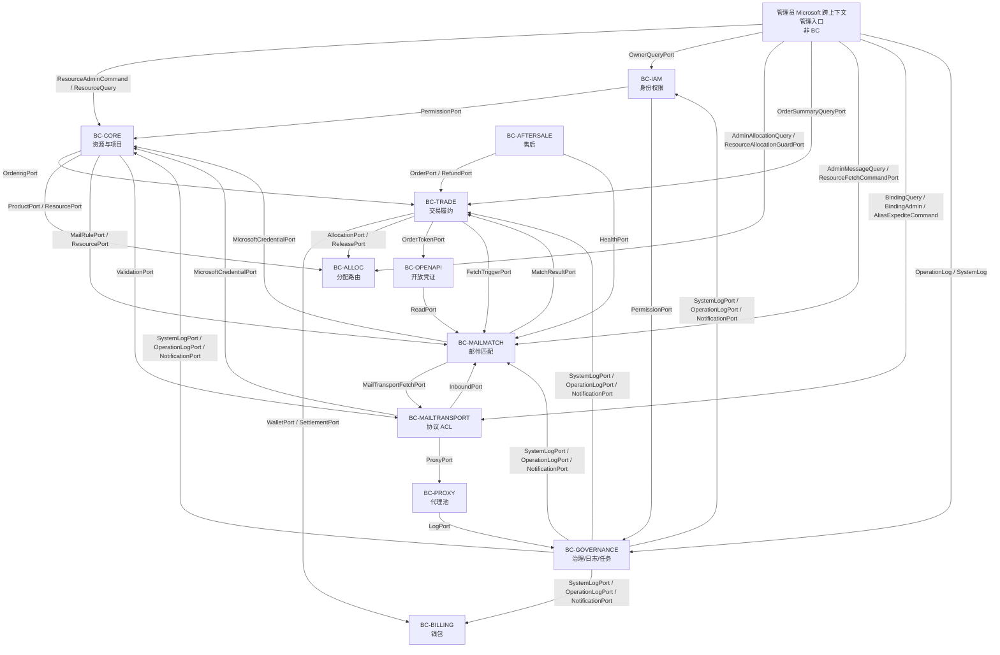

# ReMail Go 版邮箱交易平台 - DDD 战略地图

## 修订记录

| 日期 | 版本 | 修订人 | 说明 |
|------|------|--------|------|
| 2026-06-29 | V1.0 | Codex | 形成 Go 版从 0 DDD 设计基线，作为一次 V1.0 变更。 |
| 2026-07-02 | V1.1 | Codex | 补充 P1-I2 Domain 用途命名为 `not_sale/sale/binding`，中文仍展示辅助邮箱；对齐 Core 资源设计，不新增边界上下文。 |
| 2026-07-12 | V1.2 | Codex | 补充管理员 Microsoft 邮箱跨上下文管理用例：以 Core 资源为锚点组合 IAM、Alloc、Trade、MailMatch、MailTransport 的 Query/Command Port，不新增后台业务 BC；明确组合契约和状态所有权边界。 |
| 2026-07-12 | V1.3 | Codex | 收敛管理员协议结果边界：MailTransport Token 与 MailMatch Fetch 通过 Core `MicrosoftCredentialPort` 读取内部 scope/回写 revision、version 和诊断；Alias expedite 只保留带 receipt/audit 的唯一命令入口。 |
| 2026-07-12 | V1.4 | Codex | 明确模块化单体的管理员有界只读查询组合例外：普通业务 repository 仍禁止跨域读写，只有文档明确、单页有界、无副作用的源表查询组合可读取同库安全字段；不建立投影表。 |

> 本文是新项目 `/home/donnel/work/email/remail` 的 DDD 总览。
>
> 新项目参考 `new-api` 的设计思想：一个后端、一个前端控制台、一个部署单元；通过角色、权限、数据 scope 和鉴权中间件区分用户/供应商/管理员/API Key/服务凭证能力，而不是拆多个前端项目和重复 API。
>
> 本文只定义业务边界、统一语言和跨域规则，不承诺兼容旧 Java 表、旧接口或旧模块结构。

---

## 1. 平台本质

ReMail 的价值不是保存邮箱账号，而是让用户在指定项目下稳定拿到一个可用邮箱、服务凭证和邮件验证码读取能力。

核心闭环：


战略判断：

| 判断 | 说明 |
|------|------|
| 邮箱资源是供给载体 | Microsoft 邮箱、自建邮箱域名、别名和生成邮箱是供给能力，不是交易状态。 |
| 项目是规则中心 | 项目定义商品、价格、服务窗口、分配权重和邮件识别规则。 |
| 分配是核心策略 | 分配把一个订单绑定到一个邮箱使用权，必须一单一资源。 |
| 邮件事实是真实服务 | 用户最终感知的是能否收到并识别验证码。 |
| 交易是编排域 | 订单负责扣款、分配、凭证、窗口、退款和结算的有序编排。 |
| 后台是命令入口 | 管理员不能手工 SQL 改状态；所有高风险动作走领域命令并写操作日志。 |
| 后台详情是组合视图 | 管理员 Microsoft 邮箱页面是以资源为锚点的跨上下文管理用例，不是新的业务事实所有者；页面可组合多个 BC 的只读契约，但任何状态只能由原所属 BC 的命令修改。 |

---

## 2. 子域与上下文

| 子域 | 类型 | 上下文 | 价值定位 |
|------|------|--------|----------|
| 邮箱资源与项目规则 | 核心域 | BC-CORE | 资源生命周期、项目商品、邮件规则和项目访问。 |
| 分配与路由 | 核心域 | BC-ALLOC | 按项目商品策略选择资源并创建分配。 |
| 邮件匹配与真实服务 | 核心域 | BC-MAILMATCH | 保存邮件事实、匹配项目规则、提取验证码并提供服务结果。 |
| 交易履约 | 支撑域 | BC-TRADE | 下单、扣款、分配、服务凭证、退款、服务窗口和供应商结算触发。 |
| 邮件传输 | 支撑域 | BC-MAILTRANSPORT | SMTP/IMAP/Microsoft OAuth/Graph/外发邮件等协议 ACL。 |
| 代理池 | 支撑域 | BC-PROXY | Microsoft 通讯代理录入、检测、资源池绑定、系统池兜底和轮转。 |
| 计费与钱包 | 支撑域 | BC-BILLING | 消费额度、供应商额度、充值、卡密、结算、提现和不可变流水。 |
| 售后仲裁 | 支撑域 | BC-AFTERSALE | 工单、自动检测、供应商 SLA、平台裁决和售后退款入口。 |
| 身份与权限 | 通用域 | BC-IAM | 用户、角色、权限、会话、邀请码和首次激活。 |
| 开放接口与凭证 | 通用域 | BC-OPENAPI | API Key、服务凭证 Token、开放入口、限流、并发和请求日志。 |
| 平台治理 | 通用域 | BC-GOVERNANCE | 系统配置、公告、通知、帮助、操作日志、系统日志、任务和运行健康。 |

---

## 3. 上下文目录

| 上下文 | 聚合/实体根 | 强一致职责 | 不归它管 |
|--------|-------------|------------|----------|
| BC-IAM | `User`、`Role`、`Permission`、`Invite` | 身份、登录会话、RBAC、首次激活 | 钱包、订单、资源 |
| BC-GOVERNANCE | `Setting`、`OperationLog`、`SystemLog`、`Announcement`、`Notification`、`HelpArticle`、`TaskView` | 配置、日志、内容运营、任务可观测和后台命令入口 | 业务状态机 |
| BC-CORE | `EmailResource`、`MicrosoftResource`、`DomainResource`、`Project` | 资源状态、别名池、项目商品、项目访问、邮件规则 | 订单、分配事实、邮件正文、余额 |
| BC-ALLOC | `MicrosoftAllocation`、`DomainAllocation` | 一单一资源、分配唯一性、历史项目排除、释放 | 资源验证、订单状态、钱包 |
| BC-BILLING | `Wallet`、`Transaction`、`Recharge`、`CardKey`、`Settlement`、`Withdrawal` | 多额度桶、不可变流水、充值、卡密、结算、提现 | 订单为什么扣款或退款 |
| BC-TRADE | `Order`、`OrderEvent` | 订单状态机、扣款/退款绑定、分配外键、服务窗口 | 钱包余额、资源策略、邮件正文 |
| BC-MAILTRANSPORT | `OutboundMail`、`Binding`、`InboundSetting` | 协议调用、外发邮件、辅助邮箱绑定、SMTP 入站配置 | 邮件归属和项目匹配 |
| BC-PROXY | `Proxy`、`Binding` | 代理检测、IP 版本、7 天绑定、系统池兜底、错误计数、异常隔离和管理员禁用 | Microsoft 页面流、资源状态、邮件事实 |
| BC-MAILMATCH | `Message` | 邮件去重、匹配、验证码、真实服务读取 | 协议收发、订单退款、资源验证 |
| BC-OPENAPI | `ApiKey`、`OrderToken` | 凭证签发、认证、限流、并发、配额累计 | 下单业务规则、邮件匹配规则 |
| BC-AFTERSALE | `Ticket`、`TicketMessage`、`Attachment`、`FlowLog` | 工单状态、供应商 SLA、自动检测、平台裁决 | 订单归属和退款执行 |

---

## 4. 上下文映射图



### 4.1 管理员 Microsoft 跨上下文管理用例

管理员 Microsoft 邮箱页面以 Core 的 `EmailResource.id` 为锚点，但不是由 Core 返回包含七个 Tab 的巨型详情。Core 的 `/v1/admin/resources/**` 负责列表、基本概要、原子编辑和资源命令；订单、邮件、Binding 和 Task Tab 优先复用事实所有者的管理员查询 API。整个页面是跨上下文管理用例，各 API/Application Service 只负责编排自身契约，不拥有新的聚合、状态机或跨域源表；不得新建 `BC-ADMIN-MICROSOFT`。普通业务 repository 不得任意跨 BC JOIN/UPDATE；共享数据库内经本文和矩阵明确、只读、单页有界且无副作用的管理员源表查询组合可以例外，但绝不允许借此跨域写入，也不得形成缓存或物化副本。

| 页面事实/动作 | 契约提供方 | 所有权规则 |
|--------------|------------|------------|
| 资源基本信息、凭据配置标记、健康状态、导入和验证任务 | BC-CORE | Core 拥有资源和凭据事实；密码、RT 只写不读，组合响应只返回 configured/health 等安全字段。 |
| owner 展示与可转移资格 | BC-IAM | IAM 通过 `OwnerQueryPort` 提供批量用户目录和资格查询；Core 只保存 `ownerUserId` 引用，不复制用户状态机。 |
| 分配、资源维度订单读模型、active allocation 保护 | BC-ALLOC | Alloc 提供 `AdminAllocationQueryPort` 和 `ResourceAllocationGuardPort`；订单 Tab 可对当前页 orderNo 使用直接源表的有界只读查询组合，Core 仍不直接读写 allocation 表。 |
| 订单状态、服务模式、金额和买家安全摘要 | BC-TRADE | Trade 继续拥有事实；共享数据库中的 Alloc 管理查询只按当前页 orderNo 读取安全展示字段，不复制订单判断或开放写入。 |
| 主邮箱邮件摘要、正文和资源级拉取任务 | BC-MAILMATCH | MailMatch 拥有 Message/Fetch 事实；正文按需读取，资源级拉取复用 durable single-flight 事实；内部凭据 scope 与 rotated RT 只经 Core `MicrosoftCredentialPort` 处理。 |
| 辅助邮箱绑定与收码邮件、RT 协议任务、远端别名 schedule/expedite | BC-MAILTRANSPORT | MailTransport 拥有绑定、协议执行 task 和远端别名调度事实；Core 凭据/revision/version 通过 `MicrosoftCredentialPort` 回写，alias expedite 只有 receipt/audit 命令入口；Core 不解释 Microsoft 页面状态。 |
| 管理命令审计与上游失败诊断 | BC-GOVERNANCE | 高风险命令成功/失败写 OperationLog，任务或协议失败写 SystemLog，均使用同一 requestId 且禁敏。 |

内部 Query Port 的响应类型由提供方 BC 定义，只返回该 BC 拥有或经明确 ACL 翻译的安全事实；对应的管理员 HTTP API 拥有自己的 OpenAPI DTO，页面在前端按 Tab 组合，不存在一个跨域“最终详情 DTO”作为事实源。查询优先通过批量 Port 丰富；对共享数据库中的低频管理员读模型，可以使用明确标识、输入数量有上限的直接源表查询组合，禁止 N+1、敏感字段和任何写入。跨域写入必须调用所属 BC 的显式 Command Port，不能通过 Query DTO 或查询结果回写。进程内组合不新增 `/v1/internal/**` HTTP 调用。

---

## 5. 统一语言

| 术语 | 代码 | 上下文 | 定义 |
|------|------|--------|------|
| 单控制台 | Console | 全局 | 一个 React 前端承载用户、供应商、管理员能力，通过 RBAC 菜单和数据 scope 控制。 |
| 统一业务 API | Unified API | 全局 | 控制台和 SDK 共用的 API；由 Session/API Key 鉴权中间件决定主体能力。P1-I8 补充：取件使用 `pickup(email + token)` 资源钥匙，不进入通用主体模型。 |
| 管理 API | Admin API | 全局 | 特权页面和高风险后台命令，保留 `/v1/admin/**`，必须走权限和操作日志。 |
| SDK | SDK | 全局 | SDK 不要求后端另做一套接口，只从同一份 OpenAPI 选择允许 API Key 调用的操作生成。 |
| 邮箱资源根 | `EmailResource` | BC-CORE | 统一资源身份，资源类型创建后不可变。 |
| 微软邮箱资源 | `MicrosoftResource` | BC-CORE | Microsoft 邮箱账号和可用凭据。 |
| 自建邮箱域名资源 | `DomainResource` | BC-CORE | 自建域名邮箱资源，带 `purpose=not_sale/sale/binding`；用户默认不可出售，公开出售与辅助邮箱用途分离。 |
| 项目 | `Project` | BC-CORE | 规则中心，定义商品、访问、分配和邮件识别规则。 |
| 项目商品 | `Product` | BC-CORE | 服务模式、价格、供应商价、资源类型、服务窗口和分配权重。 |
| 分配 | `Allocation` | BC-ALLOC | 订单获得邮箱使用权的事实。 |
| 订单 | `Order` | BC-TRADE | 一次钱换一个邮箱使用权和服务凭证。 |
| 服务凭证 | `OrderToken` | BC-OPENAPI | 绑定 `orderNo` 的 Bearer Token，持有者可读取该订单服务结果。 |
| 邮件事实 | `Message` | BC-MAILMATCH | 收到的一封邮件，匹配后可成为真实服务结果。 |
| 资源代理 | `Proxy(pool=resource)` | BC-PROXY | 正常 Microsoft 业务使用，按 Microsoft 邮箱等 key 绑定 7 天。 |
| 系统代理 | `Proxy(pool=system)` | BC-PROXY | 资源代理异常后的兜底轮转，不建立绑定。 |
| 消费额度 | `consumer` | BC-BILLING | 充值、卡密、供应商转入形成，只能下单，不能提现。 |
| 供应商可用额度 | `supplierAvailable` | BC-BILLING | 供应商结算入账后可提现或转消费。 |
| 供应商冻结额度 | `supplierFrozen` | BC-BILLING | 争议期收入和提现审核占用。 |

---

## 6. API 分层原则

新项目按 `new-api` 的复杂度控制思路组织 API：同一业务能力尽量只有一个接口，控制台和 SDK 共用；差异由鉴权中间件、权限、数据 scope 和服务窗口判断承担。

| 接口族 | 路径 | 调用者 | 设计原则 |
|--------|------|--------|----------|
| 统一业务 API | `/v1/**` | Session/API Key；pickup 使用 `email + token` 资源钥匙 | 控制台和 SDK 共用；API Key 能调用哪些接口由中间件和 OpenAPI 标记控制。P1-I8 补充：取件只走 pickup，不把 OrderToken 扩展为通用主体。 |
| 管理 API | `/v1/admin/**` | admin/super_admin | 特权页面和高风险写动作；服务端固定写 OperationLog。 |
| 内部接口 | `/v1/internal/**` | 内部组件 | 必须使用内部 Token，不进入公开 OpenAPI；Microsoft ACL 是进程内模块调用，不走内部接口。 |

统一业务 API 示例：

```http
POST /v1/orders
GET /v1/orders?scope=mine
GET /v1/orders?scope=all
GET /v1/pickup?email={email}&token={token}
GET /v1/projects?scope=visible
GET /v1/projects?scope=mine
GET /v1/projects?scope=all
GET /v1/resources?scope=owned
GET /v1/resources?scope=all
```

管理 API 示例：

```http
POST /v1/admin/projects/{id}/approve
POST /v1/admin/orders/{orderNo}/refund
POST /v1/admin/orders/{orderNo}/terminate
POST /v1/admin/resources/{resourceId}/validate
```

够用的 REST 约束：

| 规则 | 要求 |
|------|------|
| 资源命名 | 常规 CRUD 用复数名词。 |
| 命名风格 | URI 使用常见短词；默认不使用 `-` 连接多词。能省略的词省略，不能省略的概念才拆成 `/` 层级。路径中不出现内部实现词、表名、角色前缀或冷门领域词。 |
| 类型命名 | 实体、枚举、代码常量只取最突出特点，不把完整业务语境写成句子；上下文包名、表归属和字段说明承担语境。 |
| 常用资源名 | 自建邮箱域名用 `domains`，邮箱服务器用 `servers`，API Key 用 `apikeys`，订单服务凭证用 `orders/{orderNo}/token`。 |
| 领域命令 | 审批、退款、重置、拉取、禁用这类明确业务命令允许使用清晰子路径动词，例如 `/approve`、`/refund`、`/reset`、`/disable`；禁止万能 `/action` + `actionType`。 |
| HTTP 方法 | `GET` 查询，`POST` 创建或执行命令，`PUT` 全量替换，`PATCH` 局部变更，`DELETE` 删除或撤销。 |
| 状态表达 | 成功或失败由 HTTP 状态码表达，不在响应体再包业务响应码。 |
| 成功响应 | `200 OK` 返回资源表示；`201 Created` 返回新资源；`202 Accepted` 返回异步任务；`204 No Content` 表示成功但无响应体。 |
| 失败响应 | 返回最小错误体，不返回 `{code,message,data}`。 |
| SDK 契约 | 不为 SDK 另做 `/open` 版本接口；OpenAPI 只标记哪些统一业务接口允许 API Key 调用。 |

---

## 7. 跨域全局规约

### 7.1 HTTP 状态与错误响应

新项目使用 HTTP 状态码表达成功或失败，响应体不再加业务响应码，不再使用旧 `{code,message,data}` 包装。

成功响应：

| 状态 | 场景 |
|------|------|
| `200 OK` | 查询成功、同步命令返回更新后资源。 |
| `201 Created` | 创建资源成功，必要时带 `Location`。 |
| `202 Accepted` | 异步任务已受理，例如导入、拉取、批量处理。 |
| `204 No Content` | 删除、撤销、启停等成功且无返回体。 |

失败响应使用最小 JSON 结构：

```json
{
  "message": "Human verification failed.",
  "requestId": "req_..."
}
```

字段规则：

| 字段 | 说明 |
|------|------|
| `message` | 可展示给用户的安全业务语义。 |
| `requestId` | 排障 ID，对应运行日志/SystemLog/OperationLog。 |
| `fields` | 可选，字段级校验错误，结构为 `{fieldName: message}`，只返回安全字段名。 |

错误文案必须带业务语义，但不得暴露内部细节：

| 场景 | 对外文案原则 |
|------|--------------|
| 验证码错误 | 明确返回验证码错误或过期。 |
| 账号密码错误 | 返回账号或密码错误，不枚举账号是否存在。 |
| 权限不足 | 返回无权限执行该操作。 |
| 余额不足 | 返回余额不足。 |
| 订单状态非法 | 返回当前订单状态不允许该操作。 |
| 上游协议失败 | 返回安全业务文案，内部详情写 SystemLog。 |

禁止把 SQL、堆栈、邮箱密码、RT、Token、API Key、邮件正文、上游原始响应放进错误响应或普通日志。

### 7.2 HTTP 状态码约定

| 状态 | 用途 |
|------|------|
| `400 Bad Request` | 请求语法、JSON 格式、枚举值格式错误。 |
| `401 Unauthorized` | 未登录、Session 失效、API Key/Service Token 缺失或无效。 |
| `403 Forbidden` | 已认证但无角色/权限/数据归属。 |
| `404 Not Found` | 资源不存在，或为避免越权枚举而按不存在处理。 |
| `409 Conflict` | 幂等键冲突、唯一约束冲突、状态并发冲突。 |
| `422 Unprocessable Entity` | 业务校验失败，例如验证码错误、余额不足、状态不允许。 |
| `429 Too Many Requests` | 限流或并发上限。 |
| `500 Internal Server Error` | 未预期系统错误。 |
| `502 Bad Gateway` | 上游协议/第三方服务错误。 |
| `503 Service Unavailable` | 依赖服务不可用或系统维护。 |

错误体不设计额外业务响应码。需要程序化判断时，SDK 先按 HTTP 状态码处理，并以 OpenAPI 中固定的安全 `message` 作为辅助；一期不提前建立庞大错误分类体系。若后续确实需要新增稳定错误字段，必须先写 ADR 并证明不会增加前端和 SDK 复杂度。内部错误分类、上游错误分类和堆栈只进入日志和诊断字段，不进入响应体。

### 7.3 时间与时区

- API 时间统一 ISO 8601 字符串。
- 业务时区固定 `Asia/Shanghai`。
- 自然周按 ISO 8601 周一至周日。
- 无值用 `null`，不用空串、0 或 `1970-01-01`。

### 7.4 幂等

以下写动作必须支持 `Idempotency-Key`：

| 场景 | 说明 |
|------|------|
| 创建订单 | 防重复扣款和重复分配。 |
| OpenAPI 下单 | API Key + 幂等键唯一。 |
| 创建 API Key | 成功重放返回同一明文 Key。 |
| 重置服务凭证 | 成功重放返回同一新 Token。 |
| 退款、补偿退款、提现、充值查账 | 防重复资金事实。 |
| 外发邮件、邮件拉取 | 防重复发送和无意义重复任务。 |

幂等最终事实必须由数据库唯一约束或幂等表兜底；Redis 只能作为保护层。

### 7.5 凭据存储与展示

| 凭据 | 存储 | 展示 |
|------|------|------|
| Microsoft 邮箱密码、RT | 原值保存 | 不进 API 响应、日志、导出、后台列表。 |
| 卡密 | 原值保存 | 管理端授权接口可重复查看明文；普通日志禁敏。 |
| API Key | 原值保存 | 创建/当前用户列表/详情授权接口可重复查看明文；非凭证管理列表只显示前缀。 |
| OrderToken | 原值保存 | 交付、详情、重置授权接口可重复查看明文；列表只显示前缀。 |
| 支付密钥 | 原值保存或配置原文保存 | 只在授权配置接口回显，普通日志禁敏。 |

不引入应用层或数据库字段级对称加密；风险通过权限、授权接口、日志禁敏、数据库访问控制和最小化使用控制。

### 7.6 日志

| 日志 | 用途 | 要求 |
|------|------|------|
| 运行日志 | 服务进程诊断 | 结构化、带 requestId，不记录敏感值。 |
| SystemLog | 上游失败、任务失败、协议失败、系统事件 | 入库可查，保留安全内部诊断。 |
| OperationLog | 管理员/系统高风险动作 | 成功失败都记录，不由请求方随意提供审计字段。 |

业务语义需要原因的命令保留业务原因字段，例如项目驳回、工单驳回、退款、人工调账。纯运维按钮不要求请求方提交 `reason`，OperationLog 由服务端根据固定动作生成。

---

## 8. 典型业务闭环

| 闭环 | 说明 |
|------|------|
| 首次激活 | 空用户表时后台进入激活页，操作人提交邮箱和密码创建首个 `super_admin`。 |
| 项目申请 | 普通用户提交 `reviewing` 项目申请，管理员补齐规则并审批上架。 |
| 管理员直接建项目 | 管理员创建完整最终项目，直接 `listed`，不经过普通申请审批。 |
| 接码订单成功 | 下单扣款、分配邮箱、签发 Token、邮件匹配验证码、订单完成并延长 1 小时读取期。 |
| 接码订单超时 | 未匹配验证码时自动退款、释放分配、禁用 Token。 |
| 购买订单激活 | 规定窗口内收到验证码则激活成功，质保窗口延长；购买服务长期有效。 |
| 购买订单售后 | 质保期内工单自动检测失败则经 Trade 退款，检测正常则驳回。 |
| 供应商闭环 | 供应商上传资源出售，被购买后收入冻结，读取期结束或过保入账，可提现或转消费。 |
| OpenAPI 高并发 | API Key 并发下单受限流、并发、余额、库存和幂等保护；OrderToken 读取订单结果。 |
| 后台运营 | 管理员通过控制台处理项目、资源、订单、钱包、工单、日志和任务，不依赖 SQL。 |
| 管理员 Microsoft 运维 | 管理员从同一资源详情查看 owner、分配/订单、主邮箱与辅助邮箱邮件、验证/别名/拉取任务，并通过所属 BC 的显式命令编辑、下架、恢复、检测、刷新 Token、加速别名或拉取邮件；视觉上的一个页面不改变状态所有权。 |

---

## 9. ADR

| ADR | 决策 | 理由 |
|-----|------|------|
| ADR-GLOBAL-1 | 一个 Go 后端 + 一个 React 控制台 | 减少前台/后台重复项目和重复接口。 |
| ADR-GLOBAL-2 | 模块化单体，不拆微服务 | 当前主要复杂度在业务边界和状态机，微服务会提前放大运维复杂度。 |
| ADR-GLOBAL-3 | 统一业务 API + scope + 多鉴权主体 | 控制台和 SDK 复用接口，避免用户端/后台端/SDK 三套重复 API。 |
| ADR-GLOBAL-4 | 后台特权页面才使用 `/v1/admin/**` | 管理员拥有普通用户能力，只增加特权页面和特权命令。 |
| ADR-GLOBAL-5 | 凭据原值保存，授权接口重复查看明文 | 符合业务重复使用/展示需求；通过权限和禁敏控制风险。 |
| ADR-GLOBAL-6 | Asynq 承接异步任务 | Go 技术栈下用 Redis-backed 任务队列覆盖后台任务、延迟任务、重试和任务可观测。 |
| ADR-GLOBAL-7 | HTTP 状态码 + 最小错误体，不包业务响应码 | 去掉旧 API 包装和数字业务码，前端/SDK 直接按 HTTP 状态和安全 message 处理。 |
| ADR-GLOBAL-8 | 管理员 Microsoft 页面采用 Core 锚定的跨上下文 Facade，不新增 BC | 页面是运营组合视图；由各 BC 通过 Query/Command Port 保持事实所有权，可保留完整 UI 能力而不形成跨域写表。 |

---

## 10. 分篇索引

| 文档 | 内容 |
|------|------|
| `1-core-mailbox-project.md` | BC-CORE 邮箱资源与项目规则 |
| `2-allocation-routing.md` | BC-ALLOC 分配与路由 |
| `3-trade-fulfillment.md` | BC-TRADE 交易履约 |
| `4-mailmatch-real-service.md` | BC-MAILMATCH 邮件匹配与真实服务 |
| `5-mail-transport.md` | BC-MAILTRANSPORT 邮件传输 |
| `6-billing-wallet.md` | BC-BILLING 计费与钱包 |
| `7-aftersale.md` | BC-AFTERSALE 售后仲裁 |
| `8-iam.md` | BC-IAM 身份与权限 |
| `9-openapi-credentials.md` | BC-OPENAPI 开放接口与凭证 |
| `10-governance.md` | BC-GOVERNANCE 平台治理 |
| `11-technology-stack.md` | 技术栈与库选型 |
| `12-implementation-plan.md` | 实施方案 |
| `13-quality-matrices.md` | 设计、测试、验收矩阵 |
| `14-microsoft-go-acl-strategy.md` | Microsoft Go ACL 策略 |
| `15-proxy-pool.md` | BC-PROXY 代理池 |
| `17-operations-runbook.md` | 生产监控、备份、恢复与安全停机 |
| `18-cicd-quality-gates.md` | CI/CD 并行门禁、产物复用与 Cleanup |
| `19-money-precision.md` | 金额精度、序列化与计算规则 |
| `20-admin-microsoft-resource-management.md` | 管理员 Microsoft 邮箱跨上下文资源管理设计 |
| `21-admin-microsoft-resource-matrices.md` | 管理员 Microsoft UI/API/BC/Port 与验收专项矩阵 |
