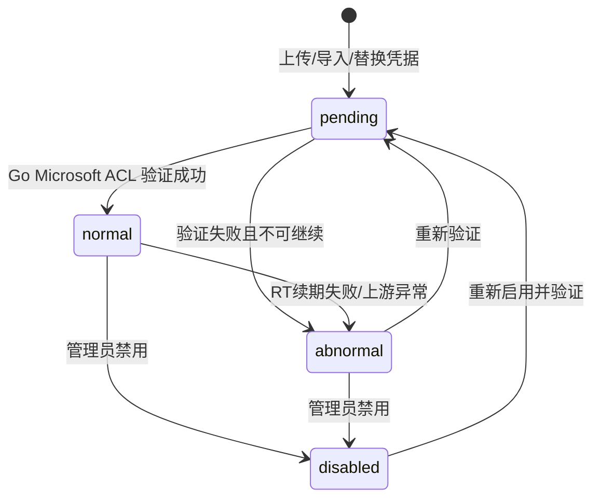
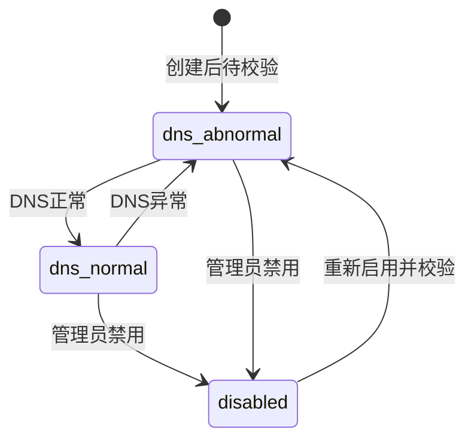
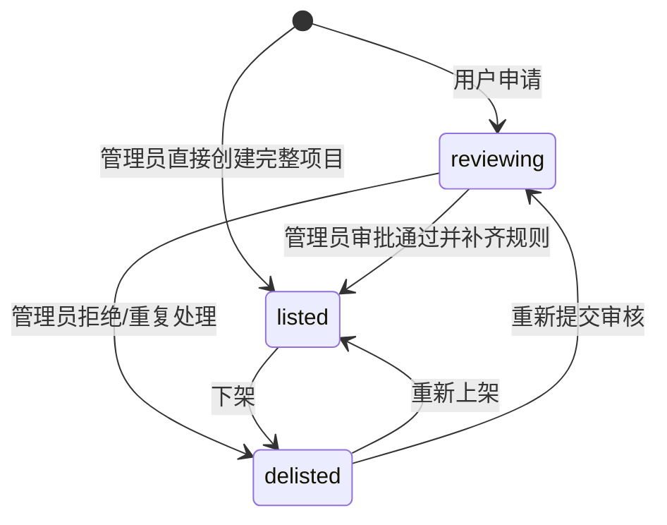

# BC-CORE 邮箱资源与项目规则上下文

## 修订记录

| 日期 | 版本 | 修订人 | 说明 |
|------|------|--------|------|
| 2026-06-29 | V1.0 | Codex | 形成 Go 版从 0 DDD 设计基线，作为一次 V1.0 变更。 |

> 核心域。BC-CORE 是邮箱资源和项目规则的所有者。分配记录、订单、邮件事实、钱包余额不在本上下文内。

---

## 1. 定位

BC-CORE 回答两个问题：

| 问题 | 聚合 |
|------|------|
| 这个邮箱资源是什么、归谁、是否可供给？ | `EmailResource` 及资源子表 |
| 这个项目卖什么、怎么分配邮箱、怎么识别邮件？ | `Project`、`Product`、`MailRule`、`Access` |

核心原则：

- 资源状态由资源服务和验证任务维护，交易和分配不能直接改资源状态。
- 项目是规则中心，订单和邮件匹配都必须回到项目规则。
- 用户项目申请不单独建重型申请聚合，用 `Project.status=reviewing` 表达。
- 管理员直接创建项目是完整运营创建路径，成功后直接 `listed`，不伪造用户申请。

---

## 2. 聚合一：邮箱资源

### 2.1 聚合结构

```text
EmailResource
├── MicrosoftResource
│   ├── ExplicitAlias
│   ├── DotAlias
│   └── PlusAlias
└── DomainResource
    ├── GeneratedMailbox
    └── MailServer
```

`EmailResource.id` 是跨上下文引用的唯一资源 ID。资源根创建后 `type` 不可修改。

### 2.2 `EmailResource`

| 字段 | 含义 |
|------|------|
| `id` | 资源根 ID |
| `type` | `microsoft/domain` |
| `ownerUserId` | 资源 owner；供应商资源归供应商，平台资源可归管理员 |
| `createdAt` | 创建时间 |

不变式：

| 编号 | 规则 |
|------|------|
| INV-C-R1 | 每个资源根必须且只能有一个对应子表记录。 |
| INV-C-R2 | 资源根类型和子表类型必须由数据库约束兜底。 |
| INV-C-R3 | 出售供给 owner 必须是启用用户，并具备 `supplier/admin/super_admin` 任一角色。 |

### 2.3 `MicrosoftResource`

| 字段 | 含义 |
|------|------|
| `id` | 共享主键，等于 `EmailResource.id` |
| `emailAddress` | Microsoft 邮箱 |
| `password` | 邮箱密码，原值保存 |
| `clientId` | Microsoft OAuth clientId |
| `refreshToken` | Microsoft RT，原值保存 |
| `rtExpireAt` | RT 预计失效时间 |
| `forSale` | 是否公开供给出售 |
| `status` | `pending/normal/abnormal/disabled` |
| `qualityScore` | 资源质量分 |
| `lastSafeError` | 脱敏诊断摘要 |
| `lastAllocatedAt` | 最近分配时间 |

状态机：



可分配条件：

```text
status=normal
forSale=true
ownerUserId 对应用户启用
ownerUserId 具备 supplier/admin/super_admin 任一角色
```

Microsoft 协议细节不在 Go 领域模型中表达。登录页面、RT 获取、Graph 拉取由 BC-MAILTRANSPORT 的 Go Microsoft ACL 处理。

### 2.4 Microsoft 别名池

| 实体 | 用途 | 关键规则 |
|------|------|----------|
| `ExplicitAlias` | 真实创建在 Microsoft 账号里的显式别名 | 同资源自然周最多新增 2 个，自然年最多 10 个，异常别名不返还额度。 |
| `DotAlias` | 系统由主邮箱 local-part 插入 `.` 生成 | 同 `resourceId + email` 唯一，优先复用。 |
| `PlusAlias` | 系统由主邮箱生成 `+tag` | 同 `resourceId + email` 唯一，优先复用，不计库存。 |

别名池属于资源能力，不是分配事实。BC-ALLOC 只能通过 Port 选择/创建/引用别名。

### 2.5 `DomainResource`

| 字段 | 含义 |
|------|------|
| `id` | 共享主键，等于 `EmailResource.id` |
| `domain` | 自建邮箱域名 |
| `mailServerId` | 邮箱服务器 ID |
| `purpose` | `sale/auxiliary` |
| `status` | `dns_normal/dns_abnormal/disabled` |
| `lastAllocatedAt` | 最近分配时间 |

状态机：



可分配条件：

```text
purpose=sale
status=dns_normal
MailServer.status=online
ownerUserId 对应用户启用
ownerUserId 具备 supplier/admin/super_admin 任一角色
```

`purpose=auxiliary` 只用于 Microsoft 辅助邮箱验证码接收，不进入出售库存和分配。

### 2.6 `GeneratedMailbox`

| 字段 | 含义 |
|------|------|
| `id` | 生成邮箱 ID |
| `resourceId` | 自建邮箱域名资源 ID |
| `email` | 实际邮箱 |
| `status` | `normal/disabled` |
| `lastAllocatedAt` | 最近分配时间 |

规则：

- 同 `resourceId + email` 唯一。
- 分配时优先复用已有 `normal` 邮箱。
- 允许跨项目复用，同项目唯一由 BC-ALLOC 分配约束兜底。
- 自建库存展示可用域名数量，同时管理端返回已生成邮箱数量 `mailboxCount`。

### 2.7 `MailServer`

| 字段 | 含义 |
|------|------|
| `id` | 邮箱服务器 ID |
| `ownerUserId` | 服务器 owner；供应商自建服务器归供应商，平台服务器可归管理员 |
| `name` | 名称 |
| `serverAddress` | 服务器地址 |
| `mxRecord` | MX 记录 |
| `spf/dkim/dmarc/ptr` | 出站 DNS 记录 |
| `status` | `online/offline/disabled` |

`MailServer` 归 BC-CORE，因为它决定自建邮箱域名资源是否可供给；BC-MAILTRANSPORT 只使用协议连接能力。供应商创建自建邮箱域名时，只能引用自己拥有的 `MailServer`；管理员创建平台资源时，owner 由服务端按当前管理员写入。

---

## 3. 聚合二：项目

### 3.1 聚合结构

```text
Project
├── Product
├── MailRule
└── Access
```

### 3.2 `Project`

| 字段 | 含义 |
|------|------|
| `id` | 项目 ID |
| `name` | 项目名 |
| `targetPlatform` | 目标平台 |
| `status` | `reviewing/listed/delisted` |
| `accessType` | `public/private` |
| `applicantUserId` | 普通用户申请人；管理员直接创建时为空 |
| `reviewReason` | 审核驳回或重复处理原因 |
| `looseMatch` | 邮件宽松匹配开关 |
| `createdAt/updatedAt` | 时间 |

状态机：



上架完整性：

- 至少一个启用商品。
- 邮件规则满足当前 `looseMatch` 策略。
- `listed` 项目名唯一由数据库约束兜底。
- 私有项目下单必须有 `Access`。

### 3.3 `Product`

| 字段 | 含义 |
|------|------|
| `id` | 商品 ID |
| `projectId` | 项目 ID |
| `type` | `microsoft/domain` |
| `status` | `enabled/disabled` |
| `codeEnabled/purchaseEnabled` | 是否支持接码/购买 |
| `codePrice/purchasePrice` | 用户价格 |
| `codeSupplierPrice/purchaseSupplierPrice` | 供应商结算价 |
| `codeWindowMinutes` | 接码等待窗口 |
| `activationWindowMinutes` | 购买激活窗口 |
| `warrantyMinutes` | 购买质保窗口 |
| `mainWeight/dotWeight/plusWeight` | Microsoft 分配权重 |

规则：

- `type=microsoft` 时，至少一个 Microsoft 权重大于 0。
- `mainWeight` 表示主邮箱类，主邮箱和显式别名共享该权重。
- 权重不是百分比，分母是非零权重之和。
- `type=domain` 时 Microsoft 权重不参与分配。

### 3.4 `MailRule`

| 字段 | 含义 |
|------|------|
| `id` | 规则 ID |
| `projectId` | 项目 ID |
| `ruleType` | `sender/recipient/subject/body` |
| `pattern` | 正则或内置收件人策略 |
| `enabled` | 是否启用 |

匹配策略：

| 模式 | 必需规则 |
|------|----------|
| `looseMatch=true` | `sender + recipient` |
| `looseMatch=false` | `sender + recipient + subject + body` |

类型间 AND，类型内 OR。当前策略缺少必需类型或必需类型未命中，最终匹配失败。

### 3.5 `Access`

私有项目授权事实：

| 字段 | 含义 |
|------|------|
| `projectId` | 私有项目 |
| `userId` | 被授权用户 |
| `grantedBy` | 授权管理员 |
| `createdAt` | 授权时间 |

公开项目不需要授权；私有项目只按 `Access` 判断可见和可下单。

---

## 4. 不变式

| 编号 | 规则 |
|------|------|
| INV-C1 | 只有 `Project.status=listed` 且商品 `enabled` 才可下单。 |
| INV-C2 | 私有项目只按 `Access` 授权，下单前必须校验。 |
| INV-C3 | 资源状态只由资源服务/验证任务修改，分配和交易不能直接改。 |
| INV-C4 | Microsoft 资源凭据原值保存，但不得进入 API 响应、普通日志、导出和后台列表。 |
| INV-C5 | `Product.type` 决定分配资源类型，不允许跨类型分配。 |
| INV-C6 | `MailRule` 缺少当前策略必需类型时，邮件匹配失败而不是放宽范围。 |
| INV-C7 | 显式别名配额按同一资源自然周/自然年统计，配额校验和落库必须串行化。 |
| INV-C8 | 点别名、加号别名、自建生成邮箱必须优先复用，无法复用时才生成。 |
| INV-C9 | 自建邮箱域名只有 `purpose=sale` 才进入出售分配。 |
| INV-C10 | 管理员创建自建邮箱域名时 owner 由服务端按当前用户写入，前端不提交 owner。 |
| INV-C11 | 自建邮箱域名引用的 `MailServer` 必须与自建邮箱域名同 owner，禁止跨供应商复用服务器配置。 |

---

## 5. Port

| Port | 消费方 | 职责 |
|------|--------|------|
| `OrderingPort` | BC-TRADE | 校验项目、商品、服务模式、访问权限和邮件规则，返回价格、窗口和资源类型。 |
| `ProductPort` | BC-ALLOC | 查询商品分配权重和资源类型。 |
| `MailRulePort` | BC-MAILMATCH | 查询项目规则和匹配模式。 |
| `ResourcePort` | BC-ALLOC/BC-MAILMATCH | 查询资源类型、状态、安全只读信息和可用性。 |
| `AliasPort` | BC-ALLOC | 查询/创建/复用显式别名、点别名、加号别名。 |
| `MailboxPort` | BC-ALLOC | 查询/创建/复用自建生成邮箱。 |
| `ValidationPort` | BC-MAILTRANSPORT | Microsoft 验证和 RT 续期。 |

---

## 6. API 设计

API 采用够用的 REST 风格，不复用旧接口设计；明确业务命令允许使用清晰动词子路径，避免为了形式把接口拆复杂。

控制台项目接口：

| 方法 | URI | 说明 |
|------|-----|------|
| `GET` | `/v1/projects` | 项目列表；支持 `scope=visible/mine/all`，管理员可用 `all`。 |
| `POST` | `/v1/projects` | 普通用户创建项目申请，返回 `201 Created` 的 `reviewing` 项目。 |
| `GET` | `/v1/projects/{projectId}` | 项目详情；按 scope 和授权过滤。 |
| `POST` | `/v1/admin/projects` | 管理员直接创建完整 `listed` 项目。 |
| `PUT` | `/v1/admin/projects/{projectId}` | 管理员全量更新项目基本信息。 |
| `POST` | `/v1/admin/projects/{projectId}/approve` | 审批通过，补齐商品、规则和访问类型。 |
| `POST` | `/v1/admin/projects/{projectId}/reject` | 拒绝申请，必须有业务原因。 |
| `POST` | `/v1/admin/projects/{projectId}/duplicate` | 处理重复申请，必须有业务原因。 |
| `POST` | `/v1/admin/projects/{projectId}/relist` | 重新上架。 |
| `POST` | `/v1/admin/projects/{projectId}/delist` | 下架。 |
| `GET` | `/v1/admin/projects/{projectId}/access` | 私有项目授权列表。 |
| `POST` | `/v1/admin/projects/{projectId}/access` | 授权用户访问私有项目。 |
| `DELETE` | `/v1/admin/projects/{projectId}/access/{userId}` | 撤销私有项目授权。 |

供应商/用户资源接口：

| 方法 | URI | 说明 |
|------|-----|------|
| `GET` | `/v1/resources` | 资源统一列表；支持 `scope=owned/all`。 |
| `GET` | `/v1/resources/{resourceId}` | 自有资源详情；不返回密码、RT、AT 等可用凭据。 |
| `POST` | `/v1/resources/imports` | 供应商上传资源导入文件，`type=microsoft/domain`，owner 由后端写入。 |
| `GET` | `/v1/servers` | 邮箱服务器列表；支持 `scope=owned/all`，普通供应商只能 owned。 |
| `POST` | `/v1/servers` | 供应商创建邮箱服务器，owner 由后端写入。 |
| `POST` | `/v1/domains` | 供应商创建自建邮箱域名资源，owner 由后端写入。 |
| `GET` | `/v1/domains/{domainId}/mailboxes` | 自建生成邮箱池。 |
| `POST` | `/v1/resources/{resourceId}/validate` | 为自有资源创建验证请求，成功返回异步任务或验证结果。 |

管理端资源接口：

| 方法 | URI | 说明 |
|------|-----|------|
| `GET` | `/v1/admin/resources` | 资源管理列表；支持 `type=microsoft/domain` 筛选。 |
| `POST` | `/v1/admin/resources/imports` | 管理员导入资源文件，owner 由后端写入。 |
| `PUT` | `/v1/admin/resources/{resourceId}/credentials` | 替换凭据并创建验证任务。 |
| `POST` | `/v1/admin/resources/{resourceId}/validate` | 创建重新验证请求。 |
| `POST` | `/v1/admin/resources/{resourceId}/aliases` | 创建显式别名。 |
| `PATCH` | `/v1/admin/resources/{resourceId}` | 更新资源启停、出售标记等可变属性。 |
| `GET` | `/v1/admin/domains` | 自建邮箱域名列表，返回 `purpose/mailboxCount`。 |
| `POST` | `/v1/admin/domains` | 创建自建邮箱域名，owner 由后端写入。 |
| `GET` | `/v1/admin/domains/{domainId}/mailboxes` | 自建生成邮箱池。 |
| `GET` | `/v1/admin/servers` | 邮箱服务器列表。 |
| `POST` | `/v1/admin/servers` | 创建邮箱服务器。 |

高风险管理命令必须写 OperationLog；纯查询不写 OperationLog。

---

## 7. ADR

| ADR | 决策 | 理由 |
|-----|------|------|
| ADR-CORE-1 | 统一资源根 + 资源子表 | Microsoft 和自建字段差异大，拆表更清楚。 |
| ADR-CORE-2 | 项目是规则中心 | 分配、交易、邮件匹配都回到项目规则，避免规则散落。 |
| ADR-CORE-3 | 别名池归资源上下文 | 别名是资源能力，不是分配事实。 |
| ADR-CORE-4 | 管理员直接创建项目不走申请状态 | 管理员创建的是最终完整项目，避免伪造用户申请。 |
| ADR-CORE-5 | 自建邮箱域名加 `purpose` | 出售域名和辅助邮箱域名必须分开，避免误分配。 |
| ADR-CORE-6 | REST API 重新设计 | 旧 API 不作为参考，使用资源和命令资源表达业务动作。 |
