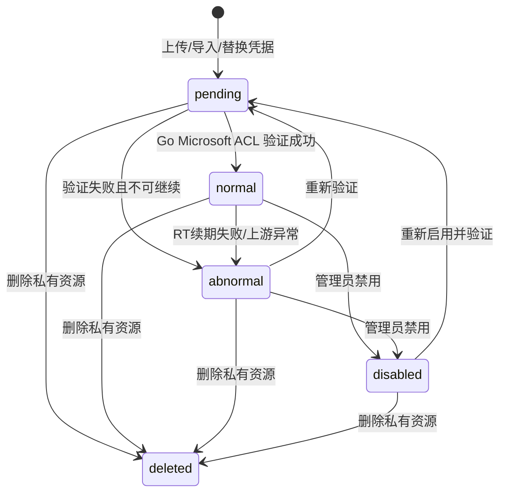
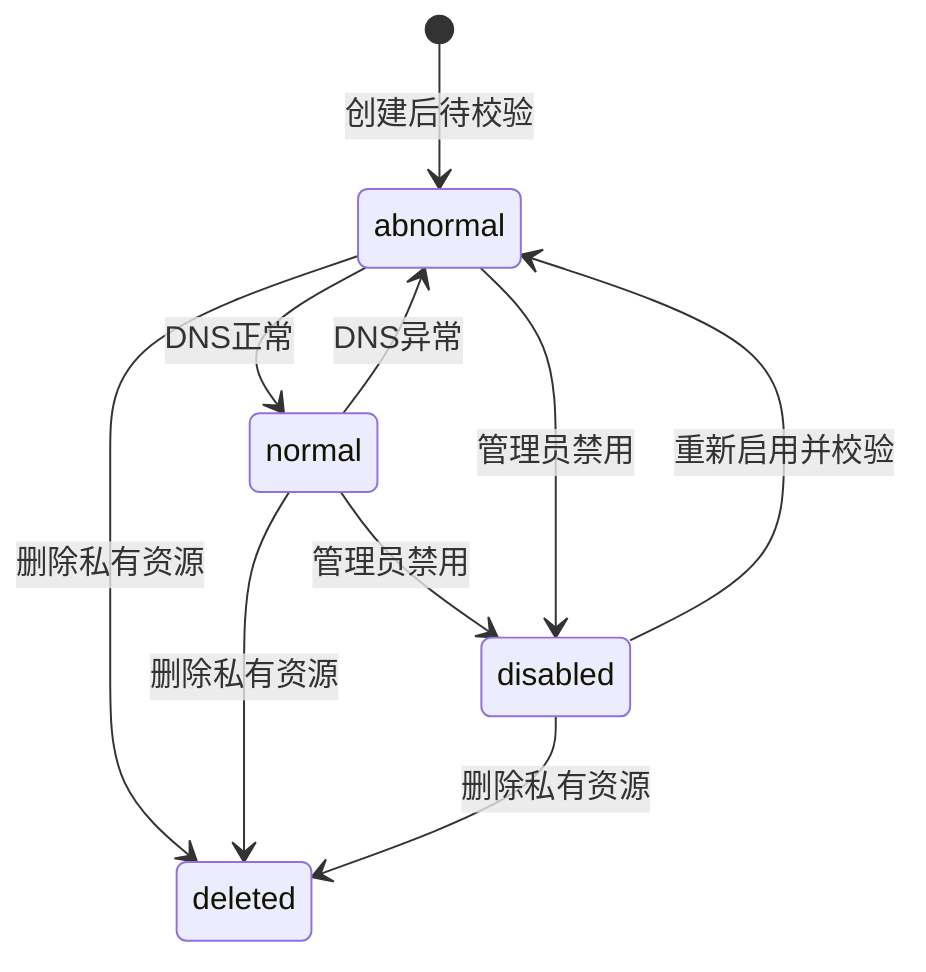
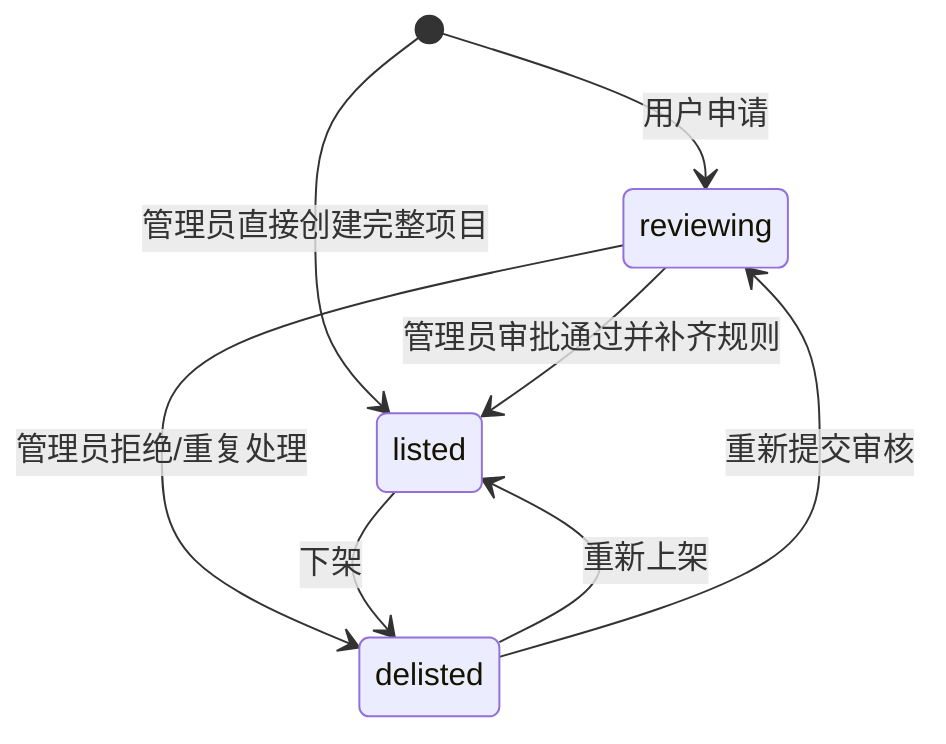

# BC-CORE 邮箱资源与项目规则上下文

## 修订记录

| 日期 | 版本 | 修订人 | 说明 |
|------|------|--------|------|
| 2026-06-29 | V1.0 | Codex | 形成 Go 版从 0 DDD 设计基线，作为一次 V1.0 变更。 |
| 2026-07-01 | V1.1 | Codex | 补充 P1-I2 Microsoft TXT 导入四种 `----` 行格式；不改变 Core 资源表和辅助邮箱绑定边界。 |
| 2026-07-01 | V1.2 | Codex | 澄清 P1-I2 供应商资源接口拆分：Microsoft TXT 走资源导入口，自建域名走结构化 Domain 接口；不改变资源聚合边界。 |
| 2026-07-01 | V1.3 | Codex | 补充 P1-I2 ResourceImport artifact 索引；落实原始导入文件和安全失败明细进入 MinIO private bucket 的原设计。 |
| 2026-07-01 | V1.4 | Codex | 补充 P1-I2 Microsoft 普通用户上传默认私有、供应商单向发布出售；明确 `forSale` 不是已售出状态。 |
| 2026-07-01 | V1.5 | Codex | 补充 P1-I2 Microsoft `longLived` 独立字段、导入批次长短效选择和批量发布出售命令。 |
| 2026-07-02 | V1.6 | Codex | 补充 P1-I2 ResourceImport 异步状态查询、Asynq 重试边界和导入成功事务幂等要求；不改变 Core 资源聚合边界。 |
| 2026-07-02 | V1.7 | Codex | 补充 P1-I2 普通用户逻辑删除自有私有 Microsoft 资源、删除后重新导入恢复；不改变公开出售单向策略。 |
| 2026-07-02 | V1.8 | Codex | 补充 P1-I2 自建域名一期策略：系统内置默认本机收件服务器，MX 固定为 `mx.aishop6.com`；Domain 私有发布 `not_sale -> sale`、私有删除使用 `deleted` 终态并支持同 owner 重建恢复；同步 `not_sale/sale/binding` 用途命名。 |
| 2026-07-02 | V1.9 | Codex | 补充 P1-I2 资源批量删除命令：仅删除当前 owner 的私有 Microsoft/Domain 资源，保持公开出售不可删除策略。 |
| 2026-07-02 | V1.10 | Codex | 补充 P1-I2 资源列表统一模糊搜索、创建时间区间筛选、`selection.mode=filter` 服务端批量命令；修订 deleted 资源重新导入时可更新 owner。 |
| 2026-07-02 | V1.11 | Codex | 设计调整：Domain `domainTld` 从仅内部索引改为资源列表安全返回，前端不得重复实现 TLD 规则；补充 P1-I2 批量资源命令的派生索引字段、`GeneratedMailbox.ownerUserId` 和已删除 Domain 恢复时重置生成邮箱池。 |
| 2026-07-02 | V1.12 | Codex | 补充 P1-I2 Microsoft 导入错误处理策略和 filter 批量删除性能策略：默认错误跳过，filter 删除使用集合更新并写命令级 OperationLog。 |
| 2026-07-02 | V1.13 | Codex | 补充 P1-I2 Microsoft 导入前端预处理策略：前端可按同规则过滤行级错误减负，后端仍是权威校验边界。 |
| 2026-07-04 | V1.14 | Codex | 补充 P1-I3 ResourceValidation 异步任务事实：资源验证 HTTP 入口只创建任务并返回 `202`，Microsoft/DNS 外部验证由 Asynq worker 执行，结果短事务回写资源状态。此为缺失设计补充，不改变资源状态机。 |
| 2026-07-04 | V1.15 | Codex | 补充 P1-I3 ResourceValidation 幂等与临时失败策略：同一资源同一时间只允许一个 active 验证任务；外部网络/代理/DNS 服务临时不可用只重试任务，不把资源状态写为异常。此为缺失设计补充，不改变资源状态机。 |
| 2026-07-04 | V1.16 | Codex | 补充 P1-I3 Microsoft 辅助邮箱输入交接：Core 只解析 TXT 中的 `bindingAddress` 并通过 Port 交给 MailTransport，绑定状态仍由 MailTransport 拥有。此为缺失设计补充，不改变 Core 资源聚合边界。 |
| 2026-07-04 | V1.17 | Codex | 补充 P1-I3 Microsoft `graphAvailable` 协议能力事实：验证后记录 Graph 是否可读，列表和批量 filter 可筛选；此为缺失设计补充，不新增资源状态。 |
| 2026-07-04 | V1.18 | Codex | 纠正 P1-I3 ResourceValidation 临时失败重试上限：基础设施失败只在任务事实内有限重试，耗尽后任务终态失败但不改资源状态。此为缺失设计补充，不改变资源状态机。 |

> 核心域。BC-CORE 是邮箱资源和项目规则的所有者。分配记录、订单、邮件事实、钱包余额不在本上下文内。

---

## 1. 定位

BC-CORE 回答两个问题：

| 问题 | 聚合 |
|------|------|
| 这个邮箱资源是什么、归谁、是否可供给？ | `EmailResource` 及资源子表 |
| 这个项目卖什么、怎么分配邮箱、怎么识别邮件？ | `Project`、`Product`、`MailRule`、`Access` |

核心原则：

- 资源状态由资源服务和验证任务维护，交易和分配不能直接改资源状态。
- 项目是规则中心，订单和邮件匹配都必须回到项目规则。
- 用户项目申请不单独建重型申请聚合，用 `Project.status=reviewing` 表达。
- 管理员直接创建项目是完整运营创建路径，成功后直接 `listed`，不伪造用户申请。

---

## 2. 聚合一：邮箱资源

### 2.1 聚合结构

```text
EmailResource
├── MicrosoftResource
│   ├── ExplicitAlias
│   ├── DotAlias
│   └── PlusAlias
└── DomainResource
    ├── GeneratedMailbox
    └── MailServer
```

`EmailResource.id` 是跨上下文引用的唯一资源 ID。资源根创建后 `type` 不可修改。

### 2.2 `EmailResource`

| 字段 | 含义 |
|------|------|
| `id` | 资源根 ID |
| `type` | `microsoft/domain` |
| `ownerUserId` | 资源 owner；供应商资源归供应商，平台资源可归管理员 |
| `createdAt` | 创建时间 |

不变式：

| 编号 | 规则 |
|------|------|
| INV-C-R1 | 每个资源根必须且只能有一个对应子表记录。 |
| INV-C-R2 | 资源根类型和子表类型必须由数据库约束兜底。 |
| INV-C-R3 | 出售供给 owner 必须是启用用户，并具备 `supplier/admin/super_admin` 任一角色。 |
| INV-C-R4 | 普通 `user` 拥有的 Microsoft 资源不得进入公开出售供给池，只能作为 owner 自用私有资源。 |

### 2.3 `MicrosoftResource`

| 字段 | 含义 |
|------|------|
| `id` | 共享主键，等于 `EmailResource.id` |
| `emailAddress` | Microsoft 邮箱 |
| `emailDomain` | 从 `emailAddress` 派生的精确后缀索引字段，不对 API 暴露 |
| `password` | 邮箱密码，原值保存 |
| `clientId` | Microsoft OAuth clientId |
| `refreshToken` | Microsoft RT，原值保存 |
| `longLived` | 是否长效资源，由导入批次选择写入，不从 `clientId/refreshToken` 自动推断 |
| `graphAvailable` | 最近一次完成验证是否确认 Graph 可收件；Graph 成功为 `true`，IMAP 回退成功或确定性验证失败为 `false` |
| `rtExpireAt` | RT 预计失效时间 |
| `forSale` | 是否公开供给出售 |
| `status` | `pending/normal/abnormal/disabled/deleted` |
| `qualityScore` | 资源质量分 |
| `lastSafeError` | 脱敏诊断摘要 |
| `lastAllocatedAt` | 最近分配时间 |

`forSale` 表示 Microsoft 资源是否公开进入出售供给池。`forSale=false` 等价于用户侧“私有=是”，`forSale=true` 等价于用户侧“私有=否”。`forSale` 不表示资源已经售出；订单购买的是资源分配产生的绑定关系或使用结果，不转移 `MicrosoftResource` 本体所有权。

状态机：



`deleted` 是用户删除私有资源命令写入的终态标记，不由验证状态机的普通流转产生。进入 `deleted` 后不再参与列表展示、查重拦截、验证、分配和出售发布。

可分配条件：

```text
status=normal
forSale=true
ownerUserId 对应用户启用
ownerUserId 具备 supplier/admin/super_admin 任一角色
```

自用私有条件：

```text
status=normal
forSale=false
ownerUserId = 当前下单用户
```

自用私有资源只能分配给 owner 自己，不进入公开出售候选。

Microsoft 协议交互细节不在 Core 领域模型中表达。登录页面、RT 获取、Graph 拉取由 BC-MAILTRANSPORT 的 Go Microsoft ACL 处理；Core 仅保存 `graphAvailable` 这类验证后的协议能力事实，用于资源页展示和筛选，不参与资源状态枚举。

#### P1-I3 补充设计：资源验证任务

`ResourceValidation` 是 Core 对一次资源验证请求的安全任务事实，只保存资源 ID、资源类型、owner、状态、requestId、path、开始/结束时间和安全诊断摘要，不保存密码、RT、accessToken、邮件正文或 Microsoft 上游原文。

验证 HTTP 入口遵循异步边界：

| 步骤 | 要求 |
|------|------|
| `POST /v1/resources/{resourceId}/validate` | 只校验登录、owner/admin 权限、资源存在且未删除，创建 `ResourceValidation(queued)`，投递 Asynq 后返回 `202 Accepted` 和 `validationId`。 |
| worker 执行 | 根据资源类型调用 BC-MAILTRANSPORT 的 Microsoft ACL 或 DNS 验证 Port；外部网络调用不得进入数据库事务。 |
| Microsoft 成功条件 | MailTransport 完成 RT 获取/刷新，并通过 Graph 或 IMAP 任一路径正常读取收件箱和垃圾箱后，即可判定 Microsoft 资源本体正常。后续项目邮件匹配和关系插入不影响资源健康状态。 |
| 成功回写 | 短事务把 Microsoft/Domain 资源状态置为 `normal`，清空安全错误；Microsoft 如返回 rotated RT，必须同步保存；Microsoft 如通过 Graph 收件则 `graphAvailable=true`，如通过 IMAP 回退收件则 `graphAvailable=false`。 |
| 失败回写 | 短事务把可验证失败置为 `abnormal`，写 `lastSafeError` 和 SystemLog，并把 Microsoft `graphAvailable` 清为 `false`；不得把资源自动置为 `disabled`，禁用只能由管理员命令触发。 |
| 临时失败 | Microsoft/代理/DNS 服务临时不可用、请求超时、验证 Port 不可用等基础设施失败不得把资源置为 `abnormal`；任务写安全诊断并累加 `attempts`，未达到 `maxAttempts` 时回到 `queued`，达到上限后只把 `ResourceValidation` 置为 `failed`，资源本体状态保持不变。 |
| 任务幂等 | `resource_validation_jobs` 必须通过数据库唯一约束保证同一资源同一时间最多一个 `queued/running` active 任务；重复点击验证返回既有 active `validationId`，不得重复投递新事实。 |
| 任务恢复 | `resource_validation_jobs` 是最终任务事实；Redis/Asynq 仅为执行层，dispatcher 必须能恢复 `queued` 和 stale `running` 任务。 |

`ResourceValidation.status`：

```text
queued -> running -> succeeded
queued -> running -> failed
running -> queued: 临时基础设施失败，等待重试
running -> failed: 临时基础设施失败达到 maxAttempts
running(stale) -> running
```

`succeeded/failed` 是任务终态。资源状态仍以 `MicrosoftResource.status` 和 `DomainResource.status` 为准，不新增资源状态枚举。

#### P1-I2 补充设计：Microsoft TXT 导入行格式

Microsoft TXT 导入解析支持以下四种行格式，一行一个资源：

```text
email----password
email----password----辅助邮箱
email----password----clientID----refreshToken
email----password----clientID----refreshToken----辅助邮箱
```

`email/password/clientID/refreshToken` 属于 Core 的 `MicrosoftResource` 资源本体字段。`辅助邮箱` 是后续 BC-MAILTRANSPORT 创建或复用辅助邮箱绑定记录的输入，不新增到 Core 资源表，不进入 Core 资源状态机，也不得出现在资源列表、资源详情、普通日志或导出中。辅助邮箱是否已分配、已发码、已验证或失败，仍由 MailTransport 的辅助邮箱绑定实体和状态机表达。

P1-I3 验证任务必须把上述输入边界落实为代码边界：Core 解析导入 TXT 后，通过 `MicrosoftBindingInputRecorder` Port 把 `ownerUserId/email/bindingAddress` 交给 BC-MAILTRANSPORT；Core 不持久化辅助邮箱状态，也不在资源验证任务中解释 Microsoft 页面绑定细节。ResourceValidation worker 只把资源本体凭据交给 MailTransport ACL，并接收结构化验证结果回写资源状态。Microsoft ACL 内部的第三步项目匹配与关系插入是 BC-MAILMATCH/Project 的后续扩展点，不属于 Core 资源状态机。

#### P1-I2 补充设计：资源导入 artifact

`ResourceImport` 是 Core 对一次资源导入的安全索引，只保存 owner、资源类型、原始导入文件 objectKey、失败明细 objectKey、状态、导入数量和安全错误摘要。原始 TXT 和失败明细由 BC-GOVERNANCE FilePort 写入 MinIO private bucket；Core 表不得保存密码、RT、accessToken、辅助邮箱绑定状态或原始文件内容。导入 HTTP 请求只负责写入 MinIO private bucket、创建 `ResourceImport(processing)` 并投递 Asynq 任务，随后返回 `202 Accepted`；解析、查重、资源创建和失败明细生成由后端 Asynq worker 异步完成。导入 HTTP 契约允许 `errorStrategy=skip|abort`，默认 `skip`，用户侧文案为“错误跳过/错误中止”。前端可以用同一套四种 `----` 行格式规则预处理上传内容：`skip` 时过滤行格式错误和文件内重复，`abort` 时直接拦截首个行级错误并不上传；该预处理只用于减少无效上传和 worker 压力，后端仍必须重复执行解析、文件内查重、库内查重和事务唯一约束兜底，不能信任前端。`skip` 对行格式错误、文件内重复、已有未删除邮箱等行级错误写入失败明细并继续导入有效行，最终 `ResourceImport(imported)` 的 `importedCount` 只统计实际写入资源数，安全错误摘要只返回跳过数量；`abort` 在首个行级错误处写入失败明细并把任务置为 `ResourceImport(failed)`。确定性业务失败写入失败明细和终态后不再重试；MinIO、MySQL、Redis 等基础设施失败交给 Asynq 重试，耗尽重试后写入安全失败摘要。资源创建和 `ResourceImport(imported)` 必须在同一个数据库事务中完成，重复投递遇到 `imported/failed` 终态直接 no-op。

#### P1-I2 补充设计：Microsoft 上传与出售发布

任何已登录用户都可以上传自有 Microsoft 资源。上传或导入后的 Microsoft 资源固定为 `status=pending`、`forSale=false`，即默认私有。导入时用户必须选择本批资源为长效或短效，服务端把该选择写入 `MicrosoftResource.longLived`；`longLived` 是资源本体的独立字段，不由是否填写 `clientID/refreshToken` 派生。

普通 `user` 点击出售不改变资源，而是进入 BC-IAM 的供应商申请流程。申请通过后只提升用户角色，不自动发布任何资源。用户成为 `supplier` 后，仍需主动对自有私有资源执行发布出售命令。

供应商、管理员和超级管理员可以把自有 Microsoft 资源单向发布为公开供给：

```text
forSale=false -> forSale=true
```

用户侧不提供 `forSale=true -> forSale=false`。如未来需要下架公开供给，必须另行设计管理员命令，不得复用供应商发布接口。

Microsoft 批量发布出售是单个发布命令的批量形式。选中资源操作使用 `selection.mode=ids`，服务端必须先校验全部 ID 都属于当前 owner，再只对 `forSale=false` 的资源执行 `forSale=true`；已处于 `forSale=true` 的资源视为幂等跳过，不得报“已售出”。全部出售操作使用 `selection.mode=filter`，服务端按 owner、资源类型、统一模糊搜索、精确后缀、状态、长短效、Graph 可用性和创建时间区间筛选私有资源，并分块执行发布；filter 模式只返回数量，不返回全量资源 ID。

普通用户和供应商都可以删除自有 `forSale=false` 的 Microsoft 私有资源。删除只适用于尚未发布到公开供给池的资源，服务端必须校验 owner、资源类型、`forSale=false` 且当前状态不是 `deleted`；`forSale=true` 表示资源已经进入公开出售供给池，不是已售出状态，用户侧不得删除或下架，后续如需下架必须另行设计管理员命令。删除成功写入 OperationLog，并在同一事务内把 Microsoft 子表状态更新为 `deleted`，不得物理删除资源根或子表记录。

Microsoft 资源列表、数量统计、重复导入检查、验证任务、公开出售发布和分配候选都必须排除 `status=deleted`。如果后续再次导入同一个已删除邮箱，服务端复用原有 `EmailResource.id` 和 `MicrosoftResource.id`，把 owner、密码、clientId、refreshToken、longLived、rtExpireAt、状态等字段覆盖为最新导入数据，并固定恢复为 `forSale=false`；即使新导入用户不是旧 owner，也以本次导入用户作为新 owner。如果同邮箱资源存在且状态不是 `deleted`，继续按重复邮箱冲突处理。

批量删除是单个删除命令的批量形式，用于资源页“删除选中/全部删除”的效率保障。选中资源操作使用 `selection.mode=ids`，服务端必须在一个事务内校验全部 ID 都属于当前 owner，然后只删除仍处于私有状态的 Microsoft/Domain 资源，并返回实际删除的资源 ID，前端只能按这些 ID 更新本地列表。全部删除操作使用 `selection.mode=filter`，服务端按 owner、资源类型、统一模糊搜索、精确后缀/TLD、状态、长短效、Graph 可用性和创建时间区间筛选私有资源，并使用单条集合更新执行逻辑删除；filter 模式只返回数量，不返回全量资源 ID。filter 删除只写一条命令级 OperationLog，`resourceId=filter`，安全摘要记录影响数量；不得为每一条被删除资源逐行写 OperationLog，避免大批量删除拖慢请求。

Microsoft 的精确后缀筛选不得依赖 `LOWER(emailAddress) LIKE '%@suffix'` 这类不可用普通索引的表达式。服务端必须在写入或恢复资源时同步维护 `emailDomain`，批量发布/删除的 `selection.mode=filter.suffix` 使用 `emailDomain` 等值匹配。统一模糊搜索仍保留为搜索语义，不替代精确后缀筛选。

### 2.4 Microsoft 别名池

| 实体 | 用途 | 关键规则 |
|------|------|----------|
| `ExplicitAlias` | 真实创建在 Microsoft 账号里的显式别名 | 同资源自然周最多新增 2 个，自然年最多 10 个，异常别名不返还额度。 |
| `DotAlias` | 系统由主邮箱 local-part 插入 `.` 生成 | 同 `resourceId + email` 唯一，优先复用。 |
| `PlusAlias` | 系统由主邮箱生成 `+tag` | 同 `resourceId + email` 唯一，优先复用，不计库存。 |

别名池属于资源能力，不是分配事实。BC-ALLOC 只能通过 Port 选择/创建/引用别名。

### 2.5 `DomainResource`

| 字段 | 含义 |
|------|------|
| `id` | 共享主键，等于 `EmailResource.id` |
| `domain` | 自建邮箱域名 |
| `domainTld` | 从 `domain` 派生的精确 TLD 索引字段；资源列表安全返回该派生值，前端不得重复实现 TLD 规则 |
| `mailServerId` | 邮箱服务器 ID |
| `purpose` | `not_sale/sale/binding` |
| `status` | `normal/abnormal/disabled/deleted` |
| `lastAllocatedAt` | 最近分配时间 |

状态机：



可分配条件：

```text
purpose=sale
status=normal
MailServer.status=online
ownerUserId 对应用户启用
ownerUserId 具备 supplier/admin/super_admin 任一角色
```

`purpose=not_sale` 是普通用户自有域名资源的默认用途，用户侧展示为私有或不可出售，不进入公开出售供给池；`purpose=sale` 才能作为公开出售候选；`purpose=binding` 只用于 Microsoft 辅助邮箱验证码接收，只能由管理员创建或调整，不进入出售库存和分配。

P1 一期内置默认本机收件服务器，MX 记录固定指向 `mx.aishop6.com`。用户创建自建域名时，`mailServerId` 可省略；省略时服务端为当前 owner 复用或创建默认本机入站服务器。MailServer 实体和接口保留为后续多邮局/供应商自建邮局的扩展基础，但用户侧 P1 引导默认只展示本机 MX。

默认本机入站服务器是 owner 维度的内置能力，服务端必须按 `ownerUserId + serverAddress + mxRecord` 原子复用或创建，不得通过分页列表扫描来判断是否存在。并发创建域名时只能得到同一条默认 `MailServer` 记录。

供应商、管理员和超级管理员可以把自有 Domain 私有资源单向发布为公开供给：

```text
purpose=not_sale -> purpose=sale
```

用户侧不提供 `purpose=sale -> purpose=not_sale`。批量发布接口可以同时提交 Microsoft 和 Domain 资源 ID；服务端必须在一个事务内校验所有资源都属于当前 owner，Microsoft 按 `forSale=false -> true` 处理，Domain 按 `purpose=not_sale -> sale` 处理，`purpose=binding` 和 `status=deleted` 必须拒绝。

普通用户和供应商都可以删除自有 `purpose=not_sale` 的 Domain 私有资源。删除只适用于尚未发布到公开供给池的资源，服务端必须校验 owner、资源类型、`purpose=not_sale` 且当前状态不是 `deleted`；`purpose=sale` 表示域名资源已进入公开出售供给池，用户侧不得删除或下架。删除成功写入 OperationLog，并在同一事务内把 Domain 子表状态更新为 `deleted`，不得物理删除资源根或子表记录。

Domain 资源列表、数量统计、验证任务、公开出售发布和分配候选都必须排除 `status=deleted`。后续再次创建同一个已删除域名时，服务端复用原有 `EmailResource.id` 和 `DomainResource.id`，把 `EmailResource.ownerUserId`、`DomainResource.ownerUserId`、`mailServerId/purpose/status/lastAllocatedAt/domainTld` 等字段覆盖为本次创建数据，并按创建请求恢复用途；普通用户创建默认恢复为 `purpose=not_sale/status=abnormal`，`sale` 仍不得通过创建接口写入。如果同域名资源存在且状态不是 `deleted`，继续按重复域名冲突处理。

Domain 创建接口只接受 canonical ASCII 域名：服务端必须统一 lower-case、去掉尾部根点，并拒绝 URL scheme、路径、端口、通配符、空 label、非法字符、过长 label 和非域名格式。批量发布/删除的 `selection.mode=filter.tld` 必须使用 `domainTld` 等值匹配；`domainTld` 由服务端按内置常见二级 TLD 规则派生，避免精确 TLD 筛选退化为 `LIKE '%.tld'` 扫描。前端筛选 tab 必须使用资源列表返回的 `domainTld`，不得维护另一份 TLD 派生表。

### 2.6 `GeneratedMailbox`

| 字段 | 含义 |
|------|------|
| `id` | 生成邮箱 ID |
| `resourceId` | 自建邮箱域名资源 ID |
| `ownerUserId` | 生成邮箱池当前 owner，必须与 DomainResource 当前 owner 一致 |
| `email` | 实际邮箱 |
| `status` | `normal/disabled` |
| `lastAllocatedAt` | 最近分配时间 |

规则：

- 同 `resourceId + email` 唯一，查询必须同时按 `resourceId + ownerUserId` 过滤。
- 分配时优先复用已有 `normal` 邮箱。
- 允许跨项目复用，同项目唯一由 BC-ALLOC 分配约束兜底。
- 自建库存展示可用域名数量，同时管理端返回已生成邮箱数量 `mailboxCount`。
- 已删除 Domain 被重新创建恢复时，原 `GeneratedMailbox` 派生邮箱池必须在同一事务中清空，避免跨 owner 继承旧生成邮箱；新的邮箱池由后续分配重新生成。

### 2.7 `MailServer`

| 字段 | 含义 |
|------|------|
| `id` | 邮箱服务器 ID |
| `ownerUserId` | 服务器 owner；供应商自建服务器归供应商，平台服务器可归管理员 |
| `name` | 名称 |
| `serverAddress` | 服务器地址 |
| `mxRecord` | MX 记录 |
| `spf/dkim/dmarc/ptr` | 出站 DNS 记录 |
| `status` | `online/offline/disabled` |

`MailServer` 归 BC-CORE，因为它决定自建邮箱域名资源是否可供给；BC-MAILTRANSPORT 只使用协议连接能力。供应商创建自建邮箱域名时，只能引用自己拥有的 `MailServer`；管理员创建平台资源时，owner 由服务端按当前管理员写入。

---

## 3. 聚合二：项目

### 3.1 聚合结构

```text
Project
├── Product
├── MailRule
└── Access
```

### 3.2 `Project`

| 字段 | 含义 |
|------|------|
| `id` | 项目 ID |
| `name` | 项目名 |
| `targetPlatform` | 目标平台 |
| `status` | `reviewing/listed/delisted` |
| `accessType` | `public/private` |
| `applicantUserId` | 普通用户申请人；管理员直接创建时为空 |
| `reviewReason` | 审核驳回或重复处理原因 |
| `looseMatch` | 邮件宽松匹配开关 |
| `createdAt/updatedAt` | 时间 |

状态机：



上架完整性：

- 至少一个启用商品。
- 邮件规则满足当前 `looseMatch` 策略。
- `listed` 项目名唯一由数据库约束兜底。
- 私有项目下单必须有 `Access`。

### 3.3 `Product`

| 字段 | 含义 |
|------|------|
| `id` | 商品 ID |
| `projectId` | 项目 ID |
| `type` | `microsoft/domain` |
| `status` | `enabled/disabled` |
| `codeEnabled/purchaseEnabled` | 是否支持接码/购买 |
| `codePrice/purchasePrice` | 用户价格 |
| `codeSupplierPrice/purchaseSupplierPrice` | 供应商结算价 |
| `codeWindowMinutes` | 接码等待窗口 |
| `activationWindowMinutes` | 购买激活窗口 |
| `warrantyMinutes` | 购买质保窗口 |
| `mainWeight/dotWeight/plusWeight` | Microsoft 分配权重 |

规则：

- `type=microsoft` 时，至少一个 Microsoft 权重大于 0。
- `mainWeight` 表示主邮箱类，主邮箱和显式别名共享该权重。
- 权重不是百分比，分母是非零权重之和。
- `type=domain` 时 Microsoft 权重不参与分配。

### 3.4 `MailRule`

| 字段 | 含义 |
|------|------|
| `id` | 规则 ID |
| `projectId` | 项目 ID |
| `ruleType` | `sender/recipient/subject/body` |
| `pattern` | 正则或内置收件人策略 |
| `enabled` | 是否启用 |

匹配策略：

| 模式 | 必需规则 |
|------|----------|
| `looseMatch=true` | `sender + recipient` |
| `looseMatch=false` | `sender + recipient + subject + body` |

类型间 AND，类型内 OR。当前策略缺少必需类型或必需类型未命中，最终匹配失败。

### 3.5 `Access`

私有项目授权事实：

| 字段 | 含义 |
|------|------|
| `projectId` | 私有项目 |
| `userId` | 被授权用户 |
| `grantedBy` | 授权管理员 |
| `createdAt` | 授权时间 |

公开项目不需要授权；私有项目只按 `Access` 判断可见和可下单。

---

## 4. 不变式

| 编号 | 规则 |
|------|------|
| INV-C1 | 只有 `Project.status=listed` 且商品 `enabled` 才可下单。 |
| INV-C2 | 私有项目只按 `Access` 授权，下单前必须校验。 |
| INV-C3 | 资源状态只由资源服务/验证任务修改，分配和交易不能直接改。 |
| INV-C4 | Microsoft 资源凭据原值保存，但不得进入 API 响应、普通日志、导出和后台列表。 |
| INV-C5 | `Product.type` 决定分配资源类型，不允许跨类型分配。 |
| INV-C6 | `MailRule` 缺少当前策略必需类型时，邮件匹配失败而不是放宽范围。 |
| INV-C7 | 显式别名配额按同一资源自然周/自然年统计，配额校验和落库必须串行化。 |
| INV-C8 | 点别名、加号别名、自建生成邮箱必须优先复用，无法复用时才生成。 |
| INV-C9 | 自建邮箱域名只有 `purpose=sale` 才进入出售分配。 |
| INV-C10 | 管理员创建自建邮箱域名时 owner 由服务端按当前用户写入，前端不提交 owner。 |
| INV-C11 | 自建邮箱域名引用的 `MailServer` 必须与自建邮箱域名同 owner，禁止跨供应商复用服务器配置。 |

---

## 5. Port

| Port | 消费方 | 职责 |
|------|--------|------|
| `OrderingPort` | BC-TRADE | 校验项目、商品、服务模式、访问权限和邮件规则，返回价格、窗口和资源类型。 |
| `ProductPort` | BC-ALLOC | 查询商品分配权重和资源类型。 |
| `MailRulePort` | BC-MAILMATCH | 查询项目规则和匹配模式。 |
| `ResourcePort` | BC-ALLOC/BC-MAILMATCH | 查询资源类型、状态、安全只读信息和可用性。 |
| `AliasPort` | BC-ALLOC | 查询/创建/复用显式别名、点别名、加号别名。 |
| `MailboxPort` | BC-ALLOC | 查询/创建/复用自建生成邮箱。 |
| `ValidationPort` | BC-MAILTRANSPORT | Microsoft 验证和 RT 续期。 |

---

## 6. API 设计

API 采用够用的 REST 风格，不复用旧接口设计；明确业务命令允许使用清晰动词子路径，避免为了形式把接口拆复杂。

控制台项目接口：

| 方法 | URI | 说明 |
|------|-----|------|
| `GET` | `/v1/projects` | 项目列表；支持 `scope=visible/mine/all`，管理员可用 `all`。 |
| `POST` | `/v1/projects` | 普通用户创建项目申请，返回 `201 Created` 的 `reviewing` 项目。 |
| `GET` | `/v1/projects/{projectId}` | 项目详情；按 scope 和授权过滤。 |
| `POST` | `/v1/admin/projects` | 管理员直接创建完整 `listed` 项目。 |
| `PUT` | `/v1/admin/projects/{projectId}` | 管理员全量更新项目基本信息。 |
| `POST` | `/v1/admin/projects/{projectId}/approve` | 审批通过，补齐商品、规则和访问类型。 |
| `POST` | `/v1/admin/projects/{projectId}/reject` | 拒绝申请，必须有业务原因。 |
| `POST` | `/v1/admin/projects/{projectId}/duplicate` | 处理重复申请，必须有业务原因。 |
| `POST` | `/v1/admin/projects/{projectId}/relist` | 重新上架。 |
| `POST` | `/v1/admin/projects/{projectId}/delist` | 下架。 |
| `GET` | `/v1/admin/projects/{projectId}/access` | 私有项目授权列表。 |
| `POST` | `/v1/admin/projects/{projectId}/access` | 授权用户访问私有项目。 |
| `DELETE` | `/v1/admin/projects/{projectId}/access/{userId}` | 撤销私有项目授权。 |

供应商/用户资源接口：

| 方法 | URI | 说明 |
|------|-----|------|
| `GET` | `/v1/resources` | 资源统一列表；支持 `scope=owned/all`。 |
| `GET` | `/v1/resources/{resourceId}` | 自有资源详情；不返回密码、RT、AT 等可用凭据。 |
| `DELETE` | `/v1/resources/{resourceId}` | 当前登录用户删除自有私有资源；Microsoft 仅允许 `forSale=false`，Domain 仅允许 `purpose=not_sale`；均为逻辑删除。 |
| `POST` | `/v1/resources/delete` | 当前登录用户批量删除自有私有资源；`selection.mode=ids` 返回实际删除 ID，`selection.mode=filter` 按服务端筛选集合更新并只返回数量。 |
| `POST` | `/v1/resources/imports` | 当前登录用户上传 Microsoft TXT 资源导入文件，multipart 必须包含 `file` 和本批 `longLived` 选择，可选 `errorStrategy=skip|abort` 且默认 `skip`；owner 由后端写入，默认私有；返回 `202 Accepted` 后由 Asynq 异步处理。 |
| `GET` | `/v1/resource-imports/{importId}` | 当前登录用户查询自有导入任务安全状态；只返回 `processing/imported/failed`、导入数量和安全错误摘要，不返回 MinIO objectKey。 |
| `GET` | `/v1/servers` | 邮箱服务器列表；支持 `scope=owned/all`，普通供应商只能 owned。 |
| `POST` | `/v1/servers` | 供应商创建邮箱服务器，owner 由后端写入。 |
| `POST` | `/v1/domains` | 当前登录用户创建自建邮箱域名资源，owner 由后端写入；可省略 `mailServerId`，省略时默认内置本机入站 `mx.aishop6.com`；默认创建 `not_sale` 私有域名，不接受直接创建 `sale`，`binding` 仅允许 admin 创建。 |
| `GET` | `/v1/domains/{domainId}/mailboxes` | 自建生成邮箱池；owner 可查看自有域名，admin 可查看全部。 |
| `POST` | `/v1/resources/{resourceId}/publish` | 供应商将自有私有资源单向发布为公开出售供给；Microsoft 为 `forSale=false -> true`，Domain 为 `purpose=not_sale -> sale`。 |
| `POST` | `/v1/resources/publish` | 供应商批量将自有私有资源单向发布为公开出售供给；`selection.mode=ids` 返回实际发布 ID，`selection.mode=filter` 按服务端筛选分块发布并只返回数量。 |
| `POST` | `/v1/resources/{resourceId}/validate` | 为自有资源创建异步验证任务，成功返回 `202 Accepted` 和 `validationId`。 |

管理端资源接口：

| 方法 | URI | 说明 |
|------|-----|------|
| `GET` | `/v1/admin/resources` | 资源管理列表；支持 `type=microsoft/domain` 筛选。 |
| `POST` | `/v1/admin/resources/imports` | 管理员导入资源文件，owner 由后端写入。 |
| `PUT` | `/v1/admin/resources/{resourceId}/credentials` | 替换凭据并创建验证任务。 |
| `POST` | `/v1/admin/resources/{resourceId}/validate` | 创建重新验证请求。 |
| `POST` | `/v1/admin/resources/{resourceId}/aliases` | 创建显式别名。 |
| `PATCH` | `/v1/admin/resources/{resourceId}` | 更新资源启停、出售标记等可变属性。 |
| `GET` | `/v1/admin/domains` | 自建邮箱域名列表，返回 `purpose/mailboxCount`。 |
| `POST` | `/v1/admin/domains` | 创建自建邮箱域名，owner 由后端写入。 |
| `GET` | `/v1/admin/domains/{domainId}/mailboxes` | 自建生成邮箱池。 |
| `GET` | `/v1/admin/servers` | 邮箱服务器列表。 |
| `POST` | `/v1/admin/servers` | 创建邮箱服务器。 |

高风险管理命令必须写 OperationLog；纯查询不写 OperationLog。

---

## 7. ADR

| ADR | 决策 | 理由 |
|-----|------|------|
| ADR-CORE-1 | 统一资源根 + 资源子表 | Microsoft 和自建字段差异大，拆表更清楚。 |
| ADR-CORE-2 | 项目是规则中心 | 分配、交易、邮件匹配都回到项目规则，避免规则散落。 |
| ADR-CORE-3 | 别名池归资源上下文 | 别名是资源能力，不是分配事实。 |
| ADR-CORE-4 | 管理员直接创建项目不走申请状态 | 管理员创建的是最终完整项目，避免伪造用户申请。 |
| ADR-CORE-5 | 自建邮箱域名加 `purpose` | 出售域名和辅助邮箱域名必须分开，避免误分配。 |
| ADR-CORE-6 | REST API 重新设计 | 旧 API 不作为参考，使用资源和命令资源表达业务动作。 |
