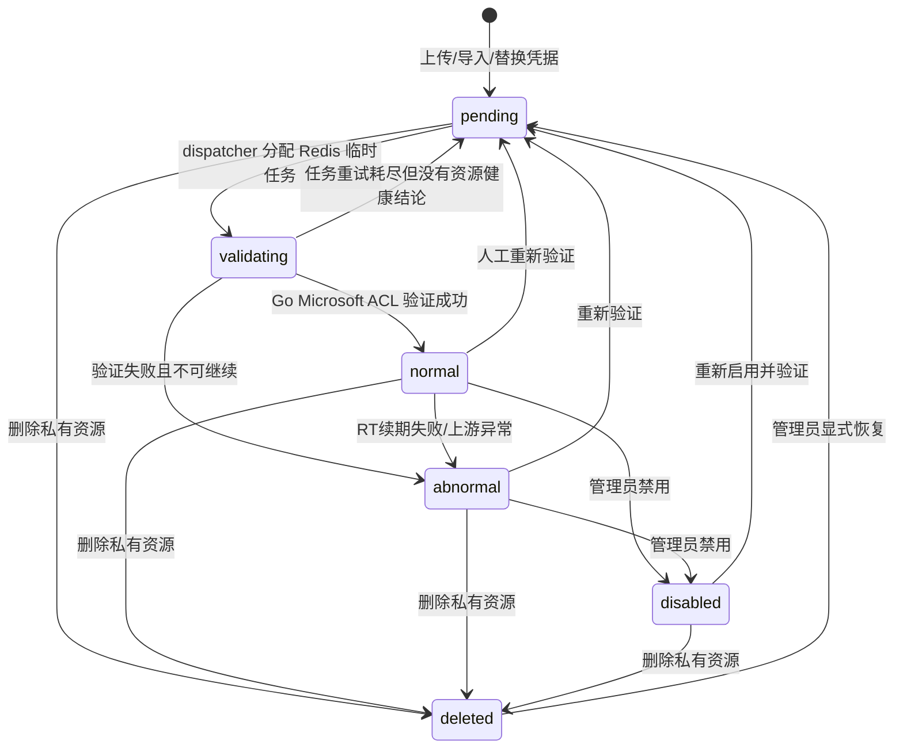
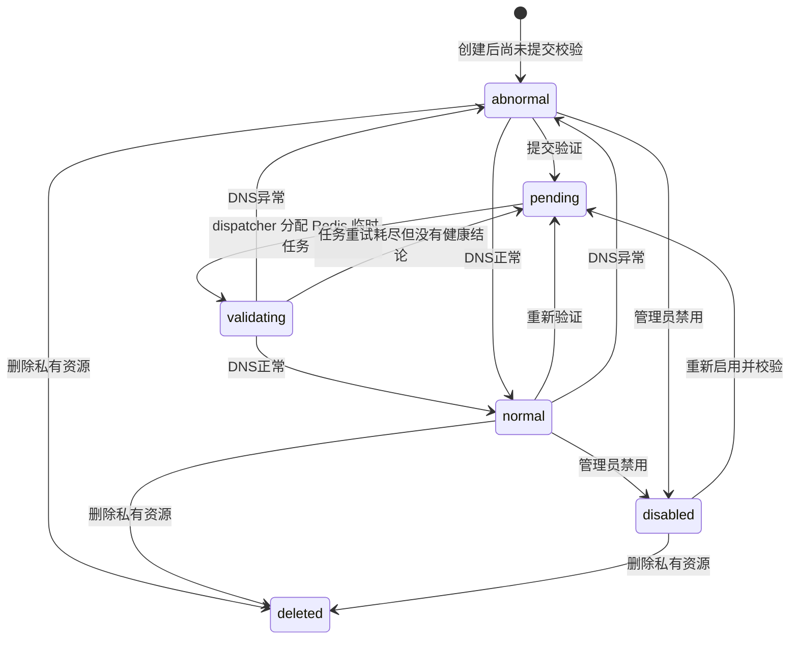
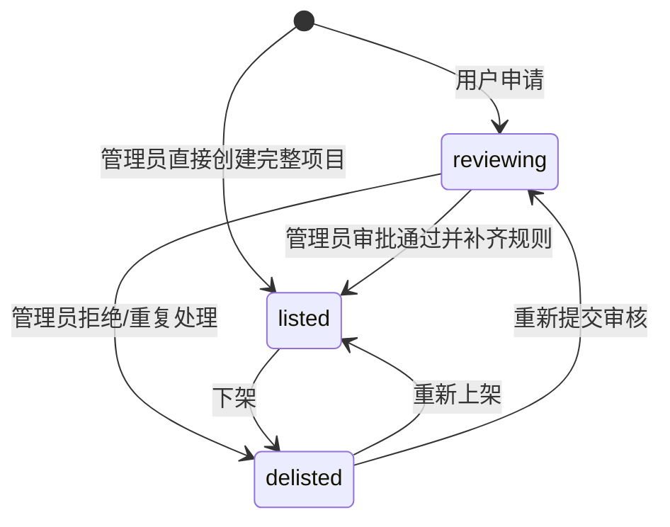

# BC-CORE 邮箱资源与项目规则上下文

## 修订记录

| 日期 | 版本 | 修订人 | 说明 |
|------|------|--------|------|
| 2026-06-29 | V1.0 | Codex | 形成 Go 版从 0 DDD 设计基线，作为一次 V1.0 变更。 |
| 2026-07-01 | V1.1 | Codex | 补充 P1-I2 Microsoft TXT 导入四种 `----` 行格式；不改变 Core 资源表和辅助邮箱绑定边界。 |
| 2026-07-01 | V1.2 | Codex | 澄清 P1-I2 供应商资源接口拆分：Microsoft TXT 走资源导入口，自建域名走结构化 Domain 接口；不改变资源聚合边界。 |
| 2026-07-01 | V1.3 | Codex | 补充 P1-I2 ResourceImport artifact 索引；落实原始导入文件和安全失败明细进入 MinIO private bucket 的原设计。 |
| 2026-07-01 | V1.4 | Codex | 补充 P1-I2 Microsoft 普通用户上传默认私有、供应商单向发布出售；明确 `forSale` 不是已售出状态。 |
| 2026-07-01 | V1.5 | Codex | 补充 P1-I2 Microsoft `longLived` 独立字段、导入批次长短效选择和批量发布出售命令。 |
| 2026-07-02 | V1.6 | Codex | 补充 P1-I2 ResourceImport 异步状态查询、Asynq 重试边界和导入成功事务幂等要求；不改变 Core 资源聚合边界。 |
| 2026-07-02 | V1.7 | Codex | 补充 P1-I2 普通用户逻辑删除自有私有 Microsoft 资源、删除后重新导入恢复；不改变公开出售单向策略。 |
| 2026-07-02 | V1.8 | Codex | 补充 P1-I2 自建域名一期策略：系统内置默认本机收件服务器，MX 固定为 `mx.aishop6.com`；Domain 私有发布 `not_sale -> sale`、私有删除使用 `deleted` 终态并支持同 owner 重建恢复；同步 `not_sale/sale/binding` 用途命名。 |
| 2026-07-02 | V1.9 | Codex | 补充 P1-I2 资源批量删除命令：仅删除当前 owner 的私有 Microsoft/Domain 资源，保持公开出售不可删除策略。 |
| 2026-07-02 | V1.10 | Codex | 补充 P1-I2 资源列表统一模糊搜索、创建时间区间筛选、`selection.mode=filter` 服务端批量命令；修订 deleted 资源重新导入时可更新 owner。 |
| 2026-07-02 | V1.11 | Codex | 设计调整：Domain `domainTld` 从仅内部索引改为资源列表安全返回，前端不得重复实现 TLD 规则；补充 P1-I2 批量资源命令的派生索引字段、`GeneratedMailbox.ownerUserId` 和已删除 Domain 恢复时重置生成邮箱池。 |
| 2026-07-02 | V1.12 | Codex | 补充 P1-I2 Microsoft 导入错误处理策略和 filter 批量删除性能策略：默认错误跳过，filter 删除使用集合更新并写命令级 OperationLog。 |
| 2026-07-02 | V1.13 | Codex | 补充 P1-I2 Microsoft 导入前端预处理策略：前端可按同规则过滤行级错误减负，后端仍是权威校验边界。 |
| 2026-07-04 | V1.14 | Codex | 补充 P1-I3 ResourceValidation 异步任务事实：资源验证 HTTP 入口只创建任务并返回 `202`，Microsoft/DNS 外部验证由 Asynq worker 执行，结果短事务回写资源状态。此为缺失设计补充，不改变资源状态机。 |
| 2026-07-04 | V1.15 | Codex | 补充 P1-I3 ResourceValidation 幂等与临时失败策略：同一资源同一时间只允许一个 active 验证任务；外部网络/代理/DNS 服务临时不可用只重试任务，不把资源状态写为异常。此为缺失设计补充，不改变资源状态机。 |
| 2026-07-04 | V1.16 | Codex | 补充 P1-I3 Microsoft 辅助邮箱输入交接：Core 只解析 TXT 中的 `bindingAddress` 并通过 Port 交给 MailTransport，绑定状态仍由 MailTransport 拥有。此为缺失设计补充，不改变 Core 资源聚合边界。 |
| 2026-07-04 | V1.17 | Codex | 补充 P1-I3 Microsoft `graphAvailable` 协议能力事实：验证后记录 Graph 是否可读，列表和批量 filter 可筛选；此为缺失设计补充，不新增资源状态。 |
| 2026-07-04 | V1.18 | Codex | 纠正 P1-I3 ResourceValidation 临时失败重试上限：基础设施失败只在任务事实内有限重试，耗尽后任务终态失败但不改资源状态。此为缺失设计补充，不改变资源状态机。 |
| 2026-07-04 | V1.19 | Codex | 补充 P1-I3 ResourceValidation 批量提交和导入后自动排队：批量检测 HTTP 入口只批量创建/复用验证任务并唤醒 dispatcher；Microsoft 导入事务成功后自动提交本批资源的异步验证任务。此为缺失设计补充，不改变资源状态机。 |
| 2026-07-05 | V1.20 | Codex | 补充 P1-I3 ResourceValidation Domain filter 的 `purpose` 筛选：用于让域名资源“全部检测”和用户侧私有/出售筛选一致；此为缺失接口筛选补充，不新增用途枚举。 |
| 2026-07-05 | V1.21 | Codex | 补充 P1-I4 管理员项目批量命令、非审核项目删除、私有项目授权接口和项目 Logo 上传接口：`selection.mode=ids/filter` 由后端集合处理，不允许前端循环单条操作；审核中项目只允许通过/驳回，不提供删除；Logo 上传保存为文件 URL，不把 base64 写入 `Project.logoUrl`。此为缺失设计补充，不改变项目状态机。 |
| 2026-07-05 | V1.22 | Codex | 补充 P1-I4 项目广场 facets、私有项目可见性和详情安全边界：项目广场筛选计数由后端聚合返回；`listed/private` 必须经 `ProjectAccess` 授权可见；普通 listed 详情不返回供应商价、分配权重、邮件规则和授权列表。此为缺失性能和安全边界补充，不改变项目状态机。 |
| 2026-07-06 | V1.23 | Codex | 补充 P1-I4 管理员完整项目配置的私有授权集合保存策略：管理员创建、审批通过、编辑项目时可提交 `accessUserIds`；后端在同一数据库事务内替换 `ProjectAccess` 集合，`public` 项目必须清空授权集合。此为缺失事务边界补充，不改变项目状态机。 |
| 2026-07-09 | V1.24 | Codex | 补充资源列表 facets：`GET /v1/resources` 在分页返回当前页数据的同时返回后端聚合筛选计数，前端不得使用已加载分页块推断全量后缀/TLD/状态/私有等计数。此为缺失性能和 UI 一致性设计补充，不改变资源状态机和既有筛选策略。 |
| 2026-07-09 | V1.25 | Codex | 按接口命名清洁度要求规范 Core URI：资源导入/检测改为 `/v1/resources/imports`、`/v1/resources/validations`，项目 Logo 改为 `/v1/projects/logos`；只调整 URI 命名，不改变资源、验证任务和项目 Logo 业务语义。 |
| 2026-07-09 | V1.26 | Codex | 补充 Domain 私有库存口径：`purpose=not_sale` 不进入公开供给池，但可作为 owner 自己下单的私有库存。此为缺失库存口径补充，不改变资源状态机。 |
| 2026-07-11 | V1.27 | Codex | 落实 Microsoft 显式别名自动补货：仅处理 `status=normal && forSale=true` 的公开出售资源，按上海自然周/年限额执行，成功别名统一归确定性的 `super_admin` 所有；同时将资源批量验证改为 durable batch 展开，并明确验证与显式别名的忙闲 admission 规则。 |
| 2026-07-11 | V1.28 | Codex | 将 Microsoft 显式别名补货资格与出售状态解耦：所有 `status=normal` 的资源均自动补货，`forSale` 变化不暂停任务；别名仍归确定性的 `super_admin`，分配阶段仍按主资源的公开/私有供给规则选择。 |
| 2026-07-12 | V1.29 | Codex | 补充管理员 Microsoft 资源管理用例：定义跨上下文组合查询、原子编辑、owner/地址迁移的 active allocation 保护，以及公开资源下架、逻辑删除和管理员恢复命令；保留现有管理 UI 能力但禁止跨域直写。 |
| 2026-07-12 | V1.30 | Codex | 发布最小 tx-bound `MicrosoftCredentialPort`：Token/Fetch 的内部凭据读取和 rotated RT/诊断结果统一回到 Core service/repository；Alias expedite 改为唯一受审计命令入口，禁止其他 BC 直读直写 Core 表。 |
| 2026-07-12 | V1.31 | Codex | 明确原子编辑的 Binding 同值语义：规范化地址未变化时不重置 verified 状态、不创建验证任务；仅 owner/主邮箱变化时只同步当前 Binding 身份字段。 |
| 2026-07-15 | V1.32 | Codex | 补充管理员 Domain 基础管理契约：增加域名详情、DNS 正常/异常显式命令、域名禁用与生成邮箱禁用；命令遵循 Domain 状态机并写 OperationLog。 |
| 2026-07-15 | V1.33 | Codex | 管理员 Domain 页面接入真实 API：列表增加 owner 富化、完整筛选/facets/deleted 视图；补齐显式编辑、Validate、Enable/Disable、Publish/Unpublish、Delete/Recover 与 ids/filter 批量命令。管理员导入可选择显式 owner，服务端校验 owner 资格、同 owner MailServer、active allocation、版本、幂等回执和 OperationLog；Domain SMTP 入站邮件只刷新真实消息查询，不伪造远程 Fetch 任务。 |
| 2026-07-15 | V1.34 | Codex | 明确 deleted Domain 恢复时的历史分配兼容：无 allocation 引用的旧生成邮箱物理清理；被 released allocation 引用的行退役并退出邮箱池，订单继续保留交付邮箱快照。owner、Domain、MailServer 和当前邮箱池归属仍在同一短事务内更新。 |
| 2026-07-16 | V1.35 | Codex | 管理员 Domain 与 Microsoft 邮件 Tab 统一使用服务端搜索与 `(receivedAt,id)` 稳定游标：首屏按全局页大小加载并由后端计算 `total`，续页不重复 `COUNT`，正文仍按单封读取；禁止全量拉取后本地搜索或计数。 |
| 2026-07-16 | V1.36 | Codex | 修正管理员辅助邮箱域名的 `mailboxCount`：普通 Domain 统计未退役 `GeneratedMailbox`，`purpose=binding` Domain 通过 MailTransport 批量统计当前有效 Microsoft 辅助绑定地址；过期绑定和 deleted Microsoft 资源不计入。 |
| 2026-07-16 | V1.37 | Codex | 定稿 Microsoft 验证与别名边界：资源健康只由权威 RT 与收件决定，辅助邮箱恢复失败不能推翻验证成功；验证成功后幂等创建或唤醒独立 alias schedule。完整流程见 [Microsoft 资源验证、辅助邮箱恢复与显式别名流程](20-microsoft-validation-binding-alias-flow.md)。 |
| 2026-07-16 | V1.38 | Codex | 补充密码登录授权 RT 的验证码路径：登录 proof 同样必须先识别辅助邮箱；规则可推算时按完整邮箱精确收码，推算失败时才按掩码和实际 recipient 反推，两条发码路径共用恢复租约。 |
| 2026-07-16 | V1.39 | Codex | 定稿 Redis-only 资源验证调度：Microsoft/Domain 的 `pending` 表示待分配，`validating` 表示已有临时 Redis/Asynq 任务；批量 selection、分页游标、单资源执行和重试都只存在 Redis。MySQL 不保存 validation job/batch/history，dispatcher 按自适应执行窗口领取，任务完成立即清理；启动时把遗留 `validating` 重置为 `pending`。 |
| 2026-07-17 | V1.40 | Codex | 将 Microsoft 旧项目识别从验证 worker 的同步全量拉取拆为独立 MailMatch 异步任务：验证只轻量探测 Inbox/Junk；扫描按确定性规则识别主邮箱/点号/加号/显式别名，复用既有订单与分配框架补齐超级管理员 0 元已过保历史订单。 |
| 2026-07-20 | V1.41 | Codex | Microsoft 验证成功后先进入 `identifying`，旧项目识别及历史订单/分配事实在同一事务完成后才切换 `normal`；`identifying` 不进入分配池，并允许管理员按状态筛选后重新提交历史扫描。 |

> 核心域。BC-CORE 是邮箱资源和项目规则的所有者。分配记录、订单、邮件事实、钱包余额不在本上下文内。

---

## 1. 定位

BC-CORE 回答两个问题：

| 问题 | 聚合 |
|------|------|
| 这个邮箱资源是什么、归谁、是否可供给？ | `EmailResource` 及资源子表 |
| 这个项目卖什么、怎么分配邮箱、怎么识别邮件？ | `Project`、`Product`、`MailRule`、`Access` |

核心原则：

- 资源状态由资源服务和验证任务维护，交易和分配不能直接改资源状态。
- 项目是规则中心，订单和邮件匹配都必须回到项目规则。
- 用户项目申请不单独建重型申请聚合，用 `Project.status=reviewing` 表达。
- 管理员直接创建项目是完整运营创建路径，成功后直接 `listed`，不伪造用户申请。
- 管理员 Microsoft 邮箱页面是以 `EmailResource.id` 为锚点的跨上下文管理入口，不是新 BC；Core 只承载资源列表/概要/命令，各独立 Tab 优先复用事实所有者的管理员 API。

---

## 2. 聚合一：邮箱资源

### 2.1 聚合结构

```text
EmailResource
├── MicrosoftResource
│   ├── ExplicitAlias
│   ├── DotAlias
│   └── PlusAlias
└── DomainResource
    ├── GeneratedMailbox
    └── MailServer
```

`EmailResource.id` 是跨上下文引用的唯一资源 ID。资源根创建后 `type` 不可修改。

### 2.2 `EmailResource`

| 字段 | 含义 |
|------|------|
| `id` | 资源根 ID |
| `type` | `microsoft/domain` |
| `ownerUserId` | 资源 owner；供应商资源归供应商，平台资源可归管理员 |
| `createdAt` | 创建时间 |

不变式：

| 编号 | 规则 |
|------|------|
| INV-C-R1 | 每个资源根必须且只能有一个对应子表记录。 |
| INV-C-R2 | 资源根类型和子表类型必须由数据库约束兜底。 |
| INV-C-R3 | 出售供给 owner 必须是启用用户，并具备 `supplier/admin/super_admin` 任一角色。 |
| INV-C-R4 | 普通 `user` 拥有的 Microsoft 资源不得进入公开出售供给池，只能作为 owner 自用私有资源。 |

### 2.3 `MicrosoftResource`

| 字段 | 含义 |
|------|------|
| `id` | 共享主键，等于 `EmailResource.id` |
| `emailAddress` | Microsoft 邮箱 |
| `emailDomain` | 从 `emailAddress` 派生的精确后缀索引字段，不对 API 暴露 |
| `password` | 邮箱密码，原值保存 |
| `clientId` | Microsoft OAuth clientId |
| `refreshToken` | Microsoft RT，原值保存 |
| `longLived` | 是否长效资源，由导入批次选择写入，不从 `clientId/refreshToken` 自动推断 |
| `graphAvailable` | 最近一次完成验证是否确认 Graph 可收件；Graph 成功为 `true`，IMAP 回退成功或确定性验证失败为 `false` |
| `rtExpireAt` | RT 预计失效时间 |
| `forSale` | 是否公开供给出售 |
| `status` | `pending/validating/identifying/normal/abnormal/disabled/deleted`；`pending`=待验证，`validating`=已分配验证任务，`identifying`=验证已成功但仍在识别旧项目 |
| `qualityScore` | 资源质量分 |
| `lastSafeError` | 脱敏诊断摘要 |
| `lastAllocatedAt` | 最近分配时间 |

`forSale` 表示 Microsoft 资源是否公开进入出售供给池。`forSale=false` 等价于用户侧“私有=是”，`forSale=true` 等价于用户侧“私有=否”。`forSale` 不表示资源已经售出；订单购买的是资源分配产生的绑定关系或使用结果，不转移 `MicrosoftResource` 本体所有权。

状态机：



`deleted` 是普通用户流程和自动验证流程的终态标记，不由 Microsoft ACL 或普通状态 PATCH 产生。进入 `deleted` 后不再参与默认列表、查重拦截、验证、分配和出售发布；只有管理员 `RecoverMicrosoftResource` 命令可以在重新校验唯一地址、owner、凭据配置和当前状态后执行 `deleted -> pending`。恢复固定写 `forSale=false/graphAvailable=false`、清空旧安全错误，提交后唤醒 dispatcher，不能直接恢复为 `normal`。

可分配条件：

```text
status=normal
forSale=true
ownerUserId 对应用户启用
ownerUserId 具备 supplier/admin/super_admin 任一角色
```

自用私有条件：

```text
status=normal
forSale=false
ownerUserId = 当前下单用户
```

自用私有资源只能分配给 owner 自己，不进入公开出售候选。

Microsoft 协议交互细节不在 Core 领域模型中表达。登录页面、RT 获取、Graph 拉取由 BC-MAILTRANSPORT 的 Go Microsoft ACL 处理；Core 仅保存 `graphAvailable` 这类验证后的协议能力事实，用于资源页展示和筛选，不参与资源状态枚举。

#### P1-I3 补充设计：资源验证任务

资源验证没有 MySQL 任务实体。MySQL 只保存资源业务状态；批量游标、单资源 payload、重试次数和执行去重都属于 Redis/Asynq 临时数据，不提供 `validationId`、任务历史或任务状态查询接口。

验证 HTTP 入口遵循异步边界：

| 步骤 | 要求 |
|------|------|
| `POST /v1/resources/{resourceId}/validate` | 只校验登录、owner/admin 权限和资源状态，在短事务内把单资源置为 `pending` 并写 OperationLog；提交后唤醒 dispatcher，返回 `202 Accepted` 的 `{requested,queued}`，不返回任务 ID。 |
| `POST /v1/resources/validations` | Microsoft/Domain 大批量入口只把 selection 放入一个 Redis cursor task 后返回 `202`，HTTP 不同步扫描、COUNT 或更新大表。cursor worker 每次最多处理一页，把命中资源异步置为 `pending`，然后只投递下一页 cursor；当前页完成即从 Redis 删除。`ids` 最多显式提交 10000 个，更多资源使用 `filter`。 |
| Microsoft 导入后自动验证 | 导入 worker 创建或恢复 Microsoft 资源时已经写 `status=pending`，事务提交后只唤醒统一 dispatcher；不创建第二份 validation batch，不在导入事务内执行 Microsoft 外部验证。 |
| dispatcher 领取 | dispatcher 只挑选 `pending` 资源，并在同一短事务把它们置为 `validating` 后投递单资源 Redis task。总 `validating` 分配数不得超过当前自适应执行窗口；重复 dispatcher 不能让 Redis backlog 无界增长。 |
| worker 执行 | 根据资源类型调用 BC-MAILTRANSPORT 的 Microsoft ACL 或 DNS 验证 Port；外部网络调用不得进入数据库事务。 |
| Microsoft 成功条件 | MailTransport 完成 RT 获取/刷新，并通过 Graph 或 IMAP 任一路径轻量读取收件箱和垃圾箱后，即可判定 Microsoft 资源本体正常；验证阶段每个文件夹最多读取一封，不承担历史全量扫描。密码登录授权若触发辅助邮箱验证码，必须先按规则推算完整地址：推算成功则精确收码，推算失败才按掩码反推实际 recipient。辅助邮箱观察、恢复、绑定和持久化失败，以及后续项目邮件匹配失败，均不能推翻已经成立的 RT 与收件成功证据。完整流程见 [Microsoft 资源验证、辅助邮箱恢复与显式别名流程](20-microsoft-validation-binding-alias-flow.md)。 |
| 成功回写 | 短事务把 Microsoft 资源状态置为 `identifying`、Domain 资源状态置为 `normal`，清空安全错误；Microsoft 如返回 rotated RT，必须同步保存；Microsoft 如通过 Graph 收件则 `graphAvailable=true`，如通过 IMAP 回退收件则 `graphAvailable=false`。 |
| 旧项目识别 | Microsoft 健康结果提交前，Core 先幂等投递独立 `validated_microsoft_history_scan` 任务；投递失败则保持 `validating` 交给现有验证重试。健康结果成功提交后资源进入 `identifying`，不进入分配池。任务 worker 使用已提交凭据流式全量读取 Inbox/Junk：地址等于主邮箱为 `main`，同域去点后相同为 `dot`，同域且 `+` 前缀相同为 `plus`，其余实际收件地址为显式 `alias`。MailMatch 提交识别结果；BC-TRADE 复用既有 BC-BILLING 零元扣款和 BC-ALLOC alias/guard/allocation Port，先创建或复用对应别名，再为确定性的 `super_admin` 创建一笔 0 元、`completed`、已过保且 Allocation 已 `released` 的幂等历史订单；这些事实与 `identifying -> normal` 在同一数据库事务提交。失败时保持 `identifying`，管理员可按该状态筛选并重新提交历史扫描。 |
| 失败回写 | 只有无法获得权威可用 RT，或使用最终 RT 发生确定性收件失败，才允许把资源置为 `abnormal`。辅助邮箱本身的掩码、外部域名、恢复超时、验证码错误或写入失败不是独立资源异常证据。写 `lastSafeError` 和 SystemLog 时必须记录真正的 RT/账号/收件失败原因；不得把资源自动置为 `disabled`，禁用只能由管理员命令触发。 |
| 临时失败 | Microsoft/代理/DNS 服务临时不可用、请求超时或验证 Port 不可用时，Asynq 在同一临时 task 内重试，资源保持 `validating`。最终重试耗尽时必须先把资源恢复为 `pending`，handler 返回成功让该 Redis task 立即删除；不得写 `abnormal`，也不得进入 archived。 |
| 投递失败 | `pending -> validating` 后如果 Redis enqueue 失败，立即按 resource type、status 和 credential revision fence 回滚为 `pending`。 |
| 幂等与 fencing | 单资源 TaskID 由 resource type、resource ID 和 credential revision 构成；结果提交同时检查 owner/type、`status=validating` 和 Microsoft credential revision。旧 task 不得覆盖管理员换凭据、禁用、删除或启动归零后的新状态。 |
| 恢复与清理 | 服务启动时全部 `validating -> pending`。运行中超过租期的遗留 `validating` 也由 dispatcher 恢复。completed task 不保留 retention，最终失败不进入 archived，不维护额外 Redis result/list/set key。 |

资源验证状态机只有以下已知节点：

```text
提交/导入/批量 cursor: 非 disabled/deleted -> pending
dispatcher: pending -> validating
确定成功: validating -> normal
确定资源失败: validating -> abnormal
投递失败/最终临时失败/启动恢复: validating -> pending
管理员禁用: 非 deleted -> disabled
逻辑删除: -> deleted
```

管理员 Microsoft 资源的 `Validate` 还必须拒绝 `disabled/deleted`；`disabled -> pending` 只能由独立 `Enable` 命令完成并唤醒 dispatcher，不能借普通 Validate 隐式启用。普通 owner 资源验证入口如遇 disabled 同样按状态不允许处理。

#### P1-I2 补充设计：Microsoft TXT 导入行格式

Microsoft TXT 导入解析支持以下四种行格式，一行一个资源：

```text
email----password
email----password----辅助邮箱
email----password----clientID----refreshToken
email----password----clientID----refreshToken----辅助邮箱
```

`email/password/clientID/refreshToken` 属于 Core 的 `MicrosoftResource` 资源本体字段。`辅助邮箱` 是后续 BC-MAILTRANSPORT 创建或复用辅助邮箱绑定记录的输入，不新增到 Core 资源表，不进入 Core 资源状态机，也不得出现在资源列表、资源详情、普通日志或导出中。辅助邮箱是否已分配、已发码、已验证或失败，仍由 MailTransport 的辅助邮箱绑定实体和状态机表达。

P1-I3 验证执行必须把上述输入边界落实为代码边界：Core 解析导入 TXT 后，通过 `MicrosoftBindingInputRecorder` Port 把 `ownerUserId/email/bindingAddress` 交给 BC-MAILTRANSPORT；Core 不持久化辅助邮箱状态，也不解释 Microsoft 页面绑定细节。Redis validation worker 只把资源本体凭据交给 MailTransport ACL，并接收结构化验证结果回写资源状态。健康结果最终提交前，Core 先幂等创建 BC-MAILMATCH 独立资源历史扫描任务；投递失败沿用现有 validation retry，任务提前运行时必须等待资源进入 `normal`。该任务全量流式读取邮件并把识别结果交给 BC-TRADE，后者通过既有 BC-BILLING/BC-ALLOC Port 补齐 alias/order/allocation 事实。MailMatch 不跨域直写订单、钱包或 Allocation；任务不占用验证 worker，也不属于 Core 资源状态机，识别执行失败不得改变已经提交的资源健康。

#### P1-I2 补充设计：资源导入 artifact

`ResourceImport` 是 Core 对一次资源导入的安全索引，只保存 owner、资源类型、原始导入文件 objectKey、失败明细 objectKey、状态、导入数量和安全错误摘要。原始 TXT 和失败明细由 BC-GOVERNANCE FilePort 写入 MinIO private bucket；Core 表不得保存密码、RT、accessToken、辅助邮箱绑定状态或原始文件内容。导入 HTTP 请求只负责写入 MinIO private bucket、创建 `ResourceImport(processing)` 并投递 Asynq 任务，随后返回 `202 Accepted`；解析、查重、资源创建和失败明细生成由后端 Asynq worker 异步完成。导入 HTTP 契约允许 `errorStrategy=skip|abort`，默认 `skip`，用户侧文案为“错误跳过/错误中止”。前端可以用同一套四种 `----` 行格式规则预处理上传内容：`skip` 时过滤行格式错误和文件内重复，`abort` 时直接拦截首个行级错误并不上传；该预处理只用于减少无效上传和 worker 压力，后端仍必须重复执行解析、文件内查重、库内查重和事务唯一约束兜底，不能信任前端。`skip` 对行格式错误、文件内重复、已有未删除邮箱等行级错误写入失败明细并继续导入有效行，最终 `ResourceImport(imported)` 的 `importedCount` 只统计实际写入资源数，安全错误摘要只返回跳过数量；`abort` 在首个行级错误处写入失败明细并把任务置为 `ResourceImport(failed)`。确定性业务失败写入失败明细和终态后不再重试；MinIO、MySQL、Redis 等基础设施失败交给 Asynq 重试，耗尽重试后写入安全失败摘要。资源创建和 `ResourceImport(imported)` 必须在同一个数据库事务中完成，重复投递遇到 `imported/failed` 终态直接 no-op。

#### P1-I2 补充设计：Microsoft 上传与出售发布

任何已登录用户都可以上传自有 Microsoft 资源。上传或导入后的 Microsoft 资源固定为 `status=pending`、`forSale=false`，即默认私有。导入时用户必须选择本批资源为长效或短效，服务端把该选择写入 `MicrosoftResource.longLived`；`longLived` 是资源本体的独立字段，不由是否填写 `clientID/refreshToken` 派生。

普通 `user` 点击出售不改变资源，而是进入 BC-IAM 的供应商申请流程。申请通过后只提升用户角色，不自动发布任何资源。用户成为 `supplier` 后，仍需主动对自有私有资源执行发布出售命令。

供应商、管理员和超级管理员可以把自有 Microsoft 资源单向发布为公开供给：

```text
forSale=false -> forSale=true
```

用户侧不提供 `forSale=true -> forSale=false`。如未来需要下架公开供给，必须另行设计管理员命令，不得复用供应商发布接口。

Microsoft 批量发布出售是单个发布命令的批量形式。选中资源操作使用 `selection.mode=ids`，服务端必须先校验全部 ID 都属于当前 owner，再只对 `forSale=false` 的资源执行 `forSale=true`；已处于 `forSale=true` 的资源视为幂等跳过，不得报“已售出”。全部出售操作使用 `selection.mode=filter`，服务端按 owner、资源类型、统一模糊搜索、精确后缀、状态、长短效、Graph 可用性和创建时间区间筛选私有资源，并分块执行发布；filter 模式只返回数量，不返回全量资源 ID。

普通用户和供应商都可以删除自有 `forSale=false` 的 Microsoft 私有资源。删除只适用于尚未发布到公开供给池的资源，服务端必须校验 owner、资源类型、`forSale=false` 且当前状态不是 `deleted`；`forSale=true` 表示资源已经进入公开出售供给池，不是已售出状态，用户侧不得删除或下架，后续如需下架必须另行设计管理员命令。删除成功写入 OperationLog，并在同一事务内把 Microsoft 子表状态更新为 `deleted`，不得物理删除资源根或子表记录。

Microsoft 资源列表、数量统计、重复导入检查、验证任务、公开出售发布和分配候选都必须排除 `status=deleted`。如果后续再次导入同一个已删除邮箱，服务端复用原有 `EmailResource.id` 和 `MicrosoftResource.id`，把 owner、密码、clientId、refreshToken、longLived、rtExpireAt、状态等字段覆盖为最新导入数据，并固定恢复为 `forSale=false`；即使新导入用户不是旧 owner，也以本次导入用户作为新 owner。如果同邮箱资源存在且状态不是 `deleted`，继续按重复邮箱冲突处理。

批量删除是单个删除命令的批量形式，用于资源页“删除选中/全部删除”的效率保障。选中资源操作使用 `selection.mode=ids`，服务端必须在一个事务内校验全部 ID 都属于当前 owner，然后只删除仍处于私有状态的 Microsoft/Domain 资源，并返回实际删除的资源 ID，前端只能按这些 ID 更新本地列表。全部删除操作使用 `selection.mode=filter`，服务端按 owner、资源类型、统一模糊搜索、精确后缀/TLD、状态、长短效、Graph 可用性和创建时间区间筛选私有资源，并使用单条集合更新执行逻辑删除；filter 模式只返回数量，不返回全量资源 ID。filter 删除只写一条命令级 OperationLog，`resourceId=filter`，安全摘要记录影响数量；不得为每一条被删除资源逐行写 OperationLog，避免大批量删除拖慢请求。

Microsoft 的精确后缀筛选不得依赖 `LOWER(emailAddress) LIKE '%@suffix'` 这类不可用普通索引的表达式。服务端必须在写入或恢复资源时同步维护 `emailDomain`，批量发布/删除的 `selection.mode=filter.suffix` 使用 `emailDomain` 等值匹配。统一模糊搜索仍保留为搜索语义，不替代精确后缀筛选。

#### 管理员 Microsoft 资源管理用例

Core 的 `AdminResourceQuery` 只对外提供管理员资源列表、facets、基本概要和必要安全统计。Core repository 只查询 Core 自己的资源、凭据安全标记、导入和验证事实，并通过批量 Port 补充概要所需的 owner、当前 Binding 和任务摘要；订单、主邮箱邮件、辅助邮箱邮件和完整 Task Tab 分别调用 Alloc、MailMatch、MailTransport、Governance 的管理员 API。Core 不拥有整个页面的最终 DTO，也不得跨上下文 repository JOIN 或通过组合 DTO 修改状态。

管理员写能力必须落为显式应用命令；`PATCH /v1/admin/resources/{resourceId}` 可以保留编辑弹窗一次保存的 UI 契约，接受资源字段、`forSale`、可选凭据和 `bindingAddress`，但不接受任意 `status`。应用层必须先把字段解释为以下命令并统一校验，不能把请求 map 直接交给 GORM 更新：

| 应用命令 | 规则 |
|----------|------|
| `EditMicrosoftResource` | 可修正 `emailAddress/ownerUserId/longLived/qualityScore`，并可组合 MailTransport 的 `SetBindingAddress`；地址格式、资源类型、唯一性、目标 owner 和版本条件全部通过后才落库。`status/graphAvailable/tokenHealth/lastSafeError` 等状态、派生或任务结果字段不可直接编辑。 |
| `PublishMicrosoftResource` / `UnpublishMicrosoftResource` | `publish` 校验 owner 启用且角色为 `supplier/admin/super_admin`；`unpublish` 执行 `forSale=true -> false`，只阻止新分配，不释放或改写既有 allocation。二者均幂等。 |
| `ReplaceMicrosoftCredentials` | 密码必填，`clientId/refreshToken` 必须成对；凭据、revision、`status=pending/graphAvailable=false` 和 OperationLog 同一事务提交，事务后唤醒 dispatcher。响应只返回 configured/revision 等安全字段。该修复命令允许在存在 active allocation 时执行。 |
| `ValidateMicrosoftResource` | 对非 disabled/deleted 资源只写 `pending` 并唤醒 Redis dispatcher；管理员不能直接把状态写为 `normal/abnormal`。 |
| `EnableMicrosoftResource` | 只处理 `disabled -> pending`，清理不再可信的派生健康并唤醒 dispatcher；与普通 Validate 分开，避免隐式启用。 |
| `DisableMicrosoftResource` | 显式禁用并停止后续供给和该资源的新自动维护；不释放、不改写既有 Order/Allocation，也不擅自终止既有服务，其生命周期继续由 Trade/MailMatch 等所有者处理。 |
| `DeleteMicrosoftResource` | 管理员可逻辑删除公开或私有资源；先原子下架，再写 `status=deleted`，不物理删除资源根、allocation、订单、邮件或审计事实。存在 active allocation 时返回 `409`；用户侧删除仍只允许私有资源。 |
| `RecoverMicrosoftResource` | 只接受 `status=deleted`；恢复为私有 `pending` 并提交验证，不能恢复旧出售状态，也不能复活旧 active 任务。 |
| `RefreshMicrosoftToken` | 对非 deleted 且具备 RT 能力的资源创建或复用 durable token task；disabled 资源也可用于管理员诊断，但命令不执行 Enable。HTTP 不执行 Microsoft 网络，rotated RT 仍由 Core 凭据能力落库。 |

管理员 RT task 的协议执行事实可以由 MailTransport 保存，资源 Fetch task 由 MailMatch 保存，但二者都不能直接查询或更新 Core 表。Core 发布最小 `MicrosoftCredentialPort`：在 tx-bound context 中锁定内部 credential scope，并统一应用 token refresh 成功/失败诊断或 Fetch rotated RT；credential revision、`email_resources.version` 和安全诊断只在 Core application/repository 中推进。该 Port 只用于进程内协议工作，密码、Client ID、RT 不进入 HTTP、queue、TaskView、OperationLog 或 SystemLog。

owner 转移和邮箱地址修正会改变供给归属或已交付身份，必须调用 BC-ALLOC 的 `ResourceAllocationGuardPort`。Core 先锁定资源根，再在同一个短事务上下文查询 active allocation；分配创建也遵守“先锁 Core 资源、再写 allocation”的锁顺序。只要存在 active allocation，owner、`emailAddress` 和删除返回 `409 Conflict`；`disable`、`unpublish`、凭据修复、验证、质量分和长短效调整不改写既有 Order/Allocation，可以继续执行。Disable/Unpublish 仅阻止后续供给或自动维护，既有服务生命周期由其所属上下文继续处理。目标 owner 必须启用；资源保持公开出售时还必须具备 `supplier/admin/super_admin` 角色，普通 `user` 只能接收私有资源。

一次编辑同时包含 Core 字段、`forSale`、可选凭据和 `bindingAddress` 时必须 all-or-nothing：Core application service 开启短数据库事务，在内部复用 `Publish/Unpublish/ReplaceCredentials` 等领域能力，并通过 tx-bound context 调用 BC-MAILTRANSPORT 的 `BindingAdminPort`，再提交资源字段、必要的 `pending` 状态和成功 OperationLog。规范化后的 `bindingAddress` 与当前值相同时是 no-op，不得把 `verified` 重置为 `pending`，也不得仅因此重新排队验证；只发生 owner/主邮箱变化时同步 Binding 当前身份字段并保留地址协议状态。事务内只允许数据库操作，不执行 Microsoft/Graph/IMAP/SMTP/MinIO；任一字段或 Port 失败全部回滚。失败 OperationLog 在事务外 best-effort 写入，且不得包含邮箱密码、RT、验证码或邮件正文。批量 `ids/filter` 均由服务端处理，不允许前端循环单条命令；请求结构、权限范围或显式不存在 ID 在受理前使请求失败，受理后的并发状态、active allocation 或 owner 资格冲突按安全原因跳过并计数，不能静默计入 affected。

### 2.4 Microsoft 别名池

| 实体 | 用途 | 关键规则 |
|------|------|----------|
| `ExplicitAlias` | 真实创建在 Microsoft 账号里的显式别名 | 为所有 `status=normal` 的 Microsoft 资源自动创建，不区分 `forSale=true/false`；按 Asia/Shanghai 自然周最多 2 个、自然年最多 10 个；成功事实统一归当前 ID 最小的 `super_admin` 所有。 |
| `DotAlias` | 系统由主邮箱 local-part 插入 `.` 生成 | 同 `resourceId + email` 唯一，优先复用。 |
| `PlusAlias` | 系统由主邮箱生成 `+tag` | 同 `resourceId + email` 唯一，优先复用，不计库存。 |

别名池属于资源能力，不是分配事实。BC-ALLOC 只能通过 Port 选择/创建/引用别名。

显式别名仍由后台 dispatcher 无条件持续自动补货，发现 `status=normal` 且未达到配额的 Microsoft 资源后创建，公开与私有资源采用同一规则；`forSale` 变化不得暂停 schedule、取消 attempt 或阻止远端请求。管理员页面保留逐资源“创建显式别名”按钮，但其后端语义固定为调用 BC-MAILTRANSPORT 唯一受审计的 `AliasExpediteCommand`，先建立/复用幂等 receipt 和 OperationLog，再加速/唤醒该资源的既有 durable schedule；不存在绕过审计的直接 schedule 写入口，也不是绕过规则的同步创建入口。expedite 必须复用 active attempt，并继续受 `status=normal`、自然周/年配额、admission、fencing 和 uncertain reconciliation 约束。领取任务和真正远端调用前仍必须重新校验资源状态，只有状态不再是 `normal` 时才停止执行。`running/succeeded/uncertain` attempt 均占用配额，已确认失败才释放；结果不确定时固定对账同一候选，不能因一次未查询到就释放或换新候选。配额预占、attempt 结果和 `ExplicitAlias` 成功事实必须由数据库事务与 fencing token 保证并发一致性；attempt 是内部执行事实，一期 HTTP 不自动暴露未在已确认 UI 展示的字段。

`ExplicitAlias.ownerUserId` 是平台库存所有权，不继承 Microsoft 主资源的供应商 owner。确认显式别名成功时，事务必须按 `users.id ASC` 选择并共享锁定当前第一个 `role=super_admin` 的用户，然后同时写入 attempt 成功结果和 alias owner；如果系统当前没有 `super_admin`，整笔成功落库必须回滚，不能生成 `NULL` owner 或退化为供应商/admin owner。若同一 `resourceId + email` 已存在，远端再次确认成功时也要把 owner 收敛到本次确定的 `super_admin`。显式别名的创建资格与 allocation 供给范围相互独立：私有主资源也可以预创建别名，但不会因此变成公开供给，BC-ALLOC 仍按主资源和下单用户的既有规则选择库存。

### 2.5 `DomainResource`

| 字段 | 含义 |
|------|------|
| `id` | 共享主键，等于 `EmailResource.id` |
| `domain` | 自建邮箱域名 |
| `domainTld` | 从 `domain` 派生的精确 TLD 索引字段；资源列表安全返回该派生值，前端不得重复实现 TLD 规则 |
| `mailServerId` | 邮箱服务器 ID |
| `purpose` | `not_sale/sale/binding` |
| `status` | `pending/validating/normal/abnormal/disabled/deleted`；`pending`=待验证，`validating`=已分配验证任务 |
| `lastAllocatedAt` | 最近分配时间 |

状态机：



可分配条件：

```text
公开供给：purpose=sale
status=normal
MailServer.status=online
ownerUserId 对应用户启用
ownerUserId 具备 supplier/admin/super_admin 任一角色

owner 私有供给：purpose=not_sale
status=normal
MailServer.status=online
ownerUserId = 当前下单用户
```

`purpose=not_sale` 是普通用户自有域名资源的默认用途，用户侧展示为私有或不可出售，不进入公开出售供给池，但可以作为 owner 自己下单时的私有库存；`purpose=sale` 才能作为公开出售候选；`purpose=binding` 只用于 Microsoft 辅助邮箱验证码接收，只能由管理员创建或调整，不进入出售库存和分配。

P1 一期内置默认本机收件服务器，MX 记录固定指向 `mx.aishop6.com`。用户创建自建域名时，`mailServerId` 可省略；省略时服务端为当前 owner 复用或创建默认本机入站服务器。MailServer 实体和接口保留为后续多邮局/供应商自建邮局的扩展基础，但用户侧 P1 引导默认只展示本机 MX。

默认本机入站服务器是 owner 维度的内置能力，服务端必须按 `ownerUserId + serverAddress + mxRecord` 原子复用或创建，不得通过分页列表扫描来判断是否存在。并发创建域名时只能得到同一条默认 `MailServer` 记录。

供应商、管理员和超级管理员可以把自有 Domain 私有资源单向发布为公开供给：

```text
purpose=not_sale -> purpose=sale
```

用户侧不提供 `purpose=sale -> purpose=not_sale`。批量发布接口可以同时提交 Microsoft 和 Domain 资源 ID；服务端必须在一个事务内校验所有资源都属于当前 owner，Microsoft 按 `forSale=false -> true` 处理，Domain 按 `purpose=not_sale -> sale` 处理，`purpose=binding` 和 `status=deleted` 必须拒绝。

普通用户和供应商都可以删除自有 `purpose=not_sale` 的 Domain 私有资源。删除只适用于尚未发布到公开供给池的资源，服务端必须校验 owner、资源类型、`purpose=not_sale` 且当前状态不是 `deleted`；`purpose=sale` 表示域名资源已进入公开出售供给池，用户侧不得删除或下架。删除成功写入 OperationLog，并在同一事务内把 Domain 子表状态更新为 `deleted`，不得物理删除资源根或子表记录。

Domain 资源列表、数量统计、验证任务、公开出售发布和分配候选都必须排除 `status=deleted`。后续再次创建同一个已删除域名时，服务端复用原有 `EmailResource.id` 和 `DomainResource.id`，把 `EmailResource.ownerUserId`、`DomainResource.ownerUserId`、`mailServerId/purpose/status/lastAllocatedAt/domainTld` 等字段覆盖为本次创建数据，并按创建请求恢复用途；普通用户创建默认恢复为 `purpose=not_sale/status=abnormal`，`sale` 仍不得通过创建接口写入。如果同域名资源存在且状态不是 `deleted`，继续按重复域名冲突处理。

Domain 创建接口只接受 canonical ASCII 域名：服务端必须统一 lower-case、去掉尾部根点，并拒绝 URL scheme、路径、端口、通配符、空 label、非法字符、过长 label 和非域名格式。批量发布/删除的 `selection.mode=filter.tld` 必须使用 `domainTld` 等值匹配；`domainTld` 由服务端按内置常见二级 TLD 规则派生，避免精确 TLD 筛选退化为 `LIKE '%.tld'` 扫描。前端筛选 tab 必须使用资源列表返回的 `domainTld`，不得维护另一份 TLD 派生表。

### 2.6 `GeneratedMailbox`

| 字段 | 含义 |
|------|------|
| `id` | 生成邮箱 ID |
| `resourceId` | 自建邮箱域名资源 ID |
| `ownerUserId` | 生成邮箱池当前 owner，必须与 DomainResource 当前 owner 一致 |
| `email` | 实际邮箱 |
| `status` | `normal/disabled` |
| `lastAllocatedAt` | 最近分配时间 |

规则：

- 同 `resourceId + email` 唯一，查询必须同时按 `resourceId + ownerUserId` 过滤。
- 分配时优先复用已有 `normal` 邮箱。
- 允许跨项目复用，同项目唯一由 BC-ALLOC 分配约束兜底。
- 自建库存展示可用域名数量，同时管理端返回邮箱数量 `mailboxCount`：`not_sale/sale` 统计未退役 `GeneratedMailbox`，`binding` 统计 MailTransport 当前有效且归属该域名的 Microsoft 辅助绑定地址；禁止前端本地推算。
- 已删除 Domain 被重新创建恢复时，原 `GeneratedMailbox` 派生邮箱池必须在同一事务中清空，避免跨 owner 继承旧生成邮箱；无 allocation 引用的行物理删除，被 released allocation 引用的行改为内部 `retired` 并从列表、计数、入站解析和后续分配中排除，`DomainAllocation.email` 继续保存历史交付快照；新的邮箱池由后续分配重新生成。

### 2.7 `MailServer`

| 字段 | 含义 |
|------|------|
| `id` | 邮箱服务器 ID |
| `ownerUserId` | 服务器 owner；供应商自建服务器归供应商，平台服务器可归管理员 |
| `name` | 名称 |
| `serverAddress` | 服务器地址 |
| `mxRecord` | MX 记录 |
| `spf/dkim/dmarc/ptr` | 出站 DNS 记录 |
| `status` | `online/offline/disabled` |

`MailServer` 归 BC-CORE，因为它决定自建邮箱域名资源是否可供给；BC-MAILTRANSPORT 只使用协议连接能力。供应商创建自建邮箱域名时，只能引用自己拥有的 `MailServer`；管理员创建平台资源时，owner 由服务端按当前管理员写入。

---

## 3. 聚合二：项目

### 3.1 聚合结构

```text
Project
├── Product
├── MailRule
└── Access
```

### 3.2 `Project`

| 字段 | 含义 |
|------|------|
| `id` | 项目 ID |
| `name` | 项目名 |
| `targetPlatform` | 目标平台 |
| `logoUrl` | 项目 Logo；用于用户项目广场展示 |
| `description` | 项目说明；用于用户项目广场展示 |
| `status` | `reviewing/listed/delisted` |
| `accessType` | `public/private` |
| `applicantUserId` | 普通用户申请人；管理员直接创建时为空 |
| `reviewReason` | 审核驳回或重复处理原因 |
| `looseMatch` | 邮件宽松匹配开关 |
| `createdAt/updatedAt` | 时间 |

状态机：



上架完整性：

- 至少一个启用商品。
- 邮件规则满足当前 `looseMatch` 策略。
- `listed` 项目名唯一由数据库约束兜底。
- 私有项目下单必须有 `Access`。
- 管理员审批通过进入 `listed`，必须满足上架完整性；拒绝或重复处理进入 `delisted`，必须写入 `reviewReason` 供申请人重新提交时修正。

### 3.3 `Product`

| 字段 | 含义 |
|------|------|
| `id` | 商品 ID |
| `projectId` | 项目 ID |
| `type` | `microsoft/domain` |
| `status` | `enabled/disabled` |
| `codeEnabled/purchaseEnabled` | 是否支持接码/购买 |
| `codePrice/purchasePrice` | 用户价格 |
| `codeSupplierPrice/purchaseSupplierPrice` | 供应商结算价 |
| `codeWindowMinutes` | 接码等待窗口 |
| `activationWindowMinutes` | 购买激活窗口 |
| `warrantyMinutes` | 购买质保窗口 |
| `mainWeight/dotWeight/plusWeight` | Microsoft 分配权重 |

规则：

- `type=microsoft` 时，至少一个 Microsoft 权重大于 0。
- `mainWeight` 表示主邮箱类，主邮箱和显式别名共享该权重。
- 权重不是百分比，分母是非零权重之和。
- `type=domain` 时 Microsoft 权重不参与分配。

### 3.4 `MailRule`

| 字段 | 含义 |
|------|------|
| `id` | 规则 ID |
| `projectId` | 项目 ID |
| `ruleType` | `sender/recipient/subject/body` |
| `pattern` | 正则或内置收件人策略 |
| `enabled` | 是否启用 |

匹配策略：

| 模式 | 必需规则 |
|------|----------|
| `looseMatch=true` | `sender + recipient` |
| `looseMatch=false` | `sender + recipient + subject + body` |

类型间 AND，类型内 OR。当前策略缺少必需类型或必需类型未命中，最终匹配失败。

### 3.5 `Access`

私有项目授权事实：

| 字段 | 含义 |
|------|------|
| `projectId` | 私有项目 |
| `userId` | 被授权用户 |
| `grantedBy` | 授权管理员 |
| `createdAt` | 授权时间 |

公开项目不需要授权；私有项目只按 `Access` 判断可见和可下单。

---

## 4. 不变式

| 编号 | 规则 |
|------|------|
| INV-C1 | 只有 `Project.status=listed` 且商品 `enabled` 才可下单。 |
| INV-C2 | 私有项目只按 `Access` 授权，下单前必须校验。 |
| INV-C3 | 资源状态只由资源服务/验证任务修改，分配和交易不能直接改。 |
| INV-C4 | Microsoft 资源凭据原值保存，但不得进入 API 响应、普通日志、导出和后台列表。 |
| INV-C5 | `Product.type` 决定分配资源类型，不允许跨类型分配。 |
| INV-C6 | `MailRule` 缺少当前策略必需类型时，邮件匹配失败而不是放宽范围。 |
| INV-C7 | 显式别名配额按同一资源自然周/自然年统计，配额校验和落库必须串行化。 |
| INV-C8 | 点别名、加号别名、自建生成邮箱必须优先复用，无法复用时才生成。 |
| INV-C9 | 自建邮箱域名 `purpose=sale` 才进入公开出售分配；`purpose=not_sale` 只能作为 owner 自己的私有库存分配。 |
| INV-C10 | 普通用户创建自建邮箱域名时 owner 由服务端按当前用户写入；管理员导入页面可提交显式 owner，后端必须通过 IAM 校验目标 owner，并继续强制 Domain 与 MailServer 同 owner。 |
| INV-C11 | 自建邮箱域名引用的 `MailServer` 必须与自建邮箱域名同 owner，禁止跨供应商复用服务器配置。 |
| INV-C12 | 管理员编辑弹窗的一次保存必须原子复用资源编辑、Publish/Unpublish、ReplaceCredentials 和 BindingAdmin 能力；PATCH 不接受任意 status。 |
| INV-C13 | email 身份修正、owner 转移和 Delete 必须由 `ResourceAllocationGuardPort` 证明无 active allocation；Disable/Unpublish 不修改既有 Order/Allocation。 |
| INV-C14 | `deleted` 对普通流程仍是终态；只有管理员 Recover 可恢复为私有 pending 并提交验证，不能直接恢复 normal 或旧出售状态。 |

---

## 5. Port

| Port | 消费方 | 职责 |
|------|--------|------|
| `OrderingPort` | BC-TRADE | 校验项目、商品、服务模式、访问权限和邮件规则，返回价格、窗口和资源类型。 |
| `ProductPort` | BC-ALLOC | 查询商品分配权重和资源类型。 |
| `MailRulePort` | BC-MAILMATCH | 查询项目规则和匹配模式。 |
| `ResourcePort` | BC-ALLOC/BC-MAILMATCH | 查询资源类型、状态、安全只读信息和可用性。 |
| `AliasPort` | BC-ALLOC | 查询/创建/复用显式别名、点别名、加号别名。 |
| `MailboxPort` | BC-ALLOC | 查询/创建/复用自建生成邮箱。 |
| `ValidationPort` | BC-MAILTRANSPORT | Microsoft 验证和 RT 续期。 |
| `MicrosoftCredentialPort` | BC-MAILTRANSPORT/BC-MAILMATCH | 向协议 worker 提供 tx-bound 内部 credential scope，并由 Core 统一保存 token refresh/rotated RT/安全诊断、推进 revision 和 root version；禁止消费者 repository 直读直写 Core 表。 |
| `OwnerQueryPort` | BC-IAM | 批量读取 owner 安全展示并校验启用状态/角色；Core 只保存 owner ID。 |
| `ResourceAllocationGuardPort` | BC-ALLOC | 在 owner/地址迁移和删除前批量检查 active allocation，并参与规定锁顺序的短事务；Disable/Unpublish 不使用该 Port 改写既有 allocation。 |
| `BindingQueryPort` / `BindingAdminPort` | BC-MAILTRANSPORT | 为 Core 概要读取当前辅助邮箱安全状态，并在原子编辑中设置绑定输入、在 owner 转移时收敛当前 Binding owner；历史 InboundMail owner 不改。辅助邮箱完整 Tab 由 MailTransport 管理 API 提供，Core 不直接写绑定表。 |
| `AliasQueryPort` / `AliasExpediteCommand` | BC-MAILTRANSPORT | 读取远端别名 schedule 安全摘要；管理员加速只能走带 receipt/OperationLog 的唯一命令入口，不绕过配额，一期不自动发布内部 attempt 字段。 |

订单、主邮箱邮件和完整 Task Tab 分别由 BC-ALLOC、BC-MAILMATCH、BC-GOVERNANCE 的管理员 API 提供，不作为 Core Port 表中的详情聚合依赖。Core 基本概要只批量补充 owner、当前 Binding 和必要的任务安全统计；不得把独立 Tab 数据复制进一个巨型资源详情。

---

## 6. API 设计

API 采用够用的 REST 风格，不复用旧接口设计；明确业务命令允许使用清晰动词子路径，避免为了形式把接口拆复杂。

控制台项目接口：

| 方法 | URI | 说明 |
|------|-----|------|
| `GET` | `/v1/projects` | 项目列表；支持 `scope=visible/mine/all`，管理员可用 `all`；`visible` 包含已上架公开项目、已授权私有项目，以及当前用户自己的 `reviewing/delisted` 申请；`mine` 仅返回当前用户自己的 `reviewing/delisted` 申请。 |
| `POST` | `/v1/projects` | 普通用户创建项目申请，返回 `201 Created` 的 `reviewing` 项目。 |
| `GET` | `/v1/projects/{projectId}` | 项目详情；按 scope 和授权过滤。 |
| `POST` | `/v1/projects/{projectId}/resubmit` | 申请人编辑已驳回申请并重新提交审核；仅允许自己的 `delisted` 申请转回 `reviewing`，同时清空 `reviewReason`。 |
| `POST` | `/v1/admin/projects` | 管理员直接创建完整 `listed` 项目。 |
| `PUT` | `/v1/admin/projects/{projectId}` | 管理员全量更新非审核中项目；`reviewing` 项目只能通过审批补配置路径更新并转为 `listed`。 |
| `POST` | `/v1/admin/projects/{projectId}/approve` | 审批通过，补齐商品、规则和访问类型。 |
| `POST` | `/v1/admin/projects/{projectId}/reject` | 拒绝申请，必须有业务原因。 |
| `POST` | `/v1/admin/projects/{projectId}/duplicate` | 处理重复申请，必须有业务原因。 |
| `POST` | `/v1/admin/projects/{projectId}/relist` | 重新上架。 |
| `POST` | `/v1/admin/projects/{projectId}/delist` | 下架。 |
| `DELETE` | `/v1/admin/projects/{projectId}` | 删除非审核中项目；审核中项目不提供删除，只能通过或驳回。 |
| `POST` | `/v1/admin/projects/relist` | 批量重新上架；`selection.mode=ids/filter`，服务端按集合处理并只返回影响数量。 |
| `POST` | `/v1/admin/projects/delist` | 批量下架；`selection.mode=ids/filter`，服务端按集合处理并只返回影响数量。 |
| `POST` | `/v1/admin/projects/delete` | 批量删除非审核中项目；`selection.mode=ids/filter`，服务端跳过 `reviewing`，不得由前端循环单条删除。 |
| `GET` | `/v1/admin/projects/{projectId}/access` | 私有项目授权列表。 |
| `POST` | `/v1/admin/projects/{projectId}/access` | 授权用户访问私有项目。 |
| `DELETE` | `/v1/admin/projects/{projectId}/access/{userId}` | 撤销私有项目授权。 |
| `POST` | `/v1/admin/projects/logos` | 管理员上传项目 Logo，返回可写入 `Project.logoUrl` 的同源短 URL。 |
| `GET` | `/v1/projects/logos/{logoKey}` | 已登录用户读取项目 Logo 文件；只允许读取项目 Logo 前缀对象。 |

列表响应说明：

- 用户项目广场卡片需要直接展示项目说明、商品类型和用户价格，`GET /v1/projects` 可以在 `ProjectItem.products` 中返回安全商品摘要。
- 商品摘要只包含 `id/type/status/codeEnabled/purchaseEnabled/codePrice/purchasePrice/codeWindowMinutes/activationWindowMinutes/warrantyMinutes`。
- `GET /v1/projects` 同时返回 `facets`，由后端按当前搜索/时间/平台范围聚合状态、访问类型、匹配模式和商品类型数量；前端不得为每个筛选项循环发起 count 请求。
- `GET /v1/projects/{projectId}` 对普通 listed 项目只返回安全商品字段，不返回供应商价、分配权重、邮件规则和授权列表；申请人查看自己的 `reviewing/delisted` 申请时可返回邮件规则用于重新提交。
- 管理员审批用户申请时，`/v1/admin/projects/{projectId}/approve` 可以携带与管理员创建项目相同的完整配置；配置替换和 `reviewing -> listed` 状态转换必须在同一数据库事务内完成，避免出现已通过但商品/规则不完整的项目。
- 管理员完整项目配置请求可以携带 `accessUserIds`。当 `accessType=private` 时，后端必须在创建、审批或编辑项目的同一个数据库事务内将 `ProjectAccess` 集合替换为该用户集合；当 `accessType=public` 时，后端必须清空该项目授权集合，避免公开项目残留授权在后续切回私有时复活。
- 商品摘要不得返回供应商结算价、分配权重、邮件规则和私有授权列表；这些只在管理员详情或内部流程使用。

供应商/用户资源接口：

| 方法 | URI | 说明 |
|------|-----|------|
| `GET` | `/v1/resources` | 资源统一列表；支持 `scope=owned/all`。 |
| `GET` | `/v1/resources/{resourceId}` | 自有资源详情；不返回密码、RT、AT 等可用凭据。 |
| `DELETE` | `/v1/resources/{resourceId}` | 当前登录用户删除自有私有资源；Microsoft 仅允许 `forSale=false`，Domain 仅允许 `purpose=not_sale`；均为逻辑删除。 |
| `POST` | `/v1/resources/delete` | 当前登录用户批量删除自有私有资源；`selection.mode=ids` 返回实际删除 ID，`selection.mode=filter` 按服务端筛选集合更新并只返回数量。 |
| `POST` | `/v1/resources/imports` | 当前登录用户上传 Microsoft TXT 资源导入文件，multipart 必须包含 `file` 和本批 `longLived` 选择，可选 `errorStrategy=skip|abort` 且默认 `skip`；owner 由后端写入，默认私有；返回 `202 Accepted` 后由 Asynq 异步处理。 |
| `GET` | `/v1/resources/imports/{importId}` | 当前登录用户查询自有导入任务安全状态；只返回 `processing/imported/failed`、导入数量和安全错误摘要，不返回 MinIO objectKey。 |
| `GET` | `/v1/servers` | 邮箱服务器列表；支持 `scope=owned/all`，普通供应商只能 owned。 |
| `POST` | `/v1/servers` | 供应商创建邮箱服务器，owner 由后端写入。 |
| `POST` | `/v1/domains` | 当前登录用户创建自建邮箱域名资源，owner 由后端写入；可省略 `mailServerId`，省略时默认内置本机入站 `mx.aishop6.com`；默认创建 `not_sale` 私有域名，不接受直接创建 `sale`，`binding` 仅允许 admin 创建。 |
| `GET` | `/v1/domains/{domainId}/mailboxes` | 自建生成邮箱池；owner 可查看自有域名，admin 可查看全部。 |
| `POST` | `/v1/resources/{resourceId}/publish` | 供应商将自有私有资源单向发布为公开出售供给；Microsoft 为 `forSale=false -> true`，Domain 为 `purpose=not_sale -> sale`。 |
| `POST` | `/v1/resources/publish` | 供应商批量将自有私有资源单向发布为公开出售供给；`selection.mode=ids` 返回实际发布 ID，`selection.mode=filter` 按服务端筛选分块发布并只返回数量。 |
| `POST` | `/v1/resources/{resourceId}/validate` | 把自有资源置为待验证并唤醒异步 dispatcher，返回 `202 Accepted` 的受理数量；不返回任务 ID。 |

资源列表响应补充：

- `GET /v1/resources` 使用分页返回 `items/total/offset/limit`，同时返回 `facets`。
- `facets` 由后端按当前搜索、时间和跨组筛选条件聚合，状态、私有、长效、Graph、Microsoft 后缀和 Domain TLD 的数量不能由前端当前分页块推断。
- Microsoft 精确后缀 facets 使用 `emailDomain`；Domain TLD facets 使用 `domainTld`。前端不得重新实现后缀/TLD 派生规则。

管理端资源接口：

| 方法 | URI | 说明 |
|------|-----|------|
| `GET` | `/v1/admin/resources` | 资源管理列表；Microsoft 支持邮箱/owner/ID 搜索，以及状态、出售、长效、Graph、token 健康、精确后缀和时间筛选，组合 facets 必须由后端聚合。默认排除 deleted，显式 `status=deleted` 时可查；不把 mock-only 的 owner/task/质量筛选自动纳入一期。 |
| `GET` | `/v1/admin/resources/{resourceId}` | Core 基本概要和必要安全统计；可组合 owner、当前 Binding、凭据配置和最近任务摘要，但不嵌入独立 Tab 的完整列表。 |
| `POST` | `/v1/admin/resources/imports` | 管理员为显式 owner 导入资源文件并返回 durable import `202`；目标 owner 先经 IAM 校验。 |
| `GET` | `/v1/admin/resources/imports/{importId}` | 查询管理员导入安全状态。 |
| `PATCH` | `/v1/admin/resources/{resourceId}` | 编辑弹窗原子保存契约；可组合资源字段、`forSale`、可选凭据和 binding，应用层复用编辑、发布/下架、凭据和 BindingAdmin 显式能力；不接受任意 status，禁止 repository map 直写。 |
| `PUT` | `/v1/admin/resources/{resourceId}/credentials` | 原子替换凭据并置为 `pending`，不回显 secret；同步提交数据库事实后返回 `200`，不表示异步验证已成功。 |
| `POST` | `/v1/admin/resources/{resourceId}/validate` | 把资源置为 `pending` 并唤醒 Redis dispatcher，返回 `202`。 |
| `POST` | `/v1/admin/resources/{resourceId}/enable` | 显式执行 `disabled -> pending` 并唤醒 dispatcher，数据库事实提交后返回 `200`，不表示异步验证已成功。 |
| `POST` | `/v1/admin/resources/{resourceId}/disable` | 显式禁用单资源，成功返回 `204`；不改既有 Order/Allocation。 |
| `POST` | `/v1/admin/resources/{resourceId}/publish` | 显式公开单资源，成功返回 `204`。 |
| `POST` | `/v1/admin/resources/{resourceId}/unpublish` | 显式下架单资源，成功返回 `204`；不改既有 Order/Allocation。 |
| `POST` | `/v1/admin/resources/{resourceId}/recover` | 只恢复 deleted Microsoft 资源为私有 pending，并提交验证，数据库事实提交后返回 `200`，不表示异步验证已成功。 |
| `DELETE` | `/v1/admin/resources/{resourceId}` | 管理员逻辑删除公开或私有 Microsoft 资源；active allocation 冲突返回 `409`。 |
| `POST` | `/v1/admin/resources/disable` | 选中批量显式禁用；当前 UI 只使用 `selection.mode=ids`，同步返回 `200`；只阻止后续供给/自动维护，不改既有 Order/Allocation，不得前端循环。 |
| `POST` | `/v1/admin/resources/validations` | 选中或完整筛选的批量验证；只创建 Redis cursor task 并返回 `202`，不得前端循环单资源 Validate，也不得创建 MySQL batch。 |
| `POST` | `/v1/admin/resources/publish` | 批量公开；目标 owner 必须具备公开供给资格。`ids` 在固定上限内同步返回 `200`，`filter` 固定创建 durable batch 并返回 `202`。 |
| `POST` | `/v1/admin/resources/unpublish` | 批量下架转私有，只阻止新分配，不改既有 allocation；`ids` 返回 `200`，`filter` 返回 `202`。 |
| `POST` | `/v1/admin/resources/delete` | 批量逻辑删除公开或私有资源；`ids` 返回 `200`，`filter` 返回 `202`。受理前结构/权限/不存在 ID 使请求失败；受理后 active allocation 或并发状态冲突按安全原因跳过并计数，不计入 affected。 |
| `GET` | `/v1/admin/allocations?type=microsoft&resourceId={resourceId}` | 复用 Alloc 管理查询提供订单 Tab；不新增重复 nested allocation API。 |
| `GET` | `/v1/admin/messages?resourceId={resourceId}` | 复用 MailMatch 管理查询提供主邮箱邮件摘要分页；正文由单封接口按需读取。 |
| `GET` | `/v1/admin/messages/{messageId}?resourceId={resourceId}` | MailMatch 单封正文与诊断；resourceId 必须参与 message 关联校验。 |
| `POST` | `/v1/admin/resources/{resourceId}/messages/fetch` | 调用 MailMatch 创建资源级 durable fetch job，返回 `202`。 |
| `GET` | `/v1/admin/bindings?resourceId={resourceId}` | 复用 MailTransport 管理查询读取当前 Binding 和辅助邮箱邮件摘要。 |
| `GET` | `/v1/admin/bindings/messages/{messageId}?resourceId={resourceId}` | 按需读取单封辅助邮箱解析内容；resourceId/binding/message 必须关联，最终路径由 OpenAPI 评审固定。 |
| `GET` | `/v1/admin/tasks?bizType=microsoft_resource&bizId={resourceId}` | 复用 Governance TaskView 对各任务所有者源表执行有界安全查询组合。 |
| `GET` | `/v1/admin/resources/{resourceId}/aliases` | Core alias inventory 与 MailTransport schedule 的管理读模型；一期不返回内部 attempt 列表/字段。 |
| `POST` | `/v1/admin/resources/{resourceId}/aliases` | 调用 MailTransport 加速现有显式别名 schedule，返回 `202`；不表示已创建成功。 |
| `POST` | `/v1/admin/resources/{resourceId}/token/refresh` | 创建或复用 RT 刷新任务，返回 `202`；HTTP 不同步调用 Microsoft。 |
| `GET` | `/v1/admin/domains` | 自建邮箱域名管理列表；支持 domain/owner/ID 搜索、status/purpose/TLD/owner/MailServer/时间筛选、offset/cursor 分页、deleted 视图和服务端 facets，返回安全 owner 快照、`version/purpose/mailboxCount`。 |
| `POST` | `/v1/admin/domains` | 管理员为显式 owner 创建自建邮箱域名；校验 owner 资格及 MailServer 同 owner，支持 `not_sale/sale/binding` 管理用途并写幂等回执与 OperationLog。 |
| `GET` | `/v1/admin/domains/{domainId}` | 自建邮箱域名详情，包含 deleted 资源，返回后端派生 `domainTld`、`mailboxCount`、owner 快照、版本和安全诊断。 |
| `PATCH` | `/v1/admin/domains/{domainId}` | 原子编辑 owner、purpose、MailServer 与显式 `statusCommand`；owner 转移需无 active allocation，禁止用 DNS 命令启用 disabled，使用乐观版本和幂等回执。 |
| `GET` | `/v1/admin/domains/{domainId}/mailboxes` | 自建生成邮箱池。 |
| `POST` | `/v1/admin/domains/{domainId}/validate` | 把 Domain 置为 `pending` 并唤醒 Redis dispatcher，返回 `202`；disabled/deleted 拒绝。 |
| `POST` | `/v1/admin/domains/{domainId}/dns-status` | 显式标记 DNS 正常或异常；不得借此启用 disabled/deleted 域名。 |
| `POST` | `/v1/admin/domains/{domainId}/enable` | 显式执行 `disabled -> pending` 并唤醒 dispatcher。 |
| `POST` | `/v1/admin/domains/{domainId}/disable` | 显式禁用域名，阻止后续新分配，不修改既有分配事实。 |
| `POST` | `/v1/admin/domains/{domainId}/publish` | 显式执行 `not_sale -> sale`；目标 owner 必须具备公开供给资格。 |
| `POST` | `/v1/admin/domains/{domainId}/unpublish` | 显式执行 `sale -> not_sale`，不修改既有 allocation。 |
| `DELETE` | `/v1/admin/domains/{domainId}` | 管理员逻辑删除域名；active allocation 冲突返回 `409`。 |
| `POST` | `/v1/admin/domains/{domainId}/recover` | 只把 deleted Domain 恢复为 `not_sale/abnormal` 并提交验证。 |
| `POST` | `/v1/admin/domains/validations` | 对 ids 或完整筛选只创建 Redis cursor task，由 worker 分页置 `pending`。 |
| `POST` | `/v1/admin/domains/disable` | 同步禁用选中 Domain。 |
| `POST` | `/v1/admin/domains/publish` | 对 ids 或完整筛选快照批量出售。 |
| `POST` | `/v1/admin/domains/unpublish` | 对 ids 或完整筛选快照批量转私有。 |
| `POST` | `/v1/admin/domains/delete` | 对 ids 或完整筛选快照批量逻辑删除；active allocation 按安全跳过计数。 |
| `POST` | `/v1/admin/domain-mailboxes/{mailboxId}/disable` | 显式禁用单个生成邮箱，阻止后续新分配。 |
| `GET` | `/v1/admin/servers` | 邮箱服务器列表。 |
| `POST` | `/v1/admin/servers` | 创建邮箱服务器。 |

高风险管理命令必须写 OperationLog；纯查询不写 OperationLog。

Domain 邮件由 SMTP 入站推送，不存在 Microsoft 式远程邮箱 Fetch。管理员页面保留“邮件获取”交互，但其后端语义是打开并刷新 `/v1/admin/messages?type=domain&resourceId=...` 的真实消息摘要，不创建虚假任务。Domain 与 Microsoft 邮件 Tab 都只按全局页大小无限滚动加载：首屏计算后端 `total`，续页以 `(receivedAt,id)` 游标为准并设置 `includeTotal=false`，`offset` 只保留兼容用途；搜索由服务端执行。禁止为了本地搜索、分页或计数全量加载摘要。单封正文继续通过带资源关联校验和读取审计的消息详情接口按需加载。

---

## 7. ADR

| ADR | 决策 | 理由 |
|-----|------|------|
| ADR-CORE-1 | 统一资源根 + 资源子表 | Microsoft 和自建字段差异大，拆表更清楚。 |
| ADR-CORE-2 | 项目是规则中心 | 分配、交易、邮件匹配都回到项目规则，避免规则散落。 |
| ADR-CORE-3 | 别名池归资源上下文 | 别名是资源能力，不是分配事实。 |
| ADR-CORE-4 | 管理员直接创建项目不走申请状态 | 管理员创建的是最终完整项目，避免伪造用户申请。 |
| ADR-CORE-5 | 自建邮箱域名加 `purpose` | 出售域名和辅助邮箱域名必须分开，避免误分配。 |
| ADR-CORE-6 | REST API 重新设计 | 旧 API 不作为参考，使用资源和命令资源表达业务动作。 |
| ADR-CORE-7 | 管理员资源 PATCH 只服务原子编辑，状态变化使用显式命令 | 保留编辑弹窗一次保存，同时避免任意 status/布尔直写绕过状态机、active allocation 和审计。 |
| ADR-CORE-8 | 管理员 Microsoft 页面是 Core 锚定的跨上下文管理用例 | Core 只拥有资源列表/概要/命令，各 Tab 优先复用事实所有者 API，不创建新 BC 或巨型详情事实。 |
