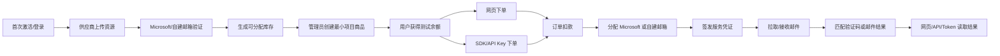

# ReMail Go 版敏捷实施方案

## 修订记录

| 日期 | 版本 | 修订人 | 说明 |
|------|------|--------|------|
| 2026-06-29 | V1.0 | Codex | 形成 Go 版从 0 DDD 设计基线，作为一次 V1.0 变更。 |

> 本文用于把 DDD 设计落到可执行节奏。
>
> 当前战略：从核心闭环出发，持续迭代、持续验证。第一期打造扎实的平台基础：资源真的能上传、能验证、能被分配，并且能被网页和 SDK 下单验证。第二期在这个基础上画龙点睛：补齐管理能力、高级用户能力、治理、售后、供应商结算和硬化。

---

## 1. 分期目标

| 阶段 | 定位 | 核心目标 | 完成标准 |
|------|------|----------|----------|
| 一期：扎实平台基础 | 围绕资源这个核心中的核心，打通可运行、可验证、可继续扩展的基础闭环 | 供应商上传 Microsoft/自建邮箱资源，用户能网页下单和 SDK 下单，订单能分配资源并读取服务结果 | 不靠 SQL，能跑通“供应商上传 -> 资源验证 -> 项目商品 -> 用户下单 -> 分配 -> 读取邮件/验证码” |
| 二期：画龙点睛 | 围绕管理功能和高级用户功能补完整产品能力 | 管理后台、供应商收益、售后、治理、权限细化、OpenAPI 管理、性能和并发硬化 | 管理员不用 SQL 修状态，高级用户/API Key 能稳定批量使用，验收矩阵全部达标 |

一期可以后置：

| 可以后置 | 说明 |
|----------|------|
| UI | 页面可以朴素，只要流程可用。 |
| 报表 | 只需要关键列表和诊断，不做完整运营看板。 |
| 内容运营 | 公告、帮助、通知可后置。 |
| 高级权限 | 先有 user/supplier/admin/super_admin 基线即可。 |
| 售后/结算 | 可先不完整，只保证订单、扣款、分配和资源验证闭环。 |

一期不能妥协：

| 不能妥协 | 原因 |
|----------|------|
| 资源模型 | Microsoft 资源、自建邮箱资源是平台根。 |
| 资源导入和验证 | 不验证就无法证明资源可售。 |
| 代理池基础 | Microsoft 通讯依赖资源代理池和系统代理池兜底。 |
| 分配唯一性 | 一单一资源是核心不变式。 |
| 下单扣款和幂等 | 网页和 SDK 都会依赖。 |
| 服务凭证和读取 | 不读取结果就无法验证资源是否真的可用。 |
| 敏感信息禁敏 | 密码、RT、Token、邮件正文不能进普通日志和错误响应。 |
| SQL/事务/并发兜底 | Go 版本必须显式证明事务和数据库约束。 |

---

## 2. 一期主线

一期最短闭环不是“后台建好所有东西”，而是供应商上传资源后，让用户通过真实下单来证明资源和分配可用。



一期必须同时证明两类资源：

| 资源 | 一期能力 |
|------|----------|
| Microsoft 邮箱资源 | TXT 导入、密码/RT 原值保存、Go Microsoft ACL 验证、Graph 拉取、错误分类和安全诊断。 |
| 自建邮箱资源 | 自建域名/邮箱服务器配置、用途区分、生成邮箱或邮箱池、SMTP/IMAP 基础收件/拉取、资源可分配统计。 |

一期必须同时证明两类下单入口：

| 入口 | 一期能力 |
|------|----------|
| 网页下单 | 用户登录控制台选择项目商品下单，能看到订单、分配资源和服务结果。 |
| SDK 下单 | API Key 调同一业务 API 下单，带幂等键，能读取自己的订单结果。 |

---

## 3. 一期迭代包

一期采用小步迭代，每个迭代都要能运行、能验证、能留下证据。

| ID | 目标 | 产出 | 验收 |
|----|------|------|------|
| P1-I0 | 工程骨架 | Go module、Gin、GORM、goose、Redis、Asynq、MinIO、OpenAPI、React 单控制台、Docker Compose | `/healthz`、基础 migration、CI、空库启动通过 |
| P1-I1 | 激活和身份基线 | 首次激活 super_admin、登录、Session、user/supplier/admin/super_admin 基线、验证码 | 空用户激活、登录、改密、角色识别、验证码错误语义 |
| P1-I2 | 供应商资源上传 | 供应商上传 Microsoft TXT、自建邮箱/域名资源；资源列表、详情、状态诊断 | 不靠 SQL 创建资源；凭据禁敏；资源状态机测试 |
| P1-I3 | 资源验证 | 资源代理池、系统代理池、Go Microsoft ACL 获取/刷新 RT；自建邮箱连接/收件验证；资源转 `normal/abnormal` | Microsoft 和自建各跑通一条验证；代理绑定/兜底可查；失败有 SystemLog 和安全 message |
| P1-I4 | 最小项目商品 | 管理员创建可售项目、商品、价格、资源类型、服务窗口、基础邮件规则 | 不走审批；项目商品能关联 Microsoft/自建资源类型 |
| P1-I5 | 分配路由 | Microsoft 候选、自建候选、主邮箱/别名/生成邮箱分配、一单一资源、释放 | 并发分配不重复；同资源不会被两个订单抢占 |
| P1-I6 | 钱包基础 | 用户测试余额、扣款、退款、不可变流水、幂等表 | 余额不负；重复请求不重复扣款 |
| P1-I7 | 订单闭环 | 网页下单、API Key 下单、订单状态、扣款、分配、签发服务凭证 | 网页和 SDK 都能创建订单并拿到分配结果 |
| P1-I8 | 读取结果 | Microsoft Graph 拉取、自建邮箱拉取/接收、MailMatch 保存邮件、匹配验证码、订单读取接口 | 用户/API Key/OrderToken 能读订单邮件或验证码 |
| P1-I9 | 一期联调验收 | Docker 中间件、空库迁移、端到端脚本、OpenAPI client、最小页面 | 跑通供应商上传 -> 用户网页下单 -> SDK 下单 -> 分配 -> 读取结果 |

一期最少页面：

| 角色 | 页面 |
|------|------|
| super_admin/admin | 激活、登录、项目商品、资源诊断、代理池、订单列表、任务/SystemLog 简表。 |
| supplier | 上传资源、查看自己的资源状态。 |
| user | 项目列表、下单、订单详情、服务结果、API Key 管理。 |

一期最少 API：

| 能力 | API 方向 |
|------|----------|
| 资源上传 | 供应商 Session API，后续管理员可复用。 |
| 项目商品 | 管理端直接创建最终项目商品，不走审批。 |
| 下单 | 统一 `POST /v1/orders`，Session/API Key 共用。 |
| 订单读取 | 统一订单详情、邮件列表、验证码读取，Session/API Key/OrderToken 按权限共用。 |
| API Key | 用户创建、查看、启停，供 SDK 下单。 |

---

## 4. 一期动态验证

每个迭代结束都要跑一条可执行验证，而不是等到一期最后。

| 迭代 | 验证重点 |
|------|----------|
| P1-I0 | 空库启动、健康检查、迁移、前后端构建。 |
| P1-I1 | 首次激活、登录、验证码错误、账号或密码错误。 |
| P1-I2 | 供应商上传 Microsoft TXT、自建域名资源，列表和详情不泄漏凭据。 |
| P1-I3 | Microsoft 验证成功/失败、自建验证成功/失败，失败可查 SystemLog。 |
| P1-I3 | resource 代理按 Microsoft 邮箱建立 7 天绑定；代理失败后能降级 system 代理。 |
| P1-I4 | 管理员创建项目商品后，用户能看到可售项目。 |
| P1-I5 | 100 并发分配不重复，唯一约束兜底。 |
| P1-I6 | 100 并发扣款余额不负，失败回滚。 |
| P1-I7 | 网页下单和 SDK 下单都能落订单、扣款、分配、签发 Token。 |
| P1-I8 | Microsoft 和自建邮箱各至少一条邮件能落库、匹配并被订单读取。 |
| P1-I9 | 端到端脚本从空库跑完整闭环。 |

一期验收脚本必须覆盖：

```text
1. docker compose up mysql redis minio
2. goose migration 空库执行
3. 首次激活 super_admin
4. 创建 supplier/user
5. admin 录入 resource/system 代理并完成检测
6. supplier 上传 Microsoft 资源
7. supplier 上传自建邮箱资源
8. admin 创建最小项目商品
9. user 网页下单
10. user 创建 API Key
11. SDK/API Key 下单
12. 两个订单分别完成分配
13. 拉取/接收邮件并读取验证码或邮件结果
14. 断言凭据和代理 URL 不在响应、普通日志和错误 message 中
```

---

## 5. 二期范围

二期围绕管理功能和高级用户功能画龙点睛，不再改变一期核心模型，只在已验证闭环上补完整产品能力。

| 方向 | 二期能力 |
|------|----------|
| 管理后台 | 完整项目管理、资源管理、订单管理、钱包管理、OpenAPI 管理、任务管理、日志管理、配置管理。 |
| 项目高级能力 | 用户项目申请、审批/驳回、私有项目授权、邮件规则高级配置、商品策略完善。 |
| 资源高级能力 | 批量导入、失败文件、别名策略、辅助邮箱绑定排障、资源健康检查、资源统计。 |
| 供应商能力 | 供应商结算、冻结/入账、提现、资源质量统计、供应商后台。 |
| 售后 | 工单、自动检测、供应商 SLA、平台裁决、附件、售后退款。 |
| OpenAPI 高级能力 | 限流、并发、请求日志、OrderToken 重置、SDK 文档、错误语义完善。 |
| Governance | 公告、通知、帮助、SystemLog/OperationLog 视图、异步任务 retry/cancel。 |
| 硬化 | 性能压测、并发测试、SQL EXPLAIN、备份恢复、部署回滚、审计和禁敏。 |

二期不是重写一期，而是持续扩展：


---

## 6. 代码组织

```text
cmd/server
internal/platform
internal/iam
internal/governance
internal/core
internal/alloc
internal/billing
internal/trade
internal/mailtransport
internal/mailtransport/infra/microsoft
internal/proxy
internal/mailmatch
internal/openapi
internal/aftersale
api/openapi.yaml
migrations
web
```

每个业务模块：

```text
domain     状态机、实体、不变式
app        用例编排、事务、Port
infra      GORM/SQL/Redis/MinIO/Microsoft ACL adapter
api        Gin handler、DTO、OpenAPI tags
```

禁止：

- Handler 写业务状态机。
- 跨模块直接访问对方 GORM model。
- 后台接口直接 update 业务表。
- 为 SDK 复制一套业务接口。
- 为 Microsoft ACL 拆独立服务或内部接口。
- 为单个小功能新增跨域抽象。

---

## 7. API 原则

| 原则 | 说明 |
|------|------|
| 共用接口 | 控制台和 SDK 共用业务 API。 |
| 多鉴权主体 | 同一接口可支持 Session/API Key/OrderToken，具体由中间件和 handler 标记控制。 |
| 管理增量 | 管理员拥有普通用户能力，只新增 `/v1/admin/**` 特权页面和命令。 |
| 够用 REST | CRUD 用资源名；明确业务命令可用清晰动词子路径；禁止万能 action。 |
| 命名简洁 | URI 用常见短词；能省略先省略，默认不用连接符，不能省略的多词概念再拆成 `/` 层级。 |
| HTTP 状态码 | 成功失败由 HTTP 状态表达，响应体不包业务 code。 |
| 错误有语义 | 账号或密码错误、验证码错误、余额不足、状态不允许等要明确但安全。 |
| OpenAPI 单源 | 前端 client 和 SDK 从同一 OpenAPI 生成。 |

一期 API 先覆盖闭环，二期再补完整管理查询和高级筛选。任何一期 API 如果后续会被 SDK 使用，一开始就必须进 OpenAPI，不允许先写临时内部接口再返工。

---

## 8. 数据库和事务原则

| 原则 | 要求 |
|------|------|
| 迁移只增不改历史 | 已部署 migration 不修改，新增 migration 修正。 |
| SQL 约束兜底 | 唯一约束、外键、CHECK、条件更新必须覆盖核心不变式。 |
| 资金和分配手写 SQL | 钱包、分配、幂等、任务 claim 不能完全依赖 ORM 默认行为。 |
| Go 显式事务 | 跨表强一致写必须走 `WithTx` 或等价 tx wrapper，并有失败回滚测试。 |
| 并发靠数据库最终兜底 | Redis 锁和 Asynq 并发只是保护层。 |
| 诊断可查 | 任务、资源、订单、邮件必须有安全诊断字段或 SystemLog。 |

一期必须优先完成这些 SQL 约束：

| 场景 | SQL 约束 |
|------|----------|
| 资源导入 | email/resource 唯一、资源根和子表一致。 |
| 分配 | 一个订单只能一个分配，同一可分配邮箱不能重复占用。 |
| 下单 | orderNo 唯一、Idempotency-Key 唯一。 |
| 钱包 | 余额非负、流水不可变。 |
| 邮件 | 同资源 Message-ID 去重、订单读取窗口索引。 |

---

## 9. 一期验收门槛

一期完成后，必须满足：

| 指标 | 最低要求 |
|------|----------|
| 资源闭环 | Microsoft 和自建邮箱资源都能由供应商上传、验证、进入可分配状态。 |
| 分配闭环 | 用户网页下单和 SDK 下单都能分配到正确资源，不重复分配。 |
| 服务闭环 | 订单能签发服务凭证，能读取邮件或验证码结果。 |
| SDK | API Key 通过统一业务 API 下单，不存在第二套 SDK 接口。 |
| 网页 | 用户能从控制台完成下单和查看结果。 |
| SQL | migration 空库执行；资源、分配、订单、钱包核心约束测试通过。 |
| Go 事务 | 下单扣款、分配、退款或失败回滚有集成测试。 |
| 并发 | 分配抢占、钱包扣款、API Key 并发下单有并发测试。 |
| 错误信息 | 验证码、账号密码、余额、状态、资源验证失败都有安全业务语义。 |
| 禁敏 | 密码、RT、Token、API Key、邮件正文不进入普通日志、错误响应、列表和导出。 |

一期验收不通过时，不进入二期。因为二期所有管理能力都建立在资源和分配闭环成立的前提上。

---

## 10. 二期验收门槛

二期完成后，必须满足 [13-quality-matrices.md](13-quality-matrices.md) 的红线项。

| 指标 | 最低要求 |
|------|----------|
| 管理能力 | 管理员不用 SQL 修项目、资源、订单、钱包、工单、凭证、任务。 |
| 高级用户能力 | 用户项目申请、API Key 管理、售后、通知、服务凭证重置完整。 |
| 供应商能力 | 资源质量、结算、提现、争议处理完整。 |
| 性能 | 核心查询 EXPLAIN 和 P95 有记录，无未解释全表扫描。 |
| 并发 | 钱包、分配、卡密、提现、任务 claim、API Key 下单都有真实依赖并发测试。 |
| 日志 | OperationLog/SystemLog 足够排障且禁敏。 |
| 部署 | Docker Compose 一键启动，迁移自动执行，备份和回滚可演练。 |

---

## 11. ADR

| ADR | 决策 | 理由 |
|-----|------|------|
| ADR-PLAN-1 | 一期从资源闭环出发 | 平台核心是资源，只有能被下单和分配验证的资源才算完成。 |
| ADR-PLAN-2 | 一期必须同时支持网页下单和 SDK 下单 | 避免后续出现控制台接口和 SDK 接口两套实现。 |
| ADR-PLAN-3 | 一期做减法但基础必须扎实 | 速度服务于闭环，不代表可以牺牲资源、分配、订单、资金的不变式。 |
| ADR-PLAN-4 | 二期画龙点睛 | 管理后台、售后、供应商结算和治理需要建立在稳定核心闭环上。 |
| ADR-PLAN-5 | 每个迭代都动态验证 | 敏捷开发必须持续跑通闭环，不能等最后一次性集成。 |
