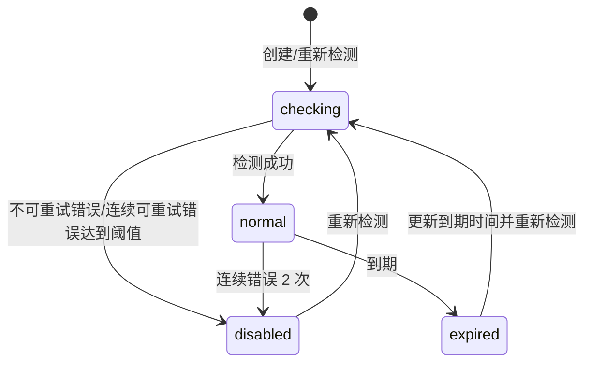

# BC-PROXY 代理池上下文

## 修订记录

| 日期 | 版本 | 修订人 | 说明 |
|------|------|--------|------|
| 2026-06-29 | V1.0 | Codex | 形成 Go 版从 0 DDD 设计基线，作为一次 V1.0 变更。 |
| 2026-07-02 | V1.1 | Codex | 补充代理管理页按国家标签聚合、检测端点兜底、IPv4/IPv6 展示和测速目标；不改变两级代理池、绑定和状态机策略。 |
| 2026-07-03 | V1.2 | Codex | 补充管理端按 ID 批量删除代理的维护能力；仅用于管理员清理代理池，不改变两级代理池、绑定和状态机策略。 |
| 2026-07-03 | V1.3 | Codex | 补充代理错误可重试分类：可重试错误累计次数，不可重试错误直接禁用；补充按筛选条件批量删除和创建时间筛选。 |
| 2026-07-03 | V1.4 | Codex | 补充代理高可用兜底策略：资源代理、系统代理最多 3 次代理尝试后切换系统直连。 |
| 2026-07-03 | V1.5 | Codex | 补充代理管理端服务器分页、统计查询、批量导入/检测命令和代理错误禁敏兜底；不改变两级代理池、绑定和状态机策略。 |
| 2026-07-03 | V1.6 | Codex | 补充代理选择 SQL 证据、失效绑定覆盖和 SystemLog 表归属说明；仅补实现验收约束，不改变代理池策略。 |
| 2026-07-03 | V1.7 | Codex | 补充代理管理搜索实现：完整 URL 用 hash 精确匹配，普通关键字走 host/IP/country 前缀搜索，避免原始 URL 全表模糊扫描。 |

> 支撑域。BC-PROXY 负责 Microsoft 通讯用代理的录入、检测、选择、绑定、轮转和禁用，不拥有 Microsoft 页面流、资源状态或订单状态。

---

## 1. 定位

当前只有 Microsoft 通讯需要代理，包括获取 RT、刷新 AT、Graph 拉取、辅助邮箱绑定等。SMTP/IMAP/DNS 是否用代理由具体协议适配器以后按需扩展，默认不经过代理池。

| 拥有 | 不拥有 |
|------|--------|
| 代理 URL、到期时间、IP 版本、国家、延时、状态、连续可重试错误次数、资源代理绑定、系统池兜底轮转 | Microsoft 登录页面、资源验证状态、邮件匹配、订单服务窗口 |

两级代理池：

| 池 | 用途 | 绑定关系 |
|----|------|----------|
| `resource` | 正常业务优先使用，例如 Microsoft 授权、收件拉取。 | 按业务 key 建 7 天绑定。 |
| `system` | 资源代理异常后的兜底。 | 不建绑定关系，直接轮转。 |

业务 key 当前使用 Microsoft 邮箱地址。后续如需要按资源、租户或账号组绑定，只扩展 key 生成规则，不改代理池模型。

---

## 2. 实体

### 2.1 `Proxy`

| 字段 | 含义 |
|------|------|
| `id` | 代理 ID |
| `pool` | `resource/system` |
| `url` | 代理 URL，原值保存 |
| `expireAt` | 代理到期时间，管理员填写 |
| `ip` | `ipv4/ipv6`，系统检测补全 |
| `country` | 国家或地区，系统检测补全 |
| `latencyMs` | 延时，系统检测补全 |
| `status` | `checking/normal/disabled/expired` |
| `errors` | 连续可重试错误次数，不可重试错误不计入该计数 |
| `lastCheckedAt/lastUsedAt` | 最近检测/使用时间 |
| `createdAt/updatedAt` | 时间 |

管理员新增代理时只输入：

| 字段 | 说明 |
|------|------|
| `url` | 代理 URL，必须带显式端口，可能包含账号密码，普通日志和列表必须禁敏。 |
| `expireAt` | 到期时间。 |

`pool` 由入口决定，例如资源代理页面创建到 `resource`，系统代理页面创建到 `system`。`ip/country/latencyMs/status` 由检测任务补全。

#### 补充设计：检测信息来源和测速目标

代理检测器通过代理自身访问公网识别端点来确认出口信息，当前优先使用 Cloudflare `cdn-cgi/trace`，失败后依次尝试其他公开识别端点，例如 `country.is`、`ipinfo`；任一端点失败不得直接判定代理不可用，必须继续尝试后续端点。检测响应只提取出口 IP 和国家/地区，不把端点原文写入普通日志或 API 错误。

`ip` 字段在实现中展示为 `ipVersion=ipv4|ipv6`，同时保留 `outboundIp` 作为本次检测到的出口 IP，便于管理员排障。测速目标使用 Microsoft 和 Google 的轻量 URL 兜底，优先把测速 URL 的成功往返耗时写入 `latencyMs`；如果测速 URL 都失败，才回退到成功识别端点的耗时。后续如果接入专门测速 URL，只能补充测速 adapter，不改变代理状态机和选择规则。

管理页按 `country` 聚合为顶部标签卡，`All` 标签展示全部代理；列表筛选支持 `pool`、`ipVersion`、`ipv6`、`status`、`country`、`createdFrom/createdTo` 和搜索。列表必须使用服务器分页和后端筛选，不允许为了本地分页或统计把代理全量拉到浏览器。国家标签和筛选计数通过统计查询返回，只做 `COUNT/GROUP BY`，不返回代理 URL 原文。普通列表只展示脱敏 URL，详情接口在管理员授权后可查看完整 URL。

#### 补充设计：代理搜索

代理 URL 原文用于连接和管理员排障，不作为普通 `LIKE '%keyword%'` 查询字段。管理端搜索按以下规则执行：

1. 搜索词能解析为完整代理 URL 时，按 `url_hash=sha256(normalizedURL)` 精确匹配。
2. 普通搜索词只匹配 `url_host`、`outboundIp` 和 `country` 的前缀。
3. `url_host` 是从 URL 派生的小写 host 字段，必须有独立索引；不得为了方便在列表/统计查询里对原始 `url` 做无界前后模糊扫描。

状态机：



### 2.2 `Binding`

资源代理当前绑定事实。`Binding` 不是历史流水；过期或失效后可以覆盖同一 `key + ip` 记录，历史排障靠 SystemLog。失效包含绑定自身过期、绑定代理已过期、绑定代理被禁用、绑定代理不再属于 `resource` 池或代理行已不存在。

| 字段 | 含义 |
|------|------|
| `id` | 绑定 ID |
| `key` | 绑定 key，当前为 Microsoft 邮箱地址 |
| `proxyId` | 资源代理 ID |
| `ip` | `ipv4/ipv6`，绑定时的代理 IP 版本 |
| `expireAt` | 绑定到期时间 |
| `createdAt/lastUsedAt` | 时间 |

绑定规则：

- 只对 `resource` 池建立绑定。
- 绑定有效期 7 天，但不能超过代理自身 `expireAt`。
- 7 天内同一 key 获取代理必须返回同一代理，除非代理已过期、禁用或 IP 版本不满足本次要求。
- `system` 池不建绑定，按可用代理轮转。

---

## 3. 选择规则

调用方传入：

| 参数 | 说明 |
|------|------|
| `key` | 绑定 key，例如 Microsoft 邮箱。系统池兜底可为空。 |
| `ip` | `auto/ipv4/ipv6`。 |
| `purpose` | `auth/fetch/binding` 等内部用途，用于日志和默认 IP 策略。 |
| `attempt` | 当前业务链路内的代理尝试序号，从 0 开始；达到 3 后 BC-PROXY 返回直连配置。 |

默认 IP 策略：

| 场景 | IP 要求 |
|------|---------|
| 辅助邮箱绑定 | 强制 `ipv4`，因为目标服务器不支持 IPv6。 |
| Microsoft 收件/Graph 拉取 | 可用 `auto`，允许 IPv6。 |
| 普通 Microsoft 授权 | 默认 `auto`，调用方可强制 IPv4/IPv6。 |

资源池选择流程：

```text
1. 若 key 存在未过期绑定，且代理 normal、未过期、IP 满足要求，返回绑定代理。
2. 否则从 resource 池选择 normal、未过期、IP 满足要求的代理。
3. 优先选择 `errors` 更低的代理，避免刚失败过但尚未禁用的代理继续污染体验。
4. 错误数相同，选择 active binding 最少的代理。
5. 绑定数相同，选择 latencyMs 更低的代理。
6. 再相同，选择最久未使用的代理。
7. 创建 7 天绑定，返回代理。
```

系统池兜底流程：

```text
1. 每次外部请求失败后，调用方必须上报本次代理成功/失败，再按 attempt + 1 重新获取路线。
2. attempt=0 且 key 存在时，优先 resource 池；resource 不可用时切到 system 池。
3. attempt=1/2 只从 system 池选择 normal、未过期、IP 满足要求的代理，不创建 Binding。
4. system 池按 `errors` 更低、最久未使用优先轮转，延时仅作为并列排序。
5. attempt >= 3，或 resource/system 池均不可用时，返回 `direct=true` 的系统直连配置。
6. 直连配置没有 proxyId、URL 和代理状态，调用方不得把直连失败上报为代理失败。
```

错误上报：

| 场景 | 处理 |
|------|------|
| 单次可重试代理错误 | `errors + 1`，写安全诊断。 |
| 可重试错误连续达到 2 次 | 自动置 `disabled`。 |
| 不可重试代理错误 | 直接置 `disabled`，不递增 `errors`，写安全诊断。 |
| 成功使用或检测成功 | `errors=0`，更新 `lastUsedAt/lastCheckedAt`。 |
| 资源代理异常 | 本次业务允许降级时，重新获取 `system` 池代理。 |
| 代理尝试耗尽或代理池不可用 | 返回系统直连配置，写 SystemLog，避免代理池故障拖垮主业务。 |

---

## 4. 不变式

| 编号 | 规则 |
|------|------|
| INV-P1 | 管理员只录入 URL 和到期时间；IP 版本、国家、延时、状态由系统检测补全。 |
| INV-P2 | 代理 URL 原值保存，但不得进入普通日志、错误响应、导出和普通列表。 |
| INV-P3 | `resource` 池按 key 建 7 天绑定，同一 key 绑定有效期内不得随意轮转。 |
| INV-P4 | `system` 池只做兜底轮转，不创建绑定关系。 |
| INV-P5 | 可重试错误连续 2 次必须自动禁用代理；不可重试错误必须直接禁用代理。 |
| INV-P6 | 代理过期后不可再被选择，过期扫描必须能把状态置为 `expired`。 |
| INV-P7 | 选择代理必须支持 `auto/ipv4/ipv6`，辅助邮箱绑定强制 IPv4。 |
| INV-P8 | 同等健康度下资源池选择优先绑定数最少，避免少数代理被过度绑定。 |
| INV-P9 | 同一业务链路最多尝试 3 次代理路线，之后必须切换系统直连；直连失败不计入代理错误。 |
| INV-P10 | `normal` 代理中必须优先选择 `errors` 更低的代理，避免一次失败后的代理立即再次被命中。 |

---

## 5. Port

| Port | 方向 | 职责 |
|------|------|------|
| `ProxyPort` | 入站自 BC-MAILTRANSPORT | 按 key、用途、IP 要求和 attempt 获取代理或直连路线，并上报代理成功/失败。 |
| `LogPort` | 出站到 BC-GOVERNANCE | 写代理检测、自动禁用、兜底失败等 SystemLog。 |

BC-MAILTRANSPORT 只拿到本次可用代理配置，不直接查询或修改代理表。

---

## 6. API 设计

仅管理端开放代理池维护和排障接口：

| 方法 | URI | 说明 |
|------|-----|------|
| `GET` | `/v1/admin/proxies` | 代理列表；支持 `pool=resource/system`、`ip=auto/ipv4/ipv6`、`ipv6=true/false`、`status=checking/normal/disabled/expired`、`country`、`search`、`createdFrom/createdTo`。 |
| `GET` | `/v1/admin/proxies/stats` | 代理统计；支持与列表相同的筛选参数，返回 total、country/status/pool/ipVersion 分组计数。 |
| `POST` | `/v1/admin/proxies/imports` | 批量导入资源代理或系统代理；请求体包含 `pool/url[]/expireAt`，重复 URL 跳过并返回重复数。 |
| `POST` | `/v1/admin/proxies/check` | 按代理 ID 或筛选条件批量检测代理；前端不得逐条编排批量检测请求。 |
| `POST` | `/v1/admin/proxies/resource` | 新增资源代理；请求体只有 `url/expireAt`。 |
| `POST` | `/v1/admin/proxies/system` | 新增系统代理；请求体只有 `url/expireAt`。 |
| `GET` | `/v1/admin/proxies/{proxyId}` | 代理详情；授权时可查看完整 URL。 |
| `PATCH` | `/v1/admin/proxies/{proxyId}` | 启停、更新到期时间。 |
| `POST` | `/v1/admin/proxies/{proxyId}/check` | 重新检测代理，返回异步任务或检测结果。 |
| `POST` | `/v1/admin/proxies/delete` | 按代理 ID 或筛选条件批量删除管理端代理；删除代理时级联清理绑定关系。 |
| `GET` | `/v1/admin/proxies/bindings` | 查看资源代理绑定；支持 `key/proxyId/ip` 筛选。 |

写动作写 OperationLog；自动检测、自动禁用和兜底失败写 SystemLog。

---

## 7. SQL 和并发要求

| 场景 | 要求 |
|------|------|
| 代理 URL | 同一 pool 下 URL 唯一；实现上保存 URL 原文，并用 `url_hash=sha256(url)` 建 `pool + url_hash` 唯一索引，避免把最长 1024 字符敏感 URL 直接放进唯一索引。 |
| 代理搜索 | 保存 `url_host` 派生字段并建索引；完整 URL 精确搜索走 `url_hash`，普通搜索走 `url_host/outboundIp/country` 前缀匹配。 |
| 绑定唯一性 | `key + ip` 同一时间只能有一个有效绑定。 |
| 最少绑定优先 | 选择代理和创建绑定必须在事务内完成，避免并发都选中同一代理。 |
| 健康优先 | 选择 `normal` 代理时必须按 `errors ASC` 排序，先避开已出现可重试失败的代理；DDL 必须保留 `pool/status/ip/errors/expireAt` 方向索引支撑选择查询。 |
| 错误计数 | 可重试错误上报使用条件更新，连续错误 2 次自动禁用；不可重试错误直接禁用且不递增 `errors`。 |
| 过期扫描 | `expireAt` 有索引，过期代理批量置 `expired`。 |
| 统计查询 | 管理页统计只允许 `COUNT/GROUP BY`，不得返回完整代理行给前端再本地统计。 |
| 安全诊断 | `lastSafeError`、SystemLog detail 和 OperationLog summary 写入前必须做代理 URL、账号密码、token 类片段禁敏。 |
| OperationLog 原子性 | 管理端创建、导入、更新、删除和检测写代理表时，业务写与 OperationLog 必须在同一个显式事务内提交，日志失败必须回滚业务写。 |
| 批量检测 | 按筛选条件批量检测不得一次性加载全部代理 ID，必须按稳定 ID 分段读取并检测，避免大代理池下内存和响应抖动。 |
| EXPLAIN 证据 | 验收测试必须 EXPLAIN 生产选择 SQL 本身：resource 选择查询命中 `idx_proxies_select_health`，active binding 子查询命中 `idx_proxy_bindings_expire_proxy`；system 选择查询命中 `idx_proxies_select_health`。 |

补充说明：`system_logs` 表归属 BC-GOVERNANCE。当前 migration 在代理池阶段引入该基础表，是因为代理检测/兜底诊断是第一个消费者；表所有权、字段语义和写入策略仍按 Governance 文档执行，BC-PROXY 只通过 LogPort 写入。

并发测试必须覆盖：

- 同一 key 100 并发获取，只创建一个有效绑定。
- 不同 key 并发获取，优先落到绑定数最少的代理。
- 代理连续两次错误后自动 disabled。
- resource 代理失败后能获取 system 代理，且不创建 Binding。
- 代理尝试达到 3 次或代理池不可用时返回 direct 路线，直连不上报代理错误计数。

---

## 8. ADR

| ADR | 决策 | 理由 |
|-----|------|------|
| ADR-PROXY-1 | 代理池独立成 BC-PROXY | 代理选择、绑定和健康有独立状态，不应塞进 MailTransport。 |
| ADR-PROXY-2 | 两级代理池 | 资源池保证账号连续性，系统池保证异常兜底。 |
| ADR-PROXY-3 | 资源池 7 天绑定 | Microsoft 账号短期固定出口，降低风控和不稳定。 |
| ADR-PROXY-4 | 辅助邮箱强制 IPv4 | 当前目标服务器不支持 IPv6，规则必须固化。 |
| ADR-PROXY-5 | 连续错误 2 次禁用 | 快速隔离坏代理，避免反复污染 Microsoft 请求。 |
| ADR-PROXY-6 | 3 次代理尝试后直连 | 代理池是体验增强能力，不允许代理池自身成为主业务不可用的单点。 |
