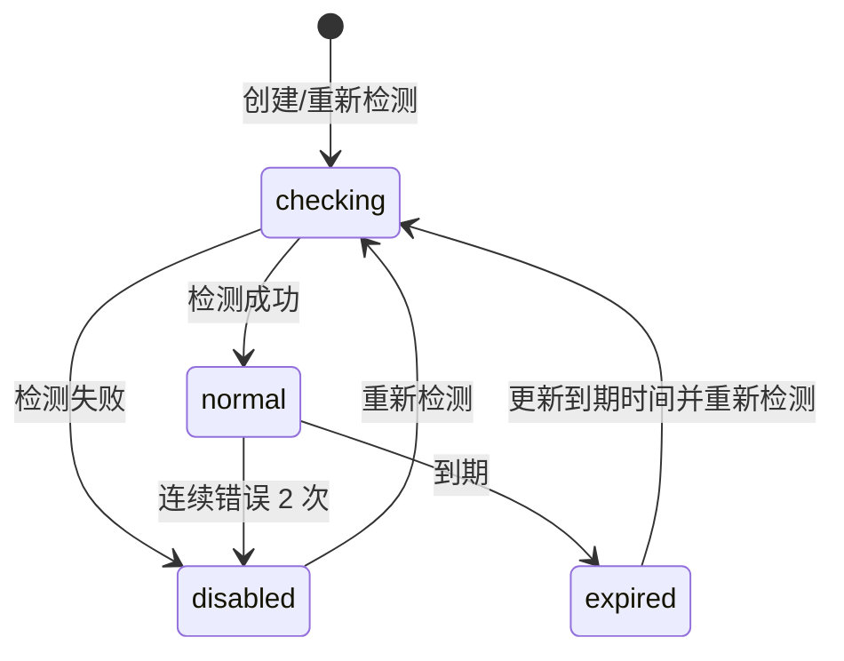

# BC-PROXY 代理池上下文

## 修订记录

| 日期 | 版本 | 修订人 | 说明 |
|------|------|--------|------|
| 2026-06-29 | V1.0 | Codex | 形成 Go 版从 0 DDD 设计基线，作为一次 V1.0 变更。 |

> 支撑域。BC-PROXY 负责 Microsoft 通讯用代理的录入、检测、选择、绑定、轮转和禁用，不拥有 Microsoft 页面流、资源状态或订单状态。

---

## 1. 定位

当前只有 Microsoft 通讯需要代理，包括获取 RT、刷新 AT、Graph 拉取、辅助邮箱绑定等。SMTP/IMAP/DNS 是否用代理由具体协议适配器以后按需扩展，默认不经过代理池。

| 拥有 | 不拥有 |
|------|--------|
| 代理 URL、到期时间、IP 版本、国家、延时、状态、连续错误次数、资源代理绑定、系统池兜底轮转 | Microsoft 登录页面、资源验证状态、邮件匹配、订单服务窗口 |

两级代理池：

| 池 | 用途 | 绑定关系 |
|----|------|----------|
| `resource` | 正常业务优先使用，例如 Microsoft 授权、收件拉取。 | 按业务 key 建 7 天绑定。 |
| `system` | 资源代理异常后的兜底。 | 不建绑定关系，直接轮转。 |

业务 key 当前使用 Microsoft 邮箱地址。后续如需要按资源、租户或账号组绑定，只扩展 key 生成规则，不改代理池模型。

---

## 2. 实体

### 2.1 `Proxy`

| 字段 | 含义 |
|------|------|
| `id` | 代理 ID |
| `pool` | `resource/system` |
| `url` | 代理 URL，原值保存 |
| `expireAt` | 代理到期时间，管理员填写 |
| `ip` | `ipv4/ipv6`，系统检测补全 |
| `country` | 国家或地区，系统检测补全 |
| `latencyMs` | 延时，系统检测补全 |
| `status` | `checking/normal/disabled/expired` |
| `errors` | 连续错误次数 |
| `lastCheckedAt/lastUsedAt` | 最近检测/使用时间 |
| `createdAt/updatedAt` | 时间 |

管理员新增代理时只输入：

| 字段 | 说明 |
|------|------|
| `url` | 代理 URL，可能包含账号密码，普通日志和列表必须禁敏。 |
| `expireAt` | 到期时间。 |

`pool` 由入口决定，例如资源代理页面创建到 `resource`，系统代理页面创建到 `system`。`ip/country/latencyMs/status` 由检测任务补全。

状态机：



### 2.2 `Binding`

资源代理当前绑定事实。`Binding` 不是历史流水；过期或失效后可以覆盖同一 `key + ip` 记录，历史排障靠 SystemLog。

| 字段 | 含义 |
|------|------|
| `id` | 绑定 ID |
| `key` | 绑定 key，当前为 Microsoft 邮箱地址 |
| `proxyId` | 资源代理 ID |
| `ip` | `ipv4/ipv6`，绑定时的代理 IP 版本 |
| `expireAt` | 绑定到期时间 |
| `createdAt/lastUsedAt` | 时间 |

绑定规则：

- 只对 `resource` 池建立绑定。
- 绑定有效期 7 天，但不能超过代理自身 `expireAt`。
- 7 天内同一 key 获取代理必须返回同一代理，除非代理已过期、禁用或 IP 版本不满足本次要求。
- `system` 池不建绑定，按可用代理轮转。

---

## 3. 选择规则

调用方传入：

| 参数 | 说明 |
|------|------|
| `key` | 绑定 key，例如 Microsoft 邮箱。系统池兜底可为空。 |
| `ip` | `auto/ipv4/ipv6`。 |
| `purpose` | `auth/fetch/aux` 等内部用途，用于日志和默认 IP 策略。 |

默认 IP 策略：

| 场景 | IP 要求 |
|------|---------|
| 辅助邮箱绑定 | 强制 `ipv4`，因为目标服务器不支持 IPv6。 |
| Microsoft 收件/Graph 拉取 | 可用 `auto`，允许 IPv6。 |
| 普通 Microsoft 授权 | 默认 `auto`，调用方可强制 IPv4/IPv6。 |

资源池选择流程：

```text
1. 若 key 存在未过期绑定，且代理 normal、未过期、IP 满足要求，返回绑定代理。
2. 否则从 resource 池选择 normal、未过期、IP 满足要求的代理。
3. 优先选择 active binding 最少的代理。
4. 绑定数相同，选择 latencyMs 更低的代理。
5. 再相同，选择最久未使用的代理。
6. 创建 7 天绑定，返回代理。
```

系统池兜底流程：

```text
1. 只从 system 池选择 normal、未过期、IP 满足要求的代理。
2. 不创建 Binding。
3. 按最久未使用优先轮转，延时仅作为并列排序。
4. 系统池也不可用时返回代理不可用错误，调用方 fail closed。
```

错误上报：

| 场景 | 处理 |
|------|------|
| 单次代理错误 | `errors + 1`，写安全诊断。 |
| 连续错误达到 2 次 | 自动置 `disabled`。 |
| 成功使用或检测成功 | `errors=0`，更新 `lastUsedAt/lastCheckedAt`。 |
| 资源代理异常 | 本次业务允许降级时，重新获取 `system` 池代理。 |

---

## 4. 不变式

| 编号 | 规则 |
|------|------|
| INV-P1 | 管理员只录入 URL 和到期时间；IP 版本、国家、延时、状态由系统检测补全。 |
| INV-P2 | 代理 URL 原值保存，但不得进入普通日志、错误响应、导出和普通列表。 |
| INV-P3 | `resource` 池按 key 建 7 天绑定，同一 key 绑定有效期内不得随意轮转。 |
| INV-P4 | `system` 池只做兜底轮转，不创建绑定关系。 |
| INV-P5 | 连续错误 2 次必须自动禁用代理。 |
| INV-P6 | 代理过期后不可再被选择，过期扫描必须能把状态置为 `expired`。 |
| INV-P7 | 选择代理必须支持 `auto/ipv4/ipv6`，辅助邮箱绑定强制 IPv4。 |
| INV-P8 | 资源池选择优先绑定数最少，避免少数代理被过度绑定。 |

---

## 5. Port

| Port | 方向 | 职责 |
|------|------|------|
| `ProxyPort` | 入站自 BC-MAILTRANSPORT | 按 key、用途和 IP 要求获取代理，并上报成功/失败。 |
| `LogPort` | 出站到 BC-GOVERNANCE | 写代理检测、自动禁用、兜底失败等 SystemLog。 |

BC-MAILTRANSPORT 只拿到本次可用代理配置，不直接查询或修改代理表。

---

## 6. API 设计

仅管理端开放代理池维护和排障接口：

| 方法 | URI | 说明 |
|------|-----|------|
| `GET` | `/v1/admin/proxies` | 代理列表；支持 `pool=resource/system`、`ip=auto/ipv4/ipv6`、`status=checking/normal/disabled/expired`。 |
| `POST` | `/v1/admin/proxies/resource` | 新增资源代理；请求体只有 `url/expireAt`。 |
| `POST` | `/v1/admin/proxies/system` | 新增系统代理；请求体只有 `url/expireAt`。 |
| `GET` | `/v1/admin/proxies/{proxyId}` | 代理详情；授权时可查看完整 URL。 |
| `PATCH` | `/v1/admin/proxies/{proxyId}` | 启停、更新到期时间。 |
| `POST` | `/v1/admin/proxies/{proxyId}/check` | 重新检测代理，返回异步任务或检测结果。 |
| `GET` | `/v1/admin/proxies/bindings` | 查看资源代理绑定；支持 `key/proxyId/ip` 筛选。 |

写动作写 OperationLog；自动检测、自动禁用和兜底失败写 SystemLog。

---

## 7. SQL 和并发要求

| 场景 | 要求 |
|------|------|
| 代理 URL | 同一 pool 下 URL 唯一。 |
| 绑定唯一性 | `key + ip` 同一时间只能有一个有效绑定。 |
| 最少绑定优先 | 选择代理和创建绑定必须在事务内完成，避免并发都选中同一代理。 |
| 错误计数 | 错误上报使用条件更新，连续错误 2 次自动禁用。 |
| 过期扫描 | `expireAt` 有索引，过期代理批量置 `expired`。 |

并发测试必须覆盖：

- 同一 key 100 并发获取，只创建一个有效绑定。
- 不同 key 并发获取，优先落到绑定数最少的代理。
- 代理连续两次错误后自动 disabled。
- resource 代理失败后能获取 system 代理，且不创建 Binding。

---

## 8. ADR

| ADR | 决策 | 理由 |
|-----|------|------|
| ADR-PROXY-1 | 代理池独立成 BC-PROXY | 代理选择、绑定和健康有独立状态，不应塞进 MailTransport。 |
| ADR-PROXY-2 | 两级代理池 | 资源池保证账号连续性，系统池保证异常兜底。 |
| ADR-PROXY-3 | 资源池 7 天绑定 | Microsoft 账号短期固定出口，降低风控和不稳定。 |
| ADR-PROXY-4 | 辅助邮箱强制 IPv4 | 当前目标服务器不支持 IPv6，规则必须固化。 |
| ADR-PROXY-5 | 连续错误 2 次禁用 | 快速隔离坏代理，避免反复污染 Microsoft 请求。 |
