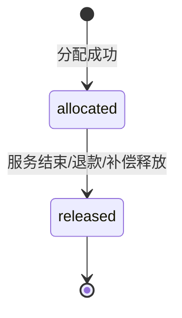
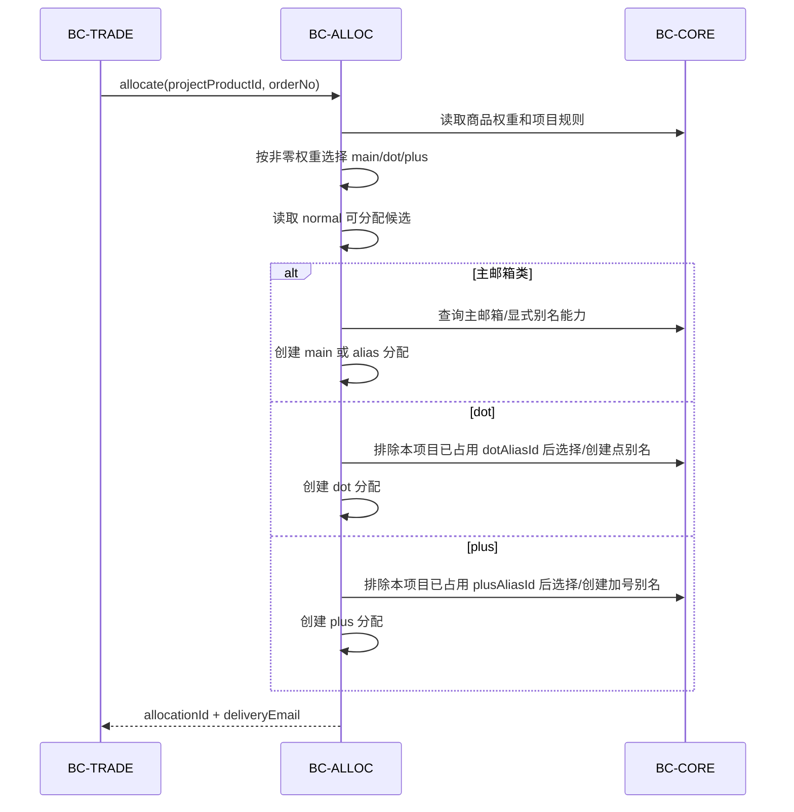
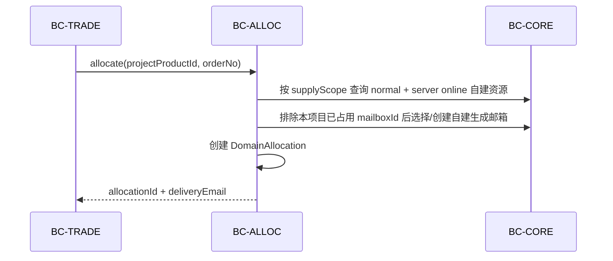

# BC-ALLOC 分配与路由上下文

## 修订记录

| 日期 | 版本 | 修订人 | 说明 |
|------|------|--------|------|
| 2026-06-29 | V1.0 | Codex | 形成 Go 版从 0 DDD 设计基线，作为一次 V1.0 变更。 |
| 2026-07-01 | V1.1 | Codex | 补充 Microsoft 公开出售候选与 owner 自用私有候选分层；普通 user 资源不得进入公开供给池。 |
| 2026-07-02 | V1.2 | Codex | 补充 P1-I2 Domain 状态命名改为 `normal/abnormal/disabled/deleted`；分配候选继续只接受 `purpose=sale + status=normal`。 |
| 2026-07-06 | V1.3 | Codex | 补充 P1-I5 分桶锁定 LRU 分配算法、active generated unique key、分配查询和候选诊断边界；此为缺失算法细化，不改变分配状态机和 BC 归属。 |
| 2026-07-06 | V1.4 | Codex | 补充 P1-I5 并发实现细节：候选列表只读、最终候选按主键短锁、事务外带抖动重试、别名复用索引和同步边界；此为实现约束补充，不改变分配状态机和 BC 归属。 |
| 2026-07-06 | V1.5 | Codex | 补充候选刷新异步任务边界和数据库复合约束细节；此为矩阵 D20/D5 缺失实现约束补充，不改变分配算法、状态机或 BC 归属。 |
| 2026-07-06 | V1.6 | Codex | 修正 P1-I5 候选读模型范围：Microsoft 与 Domain 都建候选表，候选刷新异步刷新两类候选；此为与实施计划一致的设计纠偏。 |
| 2026-07-06 | V1.7 | Codex | 补充分配源表候选与候选读模型边界：P1-I5 分配以 Core 源表短锁重校验为准，候选读模型只做后台诊断和预热；此为实现边界补充，不改变分配不变式。 |
| 2026-07-06 | V1.8 | Codex | 补充并纠正项目库存口径：库存按项目商品启用的分配形态计算；plus/domain 这类无限生成能力通过资源级日限量和按资源分散的 daily usage counter 形成库存；这会替代旧的“加号别名不计库存、不扣库存”口径，但不改变分配状态机。 |
| 2026-07-09 | V1.9 | Codex | 补充 Domain 私有候选与分配事实 `supplyScope`：Domain 与 Microsoft 一样区分公开供给和 owner 私有供给；此为实现一致性补充，不改变分配状态机。 |
| 2026-07-12 | V1.10 | Codex | 补充管理员 Microsoft 资源维度的分配/订单读模型和 `ResourceAllocationGuardPort`：Alloc 通过各事实所有者的批量 Query Port 丰富当前订单 Tab，危险身份变更和删除通过 active allocation guard 保护。 |
| 2026-07-12 | V1.11 | Codex | 对齐简单实现：管理员订单 Tab 按当前页 orderNo 直接从源表执行有界只读查询组合补齐展示字段；不建设投影表或多组空转 Port，不改变 Trade/Core/MailMatch 的事实所有权或任何写边界。 |

> 核心域。BC-ALLOC 只负责把订单绑定到一个邮箱使用权，不拥有资源验证、订单状态或钱包。

---

## 1. 定位

| 拥有 | 不拥有 |
|------|--------|
| Microsoft/Domain 候选读模型、微软分配、自建分配、一单一资源保护、释放 | 资源生命周期、项目审批、订单状态、钱包、服务凭证、邮件事实 |

目标：

- 不建通用 `EmailResourceAllocation`。
- 微软和自建分配拆表。
- 状态只保留 `allocated/released`。
- 点别名、加号别名、自建生成邮箱的生命周期归 BC-CORE。
- 分配创建必须由交易域调用，不提供手工创建分配 API。

---

## 2. 实体

### 2.1 `RoutingCandidate`

项目和可分配资源之间的候选读模型。P1-I5 使用两张候选表：`microsoft_routing_candidates` 与 `domain_routing_candidates`。候选表用于后台诊断和预热，不是库存扣减表。

| 字段 | 含义 |
|------|------|
| `id` | 候选 ID |
| `type` | `microsoft/domain` |
| `projectId` | 项目 ID |
| `resourceId` | 资源 ID |
| `address` | Microsoft 主邮箱或 Domain 域名快照 |
| `domainSuffix` | Microsoft 邮箱后缀或 Domain 后缀 |
| `forSale` | Microsoft 出售标记快照；Domain 由 `purpose=sale` 推导，`purpose=not_sale` 为 false |
| `qualityScore` | Microsoft 质量分；Domain 当前为 `0` |
| `status` | Core 资源状态快照：`normal/abnormal/disabled`；候选刷新只保留 `normal` 可分配资源 |

候选是读模型，不是库存扣减表。候选刷新时必须防御性校验资源 owner 仍具备 `supplier/admin/super_admin` 任一角色。

Microsoft 候选分为两类：

| 类型 | 条件 | 可分配对象 |
|------|------|------------|
| 公开出售候选 | `status=normal`、`forSale=true`、owner 启用且具备 `supplier/admin/super_admin` 任一角色 | 平台订单按项目规则分配给购买用户 |
| 自用私有候选 | `status=normal`、`forSale=false`、`ownerUserId = 当前下单用户` | 只能分配给 owner 自己 |

普通 `user` 拥有的 Microsoft 资源永远不得进入公开出售候选。`forSale=false` 等价于用户侧“私有=是”，不是独立状态。公开出售候选和自用私有候选必须在查询条件上显式分开，不允许用一个宽泛候选池再靠调用方过滤。

Domain 候选也分为两类：

| 类型 | 条件 | 可分配对象 |
|------|------|------------|
| 公开出售候选 | `status=normal`、`purpose=sale`、mail server online、owner 启用且具备 `supplier/admin/super_admin` 任一角色 | 平台订单按项目规则分配给购买用户 |
| 自用私有候选 | `status=normal`、`purpose=not_sale`、mail server online、`ownerUserId = 当前下单用户` | 只能分配给 owner 自己 |

普通 `user` 拥有的 Domain `purpose=not_sale` 资源可以作为 owner 私有库存，但不得进入公开出售供给池。

### 2.2 `MicrosoftAllocation`

| 字段 | 含义 |
|------|------|
| `id` | 分配 ID |
| `orderNo` | 订单号 |
| `projectId` | 项目 ID |
| `resourceId` | Microsoft 主资源 ID |
| `supplyScope` | `owned/public`，记录本次实际使用私有库存还是公开库存 |
| `mailbox` | `main/alias/dot/plus` |
| `explicitAliasId` | 显式别名 ID，可空 |
| `dotAliasId` | 点别名 ID，可空 |
| `plusAliasId` | 加号别名 ID，可空 |
| `email` | 交付邮箱；主邮箱也必须冗余写入主邮箱地址，用于收件人索引和 MailMatch 快速定位 |
| `status` | `allocated/released` |
| `createdAt/releasedAt` | 时间 |

`mailbox` 与外键一致性必须由数据库约束和领域校验双重保证。

| 类型 | 必填 | 唯一性 |
|------|------|--------|
| `main` | `resourceId` | 同一资源同时只能一个 `allocated`。 |
| `alias` | `resourceId + explicitAliasId` | 同一显式别名同时只能一个 `allocated`。 |
| `dot` | `resourceId + dotAliasId` | 同一项目同一点别名只能一个 `allocated`，允许跨项目复用。 |
| `plus` | `resourceId + plusAliasId` | 同一项目同一加号别名只能一个 `allocated`，允许跨项目复用。 |

### 2.3 `DomainAllocation`

| 字段 | 含义 |
|------|------|
| `id` | 分配 ID |
| `orderNo` | 订单号 |
| `projectId` | 项目 ID |
| `resourceId` | 自建邮箱域名资源 ID |
| `supplyScope` | `owned/public`，记录本次实际使用私有库存还是公开库存 |
| `mailboxId` | 自建生成邮箱 ID |
| `email` | 交付邮箱 |
| `status` | `allocated/released` |
| `createdAt/releasedAt` | 时间 |

同一项目同一 `mailboxId` 只能存在一个 `allocated` 分配，允许跨项目复用。

### 2.4 `OrderGuard`

数据库保护表，保证一个 `orderNo` 只能进入 Microsoft 或自建分配其中一种。

| 字段 | 含义 |
|------|------|
| `orderNo` | 主键 |
| `type` | `microsoft/domain` |
| `createdAt` | 创建时间 |

Guard 不表达业务状态，释放时不删除。

---

## 3. 状态机

分配状态不等于订单状态。购买订单过保后邮箱服务仍可能长期有效，分配不能因为 `Order.completed` 就释放。

---

## 4. 分配流程

### 4.1 Microsoft 分配

### 4.2 自建分配

### 4.3 P1-I5 补充设计：分桶锁定 LRU 算法

P1-I5 分配算法采用 Bucketed Locked LRU Allocation。目标是保持实现简单，同时避免并发下所有请求争抢同一批最旧资源：

| 规则 | 说明 |
|------|------|
| 分桶 | 可分配资源按 `resourceId % 64` 写入 `allocBucket`。分配时用 `hash(orderNo, projectId, mailboxKind) % 64` 选择起始桶，先查起始桶，再少量查相邻桶，每个桶使用 4 条候选小窗口，最后全局 8 条候选兜底。 |
| 锁定 | 资源候选列表查询保持只读，避免 MySQL 范围锁放大；真正尝试某个候选前，再按资源主键 `FOR UPDATE SKIP LOCKED` 短锁并重新校验 Core 源表条件。复用显式别名、点别名、加号别名和自建生成邮箱时也使用 `FOR UPDATE SKIP LOCKED` 锁定被复用实体。不使用 Redis 锁兜底。 |
| 排序 | 候选按 `lastAllocatedAt ASC, qualityScore DESC, id ASC` 排序，优先使用长期未分配、质量更好的资源；不得使用 `ORDER BY RAND()`。 |
| 唯一约束 | 并发正确性最终由 `OrderGuard` 和 allocation active generated unique key 兜底；锁只用于减少复用实体冲突。 |
| 重试 | Allocation 及承载它的 Trade 顶层事务使用 `READ COMMITTED`，保证等待资源根锁后的历史复核读取最新提交状态且不制造 RR gap 锁。候选根或 subtype 因 `SKIP LOCKED` 未取得、锁后条件失效等尚未写入的瞬时 miss 可继续下一个候选；`OrderGuard` 或 allocation 写入一旦遇到唯一冲突，必须退出并回滚当前事务，禁止带着失败 INSERT 的索引锁继续换候选。同一事务的第一把资源根锁可以等待，后续候选根只允许 `SKIP LOCKED`。事务内不得 sleep；MySQL `1213/1205` 重试只作为异常兜底，不作为候选竞争的正确性机制。超过窗口仍失败返回库存不足。 |

`main/dot/plus` 权重只决定首选 mailbox 类型，不表示唯一可选类型。若首选类型因库存耗尽失败，分配器可按同一商品内其他非零权重类型继续尝试，避免有库存但误报无库存。权重选择必须基于 `orderNo + productId` 的确定性 hash，保证幂等重放不会漂移。

Microsoft `main` 在持有资源根锁后必须同时复核当前项目历史和全局 active main；全局 main 已占用但 explicit alias 可用时直接分配 alias，不得先制造一次必然失败的 main INSERT。dot/plus/generated mailbox 使用幂等 upsert 取得实体，禁用实体只作为候选 miss 跳过，不使用 duplicate-key 异常驱动同事务内的变体循环。历史识别导入若需要创建订单，锁顺序与 Checkout 一致为 `wallet -> resource root -> allocation`；上游历史扫描不得在调用 Trade 前锁定或更新资源，refresh token 写入必须放在历史导入之后。

公开出售候选和自用私有候选必须使用两条显式查询路径：

| 路径 | 条件 |
|------|------|
| 公开出售 | `Microsoft.status=normal AND forSale=true`，且 owner 启用并具备 `supplier/admin/super_admin` 任一角色。 |
| 自用私有 | `Microsoft.status=normal AND forSale=false AND ownerUserId=buyerUserId`；只能由 owner 自己分配，不进入公开池。 |

Domain 公开出售候选和自用私有候选也必须使用两条显式查询路径：

| 路径 | 条件 |
|------|------|
| 公开出售 | `Domain.status=normal AND purpose=sale AND mailServer=online`，且 owner 启用并具备 `supplier/admin/super_admin` 任一角色。 |
| 自用私有 | `Domain.status=normal AND purpose=not_sale AND mailServer=online AND ownerUserId=buyerUserId`；只能由 owner 自己分配，不进入公开池。 |

P1-I5 分配直接使用 SourceCandidate 查询 Core 源表，并在同一短事务内 `FOR UPDATE SKIP LOCKED` 重校验资源状态、出售标记或用途、owner 启用状态和 owner 角色。早期按“项目 × 全资源”维护的 RoutingCandidate 镜像与刷新任务已删除，避免百万资源下的存储倍增和刷新写风暴；库存诊断使用 Redis 读模型，首次访问由分布式锁合并预热，后台任务每 60 秒限量刷新近期活跃的库存键。缓存读取不延长五分钟硬 TTL，刷新持续失败时必须回到重新预热，禁止无限返回旧库存；用户库存命中缓存前仍需实时校验项目可见性。

Microsoft 候选查询和行锁重校验必须读取既有 `microsoft_allocations` 历史：同一具体 `main/explicitAliasId/dotAliasId/plusAliasId` 已经分配给目标项目时不得再次选择，但同一主资源下未用于该项目的其他别名仍可分配。验证后的历史扫描把识别结果交给 BC-TRADE；已有 Allocation 的具体关系直接复用且不创建假订单，只有缺失关系才通过 BC-ALLOC 既有 alias、order guard 和 allocation repository 创建超级管理员 0 元已过保订单对应的 `released` Allocation，BC-MAILMATCH 不直写本表。旧 `microsoft_resource_project_matches` 仅作为尚未重扫数据的保守兼容挡板，资源完成重扫后删除对应旧行。

P1-I5 项目库存按项目商品启用的分配形态计算。管理员库存诊断可以看到来源明细；普通用户和下单页只看到项目商品库存、可选 Microsoft 后缀或 Domain 域名维度库存，不返回具体供应商、资源 ID、别名或生成邮箱等来源 breakdown。`publicAvailable` 仅用于前端区分 `private_first/public_only` 下单策略的可用量，不是管理员来源明细。库存分两类：

| 类型 | 库存口径 |
|------|----------|
| 主邮箱类 | `mainWeight > 0` 时计入可用主邮箱和可用显式别名。 |
| 点别名 | `dotWeight > 0` 时按 `eligibleMicrosoftResourceCount * 10 - activeDotAllocationsForProject` 估算；分配生成点别名也最多生成 10 个，保证展示和实际一致。 |
| 加号别名 | `plusWeight > 0` 时按 `SUM(microsoft.plusDailyLimit) - todayPlusUsage` 计算。 |
| 自建生成邮箱 | Domain 商品启用时按当前主体可用 Domain scope 的 `SUM(domain.mailboxDailyLimit) - todayDomainMailboxUsage` 计算；后台 buyer=0 只看公开池，普通用户叠加自己的 `purpose=not_sale` 私有池。 |

`plusDailyLimit` 归 Microsoft 资源，`mailboxDailyLimit` 归 Domain 资源，默认都是 `10000`。这两个字段保护的是资源本身，不放在项目商品上；多个项目共享同一个资源时，一个项目的消耗会减少其他项目看到的共享可用量。

日限量使用 `allocation_daily_usages` 记录每日用量，主键为 `(usageDate, resourceType, resourceId, usageKind)`。这是按资源分散的 counter，不允许设计为项目级或全局总库存行，避免所有请求竞争同一把锁。分配事务先锁源资源行，再锁同一资源当天的 usage row，检查 `usedCount < dailyLimit`，allocation 插入成功后同事务 `usedCount + 1`。释放 allocation 不回补 daily usage，因为 plus/domain 生成次数已经消耗。

分配写路径必须在同一个短事务内完成：创建 `OrderGuard`、读取项目商品、锁定候选、选择或创建别名/生成邮箱、插入 allocation、更新 `lastAllocatedAt`。事务内禁止 Microsoft、SMTP、DNS、MinIO、Graph、IMAP 等外部网络调用。

P1-I5 同步/异步边界：分配由订单同步调用，因为订单需要立即拿到 `allocationId + deliveryEmail` 才能签发服务凭证和进入后续读取流程。该同步事务只访问数据库，不做外部网络调用；候选刷新是后台诊断/预热能力，不是分配正确性的前置条件，HTTP 入口只创建持久任务并投递 Asynq，worker 异步执行读模型刷新。候选刷新任务单次执行，不依赖 Asynq 重试循环；dispatcher 必须把超过 lease 且已用完执行次数的 `running` job 标记为 `failed` 并记录 SystemLog，释放 active job 约束，避免管理员只能靠 SQL 修状态。后续 Trade 调用 BC-ALLOC 时必须复用同一个 `AllocationPort`，不得在 Trade 内复制分配 SQL。

### 4.4 P1-I5 补充设计：active 唯一约束

MySQL 没有 partial unique index，P1-I5 使用 generated column 表达 active key：

| 表 | 约束 |
|----|------|
| `allocation_order_guards` | `orderNo` 主键；allocation 子表通过 `(orderNo, guardType)` 复合外键指向 `(orderNo, type)`，保证一个订单只能进入 Microsoft 或 Domain 其中一种分配。 |
| `microsoft_allocations` | active main 对 `resourceId` 唯一；active explicit alias 对 `explicitAliasId` 唯一；active dot 对 `projectId + dotAliasId` 唯一；active plus 对 `projectId + plusAliasId` 唯一。 |
| `domain_allocations` | active domain 对 `projectId + mailboxId` 唯一。 |

补充约束：`microsoft_allocations/domain_allocations` 必须写入 `supplyScope=owned/public`，作为 Trade 计算订单实际应付金额的分配事实；`microsoft_allocations` 的显式别名、点别名和加号别名必须通过 `(aliasId, resourceId)` 复合外键确认归属同一个 Microsoft 主资源；`domain_allocations` 的生成邮箱必须通过 `(mailboxId, resourceId)` 复合外键确认归属同一个 Domain 资源；`productId + projectId` 也必须有复合外键确认商品属于该项目。`explicit_aliases.owner_user_id` 固定记录平台 `super_admin` 库存 owner，但显式别名的创建资格与供给范围解耦：`status=normal` 的私有主资源也会预创建别名，BC-ALLOC 仍按 alias 所属 `resource_id`、主资源的 `forSale + owner/buyer` 规则和 allocation 占用状态决定 `owned/public` 可用性，不把 alias owner 字段改造成新的供给过滤条件，也不因 alias 归超级管理员而把私有主资源变成公开供给。以上是数据库兜底，不替代领域层校验。

别名和自建生成邮箱复用查询必须有明确索引：

| 表 | 索引目标 |
|----|----------|
| `explicit_aliases` | `resourceId + status + id` 支撑显式别名复用；`ownerUserId` 索引支撑平台超级管理员所有权查询和外键。 |
| `dot_aliases` | `resourceId + status + id` 支撑点别名复用。 |
| `plus_aliases` | `resourceId + status + id` 支撑加号别名复用。 |
| `generated_mailboxes` | `resourceId + status + lastAllocatedAt + id` 支撑自建生成邮箱 LRU 复用。 |

释放只把 allocation 从 `allocated` 改为 `released` 并写 `releasedAt`，不得删除 `OrderGuard`，不得修改资源状态、订单状态、钱包或服务凭证。

### 4.5 P1-I5 补充设计：查询与诊断

后台分配 API 只做查询、库存诊断和候选刷新，不提供手工创建、编辑或直接释放分配：

| 能力 | 要求 |
|------|------|
| 按订单查询 | 先查 `OrderGuard` 决定 Microsoft/Domain，再查对应 allocation 表。 |
| 按收件人查询 | `email + status` 必须有索引，供 MailMatch 先按 recipient 定位 active 分配，禁止全项目扫描。主邮箱分配也必须冗余写入交付邮箱，提升匹配性能。 |
| 用户商品库存 | `GET /v1/projects/{projectId}/inventory` 返回项目总库存、每个商品的 `totalAvailable/publicAvailable` 以及可选后缀或域名库存；不返回供应商、资源 ID、别名或生成邮箱等来源 breakdown。 |
| 库存诊断 | `GET /v1/admin/projects/{projectId}/inventory` 返回项目商品、Microsoft 可分配统计、Domain 可分配统计和 active 分配统计。 |
| 资源使用详情 | `AdminAllocationQueryPort` 按 `resourceId` 分页返回资源维度订单/分配读模型；通过批量 Port 丰富，不得为每条 allocation 单独查询订单、项目、买家或邮件。 |

管理员 Microsoft 页面展示的是“资源维度订单/分配读模型”，但最终行不是 Alloc 新增的跨域聚合。边界固定如下：

| 字段组 | 提供方 | 说明 |
|--------|--------|------|
| `allocationId/orderNo/projectId/productId/resourceId/mailbox/supplyScope/deliveryEmail/allocationStatus/createdAt/releasedAt` | BC-ALLOC | allocation 源事实；按 `createdAt DESC, id DESC` 稳定分页。 |
| `serviceMode/orderStatus/payAmount/buyer` 和服务窗口 | BC-TRADE | 管理查询组合只按当前页最多 100 个唯一 orderNo 批量读取；不把字段复制进 Allocation。 |
| 项目名称和 Logo | BC-CORE | 同一有界查询组合批量读取项目展示字段；allocation 只保留项目引用。 |
| `verificationCode` 交付摘要 | BC-MAILMATCH | 同一有界查询组合只读取已确认订单 Tab 展示的验证码，不读取正文。mock-only `mailCount` 不进入一期契约。 |

`AdminAllocationQueryPort` 拥有订单 Tab 当前可见列的管理读模型契约，但不因此拥有下游事实。它必须使用批量 Port 完成 ACL 翻译，任一必需依赖失败时返回可诊断的安全失败，不得用零值伪造金额、身份或邮件事实；未在已确认 UI 展示的额外资源使用聚合不进入一期契约。

资源身份、owner 和删除保护使用独立的 `ResourceAllocationGuardPort`。该 Port 提供批量检查以及 tx-bound `AssertNoActiveAllocation(resourceId)`；Core 先锁资源根再调用，分配创建也按相同锁顺序先锁资源根后插入 allocation，避免“检查后又新建分配”的竞态。Disable/下架 `forSale=false` 只阻止后续候选或自动维护，不释放、不改写现有 allocation；既有服务生命周期和释放仍只能由 Trade 等所有者闭环处理。

---

## 5. 不变式

| 编号 | 规则 |
|------|------|
| INV-A1 | 一个订单只能有一条分配事实，跨分配表由 `OrderGuard` 兜底。 |
| INV-A2 | 分配创建时必须校验项目已上架、商品启用、资源可用和 owner 资格。 |
| INV-A3 | 分配释放只改分配状态，不改资源、别名、订单、钱包。 |
| INV-A4 | 加号别名按 Microsoft 资源级 `plusDailyLimit` 形成每日库存，分配成功后扣减当天 `allocation_daily_usages`；释放不回补当天用量。 |
| INV-A5 | 点别名、加号别名、自建生成邮箱必须优先复用。 |
| INV-A6 | 分配结果必须返回交付邮箱；主邮箱分配也必须在 allocation 表冗余写入主邮箱地址。 |
| INV-A7 | 不提供手工创建/编辑分配能力，避免绕过交易和钱包。 |
| INV-A8 | Core 修改资源交付身份、owner 或执行删除前必须通过 `ResourceAllocationGuardPort` 原子确认无 active allocation；Disable/Unpublish 不改写既有 allocation，Core 也不能自行查询 allocation 表代替该契约。 |
| INV-A9 | 普通 Alloc repository 不跨域 JOIN；资源维度管理员读模型可作为显式例外，在同一模块化单体数据库内按当前页 orderNo 做最多 100 条、只读、无副作用的受控源表查询组合，且不得建立投影表、返回 UI 未使用的事实或任何敏感正文。 |

---

## 6. Port

| Port | 方向 | 职责 |
|------|------|------|
| `AllocationPort` | 入站自 BC-TRADE | 创建分配并返回交付邮箱。 |
| `ReleasePort` | 入站自 BC-TRADE | 按订单释放分配。 |
| `QueryPort` | 入站自 BC-MAILMATCH/BC-TRADE | 按订单、收件人、资源查询分配。 |
| `AdminAllocationQueryPort` | 入站自 Alloc 管理 API | 按 resourceId 分页构造订单/分配管理读模型；当前页展示字段由基础设施层直接从源表执行有界只读查询组合一次批量补齐，不产生跨域写入。 |
| `ResourceAllocationGuardPort` | 入站自 BC-CORE | 批量查询或在同一短事务内断言资源不存在 active allocation，保护 owner/地址迁移和删除；不把 Disable/Unpublish 扩大为分配写命令。 |
| `ProductPort` | 出站到 BC-CORE | 查询商品和权重。 |
| `ResourcePort` | 出站到 BC-CORE | 查询资源可用性。 |
| `AliasPort` | 出站到 BC-CORE | 选择/创建/复用 Microsoft 别名。 |
| `MailboxPort` | 出站到 BC-CORE | 选择/创建/复用自建生成邮箱。 |

---

## 7. REST API 设计

分配管理 API 只做查询和排障，不做手工创建或释放分配。异常释放必须走 Trade 的服务清理、退款或终止命令，避免分配和订单/钱包/凭证脱节。

| 方法 | URI | 说明 |
|------|-----|------|
| `GET` | `/v1/admin/allocations` | 分配列表，按 `orderNo/projectId/resourceId/type/status/mailbox` 筛选。 |
| `GET` | `/v1/admin/allocations/{allocationId}` | 分配详情，必须带 `type` 查询参数防止猜表。 |
| `GET` | `/v1/admin/orders/{orderNo}/allocations` | 按订单查看分配。 |
| `GET` | `/v1/admin/allocations?type=microsoft&resourceId={resourceId}` | 复用 Alloc 管理列表提供资源维度订单 Tab；基础设施只对当前页 orderNo 做有界只读丰富，不新增重复 nested API。 |
| `GET` | `/v1/projects/{projectId}/inventory` | 普通用户/下单页读取项目商品库存、可选后缀或域名库存；不返回来源 breakdown。 |
| `GET` | `/v1/admin/projects/{projectId}/inventory` | 项目库存和可用性诊断。 |
| `GET` | `/v1/admin/projects/{projectId}/candidates` | 路由候选读模型；支持 `type=microsoft/domain`，不传则返回两类候选。 |
| `POST` | `/v1/admin/projects/{projectId}/candidates/refresh` | 创建候选读模型刷新任务，返回 `202`。 |

写接口成功返回 `200/202/204`，失败返回统一最小错误 JSON。

---

## 8. ADR

| ADR | 决策 | 理由 |
|-----|------|------|
| ADR-ALLOC-1 | Microsoft 和自建分配拆表 | 两类策略完全不同，通用表会复杂化。 |
| ADR-ALLOC-2 | 分配状态只保留 `allocated/released` | 一致性靠事务、唯一约束和订单状态机，不造中间状态。 |
| ADR-ALLOC-3 | Microsoft 和 Domain 都建候选读模型 | 候选诊断、后台库存可见性和刷新任务保持一致；候选表只做读模型，不替代分配事务内的源表校验。 |
| ADR-ALLOC-4 | 分配不拥有可复用邮箱生命周期 | 别名池和自建生成邮箱归资源上下文。 |
| ADR-ALLOC-5 | 后台只查不改分配策略 | 后台不能绕过交易创建分配。 |
| ADR-ALLOC-6 | 资源详情复用 Alloc-owned 管理读模型 | 保留管理员完整订单/分配视图；模块化单体允许一个明确标识、只读、单页有界的源表查询组合补齐展示字段，不新增投影表、多组空转 Port、重复 nested API 或跨域写入。 |
