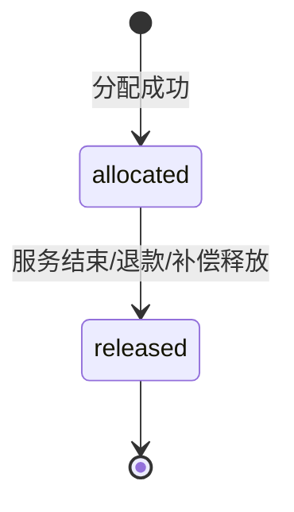
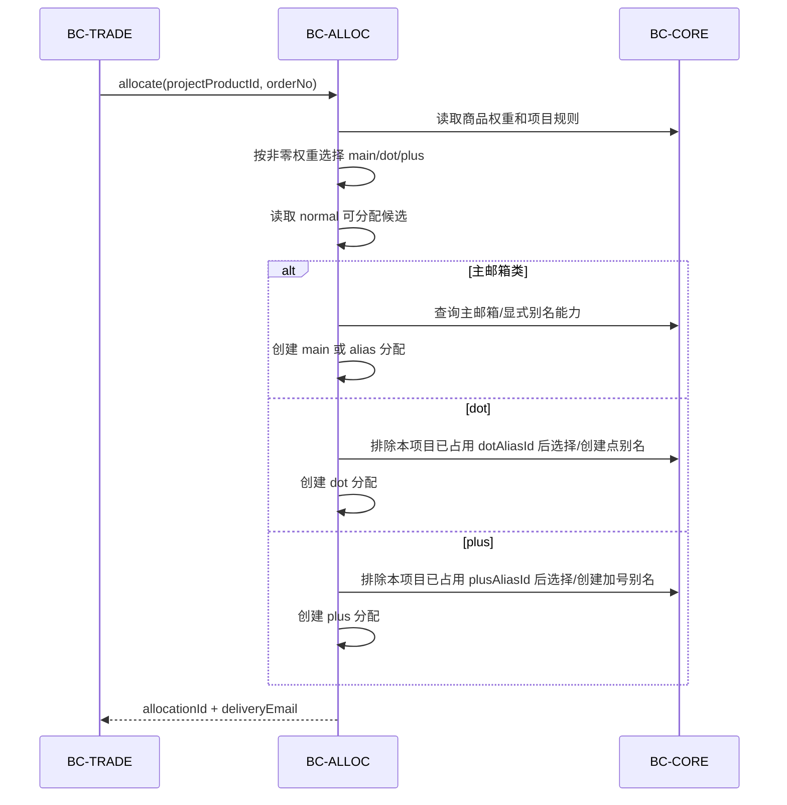
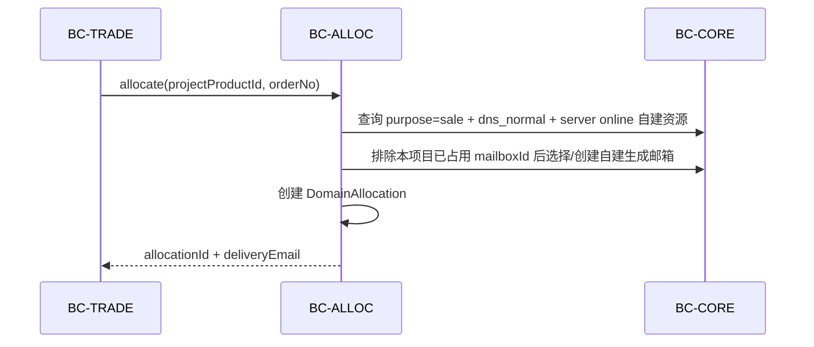

# BC-ALLOC 分配与路由上下文

## 修订记录

| 日期 | 版本 | 修订人 | 说明 |
|------|------|--------|------|
| 2026-06-29 | V1.0 | Codex | 形成 Go 版从 0 DDD 设计基线，作为一次 V1.0 变更。 |
| 2026-07-01 | V1.1 | Codex | 补充 Microsoft 公开出售候选与 owner 自用私有候选分层；普通 user 资源不得进入公开供给池。 |

> 核心域。BC-ALLOC 只负责把订单绑定到一个邮箱使用权，不拥有资源验证、订单状态或钱包。

---

## 1. 定位

| 拥有 | 不拥有 |
|------|--------|
| 微软候选读模型、微软分配、自建分配、一单一资源保护、释放 | 资源生命周期、项目审批、订单状态、钱包、服务凭证、邮件事实 |

目标：

- 不建通用 `EmailResourceAllocation`。
- 微软和自建分配拆表。
- 状态只保留 `allocated/released`。
- 点别名、加号别名、自建生成邮箱的生命周期归 BC-CORE。
- 分配创建必须由交易域调用，不提供手工创建分配 API。

---

## 2. 实体

### 2.1 `RoutingCandidate`

项目和 Microsoft 主资源之间的候选读模型。

| 字段 | 含义 |
|------|------|
| `id` | 候选 ID |
| `projectId` | 项目 ID |
| `resourceId` | Microsoft 资源 ID |
| `emailAddress` | 主邮箱快照 |
| `domainSuffix` | 邮箱后缀 |
| `forSale` | 出售标记快照 |
| `qualityScore` | 质量分 |
| `status` | Core Microsoft 状态快照：`normal/abnormal/disabled`；候选刷新只保留 `normal` 可分配资源 |

候选是读模型，不是库存扣减表。候选刷新时必须防御性校验资源 owner 仍具备 `supplier/admin/super_admin` 任一角色。

Microsoft 候选分为两类：

| 类型 | 条件 | 可分配对象 |
|------|------|------------|
| 公开出售候选 | `status=normal`、`forSale=true`、owner 启用且具备 `supplier/admin/super_admin` 任一角色 | 平台订单按项目规则分配给购买用户 |
| 自用私有候选 | `status=normal`、`forSale=false`、`ownerUserId = 当前下单用户` | 只能分配给 owner 自己 |

普通 `user` 拥有的 Microsoft 资源永远不得进入公开出售候选。`forSale=false` 等价于用户侧“私有=是”，不是独立状态。公开出售候选和自用私有候选必须在查询条件上显式分开，不允许用一个宽泛候选池再靠调用方过滤。

### 2.2 `MicrosoftAllocation`

| 字段 | 含义 |
|------|------|
| `id` | 分配 ID |
| `orderNo` | 订单号 |
| `projectId` | 项目 ID |
| `resourceId` | Microsoft 主资源 ID |
| `mailbox` | `main/alias/dot/plus` |
| `explicitAliasId` | 显式别名 ID，可空 |
| `dotAliasId` | 点别名 ID，可空 |
| `plusAliasId` | 加号别名 ID，可空 |
| `email` | 交付邮箱；主邮箱可为空，由资源主邮箱解析 |
| `status` | `allocated/released` |
| `createdAt/releasedAt` | 时间 |

`mailbox` 与外键一致性必须由数据库约束和领域校验双重保证。

| 类型 | 必填 | 唯一性 |
|------|------|--------|
| `main` | `resourceId` | 同一资源同时只能一个 `allocated`。 |
| `alias` | `resourceId + explicitAliasId` | 同一显式别名同时只能一个 `allocated`。 |
| `dot` | `resourceId + dotAliasId` | 同一项目同一点别名只能一个 `allocated`，允许跨项目复用。 |
| `plus` | `resourceId + plusAliasId` | 同一项目同一加号别名只能一个 `allocated`，允许跨项目复用。 |

### 2.3 `DomainAllocation`

| 字段 | 含义 |
|------|------|
| `id` | 分配 ID |
| `orderNo` | 订单号 |
| `projectId` | 项目 ID |
| `resourceId` | 自建邮箱域名资源 ID |
| `mailboxId` | 自建生成邮箱 ID |
| `email` | 交付邮箱 |
| `status` | `allocated/released` |
| `createdAt/releasedAt` | 时间 |

同一项目同一 `mailboxId` 只能存在一个 `allocated` 分配，允许跨项目复用。

### 2.4 `OrderGuard`

数据库保护表，保证一个 `orderNo` 只能进入 Microsoft 或自建分配其中一种。

| 字段 | 含义 |
|------|------|
| `orderNo` | 主键 |
| `type` | `microsoft/domain` |
| `createdAt` | 创建时间 |

Guard 不表达业务状态，释放时不删除。

---

## 3. 状态机

分配状态不等于订单状态。购买订单过保后邮箱服务仍可能长期有效，分配不能因为 `Order.completed` 就释放。

---

## 4. 分配流程

### 4.1 Microsoft 分配

### 4.2 自建分配

---

## 5. 不变式

| 编号 | 规则 |
|------|------|
| INV-A1 | 一个订单只能有一条分配事实，跨分配表由 `OrderGuard` 兜底。 |
| INV-A2 | 分配创建时必须校验项目已上架、商品启用、资源可用和 owner 资格。 |
| INV-A3 | 分配释放只改分配状态，不改资源、别名、订单、钱包。 |
| INV-A4 | 加号别名不计库存、不扣库存，但必须有可用 Microsoft 资源承载。 |
| INV-A5 | 点别名、加号别名、自建生成邮箱必须优先复用。 |
| INV-A6 | 分配结果必须返回交付邮箱；主邮箱分配可由 `resourceId` 解析邮箱地址。 |
| INV-A7 | 不提供手工创建/编辑分配能力，避免绕过交易和钱包。 |

---

## 6. Port

| Port | 方向 | 职责 |
|------|------|------|
| `AllocationPort` | 入站自 BC-TRADE | 创建分配并返回交付邮箱。 |
| `ReleasePort` | 入站自 BC-TRADE | 按订单释放分配。 |
| `QueryPort` | 入站自 BC-MAILMATCH/BC-TRADE | 按订单、收件人、资源查询分配。 |
| `ProductPort` | 出站到 BC-CORE | 查询商品和权重。 |
| `ResourcePort` | 出站到 BC-CORE | 查询资源可用性。 |
| `AliasPort` | 出站到 BC-CORE | 选择/创建/复用 Microsoft 别名。 |
| `MailboxPort` | 出站到 BC-CORE | 选择/创建/复用自建生成邮箱。 |

---

## 7. REST API 设计

分配管理 API 只做查询和排障，不做手工创建或释放分配。异常释放必须走 Trade 的服务清理、退款或终止命令，避免分配和订单/钱包/凭证脱节。

| 方法 | URI | 说明 |
|------|-----|------|
| `GET` | `/v1/admin/allocations` | 分配列表，按 `orderNo/projectId/resourceId/type/status/mailbox` 筛选。 |
| `GET` | `/v1/admin/allocations/{allocationId}` | 分配详情，必须带 `type` 查询参数防止猜表。 |
| `GET` | `/v1/admin/orders/{orderNo}/allocations` | 按订单查看分配。 |
| `GET` | `/v1/admin/projects/{projectId}/inventory` | 项目库存和可用性诊断。 |
| `GET` | `/v1/admin/projects/{projectId}/candidates` | 路由候选读模型；支持 `type=microsoft`。 |
| `POST` | `/v1/admin/projects/{projectId}/candidates/refresh` | 刷新候选读模型。 |

写接口成功返回 `200/202/204`，失败返回统一最小错误 JSON。

---

## 8. ADR

| ADR | 决策 | 理由 |
|-----|------|------|
| ADR-ALLOC-1 | Microsoft 和自建分配拆表 | 两类策略完全不同，通用表会复杂化。 |
| ADR-ALLOC-2 | 分配状态只保留 `allocated/released` | 一致性靠事务、唯一约束和订单状态机，不造中间状态。 |
| ADR-ALLOC-3 | 自建不建候选表 | 自建运行时选择/生成即可，候选表收益低。 |
| ADR-ALLOC-4 | 分配不拥有可复用邮箱生命周期 | 别名池和自建生成邮箱归资源上下文。 |
| ADR-ALLOC-5 | 后台只查不改分配策略 | 后台不能绕过交易创建分配。 |
