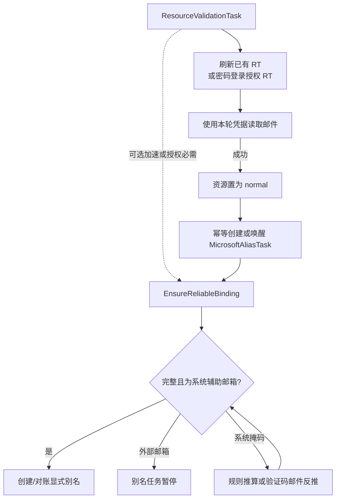

# Microsoft 资源验证、辅助邮箱恢复与显式别名流程

## 修订记录

| 日期 | 版本 | 修订人 | 说明 |
|------|------|--------|------|
| 2026-07-16 | V1.0 | Codex | 定稿 Microsoft 资源验证与显式别名两个独立后台任务，明确辅助邮箱四类识别、地址派生事实、找回密码邮件恢复和按规范化掩码租约并发规则。 |
| 2026-07-16 | V1.1 | Codex | 明确验证码邮件处理不只来自忘记密码流程：登录授权 RT 自身触发的辅助邮箱验证码也必须先识别掩码并取得同一租约；规则可推算时按完整邮箱精确收件，不能推算时才通过实际 recipient 反推，两种触发渠道共用全部规则。 |
| 2026-07-16 | V1.2 | Codex | 定稿 Redis-only 资源调度：`pending` 表示待分配，`validating` 表示已分配临时 Redis task；批量 cursor、单资源执行和 retry 不落 MySQL，dispatcher 按执行窗口限量领取，完成即清理，启动时统一归零。 |
| 2026-07-16 | V1.3 | Codex | 补充批量 cursor 的 Redis 活跃租约：同一 BatchID 只保留一个带 TTL 的 live key，所有分页携带 claim token；完成或最终失败 compare-delete，旧 token 不能续租或删除重新提交的新批次。 |

> 本文是 Microsoft 资源验证、辅助邮箱识别/恢复和显式别名创建的权威业务流程。
>
> 本文描述目标业务契约。现有代码、旧测试或其他文档如果仍把“辅助邮箱未恢复、验证码失败、Binding 持久化失败”直接等同于“资源异常”，均以本文为准并应逐步收敛。

---

## 1. 背景与目标

Microsoft 资源本体是否可用，与系统是否已经掌握完整辅助邮箱，是两个不同问题：

- 资源本体可用，取决于能否得到本轮权威可用的 Refresh Token，并使用本轮凭据成功读取邮件。
- 辅助邮箱是否完整可靠，决定后续能否登录 Microsoft、接收一次性验证码并创建显式别名。

历史问题来自把两者合并成一个验证结果：RT 已经刷新成功、邮件也能读取，但辅助邮箱关系无法恢复时，资源仍被置为 `abnormal`。这会把可正常使用的资源错误隔离。

本流程的目标是：

1. 资源验证只判断资源本体能否使用。
2. 显式别名任务强制补齐辅助邮箱前置条件。
3. 辅助邮箱恢复是一段共享流程，不新增第三种后台任务。
4. `binding_address` 自身保存空、掩码或完整地址，不保存可由代码实时推导的冗余布尔字段。
5. 登录授权或忘记密码触发的验证码邮件，只对相同规范化掩码串行，不同掩码允许并行。
6. 任一辅助邮箱或别名失败都不能推翻已经证明成功的资源验证结果。

非目标：

- 不新增独立“辅助邮箱恢复任务”。
- 不为掩码、外部域名、可收件能力增加重复状态列。
- 不实现掩码正则交集、候选集合重叠或全局单线程队列。
- 不让验证事务同步等待别名创建完成。

---

## 2. 最终架构：严格只有两个后台任务

系统只有两个独立的后台任务类型：

1. `ResourceValidationTask`：Redis/Asynq 临时任务，验证 Microsoft 资源本体。
2. `MicrosoftAliasTask`：由 durable alias schedule 调度，确保辅助邮箱可靠后创建显式别名。

辅助邮箱处理由两个任务复用，但它只是进程内应用流程和协议能力，不是第三个任务。



两个任务的硬边界：

| 事项 | `ResourceValidationTask` | `MicrosoftAliasTask` |
|------|--------------------------|----------------------|
| 核心目标 | 得到可用 RT，并证明可以收件 | 得到可靠系统辅助邮箱，并创建显式别名 |
| 辅助邮箱 | 已有 RT 路径为 best-effort；密码授权被辅助邮箱步骤阻塞时才是必要步骤 | 硬性前置，未 ready 不能调用创建别名协议 |
| 成功后资源状态 | 可以写 `normal` | 不修改资源健康状态 |
| 辅助邮箱失败 | 已经成功的 RT/收件结果不受影响 | 暂停、延迟或失败别名任务 |
| 任务关系 | 成功后幂等创建/唤醒别名任务 | 独立执行，不回滚验证成功 |

---

## 3. 辅助邮箱地址就是分类事实

### 3.1 `binding_address` 的三种自然形态

数据库以 `microsoft_binding_mailboxes.binding_address` 保存当前已知地址事实：

| `binding_address` | 代码判断 | 含义 |
|-------------------|----------|------|
| 空字符串 | `address == ""` | 尚未发现 Microsoft 辅助邮箱，或尚未准备本地绑定地址 |
| `a*****b@wsu.edu.kg` | local part 含 `*` | 已确认 Microsoft 存在该辅助邮箱 proof，但只有掩码，不能精确收件 |
| `alice@wsu.edu.kg` | 合法邮箱且 local part 不含 `*` | 已掌握完整辅助邮箱地址 |

不得为同一事实新增以下字段：

- `is_masked`
- `is_receivable`
- `can_receive`
- `address_type`
- `is_external`

这些值全部由地址格式和当前正常的 `purpose=binding` 域名实时计算。

### 3.2 纯函数判定

#### 掩码地址

只检查 local part 是否包含 `*`。不能用“整个字符串任意位置包含星号”作为合法掩码判断。

```go
func isMaskedMailbox(address string) bool {
    local, domain, ok := strings.Cut(strings.ToLower(strings.TrimSpace(address)), "@")
    return ok && local != "" && domain != "" && strings.Contains(local, "*")
}
```

实现时应复用仓库现有邮箱规范化、格式校验和掩码匹配逻辑，不另建重复解析器。

#### 完整地址

```text
isConcreteMailbox(address) =
    address 非空
    AND 不是掩码
    AND 是合法邮箱
```

仓库已有 `isConcreteMicrosoftBindingAddress(address)`，实现应直接复用或收敛到该判断。

#### 系统辅助邮箱

```text
isSystemBindingMailbox(address) =
    mailboxDomain(address)
    属于 status=normal AND purpose=binding 的 DomainResource
```

掩码只发生在 local part，因此完整域名仍可直接识别：

```text
a*****b@wsu.edu.kg
           └──────── 域名仍然完整
```

#### 可用于收件和创建别名

```text
bindingReady(address) =
    isConcreteMicrosoftBindingAddress(address)
    AND isSystemBindingMailbox(address)
```

辅助邮箱执行状态 `pending/code_sent/verified/timeout/failed/expired` 可以继续用于描述某次协议尝试，但不得替代上述地址判断，也不得作为创建别名的额外地址分类事实。

### 3.3 示例

| 地址 | 掩码 | 完整 | 系统域名 | `bindingReady` | 处理 |
|------|------|------|----------|----------------|------|
| 空 | 否 | 否 | 否 | 否 | 查询 Microsoft proof；没有 proof 时生成并绑定系统辅助邮箱 |
| `a*****b@gmail.com` | 是 | 否 | 否 | 否 | 保存掩码；外部邮箱，别名任务暂停，不触发反推邮件 |
| `a*****b@wsu.edu.kg` | 是 | 否 | 是 | 否 | 保存掩码；先推算，推算失败才通过验证码邮件反推 |
| `alice@gmail.com` | 否 | 是 | 否 | 否 | 保存完整地址；系统不可收件，别名任务暂停 |
| `alice@wsu.edu.kg` | 否 | 是 | 是 | 是 | 直接进入别名创建阶段 |

### 3.4 唯一事实字段

- Microsoft 返回的完整地址和掩码都直接规范化后写入 `binding_address`。
- 分类、展示、恢复和别名前置判断只读取 `binding_address`。
- 旧双字段模型已由数据库迁移清除，业务模型、查询、写入和测试不得再引入第二份地址字段。

### 3.5 地址唯一性

- 完整系统辅助邮箱可以参与 active concrete address 唯一约束，防止同一精确收件地址归属多个 Microsoft 资源。
- 掩码不是精确邮箱，不能占用完整地址唯一槽位。
- 空地址同样不参与精确地址唯一约束。
- 将掩码恢复为完整地址时，必须在短事务内重新校验资源 fence、系统 binding 域名和完整地址唯一性。

---

## 4. 共享流程：`EnsureReliableBinding`

`EnsureReliableBinding` 被验证任务和别名任务复用。它按以下顺序处理，不允许一拿到掩码就直接触发登录验证码或忘记密码验证码邮件。

```text
读取并规范化 binding_address
  → 已是完整地址？
      ├─ 系统 binding 域名：ready
      └─ 外部/不可用域名：external，不能创建别名
  → 地址为空？
      → 查询 Microsoft proof
          ├─ 没有辅助邮箱：生成并绑定系统辅助邮箱
          └─ 已有辅助邮箱：保存完整地址或掩码
  → 是掩码？
      ├─ 外部域名：保存掩码并停止，不触发反推邮件
      └─ 系统域名：按四类规则推算
          ├─ 唯一推算成功：保存完整地址
          └─ 系统随机前缀：通过当前可用的验证码邮件触发渠道反推
```

规则推算和验证码收件是前后两层：推算成功只解决“完整地址是谁”，如果当前 Microsoft 登录/确认仍要求验证码，仍需发码，但应直接查询推算出的完整邮箱；只有推算失败、仍只知道掩码时，收件阶段才扫描系统域名/掩码范围并用实际 recipient 反推。

### 4.1 地址为空

地址为空不等于 Microsoft 没有辅助邮箱。必须先读取 Microsoft proof picker 或登录页面事实：

1. Microsoft 未配置辅助邮箱：
   - 从正常 `purpose=binding` 域名中选择系统域名。
   - 按现有确定性规则生成完整辅助邮箱。
   - 在 Microsoft 页面完成新增 proof、发码、收码和确认。
   - 成功后保存完整 `binding_address`。
2. Microsoft 已配置辅助邮箱：
   - 返回完整地址时直接保存。
   - 返回掩码时直接把掩码保存到 `binding_address`，再进入四类识别。

验证任务只有在密码授权页面实际需要该步骤时才必须完成新增绑定；已有 RT 已成功的 best-effort 路径不应为了填空地址而阻塞资源验证。

### 4.2 已有完整地址

1. 地址合法且域名是正常系统 binding 域名：直接 ready。
2. 地址合法但域名是外部域名：保留完整地址，别名任务暂停。
3. 地址格式非法：视为未解析输入，重新从 Microsoft proof 获取事实；不得猜测或直接用于收件。

---

## 5. 掩码辅助邮箱的四类识别

四类识别只依赖以下输入：

- Microsoft 资源邮箱 `resourceEmail`。
- Microsoft 返回并保存的 `maskedProof`。
- 当前正常的系统 binding 域名集合。
- 现有确定性辅助邮箱生成规则。

识别顺序固定为：

```text
1. 域名不是系统 binding 域名 → 情况 2：外部邮箱
2. 系统确定性规则候选匹配掩码 → 情况 1：系统生成规则
3. 资源同前缀候选匹配掩码 → 情况 4：同资源前缀
4. 其余系统域名掩码 → 情况 3：系统随机前缀
```

候选必须先规范化并去重，然后使用现有 `mailboxMatchesMasked(maskedProof, candidate)` 校验。

### 5.1 情况 1：符合系统确定性生成规则

```text
candidate = DeterministicAuxiliaryAddress(resourceEmail, proofDomain)
```

如果候选与 Microsoft 掩码匹配：

1. 在短事务内把掩码替换为完整候选。
2. 重新校验该域名仍是正常 binding 域名、完整地址未被其他资源占用。
3. 不需要为了反推地址再走忘记密码邮件。
4. 如果当前登录授权仍要求发送验证码，则先取得该 masked proof 的租约并快照完整候选邮箱，再发码并直接按该精确邮箱匹配邮件；不扫描域名收件流，也不再反推 recipient。
5. 完成当前协议确认后进入后续授权或别名创建阶段。

### 5.2 情况 2：非系统/当前不可用的辅助邮箱域名

示例：

```text
a*****b@gmail.com
a*****b@hotmail.com
alice@external.example
```

处理规则：

1. 完整地址或掩码均直接保存到 `binding_address`。
2. 不触发登录授权或忘记密码反推邮件，因为本系统无法接收该域名的验证码。
3. 别名 schedule 进入 `paused` 或等价不可执行状态，并记录安全诊断。
4. Microsoft 资源保持 `normal`。
5. 地址或 binding 域名配置变化后，schedule 可以被重新唤醒并重新分类。

这是四类中唯一不能继续创建显式别名的情况。

不新增 `is_external` 或 `can_receive` 字段；外部判断每次从 `binding_address` 的域名和当前 DomainResource 实时得出。

### 5.3 情况 3：系统域名、随机 local part

满足：

```text
maskedProof 使用系统 binding 域名
AND 确定性生成候选不匹配
AND 资源同前缀候选不匹配
```

这是唯一需要通过验证码邮件实际 recipient 反推完整地址的情况。验证码邮件可以由当前登录授权 RT 流程触发，也可以由忘记密码流程触发；两条路径只在 Microsoft 发码和确认接口上不同，租约、基线、收件匹配、唯一归属和地址持久化规则完全相同：

1. 以规范化掩码申请共享恢复租约。
2. 快照该掩码对应收件查询的基线。
3. 根据当前业务上下文触发邮件：
   - 登录授权已经进入 Email proof/OTP 页面：在当前授权会话中发送登录验证码。
   - 当前没有可复用的授权发码步骤：使用忘记密码 proof 流程发送验证码。
4. 等待新的系统入站邮件。
5. 从实际 SMTP recipient 得到完整辅助邮箱。
6. 校验 recipient 属于当前系统 binding 域名并匹配掩码。
7. 校验邮件、Microsoft 账号提示和验证码属于当前触发渠道及其 Microsoft 会话。
8. 仅在候选 recipient 唯一时，使用同一触发渠道的确认接口提交验证码并保存完整地址。
9. 释放租约。
10. 进入别名创建阶段。

多个候选、无候选、验证码不匹配或会话不匹配时，禁止猜测和落库。

### 5.4 情况 4：系统域名、local part 与资源一致

示例：

```text
resourceEmail = abc@outlook.com
maskedProof   = a*c@wsu.edu.kg
candidate     = abc@wsu.edu.kg
```

计算：

```text
candidate = localPart(resourceEmail) + "@" + proofDomain
```

如果 `mailboxMatchesMasked(maskedProof, candidate)` 成立：

1. 在短事务内把掩码替换为完整候选。
2. 校验系统域名和完整地址唯一性。
3. 不需要为了反推地址再走忘记密码邮件。
4. 如果当前登录授权仍要求发送验证码，则先取得该 masked proof 的租约并快照完整候选邮箱，再发码并直接按该精确邮箱匹配邮件；只有无法推算完整候选时才进入掩码反推。
5. 完成当前协议确认后进入后续授权或别名创建阶段。

---

## 6. 任务一：资源验证完整流程

### 6.1 唯一成功条件

资源验证只关心本轮是否建立了权威可用的 RT 凭据并证明可以收件：

```text
ValidationSuccess =
    AuthoritativeRefreshCredentialEstablished
    AND MailFetchSucceededWithCurrentExchange
```

其中：

- 已有 `client_id + refresh_token` 时，先执行 RT exchange；上游返回 rotated RT 时保存新 RT，未旋转时保留经过本轮成功 exchange 证明仍有效的现有 RT。
- 没有可用 RT 时，通过密码页面流授权得到新 RT。
- 收件使用本轮 exchange/authorization 得到的 access credential，优先 Graph，允许按现有策略回退 IMAP。
- Graph 或 IMAP 任一路径成功读取要求的邮箱文件夹，即证明资源可用。

辅助邮箱状态、辅助邮箱能否恢复、项目历史匹配或别名结果都不在成功公式中。

### 6.2 路径 A：已有 RT 刷新成功

```text
读取现有 client_id + refresh_token
  → RT exchange 成功
  → 保存 rotated RT（如有）
  → 使用本轮 access credential 收件
  → 收件成功
  → 验证成功，资源 normal
  → 幂等创建/唤醒 MicrosoftAliasTask
```

在该路径中，辅助邮箱处理是 `BestEffort`：

- 能观察到完整地址：保存。
- 只能观察到掩码：直接保存掩码。
- 能按规则推算完整地址：保存以加速别名任务。
- 当前登录步骤或忘记密码步骤需要发验证码邮件且租约空闲：可以顺带反推并恢复。
- 相同掩码租约被占用：立即跳过，不等待。
- 外部辅助邮箱、恢复超时、验证码错误、协议取消、Binding 唯一冲突或持久化错误：均不能推翻 RT + 收件成功。

### 6.3 路径 B：已有 RT 无效或没有 RT，使用密码授权

```text
密码登录 Microsoft
  → 页面流是否要求辅助邮箱 proof/OTP?
      ├─ 否：继续授权并得到 RT
      └─ 是：EnsureReliableBinding(requiredForAuthorization)
  → 得到权威 RT
  → 使用本轮凭据收件
  → 收件成功
  → 验证成功，资源 normal
  → 幂等创建/唤醒 MicrosoftAliasTask
```

此时辅助邮箱可能是获取 RT 的必要协议步骤，但失败原因仍应表达为“本轮没有获得可用 RT”，不能表达成“辅助邮箱关系不完整，所以资源必然异常”。

具体规则：

- Microsoft 没有辅助邮箱：生成并绑定系统辅助邮箱，再继续授权。
- 系统掩码可推算：保存完整候选；授权仍要求验证码时，按该精确邮箱建立基线并直接匹配本轮邮件，然后继续授权。
- 系统随机掩码：先申请共享掩码租约；登录授权本身即将发码时，直接用登录验证码邮件反推，不必先切换到忘记密码流程。
- 相同掩码已有活跃恢复：验证任务延迟或重新排队，等待已有流程结束后重读 `binding_address`。
- 外部辅助邮箱且 Microsoft 强制向该地址发码：系统无法完成授权，因此本轮不能成功建立 RT。
- 即使辅助邮箱记录仍不完整，只要 Microsoft 已经发放权威 RT 且本轮收件成功，验证仍然成功。

#### 登录授权先推算，再选择精确收件或掩码反推

密码登录授权 RT 进入 Email proof/OTP 页面时，不能只把掩码当作验证码展示信息，然后等待一个尚未掌握完整地址的邮箱。必须执行同一套辅助邮箱识别：

```text
登录授权返回 masked proof
→ 把掩码保存到 binding_address
→ 先尝试系统生成规则和资源同前缀规则
    ├─ 推算成功
    │   → 保存完整 binding_address
    │   → claim(normalized_mask)
    │   → 快照该完整邮箱的收件基线
    │   → 在当前登录授权会话中触发发送验证码
    │   → 直接按完整邮箱匹配新邮件
    │   → 使用当前授权会话确认验证码
    │
    └─ 推算失败，仍是系统随机前缀
        → claim(normalized_mask)
        → 快照该系统域名/掩码收件基线
        → 在当前登录授权会话中触发发送验证码
        → 从新邮件实际 recipient 反推完整地址
        → 校验 recipient 与掩码、账号和当前授权会话匹配
        → 保存完整 binding_address
        → 使用当前授权会话确认验证码

→ 继续授权并取得 RT
```

两条分支都先执行纯规则推算。差异只在收件方式：

| 推算结果 | 收件范围 | 地址处理 |
|----------|----------|----------|
| 得到唯一完整候选且 mask-match | 只查询该完整邮箱，直接匹配本轮新验证码邮件 | 不需要从 recipient 反推地址 |
| 无法得到唯一完整候选 | 查询系统域名/掩码范围的新邮件，再用实际 recipient 与掩码唯一匹配 | 从实际 recipient 反推并保存完整地址 |

只要 masked proof 将触发验证码邮件，两条分支都必须在发码前取得相同规范化掩码租约；纯推算本身不需要租约。

因此，登录授权验证码和忘记密码验证码不是两套恢复算法，只是同一 `HandleMaskedProofCodeMail` 流程的两个发码/确认适配入口：

| 触发渠道 | 发码动作 | 验证码确认 | 后续动作 |
|----------|----------|------------|----------|
| 登录授权 RT | 当前登录 proof/OTP 页面发送 | 当前登录授权会话确认 | 继续 OAuth 授权并取得 RT |
| 忘记密码 | password-recovery proof 发送 | password-recovery 会话确认 | 只恢复 Binding，不修改密码，然后返回调用任务 |

无论哪个入口，发码前都必须先取得同一个规范化掩码租约并完成相应收件基线快照。能推算出完整邮箱时优先使用精确邮箱基线和精确匹配；推算失败时才使用域名/掩码基线并反推实际 recipient。

### 6.4 验证成功后的提交顺序

外部 Microsoft 调用全部结束后，Core 使用短事务：

1. 锁定验证任务、资源根和 Microsoft 子表。
2. 校验 job claim、credential revision 和资源状态 fence。
3. 保存 authoritative clientId/RT；有 rotated RT 就保存 rotated RT。
4. 更新 `graphAvailable`。
5. 把资源置为 `normal`，清空资源健康错误。
6. 把验证任务置为 `succeeded`。
7. 提交事务。

辅助邮箱观察或恢复事实必须遵守：

- 可以在安全的 fenced 短事务中 best-effort 写入，或在资源成功提交后单独写入。
- Binding 唯一性冲突、非法地址、数据库错误、上下文取消或其他写入失败，均不得回滚已经证明成立的资源成功结果。
- 诊断写入 Binding 自身或安全 SystemLog，不写成资源健康错误。

资源成功提交后：

```text
EnsureAliasSchedule(resourceID)
```

该调用失败只记录警告；周期扫描负责补建遗漏 schedule，不能让验证任务重新失败或把资源恢复成 `pending/abnormal`。

### 6.5 验证失败与资源状态

| 场景 | 验证任务 | 资源状态 |
|------|----------|----------|
| RT/密码授权成功，最终 RT 收件成功 | `succeeded` | `normal` |
| 已成功收件，但辅助邮箱恢复失败 | `succeeded` | `normal` |
| 已成功收件，但 Binding 持久化失败 | `succeeded` | `normal` |
| 已成功收件，但 alias schedule 即时触发失败 | `succeeded` | `normal`；周期扫描补建 |
| 密码错误、账号锁定、账号受限，无法获得任何可用 RT | 确定性失败 | 可置 `abnormal`，原因是资源凭据/账号不可用 |
| 外部辅助邮箱被 Microsoft 强制要求收码，导致无法获得 RT | 确定性失败 | 可置 `abnormal`，原因是无法完成授权并获得可用 RT，不是“辅助邮箱本身异常” |
| RT 获得成功但 Graph/IMAP 都不能读取 | 按错误分类失败或重试 | 确定性收件失败可置 `abnormal`；临时网络错误保持原状态 |
| 代理、网络、429/5xx、上下文超时、临时存储错误 | 重排；耗尽后 job `failed` | 保持原状态，不凭临时故障写 `abnormal` |
| 相同掩码租约忙，已有 RT 可用 | 跳过恢复并成功 | `normal` |
| 相同掩码租约忙，授权 RT 必须依赖恢复 | 延迟/重排 | 保持原状态，等待复用恢复结果 |

---

## 7. 验证成功后创建或唤醒别名任务

验证成功和别名任务之间是异步、幂等关系：

```text
CommitValidationSuccess
→ EnsureAliasSchedule(resourceID)
→ Alias dispatcher
```

`EnsureAliasSchedule` 行为：

| 当前情况 | 行为 |
|----------|------|
| schedule 不存在 | 创建 `pending` schedule |
| schedule 为 `pending` | 保持或提前 `next_run_at` |
| schedule 因旧 Binding 不完整而 `paused`，地址事实已变化 | 唤醒为 `pending` |
| schedule 为 `queued/running` | 复用，不重复创建 |
| 存在 uncertain attempt | 复用并继续对账同一候选 |
| 已达到周/年配额 | 保留 schedule，安排到下一配额窗口 |

双保险：

1. 验证成功后即时、幂等触发。
2. 周期扫描查找 `status=normal` 且缺失 schedule 的资源并补建。

Redis/Asynq 只是执行层；MySQL schedule 是最终任务事实。

---

## 8. 任务二：显式别名创建完整流程

### 8.1 任务目标

```text
确保辅助邮箱完整可靠
→ 使用辅助邮箱完成 Microsoft OTC/密码登录
→ 对账已有别名
→ 创建显式别名
```

### 8.2 领取与前置检查

worker 领取 schedule 后依次：

1. 校验 schedule claim token 和 fencing。
2. 重新读取 Microsoft 资源。
3. 要求资源 `status=normal`；否则暂停 schedule。
4. 执行 `EnsureReliableBinding(required)`。
5. 只有 `bindingReady(binding_address)` 才进入配额和远端别名阶段。

辅助邮箱未 ready 时禁止提前预占新的别名候选配额，避免恢复等待长期占用周/年额度。

### 8.3 各地址场景的任务行为

| 地址场景 | Binding 处理 | Alias schedule |
|----------|--------------|----------------|
| `binding_address` 为空，Microsoft 没有 Email proof | 生成并绑定系统辅助邮箱 | 成功后继续 |
| `binding_address` 为空，Microsoft 已有 proof | 保存完整地址或掩码，再分类 | 按分类继续 |
| 完整系统邮箱 | 直接使用 | 继续 |
| 完整外部邮箱 | 不触发反推邮件 | `paused` |
| 系统生成规则掩码 | 推算、mask-match、写完整地址 | 继续 |
| 外部域名掩码 | 原样保存，不触发反推邮件 | `paused` |
| 系统随机前缀掩码 | 优先复用当前登录发码步骤，否则使用忘记密码发码；两者共用反推流程 | 成功后继续；忙或临时失败则重排 |
| 系统同资源前缀掩码 | 拼接、mask-match、写完整地址 | 继续 |

除了外部域名之外，其余场景都应朝着创建别名继续，而不是因为初始地址为空或是掩码就永久停止。

### 8.4 别名创建阶段

Binding ready 后继续复用现有别名机制：

1. 再次读取资源和 `binding_address`，防止前置处理后发生并发变化。
2. 校验自然周、自然年配额。
3. 生成候选并持久化预占 attempt。
4. 在真正调用 Microsoft 前再次校验资源 `normal`、Binding ready 和 claim fencing。
5. 使用完整系统辅助邮箱执行 OTC 登录；必要时按现有协议回退密码登录。
6. 对账 Microsoft 账号已有显式别名。
7. 创建本轮候选。
8. 确认成功后登记 BC-CORE `ExplicitAlias`。
9. 响应丢失或结果不确定时保持 `uncertain`，继续对账同一候选，不能换新候选绕过配额。

### 8.5 失败边界

| 失败 | 别名任务处理 | 资源处理 |
|------|--------------|----------|
| 外部辅助邮箱 | `paused`，保存安全原因 | 保持 `normal` |
| 同掩码租约忙 | 延迟/重排，之后重新读取地址 | 保持 `normal` |
| 验证码邮件超时或验证码错误 | 按策略重试/暂停 | 保持 `normal` |
| 掩码反推出现多个候选 recipient | 不猜，重试/暂停 | 保持 `normal` |
| Binding 完整地址唯一性冲突 | 暂停并诊断 | 保持 `normal` |
| Microsoft alias 限流 | 退避或等下一配额窗口 | 保持 `normal` |
| alias 结果不确定 | 对账同一候选 | 保持 `normal` |
| 密码错误或账号限制 | alias schedule 暂停 | 不由别名任务修改资源状态；由独立验证任务重新证明资源健康 |
| 本地落库/日志临时失败 | 保留 durable attempt 并重试/对账 | 保持 `normal` |

---

## 9. 验证码邮件反推与共享租约

### 9.1 两阶段算法

辅助邮箱恢复必须先纯推算；需要发验证码时，优先按推算出的完整邮箱精确收件，无法推算时才通过实际 recipient 反推：

```text
阶段 A：Pure Inference
    → 系统生成规则
    → 资源同前缀规则
    → 外部域名识别
    → 完整地址识别

阶段 B：Mail Code Handling
    → 推算成功：按完整邮箱精确匹配验证码邮件
    → 推算失败：按掩码匹配实际 recipient 并反推完整地址
    → 发码渠道可以是登录授权 OTP 或 password-recovery OTP
```

阶段 A 没有发信副作用，可以随验证任务和别名任务自由并行。

阶段 B 是一套共享算法，只把渠道相关动作作为参数：

```text
HandleMaskedProofCodeMail(
    maskedProof,
    inferredCandidate,
    sendCode,
    confirmCode,
    protocolSession,
)
```

- `sendCode` 可以来自登录授权页面，也可以来自忘记密码 proof。
- `confirmCode` 必须与 `sendCode` 属于同一个 Microsoft 协议会话。
- `inferredCandidate` 非空且 mask-match 时，直接读取该精确邮箱；为空时才使用实际 recipient 反推。
- 掩码租约、基线、会话校验和唯一邮件匹配不区分发码渠道。

### 9.2 恢复并发键

```text
recoveryKey = normalizeMaskedMailbox(maskedProof)
```

这里的输入是当前 Microsoft 页面返回的原始 `maskedProof`。即使规则推算成功并已把数据库 `binding_address` 更新为完整地址，本轮 worker 仍使用内存中的原始掩码作为发码租约键；不需要为此新增持久化 mask 字段。

规范化至少包含：

- 去除首尾空白。
- 全部转小写。
- 校验恰好一个 `@`。
- local part 非空且包含 `*`。
- 域名非空并规范化。

完整规范化掩码包含域名，因此：

```text
a*****b@wsu.edu.kg
a*****b@aishop6.com
```

是不同的恢复键，可以并行。

### 9.3 精确相等并发规则

示例：

| 活跃掩码 | 新掩码 | 结果 |
|----------|--------|------|
| `a*****b@wsu.edu.kg` | `a*****b@wsu.edu.kg` | 相同，必须串行 |
| `a*****b@wsu.edu.kg` | `x*****9@wsu.edu.kg` | 不同，允许并行 |
| `a*****b@wsu.edu.kg` | `a*****b@aishop6.com` | 不同，允许并行 |
| `ab****9@wsu.edu.kg` | `a*****9@wsu.edu.kg` | 字符串不同，允许并行；不计算潜在集合交集 |

每个恢复流程必须只处理与自身规范化掩码匹配的邮件，并使用独立 Microsoft 会话。

### 9.4 共享活跃掩码租约

验证任务和别名任务必须使用同一个租约存储，不能各自维护进程锁或各自的 active set。

最小协调字段：

| 字段 | 用途 |
|------|------|
| `normalized_mask` | 主键/唯一并发键 |
| `claim_token` | fencing token，防止旧 worker 释放或覆盖新租约 |
| `lease_until` | 崩溃恢复 TTL |
| `resource_id` | 排障和归属 |
| `sent_at` | 本轮实际发信时间；发信前可为空 |

不需要保存：

- 掩码前缀/后缀。
- 候选集合。
- overlap 结果。
- `status` 业务状态。
- `is_receivable`。

数据库实现以 `normalized_mask` 主键保证同一掩码最多一条租约。正常完成按 `normalized_mask + claim_token` 立即删除；新 claim 会顺手删除已过期租约，再写入新的 `claim_token`，因此不需要 MySQL 部分唯一索引，也不会把失效租约长期保留成历史记录。

### 9.5 租约覆盖完整关键区间

租约不能在发信后立即释放，必须覆盖：

```text
claim(normalized_mask)
→ 有推算候选时快照精确邮箱基线；没有候选时快照系统域名/掩码基线
→ 通过当前触发渠道请求 Microsoft 发验证码邮件
→ 记录 sent_at
→ 等待邮件
→ 精确匹配完整邮箱，或在无法推算时识别实际 recipient
→ 校验邮件、账号提示和当前恢复会话
→ 消费/确认验证码
→ 持久化完整 binding_address
→ release(normalized_mask, claim_token)
```

等待邮件期间不得持有数据库事务。租约 TTL 应大于最大邮件等待时间、Microsoft 确认时间和落库宽限；如果流程允许超过 TTL，必须用同一个 `claim_token` 安全续租。

同一个 claim 只允许触发一次验证码邮件。第一次发信尚未完成邮件归属、验证码确认和地址持久化时，不得因轮询超时、代理切换或从 OTC 切换到密码登录而再次向相同掩码发信；应让当前任务延迟/重排，之后重新读取 `binding_address`。只有上一封邮件已经处理完并按 `normalized_mask + claim_token` 释放租约，新的协议会话才可以再次 claim 并发信。

释放必须带 `normalized_mask + claim_token` 条件，旧 worker 不得释放后来 worker 已重新取得的租约。

### 9.6 两个任务遇到租约冲突

| 调用者 | 辅助邮箱是否必要 | 相同掩码已活跃时的行为 |
|--------|------------------|------------------------|
| 验证任务 | 已有 RT 已刷新并可收件，恢复只是加速 | 立即跳过恢复，继续验证成功并确保别名 schedule |
| 验证任务 | 密码授权新 RT 必须完成该 proof | 不重复发信；延迟/重新排队，之后重新读取 `binding_address` |
| 别名任务 | 硬前置 | 延迟/重新排队，之后重新读取 `binding_address` |

另一个任务完成后，当前 `binding_address` 很可能已经从掩码变成完整地址，所以等待方恢复执行时必须重新读取，不能沿用旧快照继续发信。

### 9.7 邮件唯一归属条件

本轮候选邮件必须同时满足：

```text
不在发送前收件基线中
AND received_at >= sent_at
AND actual recipient 属于当前正常系统 binding 域名
AND mailboxMatchesMasked(maskedAddress, actualRecipient)
AND 有推算候选时 actual recipient 等于该完整候选
AND 邮件属于当前触发渠道（登录授权或忘记密码）
AND 邮件中的账号提示与当前资源相符
AND 验证码属于当前 Microsoft 恢复会话
AND 本轮最终只有一个唯一 actual recipient
```

匹配成功：

```text
binding_address = a*****b@wsu.edu.kg
→
binding_address = alicebob@wsu.edu.kg
```

多个候选、零候选、验证码与会话不匹配或地址唯一性冲突时：

- 不猜测。
- 不写完整地址。
- 按调用模式跳过、重排或暂停。
- 最终释放自己的租约。

### 9.8 崩溃和迟到邮件

- worker 崩溃后租约由 `lease_until` 自动失效，避免永久阻塞。
- TTL 必须覆盖正常流程最大耗时，减少旧会话邮件在新租约期间迟到的概率。
- 新任务的收件基线会包含已经到达的旧邮件，因此旧邮件不会被当成本轮新邮件。
- 仍然迟到且造成多个候选时必须保持未解析，不能按“最新一封”猜测。

---

## 10. 事务、幂等与 fencing

### 10.1 外部调用不进入数据库事务

以下操作都在事务外：

- Microsoft OAuth/页面登录。
- Graph/IMAP 收件。
- proof picker 查询。
- 登录授权验证码或忘记密码验证码的发信与等待。
- OTP 确认。
- Microsoft alias 创建和对账。

数据库只在 claim、短状态变更、结果提交和配额预占时使用短事务。

### 10.2 验证 fencing

提交验证结果前必须校验：

- 当前 job 仍是本 worker 的 `claim_token`。
- resource ID 与类型一致。
- credential revision 没有被新的管理员命令替换。
- 资源没有变成 `disabled/deleted`。

stale 结果不得覆盖新凭据或新状态。

### 10.3 Binding 持久化 fencing

- 完整地址从掩码恢复时，提交前重新读取当前 `binding_address`。
- 只有当前值仍为空、仍是本轮掩码，或已经是同一完整地址时才能幂等提交。
- 管理员在恢复期间更换地址时，本轮结果必须因 snapshot/fence 不匹配而丢弃。
- concrete address 唯一约束在最终提交时执行。
- Binding 提交失败不反向破坏已经提交的验证成功。

### 10.4 Alias fencing

- schedule claim、attempt reservation、远端调用前复查和完成提交都使用现有 claim/fencing token。
- 不确定结果继续对账同一候选。
- 旧 worker 不能覆盖新 worker 的 schedule、attempt 或 ExplicitAlias 结果。

### 10.5 幂等触发

- 同一资源同一 credential revision 最多一个 active Redis validation TaskID。
- 同一资源只有一个 durable alias schedule。
- 同一规范化掩码同一时间最多一个有效恢复租约。
- 同一 `(resource_id, alias)` 只登记一个 ExplicitAlias。

---

## 11. 状态边界

### 11.1 资源状态

资源状态只表达资源本体：

```text
pending / validating / normal / abnormal / disabled / deleted
```

其中：

- `pending`：待验证，尚未被 Redis dispatcher 分配。
- `validating`：已经分配一个临时 Redis/Asynq task，可能在队列等待、重试或 worker 内执行。
- `normal/abnormal`：只有验证 worker 根据 RT、账号和收件证据才能写入的健康结论。

人工 Microsoft/Domain 大批量验证请求不得在 HTTP 内同步扫描、COUNT 或更新大表。HTTP 只创建一个 Redis cursor task；cursor 每次分页把命中资源置为 `pending` 并只投递下一页，当前页 task 完成立即删除。导入 worker 创建的 Microsoft 资源本来就是 `pending`，提交后只唤醒同一 dispatcher，不创建第二份 validation batch。

同一个批量提交在 cursor 整体运行期间只额外占用一个 Redis live key。第一页用 `BatchID` 执行 `SET NX + TTL` 并生成 `claim_token`，后续分页只允许相同 token 续租；批次完成、无重试余量或无效任务终止时按 `BatchID + claim_token` compare-delete。worker 崩溃时 key 最终由 TTL 清理。若旧 cursor 在租约过期后复活，它不能续租、更新数据库或删除重新提交的新租约；不保存批次历史、完成数量或结果快照。

dispatcher 只从 `pending` 领取，并在同一短事务置为 `validating`。全库 `validating` 数量是临时分配水位，不得超过当前自适应执行窗口，因此周期 dispatcher 不能把百万资源一次性堆进 Redis。单 task 临时重试期间资源保持 `validating`；最终重试耗尽但没有健康结论时先恢复 `pending`，handler 返回成功让 Redis task 删除，不进入 completed retention 或 archived。服务启动时全部 `validating -> pending`；旧 task 后续提交结果必须因 status/revision fence 成为 stale/no-op。

### 11.2 Binding 执行状态

```text
pending / code_sent / verified / timeout / failed / expired
```

这些状态描述某次绑定、发码或确认执行结果。它们可以用于：

- 管理员排障。
- 任务重试策略。
- 展示最近一次协议结果。

它们不能用于：

- 单独决定资源 `normal/abnormal`。
- 代替地址格式判断掩码。
- 代替系统域名实时判断可收件性。
- 阻止一个完整系统地址进入别名流程。

### 11.3 Alias schedule/attempt

Alias schedule 和 attempt 只表达别名能力：

- `pending/queued/running/paused`
- attempt `running/succeeded/failed/uncertain`

其失败、暂停和退避不改变资源状态。

### 11.4 恢复租约

恢复租约不是业务状态机。它只回答：

```text
这个规范化掩码当前是否已有一封未完成处理的验证码邮件？
```

---

## 12. 详细场景矩阵

### 12.1 验证场景

| 编号 | 初始条件 | 过程 | 最终结果 |
|------|----------|------|----------|
| V1 | RT 有效，无 Binding 行 | 刷新 RT、收件成功；辅助邮箱可不处理 | 资源 `normal`，验证成功，创建/唤醒 alias schedule |
| V2 | RT 有效，`binding_address` 是系统掩码 | 收件成功；规则推算成功就补全，失败也不阻塞 | 资源 `normal`；alias task 后续兜底 |
| V3 | RT 有效，系统随机掩码，同掩码租约忙 | 跳过辅助邮箱恢复 | 资源 `normal`；alias task 等待已有恢复结果 |
| V4 | RT 有效，外部掩码 | 保存掩码，收件成功 | 资源 `normal`；alias schedule 后续暂停 |
| V5 | RT 有效，恢复 OTP 超时/错误 | 保留诊断，使用 RT 收件成功 | 资源 `normal`，不能因 `code_timeout/code_error` 置异常 |
| V6 | RT 有效，Binding 写入唯一性冲突 | RT 收件结果先成立，Binding 记录失败 | 资源 `normal`；Binding/alias 单独诊断 |
| V7 | RT 无效，密码登录不要求辅助邮箱 | 直接获得新 RT并收件 | 资源 `normal`，创建 alias schedule |
| V8 | RT 无效，Microsoft 没有辅助 proof，但授权要求绑定 | 生成系统辅助邮箱、绑定、收码、获得 RT、收件 | 资源 `normal`，Binding 完整，创建 alias schedule |
| V9 | RT 无效，系统生成规则掩码，登录授权要求发码 | 推算完整地址；取得掩码租约并快照精确邮箱；直接匹配该邮箱的新登录验证码并确认授权 | 获得 RT并收件后资源 `normal` |
| V10 | RT 无效，系统同前缀掩码，登录授权要求发码 | 拼接并 mask-match；取得掩码租约后按完整邮箱精确收件，不走 recipient 反推 | 获得 RT并收件后资源 `normal` |
| V11 | RT 无效，登录授权页面对系统随机掩码发验证码 | 发码前取得租约和基线；用登录验证码邮件实际 recipient 反推，随后在同一授权会话确认 | 获得 RT并收件后资源 `normal` |
| V11B | RT 无效，当前授权步骤没有可复用发码入口，但系统随机掩码可走忘记密码 proof | 使用同一租约和反推规则，由忘记密码流程发码并确认 Binding，再返回登录授权 | 获得 RT并收件后资源 `normal` |
| V12 | RT 无效，系统随机掩码，同掩码租约忙 | 不重复发信，验证任务重排 | 资源保持原状态 |
| V13 | RT 无效，外部 proof 且 Microsoft 强制该 proof 收码 | 本系统无法收码，最终未获得 RT | 验证失败；如为确定性不可用可置 `abnormal`，原因是无可用 RT |
| V14 | 获得 RT，但 Graph/IMAP 都确定性不可读 | 无法证明收件 | 验证失败，可置 `abnormal` |
| V15 | 获得 RT，但网络/代理临时不可用 | 任务重排，耗尽后只失败 job | 资源保持原状态 |
| V16 | RT 收件成功，EnsureAliasSchedule 临时失败 | 验证结果已提交 | 资源 `normal`；周期扫描补建 schedule |

### 12.2 别名场景

| 编号 | 初始条件 | 前置处理 | 别名结果 |
|------|----------|----------|----------|
| A1 | 完整系统辅助邮箱 | `bindingReady=true` | 直接创建/对账别名 |
| A2 | 完整外部邮箱 | 实时域名判断为外部 | schedule `paused`，资源不变 |
| A3 | 地址为空，Microsoft 无 Email proof | 生成并绑定系统辅助邮箱 | ready 后创建别名 |
| A4 | 地址为空，Microsoft 返回系统掩码 | 保存掩码并分类 | 走情况 1/3/4 |
| A5 | 系统生成规则掩码 | 推算、mask-match、写完整地址 | 创建别名 |
| A6 | 外部域名掩码 | 原样保存，不触发反推邮件 | schedule `paused` |
| A7 | 系统随机前缀掩码 | 可复用登录发码时用登录验证码反推，否则用忘记密码验证码反推 | 成功后创建别名 |
| A8 | 系统同资源前缀掩码 | 拼接、mask-match、写完整地址 | 创建别名 |
| A9 | 系统随机掩码，同掩码租约忙 | 重排并重新读取 Binding | 另一个任务补全后直接继续 |
| A10 | 掩码反推出现多个 recipient | 不猜、不持久化 | 重试/暂停，资源不变 |
| A11 | 恢复成功但完整地址已被其他资源占用 | 唯一约束拒绝 | 暂停并诊断，资源不变 |
| A12 | Microsoft alias 返回不确定 | 保留同一 candidate attempt | 继续 reconciliation，资源不变 |
| A13 | 达到周/年配额 | 不新增远端调用 | 安排下一窗口，资源不变 |
| A14 | alias 密码登录失败 | schedule 暂停或退避 | 不修改资源；如需判断健康，另建/复用验证任务 |

### 12.3 恢复并发场景

| 编号 | 活跃流程 | 新流程 | 行为 |
|------|----------|--------|------|
| R1 | `a*****b@wsu.edu.kg` | 同掩码验证 best-effort | 验证跳过恢复 |
| R2 | `a*****b@wsu.edu.kg` | 同掩码验证 required | 验证重排 |
| R3 | `a*****b@wsu.edu.kg` | 同掩码 alias required | alias 重排 |
| R4 | `a*****b@wsu.edu.kg` | `x*****9@wsu.edu.kg` | 并行 |
| R5 | `a*****b@wsu.edu.kg` | `a*****b@aishop6.com` | 并行 |
| R6 | worker 发信后崩溃 | 同掩码新任务 | lease 未过期时等待；过期后重新 claim，使用新基线和会话校验 |
| R7 | 两个不同掩码并行，邮件同时到达 | 两个 worker 各自匹配 | 每个 worker 只消费匹配自己掩码和会话的邮件 |

---

## 13. 安全、日志与可观测性

### 13.1 禁敏

不得进入普通日志、OperationLog、SystemLog、任务 payload 或管理列表：

- Microsoft 密码。
- RT、AT、OAuth token。
- OTP/验证码。
- recovery token、EPID、canary、UAID。
- 邮件正文和 RFC822 objectKey。
- Microsoft 原始页面或响应体。

掩码地址可以作为 Binding 管理事实展示，但普通资源验证日志优先记录 `resource_id/request_id/category`，不重复扩散地址。

### 13.2 建议安全诊断

| 事件 | 建议字段 |
|------|----------|
| 验证成功 | resourceId、requestId、graphAvailable、credential revision |
| 验证失败 | resourceId、requestId、稳定 category、安全 message |
| best-effort Binding 跳过 | resourceId、reason=`mask_busy/external/unresolved/temporary` |
| 恢复租约 claim/release/expire | resourceId、mask hash、claim token hash、leaseUntil；不必记录完整地址 |
| Alias 暂停 | resourceId、reason=`external_binding/unresolved_binding/resource_not_normal` |
| 恢复歧义 | resourceId、candidate count，不记录验证码和正文 |

### 13.3 核心指标

- 验证成功率，按 RT refresh、password authorization、Graph、IMAP 分类。
- “RT 收件成功但 Binding 处理失败”的次数；该指标必须不伴随资源异常增长。
- Binding 四类识别数量。
- 恢复租约 claim、冲突、过期和平均持有时间。
- 验证码邮件反推成功、超时、歧义数量，并按登录授权/忘记密码触发渠道区分。
- 验证成功到 alias schedule 建立的延迟。
- Alias 因 external binding 暂停数量。

---

## 14. 必须保持的业务不变式

| 编号 | 不变式 |
|------|--------|
| INV-MVA-1 | RT/权威凭据获取成功且收件成功时，任何辅助邮箱失败都不能把资源判为异常。 |
| INV-MVA-2 | 验证成功先提交资源 `normal`，再幂等创建或唤醒 alias schedule。 |
| INV-MVA-3 | Alias schedule 创建失败、别名创建失败或恢复失败不能回滚资源验证成功。 |
| INV-MVA-4 | 系统严格只有 validation 和 alias 两类业务后台任务。 |
| INV-MVA-5 | `binding_address` 是地址唯一权威事实，可为空、掩码或完整地址。 |
| INV-MVA-6 | 地址是否掩码只检查 local part 中的 `*`。 |
| INV-MVA-7 | 是否系统邮箱由当前正常 `purpose=binding` 域名实时判断，不保存冗余布尔值。 |
| INV-MVA-8 | `bindingReady` 只等于“完整合法地址 + 当前系统 binding 域名”。 |
| INV-MVA-9 | 外部域名地址不触发用于反推的验证码邮件；资源可以保持 `normal`，alias schedule 暂停。 |
| INV-MVA-10 | 所有 masked proof 先走规则推算；只有系统域名随机 local part 掩码无法推算时，才通过验证码邮件实际 recipient 反推。 |
| INV-MVA-11 | 登录授权和忘记密码只是不同发码/确认渠道，必须共用相同识别、租约、基线、匹配和持久化规则；推算成功时精确收件，推算失败时掩码反推。 |
| INV-MVA-12 | 相同规范化掩码串行，不同规范化掩码允许并行。 |
| INV-MVA-13 | 租约覆盖基线、发信、收件、归属、确认和持久化全过程。 |
| INV-MVA-14 | 等待验证码邮件时不得持有数据库事务。 |
| INV-MVA-15 | 掩码反推的验证码邮件不能唯一归属时不猜测、不写完整地址。 |
| INV-MVA-16 | masked address 不占用 concrete active-address 唯一槽位；恢复成完整地址时重新校验唯一性。 |
| INV-MVA-17 | 验证和 alias 遇到同一活跃掩码时必须共享同一个租约存储。 |
| INV-MVA-18 | 资源、Binding、alias schedule 和恢复租约各自由自己的状态/事实表达，禁止相互冒充。 |
| INV-MVA-19 | 登录授权准备向 masked proof 发码前必须先 claim 掩码租约并快照基线，不能发完邮件再开始识别辅助邮箱。 |
| INV-MVA-20 | 规则推算得到唯一完整地址时，验证码必须优先按完整邮箱精确匹配；只有无法推算时才扫描掩码范围并反推 recipient。 |
| INV-MVA-21 | Microsoft/Domain 批量提交只异步置 `pending`；HTTP 不同步扫描、COUNT 或批量更新大资源表。 |
| INV-MVA-22 | 只有 dispatcher 成功领取 `pending` 资源后，才能在同一短事务进入 `validating` 并投递 Redis task。 |
| INV-MVA-23 | 没有 active Redis task 的资源不得永久停留在 `validating`；投递失败、无结论的最终重试和服务启动恢复都必须回到 `pending`。 |
| INV-MVA-24 | 验证 Redis 数据只包含当前 cursor、当前执行和 retry；cursor 每页、单资源 task 完成后立即删除，不保留 completed/archived/history 或额外结果 key。 |
| INV-MVA-25 | dispatcher 的总分配水位不得超过当前自适应执行窗口；重复周期唤醒不能让 Redis backlog 随资源总量持续增长。 |
| INV-MVA-26 | 同一 BatchID 运行期间只有一个 live Redis lease；所有分页共享 claim token，完成或最终失败立即 compare-delete，旧 token 对新租约只能 no-op。 |

---

## 15. 实现与测试验收清单

### 15.1 地址与持久化

- [ ] `binding_address` 接受合法掩码地址并直接保存。
- [ ] 掩码检测只检查 local part。
- [ ] 复用 `isConcreteMicrosoftBindingAddress`，不新增重复解析器。
- [ ] 系统域名实时查询正常 `purpose=binding` 域名。
- [ ] `bindingReady` 不依赖执行 `status`。
- [ ] 完整地址和掩码都只写入 `binding_address`。
- [ ] masked address 不占用 concrete 唯一槽位。

### 15.2 验证任务

- [ ] 已有 RT refresh + mail fetch 成功时，Binding 超时、错误、取消、唯一冲突和普通存储错误均不影响成功。
- [ ] password authorization 只有在无法获得 RT 时才失败；错误原因不伪装为资源 Binding 健康判定。
- [ ] 登录授权 masked proof 先执行确定性规则和同前缀规则，推算成功后按完整邮箱直接匹配验证码。
- [ ] 登录授权只有在规则推算失败时才进入掩码 recipient 反推。
- [ ] 验证成功提交后幂等 EnsureAliasSchedule。
- [ ] alias trigger 失败不让验证重试或回滚。
- [ ] Application、Infra 和 handler mocks 使用同一成功契约。

### 15.3 Alias 任务

- [ ] 远端 alias 调用前强制执行 `EnsureReliableBinding`。
- [ ] 四类识别顺序固定并有表驱动测试。
- [ ] 地址为空时先确认 Microsoft 是否已有 proof；只有没有 proof 才生成并绑定新系统邮箱。
- [ ] 情况 1、4 不触发反推邮件。
- [ ] 情况 2 不触发反推邮件并暂停 schedule。
- [ ] 情况 3 同时覆盖登录授权发码和忘记密码发码，任一路径恢复成功后继续创建 alias。
- [ ] Binding 未 ready 时不预占新的 alias candidate 配额。
- [ ] alias 失败永不修改资源状态。

### 15.4 恢复租约

- [ ] validation 和 alias 使用同一租约实现。
- [ ] 登录授权发码和忘记密码发码使用同一租约实现。
- [ ] 相同规范化掩码只能 claim 一个有效 lease。
- [ ] 不同掩码可并行 claim。
- [ ] release/renew 都校验 claim token。
- [ ] lease 覆盖完整邮件处理周期。
- [ ] worker 崩溃后 TTL 可恢复。
- [ ] 任务重排后重新读取 `binding_address`。
- [ ] 登录授权发码前已经完成 mask claim 和收件基线快照。
- [ ] 推算成功使用精确邮箱基线；推算失败使用系统域名/掩码基线。
- [ ] 登录授权邮件使用实际 recipient 反推后，在同一授权会话确认验证码并继续取得 RT。
- [ ] 保存一个真实协议 fixture，证明同一辅助邮箱重复 proof 返回稳定掩码。

### 15.5 关键场景测试

- [ ] `a*****b@wsu.edu.kg` 被识别为系统掩码、未 ready。
- [ ] `a*****b@gmail.com` 被识别为外部掩码、未 ready且不发信。
- [ ] `alice@wsu.edu.kg` 被识别为 ready。
- [ ] 确定性候选匹配掩码后直接补全。
- [ ] 同资源 local part 候选匹配后直接补全。
- [ ] 两个相同掩码串行。
- [ ] 两个不同 local part 掩码并行。
- [ ] 相同 local 掩码、不同域名并行。
- [ ] 多个新邮件候选时不持久化。
- [ ] 验证成功但 Binding 提交失败时资源仍 `normal` 且 alias schedule 最终存在。

只运行与改动包和直接调用链相关的测试，再执行受影响 Go 包的 `go vet` 与 scoped `golangci-lint`；不以全仓测试作为本流程每次小改动的默认门禁。

---

## 16. 现有数据与发布边界

### 16.1 旧 Binding 数据

兼容迁移时：

- `binding_address` 为空而旧展示列有掩码：把规范化掩码迁移到 `binding_address`。
- `binding_address` 已有完整地址：保持完整地址为权威，不得被旧掩码覆盖。
- 两份旧数据冲突：不猜测，保留完整地址并交由任务重新观察 Microsoft proof。
- 迁移完成后删除旧展示列；运行时代码只读写 `binding_address`。

### 16.2 历史异常资源

不能把所有历史 `abnormal` 记录无条件批量改成 `normal`。安全恢复方式是：

1. 把目标资源置为 `pending` 并唤醒 Redis dispatcher。
2. 重新执行 RT refresh 和 mail fetch。
3. 成功后按本文规则置 `normal`。
4. 幂等 EnsureAliasSchedule。
5. Binding 缺失或为掩码时由 validation best-effort 或 alias required 流程继续处理。

生产部署和历史数据重分类必须单独审批。

---

## 17. 架构决策记录

### ADR-MVA-1：资源健康与辅助邮箱解耦

**状态**：Accepted

**决策**：资源健康只由权威 RT 获取和收件结果决定；辅助邮箱失败不覆盖已成立的成功证据。

**代价**：资源可能为 `normal`，但 alias schedule 因辅助邮箱外部或未恢复而暂停。

**接受理由**：这准确表达真实能力。资源仍可收件，别名能力由独立任务单独展示和修复。

### ADR-MVA-2：地址事实不保存冗余分类字段

**状态**：Accepted

**决策**：只以 `binding_address` 和系统 binding 域名实时派生 masked/concrete/system/ready。

**代价**：任务每次需要做少量字符串解析和域名查询。

**接受理由**：避免地址和布尔字段不一致；查询成本远小于维护重复状态的复杂度。

### ADR-MVA-3：按规范化掩码精确相等互斥

**状态**：Accepted

**决策**：相同完整掩码串行，不同完整掩码并行；不做 overlap 算法。

**代价**：依赖 Microsoft 对同一真实邮箱返回稳定掩码。

**缓解**：保存真实协议 fixture；如现网证明掩码不稳定，再依据样本升级协调键，不提前实现复杂集合算法。

### ADR-MVA-4：辅助邮箱恢复不是第三个任务

**状态**：Accepted

**决策**：validation 和 alias 直接调用共享恢复流程及租约。

**代价**：两个任务必须显式选择 best-effort 或 required 冲突策略。

**接受理由**：恢复没有独立业务目标；第三个任务会增加编排、状态同步和漏唤醒风险。

### ADR-MVA-5：验证码邮件处理与发码渠道分离

**状态**：Accepted

**决策**：登录授权 OTP 和忘记密码 OTP 共用同一个验证码邮件处理、掩码租约和持久化流程，只分别提供渠道自己的发码、验证码确认和协议会话；规则推算成功时精确收件，推算失败时才反推实际 recipient。

**代价**：两个 Microsoft 页面流都必须在真正发码前接入共享 mask claim 和收件基线步骤。

**接受理由**：实际 recipient 才是恢复完整辅助邮箱的共同证据；按入口复制两套算法会产生不同的并发和匹配规则。
