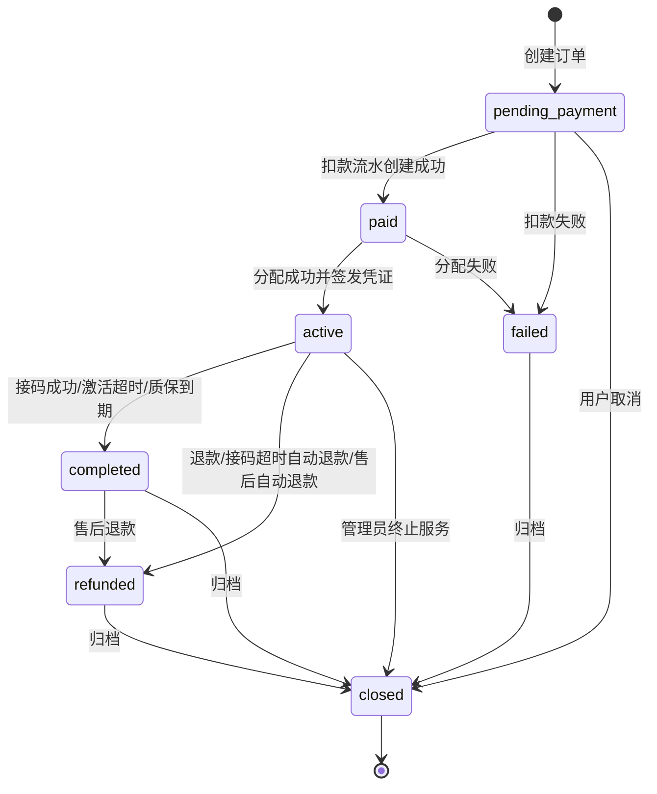

# BC-TRADE 交易履约上下文

## 修订记录

| 日期 | 版本 | 修订人 | 说明 |
|------|------|--------|------|
| 2026-06-29 | V1.0 | Codex | 形成 Go 版从 0 DDD 设计基线，作为一次 V1.0 变更。 |
| 2026-07-09 | V1.1 | Codex | 补充分配优先于扣款的私有库存语义：实际分配到 `owned` 库存时订单应付为 `0.00`，仍必须创建 0 元消费流水。 |
| 2026-07-09 | V1.2 | Codex | 补充购买服务窗口约束：未激活购买订单只使用 `receiveUntil` 表达激活截止，`afterSaleUntil` 只表达激活后的质保截止。 |
| 2026-07-10 | V1.3 | Codex | 订单实付和退款金额改用六位小数账本精度，保证分以下商品价格精确扣款与退款。 |
| 2026-07-10 | V1.4 | Codex | 订单列表读模型支持交付域名/创建时间筛选、offset+total 分页与自排除 facets 聚合，并附带项目名称冗余展示。 |
| 2026-07-12 | V1.5 | Codex | 补充管理员 Microsoft 订单 Tab 的批量 `OrderSummaryQueryPort`；只发布 Trade 自有订单事实，不让 Alloc/Core 直接读订单表或复制订单状态。 |
| 2026-07-12 | V1.6 | Codex | 将管理员订单 Tab 收敛为共享数据库内直接源表的单页有界只读查询组合；Trade 继续拥有订单事实，查询只返回安全展示字段且不形成写入口或投影表。 |

> 支撑域。BC-TRADE 负责一次“钱 -> 单个邮箱使用权 + 服务凭证”的履约编排。

---

## 1. 定位

| 拥有 | 不拥有 |
|------|--------|
| 订单状态机、服务窗口、扣款/退款流水绑定、分配外键、服务凭证生命周期同步 | 钱包余额、资源状态、分配策略、邮件正文、API Key 凭证本身 |

核心决策：交易域只有一个 `Order` 模型，不拆接码订单和购买订单。接码/购买是 `serviceMode=code/purchase` 的服务策略差异。

---

## 2. 聚合

### 2.1 `Order`

| 字段 | 含义 |
|------|------|
| `orderNo` | 订单号，业务主键 |
| `userId` | 下单用户 |
| `projectProductId` | 商品 ID |
| `serviceMode` | `code/purchase` |
| `status` | `pending_payment/paid/active/completed/refunded/failed/closed` |
| `payAmount/refundAmount` | 订单实际支付/退款金额；私有库存订单 `payAmount=0.00` |
| `debitTxId/refundTxId` | 钱包流水外键 |
| `microsoftAllocId/domainAllocId` | 分配外键二选一 |
| `deliveryEmail` | 交付邮箱冗余只读值，用于订单交付展示 |
| `receiveStartedAt/receiveUntil` | 收件窗口 |
| `activatedAt` | 购买激活成功时间 |
| `afterSaleUntil` | 售后/质保截止 |
| `clientChannel` | `console/api_key` |
| `apiKeyId` | OpenAPI 来源 Key，可空 |
| `idempotencyKey` | 幂等键 |
| `serviceCleanupStatus` | `none/succeeded/partial_failure` |
| `createdAt/updatedAt` | 时间 |
| `version` | 乐观锁 |

### 2.2 `OrderEvent`

| 字段 | 含义 |
|------|------|
| `eventNo` | 事件编号 |
| `orderNo` | 订单号 |
| `eventType` | 事件类型 |
| `fromStatus/toStatus` | 状态变化 |
| `operatorType` | `user/admin/system/openapi` |
| `reason` | 业务原因，仅退款、终止、驳回等语义需要时保存 |
| `eventContext` | 安全上下文 JSON |
| `createdAt` | 时间 |

事件只追加，不驱动状态机。

---

## 3. 状态机

订单状态和服务生命周期分离：

| 场景 | 订单状态 | 服务动作 |
|------|----------|----------|
| 分配失败 | `paid -> failed` | 钱包退款；没有分配时不释放资源，没有 Token 时不禁用凭证。 |
| 接码匹配成功 | `active -> completed` | 服务读取期延长到匹配成功后 1 小时，分配和 Token 继续有效。 |
| 接码读取期结束 | 状态不变 | 释放分配、禁用 Token、触发供应商入账。 |
| 接码超时 | `active -> refunded` | 退款、释放分配、禁用 Token。 |
| 购买激活成功 | `active` 不变 | 记录 `activatedAt`，延长售后窗口。 |
| 购买激活超时 | `active -> completed` | 不退款，购买服务和 Token 继续有效。 |
| 购买质保到期 | `active -> completed` | 供应商入账，购买服务和 Token 继续有效。 |
| 售后退款 | `active/completed -> refunded` | 服务结束，释放分配、禁用 Token。 |

---

## 4. 领域服务

| 服务 | 职责 |
|------|------|
| `CheckoutService` | 下单编排：项目准入、分配、扣款流水、凭证签发、供应商冻结结算。 |
| `OrderStateService` | 状态流转和不变式守卫。 |
| `RefundService` | 退款编排：钱包退款、分配释放、Token 禁用、结算取消。 |
| `FulfillmentPolicyService` | 接码成功、购买激活、超时、过保策略。 |
| `TimeoutService` | 处理订单超时、读取期结束、质保到期。 |
| `SettlementTriggerService` | 订单事件触发供应商结算冻结/取消/入账。 |
| `OrderQueryService` | scope 查询、详情和交付邮箱读模型。 |
| `MailAccessService` | 为 MailMatch 校验订单读取窗口和归属。 |

---

## 5. 不变式

| 编号 | 规则 |
|------|------|
| INV-T1 | `orderNo` 全局唯一且不可变。 |
| INV-T2 | Microsoft 分配外键和自建分配外键最多只能有一个；进入服务状态后必须有且只有一个。 |
| INV-T3 | 进入 `active/completed` 时必须已有一个分配外键；`failed/refunded` 若发生在分配前可以无分配，但已扣款必须有退款流水。 |
| INV-T4 | 进入 `paid` 必须绑定扣款流水；公开库存流水金额为商品价格的负数，私有库存流水金额为 `0.00`，不得因 0 元跳过流水。 |
| INV-T5 | 每次状态变化和关键服务生命周期事件必须追加订单事件。 |
| INV-T6 | 同一用户/渠道/API Key/幂等键不得创建第二个订单。 |
| INV-T7 | 接码订单超时无验证码必须自动退款。 |
| INV-T8 | 购买订单激活超时不自动退款，只结束激活/售后窗口。 |
| INV-T9 | 订单进入 active 必须签发 OrderToken，并返回交付结果。 |
| INV-T10 | 服务凭证是 Bearer 资源凭证，持有者可读取该订单服务结果。 |
| INV-T11 | 退款必须先经 Trade 状态机，不允许 Billing 或 Aftersale 直接改钱包和订单状态。 |
| INV-T12 | 供应商结算冻结、取消、入账均由 Trade 根据订单事件触发。 |
| INV-T13 | 购买订单未激活时 `activatedAt/afterSaleUntil` 必须为空；激活窗口只由 `receiveStartedAt/receiveUntil` 表达，首次匹配后才写 `activatedAt/afterSaleUntil`。 |
| INV-T14 | 公开库存订单必须按商品六位小数价格精确扣款；订单实付、钱包流水和退款金额不得在领域边界提前舍入到两位小数。 |

---

## 6. Port

| Port | 方向 | 职责 |
|------|------|------|
| `OrderingPort` | 出站到 BC-CORE | 校验项目、商品、服务模式、访问和规则，返回价格/窗口/资源类型。 |
| `WalletPort` | 出站到 BC-BILLING | 扣款/退款，返回流水 ID。 |
| `SettlementPort` | 出站到 BC-BILLING | 创建冻结结算、取消、入账。 |
| `AllocationPort` | 出站到 BC-ALLOC | 创建分配并返回实际 `supplyScope=owned/public`。 |
| `ReleasePort` | 出站到 BC-ALLOC | 释放分配。 |
| `OrderTokenPort` | 出站到 BC-OPENAPI | 签发、禁用、重置服务凭证。 |
| `FetchTriggerPort` | 出站到 BC-MAILMATCH | 触发订单收件。 |
| `MatchResultPort` | 入站自 BC-MAILMATCH | 接收邮件匹配结果。 |
| `OrderPort/RefundPort` | 入站自 BC-AFTERSALE | 售后查订单和发起退款。 |
| `OrderSummaryQueryPort` | 入站自 BC-ALLOC 管理查询 | 按去重 orderNo 集合批量返回 `buyerUserId/serviceMode/status/payAmount/receiveUntil/afterSaleUntil/createdAt` 等 Trade 自有安全摘要；金额保持 decimal 值并由 HTTP DTO 序列化为字符串。 |

管理员 Microsoft 订单 Tab 继续由 `/v1/admin/allocations?type=microsoft&resourceId=...` 对外，Alloc Application Service 收集当前页 orderNo 后一次调用 `OrderSummaryQueryPort`。该 Port 只读、不推进订单状态、不访问 IAM 展示字段，也不返回钱包流水、服务 Token 或邮件正文；缺失/不可见订单必须返回明确的安全失败，不能用零金额或默认状态伪造。Core、Alloc 和管理 Handler 均不得为组合页面直接查询或更新 Trade GORM Model。

---

## 7. API 设计

订单接口由控制台和 SDK 共用。Session 和 API Key 通过同一个鉴权中间件进入；API Key 请求必须受限流、并发和幂等保护。

| 方法 | URI | 说明 |
|------|-----|------|
| `POST` | `/v1/orders` | 创建订单，必须带 `Idempotency-Key`；成功 `201 Created` 返回交付结果。 |
| `GET` | `/v1/orders` | 订单列表；支持 `scope=mine/all`（普通用户只能 `mine`）、`status/serviceMode/domain/createdFrom/createdTo/search` 筛选与 `offset/afterId` 分页，响应含 `total` 和自排除维度的 `facets`（状态/服务模式/交付域名）。 |
| `GET` | `/v1/orders/{orderNo}` | 订单详情。 |
| `GET` | `/v1/orders/{orderNo}/events` | 订单事件。 |
| `POST` | `/v1/orders/{orderNo}/archive` | 用户归档已完成/退款/失败订单。 |

后台命令：

| 方法 | URI | 说明 |
|------|-----|------|
| `POST` | `/v1/admin/orders/{orderNo}/refund` | 管理员退款，必须有业务原因和幂等键。 |
| `POST` | `/v1/admin/orders/{orderNo}/terminate` | 终止订单服务，必须有业务原因和幂等键。 |
| `POST` | `/v1/admin/orders/{orderNo}/cleanup/retry` | 重试服务清理，无请求原因。 |
| `POST` | `/v1/admin/orders/{orderNo}/refund/retry` | 重试补偿退款，必须有业务原因和幂等键。 |
| `POST` | `/v1/admin/orders/timeouts/scan` | 创建超时扫描任务，返回 `202 Accepted`。 |

---

## 8. ADR

| ADR | 决策 | 理由 |
|-----|------|------|
| ADR-TRADE-1 | 单一 `Order` 模型 | 接码/购买差异是服务策略，不需要两套状态机。 |
| ADR-TRADE-2 | 一单一资源 | 简化退款、分配、服务凭证和邮件读取边界。 |
| ADR-TRADE-3 | 管理员资源订单视图允许直接源表的有界只读查询组合 | 保持订单事实归 Trade；共享数据库内可按当前页最多 100 个 orderNo 一次读取安全展示字段，不复制事实、不建立投影表、不开放写入，也不为单一页面提前建设多组空转 Port。 |
| ADR-TRADE-4 | 服务凭证生命周期由交易同步 | Token 本身不拥有服务状态，订单服务结束才禁用。 |
| ADR-TRADE-5 | 退款只经交易域 | 防止钱包、售后、后台绕过订单状态机。 |
| ADR-TRADE-6 | SDK 不另建订单接口 | API Key 通过统一鉴权中间件调用 `/v1/orders`，避免 `/open/orders` 重复实现。 |
