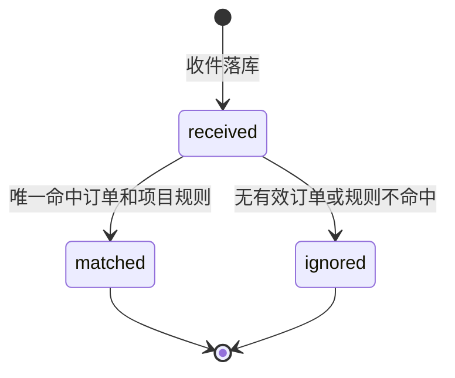
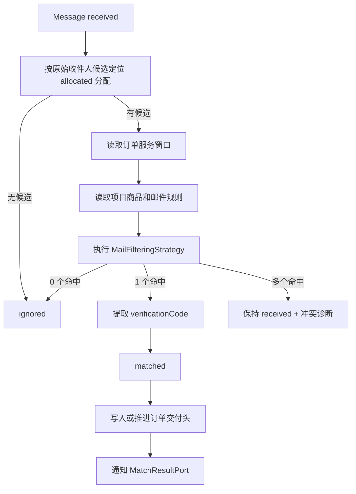

# BC-MAILMATCH 邮件匹配与真实服务上下文

## 修订记录

| 日期 | 版本 | 修订人 | 说明 |
|------|------|--------|------|
| 2026-06-29 | V1.0 | Codex | 形成 Go 版从 0 DDD 设计基线，作为一次 V1.0 变更。 |
| 2026-07-08 | V1.1 | Codex | P1-I8 补充/修正：外部取件统一为 `pickup(email + token)`，控制台和分享链接共用同一入口。 |
| 2026-07-09 | V1.2 | Codex | 补充设计：新增订单交付结果快照，用于接码一次性交付和购买最新验证码展示，不改变 `Message` 原始邮件事实模型。 |
| 2026-07-09 | V1.3 | Codex | 补充实现约束：`Message` 表停止保存 `raw_source/provider_payload`，只保留结构化正文与索引字段；RFC822 原件由 MailTransport/MinIO 私有对象保留。 |
| 2026-07-10 | V1.4 | Codex | 修正 V1.2：完整六元素快照改为轻量 `OrderDeliveryHead`，只保存订单到原始 `Message` 的当前交付指针，消除正文重复存储。 |
| 2026-07-12 | V1.5 | Codex | 补充管理员 Microsoft 资源邮件能力：列表摘要与授权单封正文按需读取分离，资源级手工 Fetch 复用或扩展现有 durable single-flight 事实并继续走 MailTransportFetchPort/ACL；不强制新增任务表或跨域凭据 Port。 |
| 2026-07-12 | V1.6 | Codex | 收敛资源 Fetch 凭据边界：MailMatch 继续拥有 Fetch/Message 事实，但内部凭据 scope、rotated RT、credential revision 和 root version 统一通过 Core `MicrosoftCredentialPort` 处理；repository 不再直读/直写 Core 表。 |
| 2026-07-15 | V1.7 | Codex | 明确宽松模式按 `sender + recipient` 两元素唯一匹配；购买订单匹配到邮件即可写交付头并通知 Trade 激活，验证码提取允许为空。严格模式仍要求 `sender + recipient + subject + body` 四元素全部命中。 |
| 2026-07-16 | V1.8 | Codex | 管理员 Domain/Microsoft 邮件摘要统一要求服务端搜索和 `(receivedAt,id)` 稳定游标；首屏计算后端 `total`，续页跳过重复 `COUNT`，前端按全局页大小无限滚动，禁止全量加载后本地搜索或推算邮件总数。 |

> 核心域。BC-MAILMATCH 保存邮件事实，按项目规则识别订单服务结果。协议收发不在本上下文内。

---

## 1. 定位

| 问题 | 说明 |
|------|------|
| 收到了什么邮件？ | `Message` 保存结构化邮件事实。 |
| 邮件属于哪个订单？ | 先按收件人定位有效分配，再按项目规则过滤。 |
| 能不能给验证码？ | `BODY` 规则命中后写 `verificationCode`。 |
| 如何对外服务？ | 外部只通过 `pickup(email + token)` 读取过滤后的邮件/验证码；控制台先从订单详情拿交付邮箱和服务凭证，再复用同一 pickup 入口。 |

真实服务不是底层邮箱代理。读取必须以 `token -> orderNo -> Order -> Allocation -> MailRule` 为边界，禁止返回底层邮箱全部原始邮件。`email` 仅用于取件凭证校验，不能扩展成第二套按用户/API Key 读取邮件的机制。

管理员 Microsoft 资源详情属于授权诊断，不复用 pickup 的资源钥匙语义。它以 `resourceId` 为作用域调用 MailMatch 的管理员 Query/Command Port，可查看该资源的邮件事实并触发资源级拉取，但不能借此改变订单匹配规则、资源状态或凭据所有权。

---

## 2. 聚合：`Message`

| 字段 | 含义 |
|------|------|
| `id` | 邮件 ID |
| `emailResourceId` | 统一资源 ID |
| `recipient` | 收件人 |
| `recipients` | 原始邮件收件人候选集合，来自 Graph/IMAP/SMTP 头或信封 |
| `sender` | 发件人 |
| `subject` | 主题 |
| `rawBody` | 正文原文 |
| `verificationCode` | 验证码快捷字段 |
| `receivedAt` | 接收时间 |
| `messageIdHeader` | Message-ID |
| `status` | `received/matched/ignored` |
| `matchDiagnostic` | 安全诊断摘要 |

不建正文拆表，不建通用邮件-订单匹配关系表。`Message` 不持久化 `orderNo`，订单作用域实时通过分配和项目规则定位。

### 2.1 `OrderDeliveryHead`

> V1.4 补充/修正设计：这是每个订单的“当前交付头”，不是邮件内容副本，也不是通用邮件-订单匹配历史表。

| 字段 | 含义 |
|------|------|
| `orderId` | 已交付结果所属订单 ID；一单最多一行 |
| `messageId` | 当前交付对应的原始 `Message.id` |
| `messageReceivedAt` | 邮件收件时间；购买订单并发推进时的 CAS 比较事实 |

交付头只在邮件唯一命中后写入；接码订单仍要求提取到验证码，购买订单在宽松模式下允许验证码为空：

| 场景 | 写入规则 |
|------|----------|
| 接码 `serviceMode=code` | 首次唯一命中且提取到验证码后写入一次，后续重复匹配不覆盖。 |
| 购买 `serviceMode=purchase` | 严格模式四元素命中，或宽松模式 `sender + recipient` 命中后写入；按 `messageReceivedAt, messageId` 原子推进到最新邮件，验证码可以为空，旧邮件不能倒退覆盖。 |

六元素响应必须通过 `messageId` 读取原始 `Message`，禁止在交付头重复保存发件人、收件人、主题、正文或验证码。`Message` 仍然是结构化邮件事实，匹配仍然按“原始收件人候选 -> 有效分配 -> 项目规则”执行。为控制表体积，`Message` 表不保存 `raw_source/provider_payload`，`rawBody` 只保存用于匹配与展示的正文；需要协议原件时使用 MailTransport 保存的 MinIO 私有 RFC822 对象。交付头不能作为匹配输入，不能绕过规则直接交付。

### 2.2 资源级 Fetch 管理用例

管理员按 Microsoft 资源手工拉取不能伪造订单。实现必须复用或向后兼容扩展当前按 `emailResourceId` single-flight 的 Fetch state/durable job 事实，使管理任务具有 `resourceId/status/time window/attempts/counts/requestId/safeError/timestamps` 等既有任务可观测性；本设计不强制新增 `ResourceFetchJob` 表、第二套 Message 事实或一组 mock 字段。若现有 order-scoped job 不能表达管理 scope，应通过向前 migration 增加明确 scope 或同等最小扩展，并保持既有订单 Fetch 行为兼容。

同一资源同一时间最多一个 active fetch，由数据库 active key/条件更新等既有 single-flight 事实兜底。重复点击返回现有任务；MySQL 是任务最终事实，Asynq 只负责执行，dispatcher 可以恢复 queued/stale running。HTTP 只校验、落任务和 OperationLog 后返回 `202`，Microsoft/Graph/IMAP 网络调用始终在事务外。任务继续调用现有 `MailTransportFetchPort`/Microsoft ACL；读取协议所需内部 scope、完成前 fencing 和保存 rotated RT 均通过 Core 发布的 tx-bound `MicrosoftCredentialPort`。该 Port 是进程内 Published Language，不是 HTTP/queue DTO；MailMatch repository 不再直接查询或更新 Core 凭据表。

---

## 3. 状态机

多个订单同时命中时保持 `received`，写 SystemLog 和诊断字段，等待修正规则后重跑匹配。

---

## 4. 匹配流程

收件人定位：

| 分配类型 | 规则 |
|----------|------|
| Microsoft 主邮箱 | 分配 `mailbox=main`，用资源主邮箱匹配。 |
| Microsoft 显式别名 | 分配 `email=recipient`。 |
| Microsoft 点别名 | 分配 `email=recipient`。 |
| Microsoft 加号别名 | 分配 `email=recipient`。 |
| 自建邮箱 | 自建分配 `email=recipient`。 |

邮件规则：

| 规则类型 | 解释 |
|----------|------|
| `recipient` | `exact/dot/plus` 等内置策略。 |
| `sender` | 正则匹配发件人。 |
| `subject` | 正则匹配主题。 |
| `body` | 正则匹配正文，捕获组 1 作为验证码；无捕获组用整段匹配。 |

`Product.dotWeight > 0` 时，`recipient=dot` 不应让主邮箱吞掉点别名邮件；点别名必须以已分配 `dot` 命中。plus 同理。

---

## 5. 不变式

| 编号 | 规则 |
|------|------|
| INV-M1 | 同一资源下同一 `messageIdHeader` 不重复落库。 |
| INV-M2 | 入站邮件必须带 `emailResourceId`，不能传空资源。 |
| INV-M3 | 匹配前必须先按原始邮件收件人候选定位有效分配，禁止全项目扫描。 |
| INV-M4 | 匹配只读 `listed` 项目和启用规则。 |
| INV-M5 | 当前策略要求的规则类型缺失时过滤失败。 |
| INV-M6 | 进入 `matched` 必须唯一命中一个有效订单服务。 |
| INV-M7 | 邮件匹配不直接修改订单状态，只通知交易域。 |
| INV-M8 | 真实服务读取必须按订单窗口和项目规则过滤。 |
| INV-M9 | 服务凭证读取只通过 `pickup(email + token)` 进入，BC-OPENAPI 只负责 token 事实校验和反查 `orderNo`。 |
| INV-M10 | pickup 响应统一返回 6 元素：发件人、收件人、收件时间、主题、正文、验证码；不能返回底层邮箱未经过滤的全部邮件。 |
| INV-M11 | 接码订单交付头只在唯一命中并提取验证码后写入；购买订单在宽松模式两元素唯一命中后即可写入，验证码允许为空。交付头不能表达候选关系、冲突关系或匹配历史。 |
| INV-M12 | 接码订单交付头只写一次；购买订单交付头只能按更新的 `messageReceivedAt, messageId` 前进。 |
| INV-M13 | pickup 通过交付头读取原始 Message；接码已有交付头时不得重复触发外部拉取。 |
| INV-M14 | 订单列表只读取交付头摘要，不得因列表加载提交邮件拉取任务。自动收件只针对当前展开且尚未交付的订单。 |
| INV-M15 | 管理员资源邮件列表只返回摘要，不返回 `rawBody` 或对象存储 key；正文只能通过 resourceId + messageId 的单封授权查询按需读取。 |
| INV-M16 | 资源级 Fetch 必须复用或兼容扩展现有 durable resource fetch/single-flight 事实，不能伪造 orderNo、强制新建第二套表或让 HTTP 同步等待 Microsoft 网络。 |
| INV-M17 | 资源级 Fetch 继续通过现有 `MailTransportFetchPort`/Microsoft ACL 使用协议能力；Core secret 只经内部 `MicrosoftCredentialPort` 在 tx-bound context 中读取/回写，MailMatch repository 不直接查询或更新 `email_resources`/`microsoft_resources`，Port 值不进入 HTTP、queue 或日志。 |
| INV-M18 | 资源级拉取的新邮件仍走统一去重、落库和匹配流程，管理员入口不能创建第二套 Message 事实或绕过项目规则写交付结果。 |

---

## 6. 领域服务与 Port

| 服务 | 职责 |
|------|------|
| `MessageService` | 邮件落库、去重、状态更新。 |
| `FilterStrategy` | 按宽松/严格策略执行规则。 |
| `MatchingService` | 定位分配、匹配规则、提取验证码、通知交易。 |
| `ReadService` | 订单作用域读取邮件和验证码。 |
| `FetchService` | 为订单触发协议拉取并落库。 |
| `ResourceFetchService` | 为管理员按资源创建/复用现有 durable single-flight fetch，调用协议 Port 并复用统一落库/匹配。 |
| `HealthService` | 售后自动检测收件能力。 |

| Port | 方向 | 职责 |
|------|------|------|
| `InboundPort` | 入站自 BC-MAILTRANSPORT | 接收 SMTP/IMAP/Graph 结构化邮件并落库。 |
| `MailTransportFetchPort` | 出站到 BC-MAILTRANSPORT | 按订单或资源管理用途拉取结构化邮件。 |
| `AllocationPort` | 出站到 BC-ALLOC | 按收件人/订单查分配。 |
| `MailRulePort` | 出站到 BC-CORE | 查询项目规则。 |
| `OrderAccessPort` | 出站到 BC-TRADE | 校验订单服务窗口和归属。 |
| `MatchResultPort` | 出站到 BC-TRADE | 通知邮件匹配结果。 |
| `ReadPort` | 入站自 BC-OPENAPI | 服务凭证读取订单结果。 |
| `HealthPort` | 入站自 BC-AFTERSALE | 售后检测邮箱是否可收件。 |
| `AdminMessageQueryPort` | 入站自 MailMatch 管理 API/BC-ALLOC | 按 resourceId 分页读取邮件摘要并返回后端 `total`、按 resourceId + messageId 读取单封正文，并批量返回订单 Tab 当前需要的验证码交付摘要；不在资源表冗余 `mailCount`。 |
| `ResourceFetchCommandPort` | 入站自 Core 管理命令入口 | 创建或复用资源级 durable single-flight Fetch 并返回安全任务引用。 |
| `MicrosoftCredentialPort` | 出站到 BC-CORE | 锁定 Fetch 所需内部 credential scope、校验 revision、在任务完成短事务中保存 rotated RT；Core 统一推进 credential revision/root version，秘密不得序列化。 |

---

## 7. REST API 设计

> P1-I8 补充/修正：取件不是用户/API Key 管理的能力，而是资源钥匙能力。任何持有 `email + token` 的调用者都只能读取该 token 绑定订单、该 email 对应交付资源的过滤结果。控制台、分享链接和后续 URL 取件都必须复用以下唯一外部入口。

| 方法 | URI | 说明 |
|------|-----|------|
| `GET` | `/v1/pickup?email={email}&token={token}` | 返回过滤后的邮件 6 元素；读取接口内部可提交异步拉取任务，但不暴露额外开关参数。 |

后台诊断接口属于后续补充设计，不属于 P1-I8 交付范围：

| 方法 | URI | 说明 |
|------|-----|------|
| `GET` | `/v1/admin/messages` | 全局邮件事实筛选。 |
| `GET` | `/v1/admin/messages/{messageId}` | 单封邮件诊断详情。 |
| `POST` | `/v1/admin/messages/{messageId}/rematch` | 重跑匹配。 |
| `GET` | `/v1/admin/messages/conflicts` | 查看冲突邮件。 |

管理员 Microsoft 资源详情使用以下资源作用域接口；摘要和单封详情由 MailMatch 管理 API 暴露，只有手工 Fetch 保留 Core 锚定的资源命令路径，语义均归 MailMatch：

| 方法 | URI | 说明 |
|------|-----|------|
| `GET` | `/v1/admin/messages?resourceId={resourceId}` | 按 `type/resourceId/search/limit` 服务端筛选分页；首屏以 `includeTotal=true` 返回后端 `total`，续页以 `beforeReceivedAt + beforeId` 稳定游标和 `includeTotal=false` 跳过重复 `COUNT`，`offset` 仅为兼容参数。响应只含 `id/mailbox/recipient/sender/subject/preview/status/verificationCode/orderNo/receivedAt` 等授权摘要，不含正文和对象存储 key；Domain 与 Microsoft 管理页都不得全量加载后本地搜索或计数。 |
| `GET` | `/v1/admin/messages/{messageId}?resourceId={resourceId}` | 管理员按需读取单封结构化正文、验证码安全展示和匹配诊断；resourceId 必须参与 message 关联校验，避免横向读取。 |
| `POST` | `/v1/admin/resources/{resourceId}/messages/fetch` | 创建/复用现有资源 single-flight Fetch，返回 `202` 安全任务视图。除 deleted 外，disabled 资源也允许管理员诊断拉取；该命令不执行 enable、不改变 Core 资源状态，凭据或协议条件不满足时返回安全业务错误。 |

列表与正文接口分离是传输和权限边界，不要求把现有 `Message.rawBody` 物理拆表。摘要不携带正文，但可以返回已确认 UI 需要的验证码安全展示；普通日志、任务视图、错误和导出不得携带正文或验证码。具备权限且完成 resource/message 关联校验的单封详情可以返回 UI 已确认的正文和验证码。前端可以在同一已确认的抽屉/表格交互中按展开或查看动作加载正文，视觉与功能不变。列表、详情和订单 Tab 丰富必须批量查询，禁止为每行 allocation/order 执行 N+1 Message 查询。

---

## 8. ADR

| ADR | 决策 | 理由 |
|-----|------|------|
| ADR-MM-1 | 只建 `Message` | 一期足够表达邮件事实和真实服务。 |
| ADR-MM-2 | 先收件人定位，再规则过滤 | 避免全项目扫描和数据泄露。 |
| ADR-MM-3 | 不持久化通用邮件-订单匹配历史 | 订单候选和规则匹配仍实时计算；只保留每单一个已交付结果头，不保存候选、冲突和历史关系。 |
| ADR-MM-4 | 服务凭证读取以 `pickup(email + token)` 为唯一外部入口 | Token 是资源钥匙，持有者不需要登录；MailMatch 内部仍以 token 反查的 `orderNo` 为服务边界。 |
| ADR-MM-5 | 多订单命中不交付 | 避免规则冲突导致错误验证码交付。 |
| ADR-MM-6 | 增加订单交付头 | 接码需要一次性交付结果，购买需要展示最新验证码；只保存 `orderId + messageId + messageReceivedAt`，六元素继续读取唯一的原始 `Message`。 |
| ADR-MM-7 | 管理员邮件列表摘要与正文读取分离 | 保留完整诊断能力，同时降低默认载荷和正文暴露面；不为此重复存储正文。 |
| ADR-MM-8 | 资源级 Fetch 复用/扩展现有 durable single-flight 事实 | 管理运维不能伪造 orderNo，也不应无证据新建第二套表；继续复用 MailTransport 协议和 MailMatch 统一落库/匹配。 |
