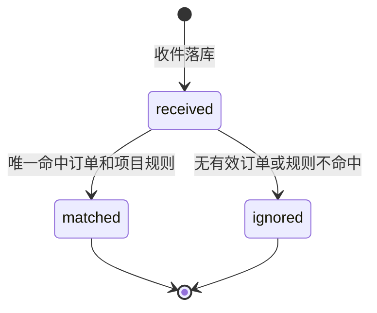
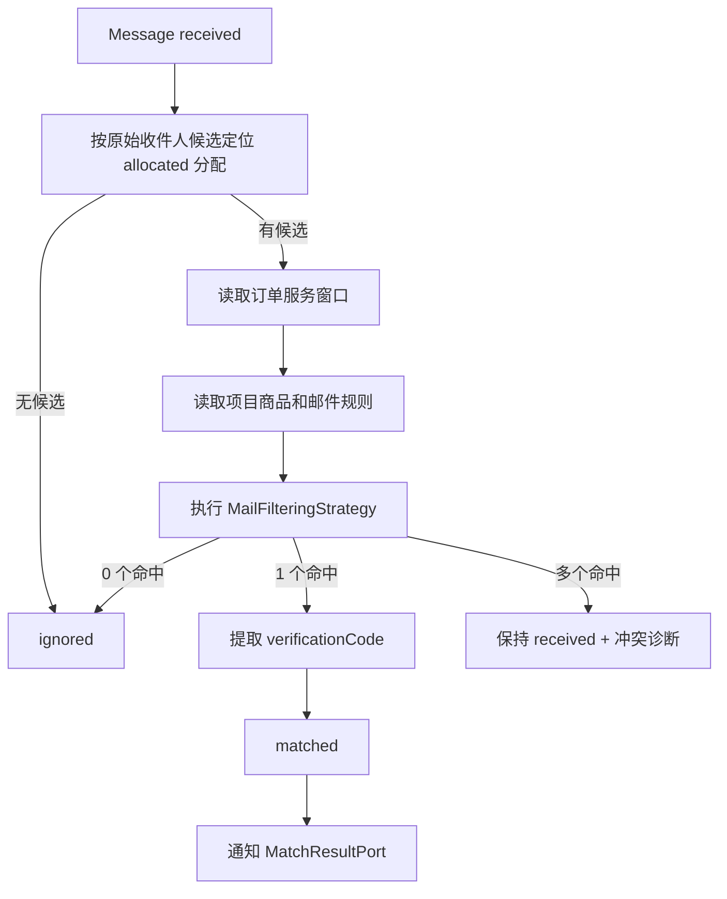

# BC-MAILMATCH 邮件匹配与真实服务上下文

## 修订记录

| 日期 | 版本 | 修订人 | 说明 |
|------|------|--------|------|
| 2026-06-29 | V1.0 | Codex | 形成 Go 版从 0 DDD 设计基线，作为一次 V1.0 变更。 |
| 2026-07-08 | V1.1 | Codex | P1-I8 补充/修正：外部取件统一为 `pickup(email + token)`，控制台和分享链接共用同一入口。 |

> 核心域。BC-MAILMATCH 保存邮件事实，按项目规则识别订单服务结果。协议收发不在本上下文内。

---

## 1. 定位

| 问题 | 说明 |
|------|------|
| 收到了什么邮件？ | `Message` 保存结构化邮件事实。 |
| 邮件属于哪个订单？ | 先按收件人定位有效分配，再按项目规则过滤。 |
| 能不能给验证码？ | `BODY` 规则命中后写 `verificationCode`。 |
| 如何对外服务？ | 外部只通过 `pickup(email + token)` 读取过滤后的邮件/验证码；控制台先从订单详情拿交付邮箱和服务凭证，再复用同一 pickup 入口。 |

真实服务不是底层邮箱代理。读取必须以 `token -> orderNo -> Order -> Allocation -> MailRule` 为边界，禁止返回底层邮箱全部原始邮件。`email` 仅用于取件凭证校验，不能扩展成第二套按用户/API Key 读取邮件的机制。

---

## 2. 聚合：`Message`

| 字段 | 含义 |
|------|------|
| `id` | 邮件 ID |
| `emailResourceId` | 统一资源 ID |
| `recipient` | 收件人 |
| `recipients` | 原始邮件收件人候选集合，来自 Graph/IMAP/SMTP 头或信封 |
| `sender` | 发件人 |
| `subject` | 主题 |
| `rawBody` | 正文原文 |
| `verificationCode` | 验证码快捷字段 |
| `receivedAt` | 接收时间 |
| `messageIdHeader` | Message-ID |
| `status` | `received/matched/ignored` |
| `matchDiagnostic` | 安全诊断摘要 |

不建正文拆表，不建邮件-订单匹配关系表。`Message` 不持久化 `orderNo`，订单作用域实时通过分配和项目规则定位。

---

## 3. 状态机

多个订单同时命中时保持 `received`，写 SystemLog 和诊断字段，等待修正规则后重跑匹配。

---

## 4. 匹配流程

收件人定位：

| 分配类型 | 规则 |
|----------|------|
| Microsoft 主邮箱 | 分配 `mailbox=main`，用资源主邮箱匹配。 |
| Microsoft 显式别名 | 分配 `email=recipient`。 |
| Microsoft 点别名 | 分配 `email=recipient`。 |
| Microsoft 加号别名 | 分配 `email=recipient`。 |
| 自建邮箱 | 自建分配 `email=recipient`。 |

邮件规则：

| 规则类型 | 解释 |
|----------|------|
| `recipient` | `exact/dot/plus` 等内置策略。 |
| `sender` | 正则匹配发件人。 |
| `subject` | 正则匹配主题。 |
| `body` | 正则匹配正文，捕获组 1 作为验证码；无捕获组用整段匹配。 |

`Product.dotWeight > 0` 时，`recipient=dot` 不应让主邮箱吞掉点别名邮件；点别名必须以已分配 `dot` 命中。plus 同理。

---

## 5. 不变式

| 编号 | 规则 |
|------|------|
| INV-M1 | 同一资源下同一 `messageIdHeader` 不重复落库。 |
| INV-M2 | 入站邮件必须带 `emailResourceId`，不能传空资源。 |
| INV-M3 | 匹配前必须先按原始邮件收件人候选定位有效分配，禁止全项目扫描。 |
| INV-M4 | 匹配只读 `listed` 项目和启用规则。 |
| INV-M5 | 当前策略要求的规则类型缺失时过滤失败。 |
| INV-M6 | 进入 `matched` 必须唯一命中一个有效订单服务。 |
| INV-M7 | 邮件匹配不直接修改订单状态，只通知交易域。 |
| INV-M8 | 真实服务读取必须按订单窗口和项目规则过滤。 |
| INV-M9 | 服务凭证读取只通过 `pickup(email + token)` 进入，BC-OPENAPI 只负责 token 事实校验和反查 `orderNo`。 |
| INV-M10 | pickup 响应统一返回 6 元素：发件人、收件人、收件时间、主题、正文、验证码；不能返回底层邮箱未经过滤的全部邮件。 |

---

## 6. 领域服务与 Port

| 服务 | 职责 |
|------|------|
| `MessageService` | 邮件落库、去重、状态更新。 |
| `FilterStrategy` | 按宽松/严格策略执行规则。 |
| `MatchingService` | 定位分配、匹配规则、提取验证码、通知交易。 |
| `ReadService` | 订单作用域读取邮件和验证码。 |
| `FetchService` | 为订单触发协议拉取并落库。 |
| `HealthService` | 售后自动检测收件能力。 |

| Port | 方向 | 职责 |
|------|------|------|
| `InboundPort` | 入站自 BC-MAILTRANSPORT | 接收 SMTP/IMAP/Graph 结构化邮件并落库。 |
| `FetchPort` | 出站到 BC-MAILTRANSPORT | 按订单和用途拉取邮件。 |
| `AllocationPort` | 出站到 BC-ALLOC | 按收件人/订单查分配。 |
| `MailRulePort` | 出站到 BC-CORE | 查询项目规则。 |
| `OrderAccessPort` | 出站到 BC-TRADE | 校验订单服务窗口和归属。 |
| `MatchResultPort` | 出站到 BC-TRADE | 通知邮件匹配结果。 |
| `ReadPort` | 入站自 BC-OPENAPI | 服务凭证读取订单结果。 |
| `HealthPort` | 入站自 BC-AFTERSALE | 售后检测邮箱是否可收件。 |

---

## 7. REST API 设计

> P1-I8 补充/修正：取件不是用户/API Key 管理的能力，而是资源钥匙能力。任何持有 `email + token` 的调用者都只能读取该 token 绑定订单、该 email 对应交付资源的过滤结果。控制台、分享链接和后续 URL 取件都必须复用以下唯一外部入口。

| 方法 | URI | 说明 |
|------|-----|------|
| `GET` | `/v1/pickup?email={email}&token={token}` | 返回过滤后的邮件 6 元素；读取接口内部可提交异步拉取任务，但不暴露额外开关参数。 |

后台诊断接口属于后续补充设计，不属于 P1-I8 交付范围：

| 方法 | URI | 说明 |
|------|-----|------|
| `GET` | `/v1/admin/messages` | 全局邮件事实筛选。 |
| `GET` | `/v1/admin/messages/{messageId}` | 单封邮件诊断详情。 |
| `POST` | `/v1/admin/messages/{messageId}/rematch` | 重跑匹配。 |
| `GET` | `/v1/admin/messages/conflicts` | 查看冲突邮件。 |

---

## 8. ADR

| ADR | 决策 | 理由 |
|-----|------|------|
| ADR-MM-1 | 只建 `Message` | 一期足够表达邮件事实和真实服务。 |
| ADR-MM-2 | 先收件人定位，再规则过滤 | 避免全项目扫描和数据泄露。 |
| ADR-MM-3 | 不持久化邮件-订单关系 | 订单作用域可实时通过分配和规则定位，减少同步点。 |
| ADR-MM-4 | 服务凭证读取以 `pickup(email + token)` 为唯一外部入口 | Token 是资源钥匙，持有者不需要登录；MailMatch 内部仍以 token 反查的 `orderNo` 为服务边界。 |
| ADR-MM-5 | 多订单命中不交付 | 避免规则冲突导致错误验证码交付。 |
