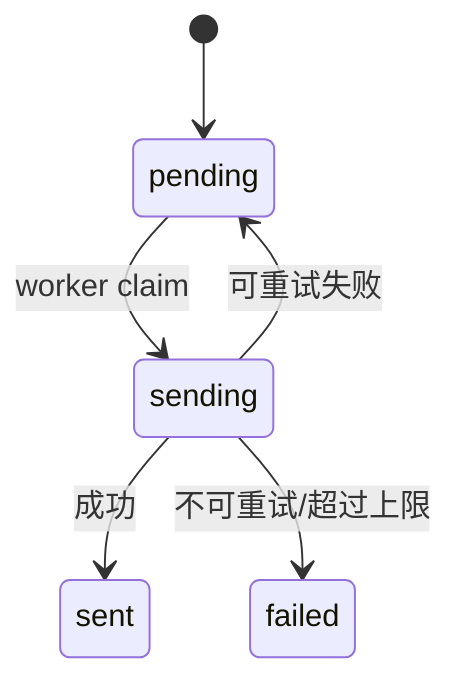
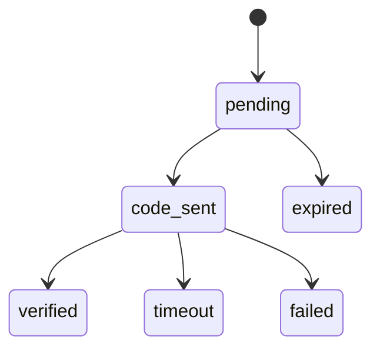
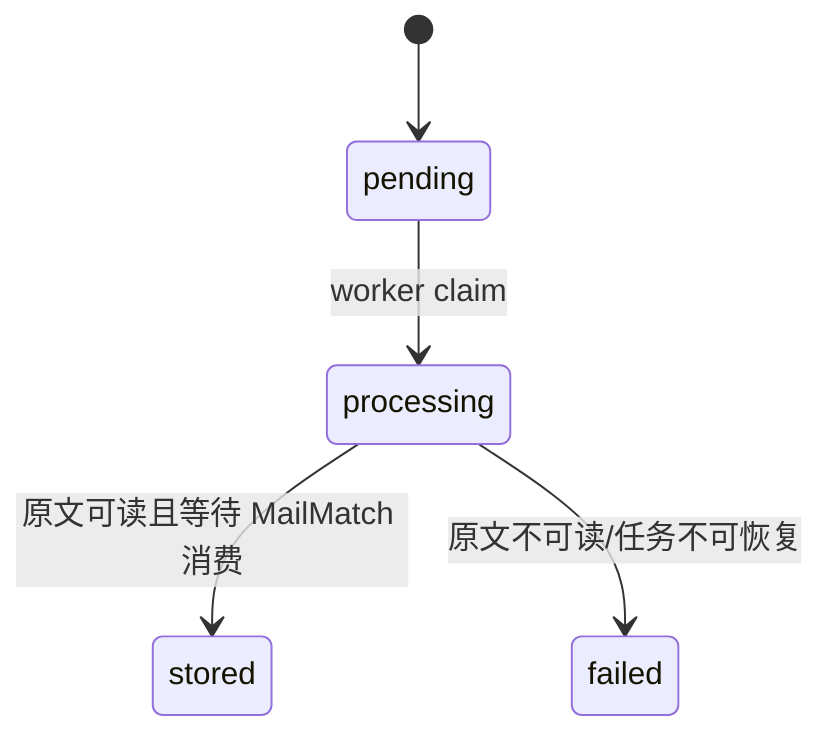

# BC-MAILTRANSPORT 邮件传输上下文

## 修订记录

| 日期 | 版本 | 修订人 | 说明 |
|------|------|--------|------|
| 2026-06-29 | V1.0 | Codex | 形成 Go 版从 0 DDD 设计基线，作为一次 V1.0 变更。 |
| 2026-06-30 | V1.1 | Codex | 补充 SMTP 外发由 BC-MAILTRANSPORT DeliveryPort 承接；IAM 不直接持有 SMTP 协议适配器。 |
| 2026-07-02 | V1.2 | Codex | 补充 P1-I2 辅助邮箱英文统一为 `binding`，中文仍称辅助邮箱；不改变 MailTransport 与 Core 边界。 |
| 2026-07-03 | V1.3 | Codex | 补充默认 SMTP direct 出站和 SMTP 入站的异步任务策略：外发请求只持久化幂等记录并投递 Asynq，worker 解析 MX 直连发信；入站 SMTP 只校验收件资源、落 MinIO 私有原文和入站任务事实，后续处理由 Asynq 承接。此为缺失设计补充，不改变 MailMatch 对邮件归属/项目匹配的拥有权。 |
| 2026-07-04 | V1.4 | Codex | 补充 MailTransport 任务持久化与恢复策略：`OutboundMail/InboundMail` 以 MySQL 为最终事实，Redis/Asynq 仅作执行层；dispatcher 定期恢复 pending/stale 任务，协议失败写 SystemLog。此为缺失设计补充，不改变既有上下文边界。 |
| 2026-07-04 | V1.5 | Codex | 补充外发邮件 DKIM 签名策略：MailTransport infra 在 SMTP DATA 前对最终 RFC822 原文签名，私钥只来自部署 Secret 或本地文件，不进入业务事实和日志。此为缺失设计补充，不改变 IAM/通知业务对 DeliveryPort 的依赖方向。 |
| 2026-07-04 | V1.6 | Codex | 补充 BIMI 品牌 Logo 发布策略：前端 public 固定发布 BIMI 专用 SVG，DNS 仅引用静态 SVG；BIMI 不参与邮件投递和业务判定，只用于支持邮箱客户端品牌展示。此为缺失设计补充，不改变 MailTransport 认证边界。 |
| 2026-07-04 | V1.7 | Codex | 补充 direct SMTP 外发协议策略：默认直连外发使用 Go 标准库 SMTP 会话并强制 IPv4 连接对方 MX，避免运行时默认双栈拨号和第三方客户端实现差异导致投递不稳定。此为缺失设计补充，不改变异步发送、DKIM 或入站策略。 |
| 2026-07-04 | V1.8 | Codex | 补充 P1-I3 资源验证 Port 执行策略：Microsoft/DNS 验证只能由异步 worker 调用，MailTransport 只返回结构化分类和安全文案，不直接拥有资源状态。此为缺失设计补充，不改变 Core 对资源状态的所有权。 |
| 2026-07-04 | V1.9 | Codex | 补充 P1-I3 资源验证临时失败分类：MailTransport 返回 `request` 表示基础设施或上游临时不可用，由 Core 任务重试处理，不直接判定资源异常。此为缺失设计补充，不改变 Core 对资源状态的所有权。 |
| 2026-07-04 | V1.10 | Codex | 补充 P1-I3 Microsoft 辅助邮箱绑定事实落库：导入输入和验证流程使用 `Binding` 状态机，验证码通过本机入站邮件读取。此为缺失设计补充，不改变 Microsoft ACL 交互流程。 |
| 2026-07-04 | V1.11 | Codex | 补充 P1-I3 Microsoft Graph 协议能力返回：验证 Port 在收件成功后返回 Graph 是否可用，Core 仅保存能力事实并用于筛选。此为缺失设计补充，不改变 MailTransport/Core 边界。 |
| 2026-07-04 | V1.12 | Codex | 纠正 P1-I3 入站邮件归属：`InboundMail` 归属到 Core 资源根 `resourceType/resourceId/ownerUserId`，同时支持 Domain 收件和 Microsoft 辅助邮箱收码。此为缺失设计补充，不改变 MailTransport 只保存邮件事实的边界。 |
| 2026-07-04 | V1.13 | Codex | 补充 P1-I3 本机 SMTP 入站可靠性策略：DATA 阶段按配置流式限量读取并记录安全耗时日志；Microsoft 收码读取允许消费已落原文但尚未完成异步 `stored` 标记的入站邮件，并保留晚到宽限窗口。此为缺失设计补充，不改变 MailMatch 边界。 |

> 支撑域。BC-MAILTRANSPORT 封装协议细节，只提供结构化结果，不做项目匹配和订单判断。

---

## 1. 定位

| 拥有 | 不拥有 |
|------|--------|
| SMTP/IMAP/Graph/Microsoft ACL、外发邮件状态、辅助邮箱绑定、SMTP 入站配置 | 项目邮件规则、邮件归属、订单服务状态、资源可分配状态、代理池选择规则 |

`MailServer` 和自建邮箱域名可用性归 BC-CORE；本上下文只使用连接和协议能力。

Microsoft 通讯需要代理时，BC-MAILTRANSPORT 通过 BC-PROXY 的 `ProxyPort` 获取本次代理；资源代理异常时按代理池规则降级到系统代理。MailTransport 不直接维护代理绑定、错误次数和轮转策略。

---

## 2. 实体

### 2.1 `OutboundMail`

| 字段 | 含义 |
|------|------|
| `id` | 外发邮件 ID |
| `idempotencyKey` | 幂等键 |
| `requestHash` | `purpose/sender/recipient/subject/body` 的请求指纹；同 key 不同指纹必须拒绝。 |
| `purpose` | `verification_code/system_notification/security_notice` |
| `recipient/sender` | 收发件人 |
| `subject/body` | 内容 |
| `status` | `pending/sending/sent/failed` |
| `retries` | 重试次数 |
| `failureReason` | 安全失败原因 |
| `sentAt` | 发送时间 |

状态机：

### 2.2 `Binding`

| 字段 | 含义 |
|------|------|
| `id` | 绑定 ID |
| `resourceId` | Microsoft 资源 ID |
| `bindingAddress` | 辅助邮箱地址 |
| `microsoftEmail` | 待验证 Microsoft 邮箱 |
| `status` | `pending/code_sent/verified/timeout/failed/expired` |
| `purpose` | 用途 |
| `codeMsgId` | 验证码邮件 ID |
| `boundDisplay` | Microsoft 页面展示的绑定信息 |
| `category/message` | 内部安全诊断，不作为公开 API 响应码 |
| `selectedAt/expireAt/verifiedAt` | 时间 |

状态机：

`verified/timeout/failed/expired` 是终态。Microsoft 授权流程发起新尝试时可以复用唯一绑定记录并重置为 `pending`，这是新尝试，不是终态回退。

### 2.3 `InboundSetting`

| 字段 | 含义 |
|------|------|
| `receiveEnabled` | 入站开关 |
| `maxSizeBytes` | 单封最大大小 |
| `blackSenders/blackSubjects` | 简单拒收规则 |
| `retentionDays/retentionCount` | 自建邮件保留策略 |
| `timeoutMs` | 连接超时 |

### 2.4 `InboundMail`

| 字段 | 含义 |
|------|------|
| `id` | 入站邮件任务 ID |
| `envelopeFrom` | SMTP MAIL FROM，安全存储信封地址 |
| `recipient` | 单个 SMTP RCPT TO；多收件人拆成多条任务事实，共用同一原文 objectKey |
| `resourceType/resourceId/ownerUserId` | RCPT 阶段解析出的资源根和 owner；`resourceType=domain` 表示自建域名或生成邮箱，`resourceType=microsoft` 表示 Microsoft 辅助邮箱收码 |
| `sourceObjectKey` | MinIO private bucket 中的 RFC822 原文 |
| `status` | `pending/processing/stored/failed` |
| `failureReason` | 安全失败摘要 |

状态机：

补充约束：当前阶段 MailMatch 尚未消费入站任务，因此 `stored` 表示 SMTP 原文已安全入库并完成异步可读校验，不表示完成项目匹配或订单服务。后续 MailMatch 接入时，只能在此任务事实后追加匹配结果，不得让 SMTP DATA 同步等待项目匹配。

---

## 3. ACL 能力

| 能力 | 所属业务语义 |
|------|--------------|
| `acquireToken` | BC-CORE Microsoft 上传验证。 |
| `refreshToken` | BC-CORE 已有 RT 验证和 RT 续期。 |
| `fetch` | BC-MAILMATCH 拉取邮件事实。 |
| SMTP 入站 | 自建域名收件后交给 MailMatch。 |
| SMTP 外发 | IAM 验证码、通知邮件、安全提醒。 |
| IMAP 拉取 | 普通邮箱或自建邮箱拉取。 |
| DNS 检查 | 自建邮箱域名和邮箱服务器诊断。 |

Microsoft Go ACL 策略详见 `14-microsoft-go-acl-strategy.md`。

---

## 4. 邮件拉取与保留

Microsoft 拉取用途必须显式传入：

| 用途 | 时间范围 |
|------|----------|
| `validation_history` | 验证阶段历史邮件识别，全量。 |
| `alias_detect` | 验证阶段别名识别，全量。 |
| `order_fetch` | 默认最近一个月。 |
| `manual_fetch` | 默认最近一个月，管理员可在安全范围内指定。 |
| `aftersale_check` | 默认最近一个月。 |

自建邮件保留策略：

- 最近一个月邮件不删除。
- 总数不超过 100 封不删除。
- 总数超过 100 时，只删除一个月以前的邮件。

---

## 5. 不变式

| 编号 | 规则 |
|------|------|
| INV-MT1 | 协议失败必须写任务诊断或 SystemLog，不能只留容器日志。 |
| INV-MT2 | 普通日志和错误响应不得包含密码、RT、accessToken、验证码、邮件正文。 |
| INV-MT3 | SMTP 入站交给 MailMatch 时必须解析出 `emailResourceId`，解析失败应拒收或写失败诊断，不静默成功。 |
| INV-MT4 | 外发邮件必须幂等，验证码发送不得重复发送不可控。 |
| INV-MT5 | Microsoft ACL 网络配置、代理或页面解析失败时 fail closed，不能静默降级。 |
| INV-MT6 | 辅助邮箱绑定排障接口只读，不推进状态机。 |
| INV-MT7 | Microsoft 资源验证链路的获取 RT、刷新 AT、Graph 拉取和辅助邮箱绑定必须通过 BC-PROXY 请求 IPv4 代理；资源/系统代理都不可用时才按代理池规则直连兜底。 |

---

## 6. Port

| Port | 方向 | 职责 |
|------|------|------|
| `ValidationPort` | 入站自 BC-CORE | 上传验证、已有 RT 校验、RT 续期。 |
| `FetchPort` | 入站自 BC-MAILMATCH | 拉取结构化邮件。 |
| `DeliveryPort` | 入站自 BC-GOVERNANCE/BC-IAM | 外发邮件。 |
| `InboundPort` | 出站到 BC-MAILMATCH | SMTP 入站邮件落库。 |
| `BindingCodeWaitPort` | 出站到 BC-MAILMATCH | Microsoft ACL 等待辅助邮箱验证码。 |
| `ProxyPort` | 出站到 BC-PROXY | 获取 Microsoft 通讯代理并上报代理成功/失败。 |

P1-I3 补充：

| Port | 方向 | 职责 |
|------|------|------|
| `ResourceValidationPort` | 入站自 BC-CORE worker | 验证 Microsoft RT/获取 RT、自建域名 MX；只返回结构化结果，不直接修改资源状态。 |

`ResourceValidationPort` 返回的 `request` 分类只表示协议请求、代理、DNS 或上游临时不可用。该分类由 Core 的 `ResourceValidation` 任务重试处理，不能作为资源账号或域名本体异常的证据；只有密码、账号异常、DNS 配置错误等确定性分类才允许 Core 把资源状态写为 `abnormal`。

P1-I3 Microsoft 验证流程使用同一个 `Binding` 实体承接辅助邮箱事实。Core 导入 TXT 时只把 `bindingAddress` 作为输入交给 MailTransport，MailTransport 写入 `pending` 绑定记录；同一 active `bindingAddress` 只能归属一个 Microsoft 资源，避免 SMTP RCPT 解析歧义。验证 worker 进入 Microsoft 页面流后复用该地址，或在没有输入时按 ACL 规则生成地址。SMTP 入站解析辅助邮箱地址后写入 `InboundMail(resourceType=microsoft)`，`BindingCodeWaitPort` 读取本机 `InboundMail` 的 RFC822 原文并沿用 ACL 的验证码提取规则。该流程不改变 Microsoft 页面交互策略，只替换本系统的输入、收码和状态回写端口。

没有导入指定 `bindingAddress` 时，验证 worker 必须在进入 Microsoft 页面流前先按 ACL 确定性规则生成辅助邮箱并写入 `MicrosoftBindingMailbox(pending)`。这样 SMTP `RCPT TO` 在 Microsoft 发验证码前已经能解析到资源根，避免验证码邮件先到而绑定事实后写造成拒收或收码不可见。验证开始时重复写入同一资源绑定记录是新一轮验证尝试，只允许把 `pending/code_sent/timeout/failed` 这类当前尝试状态重置为 `pending`；已有 `verified` 绑定事实不得在入口阶段清空，只能由后续真实验证结果推进。

P1-I3 Microsoft 资源验证的资源健康判断止于“RT 可用且收件接口可读”。MailTransport 必须先完成 RT 获取或刷新，再优先通过 Graph 分页读取收件箱和垃圾箱；Graph 失败时使用同一 RT 换 IMAP token 回退 Outlook IMAP。Graph 或 IMAP 任一路径读取正常，即 `ResourceValidationPort` 可返回成功。Port 同时返回 `graphAvailable`：Graph 路径成功为 `true`，IMAP 回退成功为 `false`。该字段是协议能力事实，不是资源状态，也不改变后续分配条件。读取到的结构化邮件只作为后续 BC-MAILMATCH/Project 匹配的输入预留；项目匹配和关系插入属于第三步业务增强，不参与 Microsoft 资源本体状态判断。

---

## 7. API 设计

管理端只读/排障接口：

| 方法 | URI | 说明 |
|------|-----|------|
| `GET` | `/v1/admin/bindings` | 按资源、Microsoft 邮箱、辅助邮箱、状态筛选。 |
| `GET` | `/v1/admin/resources/{resourceId}/bindings` | 某资源绑定关系。 |
| `GET` | `/v1/admin/bindings/{id}` | 单条详情。 |

Microsoft ACL 只做 Go 进程内模块。辅助邮箱选择、掩码解析、状态回写和验证码等待都是 Go 进程内 Port/Application Service 调用。

---

## 8. 默认 SMTP 收发策略

### 8.1 外发

系统默认外发模式为 `direct`：

- `DeliveryPort.Send` 只写入 `OutboundMail(pending)` 幂等记录并投递 `mailtransport:outbound_send` Asynq 任务，HTTP/IAM 不同步等待真实 SMTP 网络发送。
- `OutboundMail` 的幂等事实、状态、正文快照和安全失败原因必须落 MySQL；Redis/Asynq 只负责任务执行和重试，不作为最终事实来源。
- `OutboundMail.idempotencyKey` 是唯一键，`requestHash` 是同 key 重放校验；同 key 不同正文/收发件人/用途必须返回幂等冲突，不能静默复用旧任务。
- `mailtransport:outbound_send` payload 只允许携带 `idempotencyKey`，worker 必须从 MySQL 读取正文快照，避免 Redis 任务体重复保存验证码和邮件正文。
- `mailtransport:outbound_dispatch` 定期扫描 `pending` 和 stale `sending` 记录并补投递，避免进程重启或 Redis 短暂失败导致邮件事实永久卡住；因此 `OutboundMail` 事实落库后，单次 Asynq enqueue 失败只能写安全诊断，不能让上游删除验证码或撤销业务事实。
- worker 执行真实发送：按收件人域名解析 MX，使用 `mx.aishop6.com` 作为 HELO，使用 `no-reply@aishop6.com` 作为发件人，直连对方 MX 的 25 端口。
- direct SMTP 外发必须使用 Go 标准库 `net/smtp.Client` 执行 `EHLO -> STARTTLS(如对方支持) -> MAIL FROM -> RCPT TO -> DATA`，网络连接必须显式使用 `tcp4`。不得依赖默认 `tcp` 双栈拨号或第三方 SMTP 客户端内部拨号策略；这属于协议适配层约束，不上浮到 IAM/通知模板。
- 启用 `SMTP_DKIM_ENABLED=true` 时，worker 必须先生成最终 RFC822 原文，再由 MailTransport infra 使用 DKIM 私钥签名后写入 SMTP `DATA`；签名必须发生在协议适配层，IAM、验证码和通知模板不得直接感知 DKIM。
- DKIM 私钥只能通过 `SMTP_DKIM_PRIVATE_KEY_FILE` 或部署 Secret 注入，不得持久化到 `OutboundMail`、SystemLog、普通日志或 Git；配置错误必须启动失败或任务失败，不能静默降级成未签名发送。
- 测试阶段默认 selector 为 `mx`，`SMTP_DKIM_ALGORITHM=ed25519-sha256` 时 DNS 必须发布 `mx._domainkey.aishop6.com TXT "v=DKIM1; k=ed25519; p=<raw-public-key-base64>"`。
- `SMTP_MODE=relay` 仅作为显式配置的外部中继模式；默认测试环境不得再依赖 mailbux。
- worker 可重试失败写回 `pending` 和安全诊断，耗尽重试后写 `failed` 并写 SystemLog；普通日志和 SystemLog 不得打印邮件正文、验证码、SMTP 密码或完整收件人地址。
- MailTransport 使用独立 Asynq 队列 `mailtransport`，权重低于默认业务队列；SMTP 直连、入站原文校验等外部网络任务不能挤压资源导入、代理检测等后台任务。

### 8.2 入站

系统默认入站监听部署为宿主机 `25 -> server:2525`：

- SMTP `RCPT TO` 阶段必须解析到可接收的 Domain 资源或生成邮箱；解析失败返回 SMTP 550。
- SMTP `DATA` 阶段只做原文读取、MinIO private bucket 保存、`InboundMail(pending)` 创建和 Asynq 投递；不得同步执行 MailMatch 项目匹配。原文和 `InboundMail` 事实落库后，单条 enqueue 失败只能写 SystemLog 并依赖 dispatcher 恢复，不能向对端返回临时失败诱发重复投递。
- SMTP `DATA` 读取必须受 `SMTP_INBOUND_MAX_MESSAGE_BYTES` 限制，超过限制返回 552，不进入 MinIO、MySQL 或异步任务。接收端应把 DATA 限量流式转入临时文件或等价流式缓冲，再由私有文件端口写入 MinIO，避免整封邮件常驻内存。接收成功和慢接收日志只允许记录远端地址、收件人数、字节数和耗时，不记录邮件正文、验证码或完整收件人地址。
- 多个收件人拆成多条 `InboundMail` 任务事实，共用同一个 RFC822 原文 objectKey。
- Asynq worker 先校验原文对象可读，再把任务置为 `stored`，供后续 MailMatch 消费。
- `mailtransport:inbound_dispatch` 定期扫描 `pending` 和 stale `processing` 记录并补投递，读取原文失败按 Asynq 尝试次数恢复为 `pending` 或最终 `failed`，失败路径必须写 SystemLog。
- Microsoft 辅助邮箱收码属于验证流程内的快速消费场景，`BindingCodeWaitPort` 可以读取 `pending/processing/stored` 入站事实对应的 private RFC822 原文；`stored` 只表示 MailMatch 后续消费前的异步可读确认，不应成为验证码读取的前置条件。收码轮询默认短间隔，并在超时边界保留小的晚到宽限窗口，以吸收 SMTP 入站与 Microsoft 页面流之间的秒级抖动。

### 8.3 DNS

开发/测试默认 DNS：

| 类型 | 名称 | 值 | 代理 |
|------|------|-----|------|
| A | `mx` | 测试服务器公网 IPv4 | DNS only |
| AAAA | `mx` | 测试服务器公网 IPv6 | DNS only |
| MX | `@` | `mx.aishop6.com`，优先级 `10` | 不适用 |
| TXT | `@` | `v=spf1 mx ip4:<测试服务器公网 IPv4> ip6:<测试服务器公网 IPv6> -all` | 不适用 |
| TXT | `mx._domainkey` | `v=DKIM1; k=ed25519; p=<raw-public-key-base64>` | 不适用 |
| TXT | `_dmarc` | `v=DMARC1; p=none; rua=mailto:no-reply@aishop6.com` | 不适用 |
| TXT | `default._bimi` | `v=BIMI1; l=https://remail.aishop6.com/.well-known/bimi/logo.svg; a=` | 不适用 |

BIMI 只引用 `/.well-known/bimi/logo.svg` 的静态 SVG Tiny-PS 文件，不能引用邮件模板内联图片、PNG、base64 或 SPA fallback 页面。测试阶段可先发布记录验证文件可访问，但邮箱客户端稳定展示通常要求 SPF/DKIM/DMARC 全部通过，并把 DMARC 从 `p=none` 升级到 `p=quarantine` 或 `p=reject` 后再观察。部分邮箱客户端还会叠加 VMC/CMC、品牌资料或联系人头像策略，因此 BIMI 记录正确不等于所有客户端都会立即展示 Logo。

---

## 9. ADR

| ADR | 决策 | 理由 |
|-----|------|------|
| ADR-MT-1 | 协议全封装为 ACL | 核心域不直接依赖 Graph/IMAP/SMTP/Microsoft 页面流。 |
| ADR-MT-2 | Microsoft 复杂流程由 Go ACL 承接 | 新项目只有一个 Go 后端运行时，避免双部署。 |
| ADR-MT-3 | 邮箱服务器归 Core | 服务器在线状态影响资源可分配性。 |
| ADR-MT-4 | 辅助邮箱绑定只读排障 | 管理员需要查状态，但不能通过排障接口改状态。 |
| ADR-MT-5 | 默认 SMTP 直连出站 + 入站原文异步落库 | 邮件端口由本系统控制，避免外部中继不可用；SMTP 会话只做快速可证明的接收，耗时和可重试处理进入 Asynq。 |
