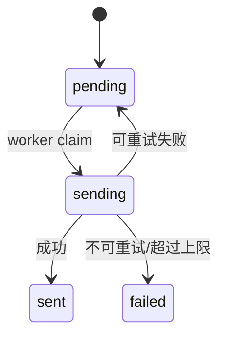
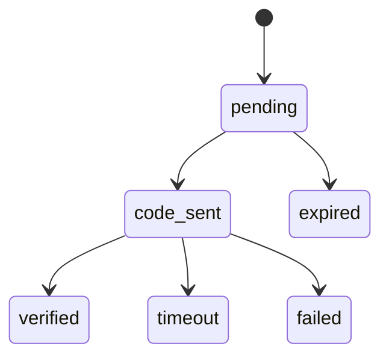

# BC-MAILTRANSPORT 邮件传输上下文

## 修订记录

| 日期 | 版本 | 修订人 | 说明 |
|------|------|--------|------|
| 2026-06-29 | V1.0 | Codex | 形成 Go 版从 0 DDD 设计基线，作为一次 V1.0 变更。 |

> 支撑域。BC-MAILTRANSPORT 封装协议细节，只提供结构化结果，不做项目匹配和订单判断。

---

## 1. 定位

| 拥有 | 不拥有 |
|------|--------|
| SMTP/IMAP/Graph/Microsoft ACL、外发邮件状态、辅助邮箱绑定、SMTP 入站配置 | 项目邮件规则、邮件归属、订单服务状态、资源可分配状态、代理池选择规则 |

`MailServer` 和自建邮箱域名可用性归 BC-CORE；本上下文只使用连接和协议能力。

Microsoft 通讯需要代理时，BC-MAILTRANSPORT 通过 BC-PROXY 的 `ProxyPort` 获取本次代理；资源代理异常时按代理池规则降级到系统代理。MailTransport 不直接维护代理绑定、错误次数和轮转策略。

---

## 2. 实体

### 2.1 `OutboundMail`

| 字段 | 含义 |
|------|------|
| `id` | 外发邮件 ID |
| `idempotencyKey` | 幂等键 |
| `purpose` | `verification_code/system_notification/security_notice` |
| `recipient/sender` | 收发件人 |
| `subject/body` | 内容 |
| `status` | `pending/sending/sent/failed` |
| `retries` | 重试次数 |
| `failureReason` | 安全失败原因 |
| `sentAt` | 发送时间 |

状态机：

### 2.2 `AuxBinding`

| 字段 | 含义 |
|------|------|
| `id` | 绑定 ID |
| `resourceId` | Microsoft 资源 ID |
| `auxiliaryAddress` | 辅助邮箱地址 |
| `microsoftEmail` | 待验证 Microsoft 邮箱 |
| `status` | `pending/code_sent/verified/timeout/failed/expired` |
| `purpose` | 用途 |
| `codeMsgId` | 验证码邮件 ID |
| `boundDisplay` | Microsoft 页面展示的绑定信息 |
| `category/message` | 内部安全诊断，不作为公开 API 响应码 |
| `selectedAt/expireAt/verifiedAt` | 时间 |

状态机：

`verified/timeout/failed/expired` 是终态。Microsoft 授权流程发起新尝试时可以复用唯一绑定记录并重置为 `pending`，这是新尝试，不是终态回退。

### 2.3 `InboundSetting`

| 字段 | 含义 |
|------|------|
| `receiveEnabled` | 入站开关 |
| `maxSizeBytes` | 单封最大大小 |
| `blackSenders/blackSubjects` | 简单拒收规则 |
| `retentionDays/retentionCount` | 自建邮件保留策略 |
| `timeoutMs` | 连接超时 |

---

## 3. ACL 能力

| 能力 | 所属业务语义 |
|------|--------------|
| `acquireToken` | BC-CORE Microsoft 上传验证。 |
| `refreshToken` | BC-CORE 已有 RT 验证和 RT 续期。 |
| `fetch` | BC-MAILMATCH 拉取邮件事实。 |
| SMTP 入站 | 自建域名收件后交给 MailMatch。 |
| SMTP 外发 | IAM 验证码、通知邮件、安全提醒。 |
| IMAP 拉取 | 普通邮箱或自建邮箱拉取。 |
| DNS 检查 | 自建邮箱域名和邮箱服务器诊断。 |

Microsoft Go ACL 策略详见 `14-microsoft-go-acl-strategy.md`。

---

## 4. 邮件拉取与保留

Microsoft 拉取用途必须显式传入：

| 用途 | 时间范围 |
|------|----------|
| `validation_history` | 验证阶段历史邮件识别，全量。 |
| `alias_detect` | 验证阶段别名识别，全量。 |
| `order_fetch` | 默认最近一个月。 |
| `manual_fetch` | 默认最近一个月，管理员可在安全范围内指定。 |
| `aftersale_check` | 默认最近一个月。 |

自建邮件保留策略：

- 最近一个月邮件不删除。
- 总数不超过 100 封不删除。
- 总数超过 100 时，只删除一个月以前的邮件。

---

## 5. 不变式

| 编号 | 规则 |
|------|------|
| INV-MT1 | 协议失败必须写任务诊断或 SystemLog，不能只留容器日志。 |
| INV-MT2 | 普通日志和错误响应不得包含密码、RT、accessToken、验证码、邮件正文。 |
| INV-MT3 | SMTP 入站交给 MailMatch 时必须解析出 `emailResourceId`，解析失败应拒收或写失败诊断，不静默成功。 |
| INV-MT4 | 外发邮件必须幂等，验证码发送不得重复发送不可控。 |
| INV-MT5 | Microsoft ACL 网络配置、代理或页面解析失败时 fail closed，不能静默降级。 |
| INV-MT6 | 辅助邮箱绑定排障接口只读，不推进状态机。 |
| INV-MT7 | Microsoft 代理选择必须通过 BC-PROXY；辅助邮箱绑定强制请求 IPv4 代理。 |

---

## 6. Port

| Port | 方向 | 职责 |
|------|------|------|
| `ValidationPort` | 入站自 BC-CORE | 上传验证、已有 RT 校验、RT 续期。 |
| `FetchPort` | 入站自 BC-MAILMATCH | 拉取结构化邮件。 |
| `DeliveryPort` | 入站自 BC-GOVERNANCE/BC-IAM | 外发邮件。 |
| `InboundPort` | 出站到 BC-MAILMATCH | SMTP 入站邮件落库。 |
| `AuxCodeWaitPort` | 出站到 BC-MAILMATCH | Microsoft ACL 等待辅助邮箱验证码。 |
| `ProxyPort` | 出站到 BC-PROXY | 获取 Microsoft 通讯代理并上报代理成功/失败。 |

---

## 7. API 设计

管理端只读/排障接口：

| 方法 | URI | 说明 |
|------|-----|------|
| `GET` | `/v1/admin/bindings` | 按资源、Microsoft 邮箱、辅助邮箱、状态筛选。 |
| `GET` | `/v1/admin/resources/{resourceId}/bindings` | 某资源绑定关系。 |
| `GET` | `/v1/admin/bindings/{id}` | 单条详情。 |

Microsoft ACL 只做 Go 进程内模块。辅助邮箱选择、掩码解析、状态回写和验证码等待都是 Go 进程内 Port/Application Service 调用。

---

## 8. ADR

| ADR | 决策 | 理由 |
|-----|------|------|
| ADR-MT-1 | 协议全封装为 ACL | 核心域不直接依赖 Graph/IMAP/SMTP/Microsoft 页面流。 |
| ADR-MT-2 | Microsoft 复杂流程由 Go ACL 承接 | 新项目只有一个 Go 后端运行时，避免双部署。 |
| ADR-MT-3 | 邮箱服务器归 Core | 服务器在线状态影响资源可分配性。 |
| ADR-MT-4 | 辅助邮箱绑定只读排障 | 管理员需要查状态，但不能通过排障接口改状态。 |
