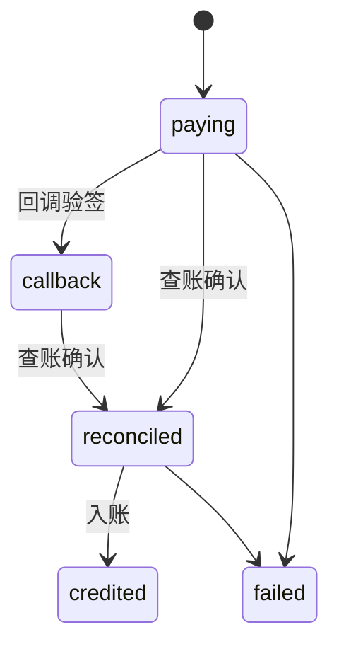
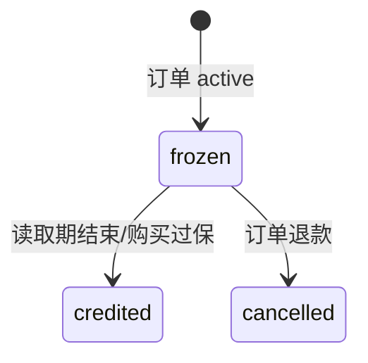
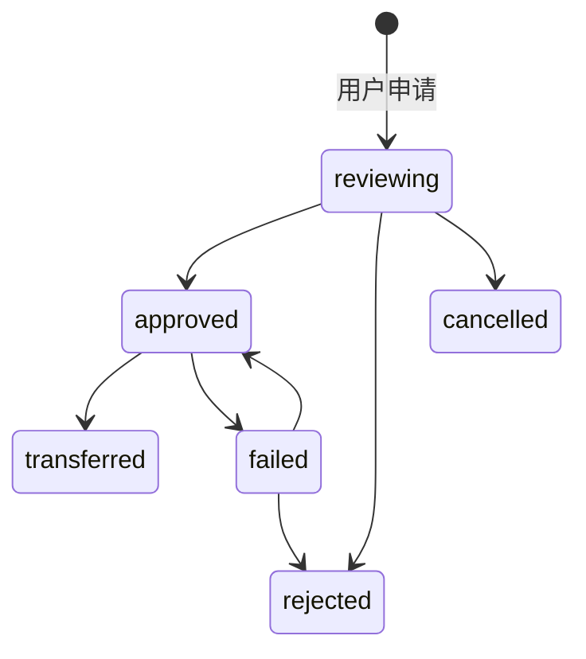

# BC-BILLING 计费与钱包上下文

## 修订记录

| 日期 | 版本 | 修订人 | 说明 |
|------|------|--------|------|
| 2026-06-29 | V1.0 | Codex | 形成 Go 版从 0 DDD 设计基线，作为一次 V1.0 变更。 |
| 2026-07-07 | V1.1 | Codex | 补充用户邀请返佣结算规则；作为充值入账后的 Billing 事实，不改变钱包额度桶策略。 |
| 2026-07-09 | V1.2 | Codex | 补充银行流水式 signed delta 模型：流水金额允许正数、负数和零，余额变动由流水金额直接表达。 |
| 2026-07-10 | V1.3 | Codex | 钱包、流水、累计消费和返佣事实统一为六位小数账本精度，兼容分以下商品价格。 |

> 支撑域。BC-BILLING 只保证资金事实正确，不理解订单为什么扣款、退款或结算。

---

## 1. 定位

| 拥有 | 不拥有 |
|------|--------|
| 钱包额度、不可变流水、充值、卡密、供应商结算、提现、账务幂等 | 订单状态、邮箱是否可用、供应商资格审批、售后原因 |

核心模式：多额度桶 + 单一不可变台账。

---

## 2. 聚合与实体

### 2.1 `Wallet`

| 额度桶 | 用途 |
|--------|------|
| `consumer` | 消费额度，只能下单，不能提现。 |
| `supplierAvailable` | 供应商可用额度，可提现或转入消费额度。 |
| `supplierFrozen` | 供应商冻结额度，争议期收入和提现审核占用。 |

### 2.2 `Transaction`

不可变流水，记录所有成功发生的额度变化。

| 字段 | 含义 |
|------|------|
| `transactionNo` | 流水号 |
| `userId` | 用户 |
| `transactionType` | 充值、扣款、退款、冻结、入账、提现、人工调整等 |
| `balanceBucket` | 额度桶 |
| `direction` | `in/out` |
| `amount` | 余额变动值；入账为正数，出账为负数，零金额业务事实为 `0.00` |
| `balanceBefore/balanceAfter` | 变动前后 |
| `bizType/bizId` | 业务来源 |
| `createdAt` | 时间 |

失败尝试不写流水。

### 2.3 其他实体

| 实体 | 状态 |
|------|------|
| `Recharge` | `paying/callback/reconciled/credited/failed` |
| `CardKey` | `enabled/disabled`，带次数和过期时间 |
| `CardKeyRedemption` | 卡密兑换事实 |
| `ReferralReward` | 被邀请人首次充值触发的一次性返佣事实 |
| `Settlement` | `frozen/credited/cancelled` |
| `Withdrawal` | `reviewing/approved/transferred/rejected/cancelled/failed` |
| `PaymentChannel` | 支付渠道配置 |
| `IdempotencyKey` | 资金操作幂等事实 |

---

## 3. 状态机

### 3.1 充值订单

回调不等于入账，必须查账确认后入 `consumer`。

### 3.2 供应商结算

### 3.3 提现

提现申请时从供应商可用转冻结；拒绝/取消退回；确认转账扣减冻结。

---

## 4. 不变式

| 编号 | 规则 |
|------|------|
| INV-B1 | 任何额度变动必须同事务锁钱包、写流水、更新余额。 |
| INV-B2 | 消费额度不能提现。 |
| INV-B3 | 供应商可用额度可提现或转消费，消费额度不可转回供应商额度。 |
| INV-B4 | 供应商收入在争议窗口内只能进冻结额度。 |
| INV-B5 | 退款发生在结算入账前必须取消冻结结算。 |
| INV-B6 | 流水不可修改、不可物理删除。 |
| INV-B7 | 流水金额采用银行流水式 signed delta：`direction=in` 时 `amount >= 0`，`direction=out` 时 `amount <= 0`，`balanceAfter = balanceBefore + amount`；余额桶不得为负。0 元业务事实必须写流水，例如私有库存订单的 0 元消费和对应 0 元退款。 |
| INV-B8 | 状态更新必须带 expected status，冲突返回 `409 Conflict`。 |
| INV-B9 | 资金写动作必须幂等，同幂等键不同指纹返回 `409 Conflict`。 |
| INV-B10 | 卡密和 API Key 这类需重复展示凭据按原值保存，普通日志禁敏。 |
| INV-B11 | 邀请返佣只在被邀请人首次充值成功时结算一次，奖励金额为本次充值金额的 80%，必须同事务写返佣事实；划转到消费余额时再同事务锁钱包、写流水、更新奖励状态。 |
| INV-B12 | 内部账本金额统一使用六位小数精度；领域/API 字符串至少保留两位、至多六位，展示层不得反向决定账本舍入精度。充值额度和卡密面额属于站内额度并使用六位小数，只有支付渠道实际收款金额可限制为两位小数。 |

邀请返佣补充设计：

| 规则 | 说明 |
|------|------|
| 触发点 | 当前阶段卡密兑换成功视为一次充值成功；后续在线充值查账入账成功后复用同一结算入口。 |
| 奖励对象 | 只奖励 `referral` 类型邀请码的创建人，后台 `admin` 邀请码不触发返佣。 |
| 入账桶 | 返佣结算先进入可划转返佣额度，不属于钱包第四个额度桶；用户划转后进入 `consumer` 消费额度，流水使用 `transactionType=credit`、`bizType=referral_transfer`。 |
| 一次性 | `referral_rewards.invitee_user_id` 唯一约束保证一个被邀请人只奖励一次。 |
| 并发 | 充值时先插入唯一返佣事实；划转时后端批量锁定当前用户 `available` 返佣行并创建一条合并入账流水，前端不得循环处理。 |
| 前端统计 | `/v1/wallet/referrals` 返回邀请人数、待划转奖励和历史收益。 |

调用边界补充：应用层的 `DebitConsumer(amount=10.00)` 表达“扣 10 元”，不要求调用方传负数；BC-BILLING 仓储写入流水时根据 `direction=out` 保存为 `amount=-10.00`。`RefundConsumer(amount=10.00)` 写入 `+10.00`。这样业务命令保持非负金额，数据库流水保持 signed delta 事实。

---

## 5. Port

| Port | 方向 | 职责 |
|------|------|------|
| `WalletPort` | 入站自 BC-TRADE | 从消费额度扣款、退款回消费额度。 |
| `SettlementPort` | 入站自 BC-TRADE | 冻结、取消、入账供应商收入。 |
| `WithdrawalTransferPort` | 出站到支付/人工转账适配 | 如接入自动转账通道时使用。 |

---

## 6. API 设计

统一业务 API：

| 方法 | URI | 说明 |
|------|-----|------|
| `GET` | `/v1/wallet` | 当前主体钱包。 |
| `GET` | `/v1/wallet/referrals` | 当前主体邀请返佣统计。 |
| `POST` | `/v1/wallet/referrals/transfer` | 将当前主体可划转返佣批量划转到消费余额，必须带幂等键。 |
| `GET` | `/v1/wallet/transactions` | 钱包流水；支持 `scope=mine/all`。 |
| `POST` | `/v1/recharges` | 创建充值单。 |
| `GET` | `/v1/recharges` | 充值单列表；支持 `scope=mine/all`。 |
| `POST` | `/v1/cards/redeem` | 兑换卡密。 |
| `POST` | `/v1/withdrawals` | 申请提现。 |
| `GET` | `/v1/withdrawals` | 提现列表；支持 `scope=mine/all`。 |
| `POST` | `/v1/withdrawals/{withdrawalNo}/cancel` | 用户取消待审核提现。 |
| `POST` | `/v1/wallet/transfers` | 供应商可用额度转消费。 |
| `GET` | `/v1/settlements` | 供应商结算列表；支持 `scope=mine/all`。 |

后台 API：

| 方法 | URI | 说明 |
|------|-----|------|
| `POST` | `/v1/admin/wallets/{userId}/credit` | 人工加款，必须有业务原因。 |
| `POST` | `/v1/admin/wallets/{userId}/debit` | 人工扣款，必须有业务原因。 |
| `POST` | `/v1/admin/withdrawals/{withdrawalNo}/approve` | 审核通过。 |
| `POST` | `/v1/admin/withdrawals/{withdrawalNo}/reject` | 审核拒绝，必须有业务原因。 |
| `POST` | `/v1/admin/withdrawals/{withdrawalNo}/transfer/confirm` | 确认已转账。 |
| `POST` | `/v1/admin/withdrawals/{withdrawalNo}/transfer/fail` | 标记转账失败。 |
| `POST` | `/v1/admin/recharges/{rechargeNo}/reconcile` | 查账入账。 |
| `POST` | `/v1/admin/recharges/{rechargeNo}/fail` | 标记失败。 |
| `GET` | `/v1/admin/cards` | 卡密查询。 |
| `POST` | `/v1/admin/cards` | 创建/批量创建卡密。 |
| `PATCH` | `/v1/admin/cards/{cardKey}` | 启停卡密。 |
| `GET` | `/v1/admin/payments/channels` | 支付渠道配置。 |
| `PUT` | `/v1/admin/payments/channels/{channelCode}` | 保存配置。 |

支付回调：

| 方法 | URI | 说明 |
|------|-----|------|
| `POST` | `/v1/payments/webhooks/epay/v1` | 易支付 V1 回调，只记录不入账。 |
| `POST` | `/v1/payments/webhooks/epay/v2` | 易支付 V2 回调，只记录不入账。 |

---

## 7. ADR

| ADR | 决策 | 理由 |
|-----|------|------|
| ADR-BILL-1 | 多额度桶 + 单一台账 | 防充值套利提现，同时保持流水统一。 |
| ADR-BILL-2 | 不建通用冻结表 | 冻结原因由结算单和提现单表达。 |
| ADR-BILL-3 | 回调不入账 | 必须查账确认金额后入账。 |
| ADR-BILL-4 | Billing 不提供任意改结算状态 | 结算业务条件由 Trade 判断。 |
