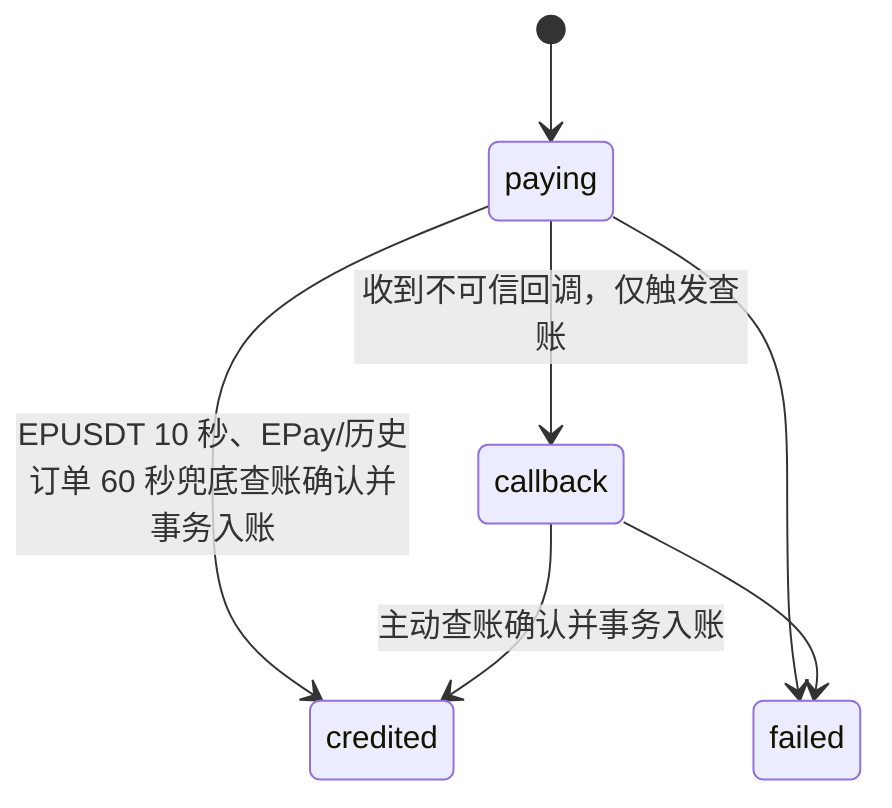
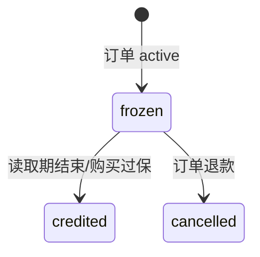

# BC-BILLING 计费与钱包上下文

## 修订记录

| 日期 | 版本 | 修订人 | 说明 |
|------|------|--------|------|
| 2026-06-29 | V1.0 | Codex | 形成 Go 版从 0 DDD 设计基线，作为一次 V1.0 变更。 |
| 2026-07-07 | V1.1 | Codex | 补充用户邀请返佣结算规则；作为充值入账后的 Billing 事实，不改变钱包额度桶策略。 |
| 2026-07-09 | V1.2 | Codex | 补充银行流水式 signed delta 模型：流水金额允许正数、负数和零，余额变动由流水金额直接表达。 |
| 2026-07-10 | V1.3 | Codex | 钱包、流水、累计消费和返佣事实统一为六位小数账本精度，兼容分以下商品价格。 |
| 2026-07-17 | V1.4 | Codex | 补充管理员用户管理所需后台钱包接口：`GET /v1/admin/wallets/balances` 批量余额、`GET /v1/admin/wallets/{userId}` 与 `/transactions` 只读，以及 `POST /v1/admin/wallets/adjust` 按 `selection`(ids/filter) 批量调账；批量调账经 IAM `UserSelectionResolver` 跨 BC 解析用户、恒排除 `super_admin`、要求 `Idempotency-Key`，复用既有 signed-delta 与六位小数账本，不改变钱包额度桶策略。 |
| 2026-07-25 | V1.5 | Codex | 邀请返佣改由系统设置控制首次充值比例、单笔/累计上限和有效期。 |
| 2026-07-25 | V1.6 | Codex | 在线充值支持易支付 V1 MD5 与 V2 RSA；回调只触发主动查账，前 10 次每 5 秒、随后每 30 秒，无回调时 60 秒兜底启动，且只允许 5 分钟内查账确认后入账。 |
| 2026-07-26 | V1.7 | Codex | 当前供应商提现与转入用户钱包统一改走 AFTERSALE general 工单，由管理员人工核对并操作钱包；不提供用户侧提现/划转写接口，不新增提现审批状态机。 |
| 2026-07-27 | V1.8 | Codex | 支付宝提现继续由固定格式 general 工单人工处理并强制附收款码；供应商可用余额转消费余额改为用户侧幂等接口，在同一钱包事务内完成双桶划转与双流水。 |
| 2026-08-25 | V1.9 | Codex | 接入 EPUSDT USDT/TRON；创建响应只取支付链接，回调只唤醒主动查账，只有签名查账完整匹配后才允许钱包入账。 |
| 2026-08-25 | V2.0 | Codex | EPUSDT 使用独立 `epusdt_points_per_usdt` 汇率，收款不叠加 EPay/支付宝手续费；新单按 USDT 金额查账，历史缺少币种字段的快照继续按 CNY 查账。 |

> 支撑域。BC-BILLING 只保证资金事实正确，不理解订单为什么扣款、退款或结算。

---

## 1. 定位

| 拥有 | 不拥有 |
|------|--------|
| 钱包额度、不可变流水、充值、卡密、供应商结算、提现、账务幂等 | 订单状态、邮箱是否可用、供应商资格审批、售后原因 |

核心模式：多额度桶 + 单一不可变台账。

---

## 2. 聚合与实体

### 2.1 `Wallet`

| 额度桶 | 用途 |
|--------|------|
| `consumer` | 消费额度，只能下单，不能提现。 |
| `supplierAvailable` | 供应商可用额度，可提现或转入消费额度。 |
| `supplierFrozen` | 供应商冻结额度，争议期收入和提现审核占用。 |

### 2.2 `Transaction`

不可变流水，记录所有成功发生的额度变化。

| 字段 | 含义 |
|------|------|
| `transactionNo` | 流水号 |
| `userId` | 用户 |
| `transactionType` | 充值、扣款、退款、冻结、入账、提现、人工调整等 |
| `balanceBucket` | 额度桶 |
| `direction` | `in/out` |
| `amount` | 余额变动值；入账为正数，出账为负数，零金额业务事实为 `0.00` |
| `balanceBefore/balanceAfter` | 变动前后 |
| `bizType/bizId` | 业务来源 |
| `createdAt` | 时间 |

失败尝试不写流水。

### 2.3 其他实体

| 实体 | 状态 |
|------|------|
| `Recharge` | `paying/callback/reconciled/credited/failed` |
| `CardKey` | `enabled/disabled`，带次数和过期时间 |
| `CardKeyRedemption` | 卡密兑换事实 |
| `ReferralReward` | 被邀请人首次充值触发的一次性返佣事实 |
| `Settlement` | `frozen/credited/cancelled` |
| `Withdrawal` | 当前版本不建立独立聚合；支付宝提现申请由 AFTERSALE general 工单承载。 |
| `PaymentChannel` | 支付渠道配置 |
| `IdempotencyKey` | 资金操作幂等事实 |

---

## 3. 状态机

### 3.1 充值订单

```mermaid
stateDiagram-v2
    [*] --> paying
    paying --> callback: 收到不可信回调，仅触发查账
    paying --> credited: EPUSDT 10 秒、EPay/历史订单 60 秒兜底查账确认并事务入账
    callback --> credited: 主动查账确认并事务入账
    paying --> failed
    callback --> failed
```

回调不等于入账，只把仍在 5 分钟窗口内的 `paying` 充值单原子标记为 `callback`，并立即投递 realtime 高优先级主动查账；如果已有查账租约，则与在途查账合并，不并发重复请求。创建支付订单的响应是不可信的，创建流程只提取并校验支付链接，不依据其中的状态、金额或交易号判断收款。回调请求同样是不可信的，只读取订单号作为查账唤醒信号，回调携带的金额、状态、交易号和签名均不参与资金判断。收到回调的订单立即查账；未收到回调时，EPUSDT 订单创建满 10 秒、EPay 或历史订单创建满 60 秒启动兜底查账。首次查询后前 10 次查询之间间隔 5 秒，第 10 次后间隔 30 秒。只有主动异步查账通过供应商响应签名校验，且商户、订单号、金额、币种、支付 Token 和网络全部与充值单创建时快照一致，才允许在钱包事务中入账；未支付状态继续等待，明确失败状态结束订单，查账异常重试。EPUSDT 充值使用 `POST /payments/gmpay/v1/order/query`，查询接口只读，不改变供应商订单状态。EPUSDT 充值单仍受 5 分钟查账窗口限制，窗口外链上已付款订单进入人工核验，不自动入账。每次查询先在 MySQL 原子领取带代次的租约，陈旧任务不能提交普通完成或失败；可信支付成功可以覆盖并发产生的失败终态，但仍受订单金额校验和网关流水唯一约束。充值单保存创建时的只读网关配置快照，密钥不通过 API 返回，后续配置轮换不会影响在途订单。V1 使用 MD5 与扩展后的 `POST /api.php` 订单查询，避免商户密钥进入 URL；易支付侧仍保留原有 GET 兼容。V2 使用 RSA-SHA256 与平台公钥验证查单响应签名，并在判断支付成功前完成验证。

EPUSDT 新订单的支付金额为 `充值积分 / epusdt_points_per_usdt`，向上取两位小数，`topup_fee_rate` 和 `topup_fee_cap` 完全不参与；EPay/支付宝仍使用原有手续费配置。启用 EPUSDT 前必须在管理端填写正的 `epusdt_points_per_usdt`，否则渠道保持不可用。新订单请求 `currency=USDT`，要求部署的 GMPay 版本支持同币种 1:1 汇率；remail 不修改 provider，也不会用未知的 CNY/USDT 市场汇率猜算金额。旧快照没有显式币种字段时继续按 CNY 协议校验，汇率调整不会改变已创建订单的支付金额。

迁移前创建、且没有可验证网关快照的待处理充值单不会使用当前运行配置“补快照”。迁移 `00128_recharge_missing_gateway_snapshot.sql` 会将这类 `paying`/`callback`/`reconciled` 订单隔离为 `failed`，原因固定为 `migration_missing_gateway_snapshot`，并保留原支付信息供人工核验；已入账和已失败历史不受影响。运维可在管理员充值列表的 `failureReason` 中查阅该原因，必须在供应商后台或链上独立核实后，再通过现有人工账务流程处理，禁止直接回填当前密钥或绕过签名查账。

### 3.2 供应商结算

```mermaid
stateDiagram-v2
    [*] --> frozen: 订单 active
    frozen --> credited: 读取期结束/购买过保
    frozen --> cancelled: 订单退款
```

### 3.3 提现

当前版本不建立提现聚合或独立审批状态机。供应商在个人财务中心点击“提现到支付宝”后，前端调用 AFTERSALE `POST /v1/tickets` 创建 `ticketType=general` 的非订单工单，标题固定为“供应商提现申请”，首条消息按固定格式记录金额、支付宝去向和用户备注，并必须附收款码图片。

支付宝工单提交本身不修改或预冻结任何余额。管理员处理时必须重新核对申请人的 `supplierAvailable`，再通过后台钱包操作人工完成供应商余额扣减与支付宝转账，并在工单中留痕后关闭。重复工单和处理期间发生的余额变化均以管理员实际操作时的账本余额为准。

“转入用户钱包”不创建工单。前端调用 `POST /v1/wallet/supplier-transfers`，后端在同一事务内锁定当前钱包，从 `supplierAvailable` 扣减指定正数金额并向 `consumer` 加入等额金额，各写一条 `transfer` 流水；余额不足时整体失败且不写流水。接口只对 supplier/admin/super-admin 开放并要求 `Idempotency-Key`，同键重试返回原结果。两条 `transfer` 流水禁止通过后台单笔冲正。

---

## 4. 不变式

| 编号 | 规则 |
|------|------|
| INV-B1 | 任何额度变动必须同事务锁钱包、写流水、更新余额。 |
| INV-B2 | 消费额度不能提现。 |
| INV-B3 | 供应商可用额度可提现或转消费，消费额度不可转回供应商额度。 |
| INV-B4 | 供应商收入在争议窗口内只能进冻结额度。 |
| INV-B5 | 退款发生在结算入账前必须取消冻结结算。 |
| INV-B6 | 流水不可修改、不可物理删除。 |
| INV-B7 | 流水积分采用银行流水式 signed delta：`direction=in` 时 `amount >= 0`，`direction=out` 时 `amount <= 0`，`balanceAfter = balanceBefore + amount`；余额桶不得为负。0 积分业务事实必须写流水，例如私有库存订单的 0 积分消费和对应 0 积分退款。 |
| INV-B8 | 状态更新必须带 expected status，冲突返回 `409 Conflict`。 |
| INV-B9 | 资金写动作必须幂等，同幂等键不同指纹返回 `409 Conflict`。 |
| INV-B10 | 卡密和 API Key 这类需重复展示凭据按原值保存，普通日志禁敏。 |
| INV-B11 | 邀请返佣只在被邀请人首次充值成功时结算一次，奖励金额按系统设置的比例、单笔/累计上限和有效期计算，必须同事务写返佣事实；划转到消费余额时再同事务锁钱包、写流水、更新奖励状态，过期奖励不可划转。 |
| INV-B12 | 内部账本金额统一使用六位小数精度；领域/API 字符串至少保留两位、至多六位，展示层不得反向决定账本舍入精度。充值额度和卡密面额属于站内额度并使用六位小数，只有支付渠道实际收款金额可限制为两位小数。 |
| INV-B13 | 每个用户最多存在一笔待处理在线充值；易支付商户密钥和商户私钥明文持久化但属于只写设置，任何读取或写入响应均不得返回原值。 |

邀请返佣补充设计：

| 规则 | 说明 |
|------|------|
| 触发点 | 当前阶段卡密兑换成功视为一次充值成功；后续在线充值查账入账成功后复用同一结算入口。 |
| 奖励对象 | 只奖励 `referral` 类型邀请码的创建人，后台 `admin` 邀请码不触发返佣。 |
| 入账桶 | 返佣结算先进入可划转返佣额度，不属于钱包第四个额度桶；用户划转后进入 `consumer` 消费额度，流水使用 `transactionType=credit`、`bizType=referral_transfer`。 |
| 一次性 | `referral_rewards.invitee_user_id` 唯一约束保证一个被邀请人只奖励一次。 |
| 并发 | 充值时先插入唯一返佣事实；划转时后端批量锁定当前用户 `available` 返佣行并创建一条合并入账流水，前端不得循环处理。 |
| 有效期 | 新返佣按结算时的 `rebate_expiry_days` 固化 `expires_at`；`0` 表示永不过期，历史空值继续保持永不过期。 |
| 前端统计 | `/v1/wallet/referrals` 返回邀请人数、待划转奖励和历史收益。 |

调用边界补充：应用层的 `DebitConsumer(amount=10.00)` 表达“扣 10 积分”，不要求调用方传负数；BC-BILLING 仓储写入流水时根据 `direction=out` 保存为 `amount=-10.00`。`RefundConsumer(amount=10.00)` 写入 `+10.00`。这样业务命令保持非负积分，数据库流水保持 signed delta 事实。

---

## 5. Port

| Port | 方向 | 职责 |
|------|------|------|
| `WalletPort` | 入站自 BC-TRADE | 从消费额度扣款、退款回消费额度。 |
| `SettlementPort` | 入站自 BC-TRADE | 冻结、取消、入账供应商收入。 |
| `WithdrawalTransferPort` | 出站到支付/人工转账适配 | 如接入自动转账通道时使用。 |

---

## 6. API 设计

统一业务 API：

| 方法 | URI | 说明 |
|------|-----|------|
| `GET` | `/v1/wallet` | 当前主体钱包。 |
| `GET` | `/v1/wallet/referrals` | 当前主体邀请返佣统计。 |
| `POST` | `/v1/wallet/referrals/transfer` | 将当前主体可划转返佣批量划转到消费余额，必须带幂等键。 |
| `POST` | `/v1/wallet/supplier-transfers` | 将当前主体指定金额的供应商可用余额原子转入消费余额，仅 supplier/admin/super-admin 角色可用且必须带幂等键。 |
| `GET` | `/v1/wallet/transactions` | 钱包流水；支持 `scope=mine/all`。 |
| `POST` | `/v1/recharges` | 创建充值单。 |
| `GET` | `/v1/recharges` | 充值单列表；支持 `scope=mine/all`。 |
| `GET` | `/v1/recharges/config` | 当前用户可见的充值档位、赠送和手续费配置。 |
| `GET` | `/v1/recharges/{rechargeNo}` | 查询本人的充值单及主动查账状态。 |
| `POST` | `/v1/cards/redeem` | 兑换卡密；需要 `X-Turnstile-Token`(action `card_redeem`)。 |
| `GET` | `/v1/settlements` | 供应商结算列表；支持 `scope=mine/all`。 |

当前无用户侧支付宝提现写接口；支付宝申请使用 BC-AFTERSALE general 工单。供应商余额转消费余额使用上述 Billing 写接口直接完成。

后台 API：

| 方法 | URI | 说明 |
|------|-----|------|
| `GET` | `/v1/admin/wallets/balances` | 按 `userIds` 批量读取消费余额（用户管理列表余额列，不创建钱包行）。 |
| `GET` | `/v1/admin/wallets/{userId}` | 读取指定用户钱包概要（余额桶、累计消费、订单数）。 |
| `GET` | `/v1/admin/wallets/{userId}/transactions` | 读取指定用户流水（游标分页）。 |
| `POST` | `/v1/admin/wallets/{userId}/credit` | 人工加款，必须有业务原因。 |
| `POST` | `/v1/admin/wallets/{userId}/debit` | 人工扣款，必须有业务原因。 |
| `POST` | `/v1/admin/wallets/{userId}/withdraw` | 从指定用户供应商可用余额人工扣减，必须有业务原因。 |
| `POST` | `/v1/admin/wallets/adjust` | 按 `selection`(ids/filter) 批量调账（签名金额，正加负扣）；跨 BC 经 IAM 解析可调整用户（恒排除 `super_admin`），必须携带 `Idempotency-Key`，返回 `{requested,affected,skipped}`。 |
| `POST` | `/v1/admin/recharges/{rechargeNo}/reconcile` | 查账入账。 |
| `POST` | `/v1/admin/recharges/{rechargeNo}/fail` | 标记失败。 |
| `GET` | `/v1/admin/cards` | 卡密查询。 |
| `POST` | `/v1/admin/cards` | 创建/批量创建卡密。 |
| `PATCH` | `/v1/admin/cards/{cardKey}` | 启停卡密。 |
| `GET` | `/v1/admin/payments/channels` | 支付渠道配置。 |
| `PUT` | `/v1/admin/payments/channels/{channelCode}` | 保存配置。 |

支付回调：

| 方法 | URI | 说明 |
|------|-----|------|
| `GET/POST` | `/v1/payments/webhooks/epay/v1` | 易支付 V1 回调读取 `out_trade_no`，只标记收到通知并触发主动查账；回调本身永不入账。 |
| `GET/POST` | `/v1/payments/webhooks/epay/v2` | 易支付 V2 回调读取 `out_trade_no`，只标记收到通知并触发主动查账；回调本身永不入账。 |
| `GET/POST` | `/v1/payments/webhooks/epusdt/v1` | EPUSDT 回调只读取 `order_id`，标记回调并触发主动查账；回调金额、状态、交易号和签名均不可信，回调本身永不入账。 |

EPUSDT 网关接口：

| 方法 | URI | 说明 |
|------|-----|------|
| `POST` | `/payments/gmpay/v1/order/query` | 以 `pid + order_id + signature` 主动查账；响应签名和订单字段必须完整匹配充值单快照后，才可进入钱包入账事务。查询是只读操作。 |

EPUSDT 部署必须提供上述签名查账路由。remail 不会把旧版未鉴权的 `/pay/check-status/{trade_id}` 当作资金事实；如果 provider 返回 404，订单只会继续按查账窗口重试并最终超时，不会自动入账。

---

## 7. ADR

| ADR | 决策 | 理由 |
|-----|------|------|
| ADR-BILL-1 | 多额度桶 + 单一台账 | 防充值套利提现，同时保持流水统一。 |
| ADR-BILL-2 | 不建通用冻结表 | 冻结原因由结算单表达。 |
| ADR-BILL-3 | 回调不入账 | 必须查账确认金额后入账。 |
| ADR-BILL-4 | Billing 不提供任意改结算状态 | 结算业务条件由 Trade 判断。 |
| ADR-BILL-5 | 不建用户提现状态机 | 支付宝提现由 general 工单和人工钱包操作覆盖；站内双桶划转直接复用钱包行锁、台账与幂等能力。需要自动冻结、并发占款或支付通道时再引入提现聚合。 |
