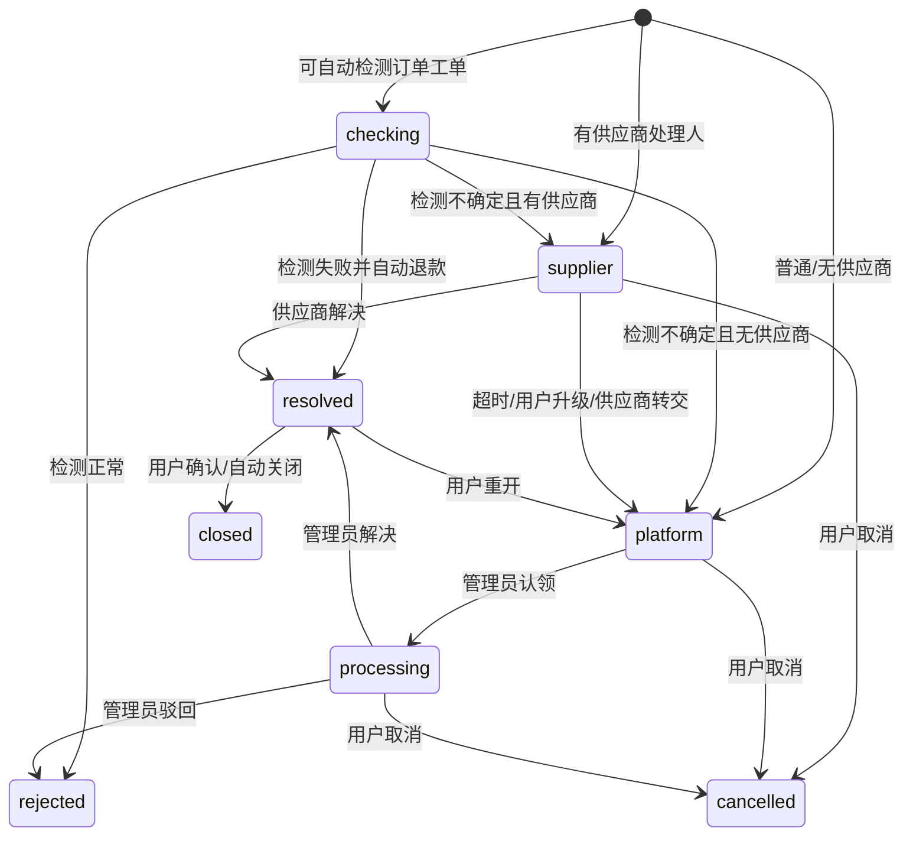

# BC-AFTERSALE 售后仲裁上下文

## 修订记录

| 日期 | 版本 | 修订人 | 说明 |
|------|------|--------|------|
| 2026-06-29 | V1.0 | Codex | 形成 Go 版从 0 DDD 设计基线，作为一次 V1.0 变更。 |

> 支撑域。售后只拥有工单状态机，不拥有订单和退款执行。

---

## 1. 定位

| 拥有 | 不拥有 |
|------|--------|
| 工单、消息、附件、流转日志、供应商 SLA、自动检测、平台裁决 | 订单归属、钱包退款、邮箱匹配规则 |

订单工单只保存 `orderNo`，归属、售后窗口、供应商处理人通过 BC-TRADE Port 查询。

---

## 2. 实体

| 实体 | 字段/状态 |
|------|-----------|
| `Ticket` | `ticketNo`、`ticketType(order/general)`、`orderNo`、`problemCode`、`appeal`、`status`、`assigneeUserId`、`supplierDeadlineAt`、`resolution` |
| `TicketMessage` | `senderType(user/supplier/admin/system)`、`content` |
| `Attachment` | 文件名、MIME、大小、MinIO objectKey、上传人 |
| `FlowLog` | `action`、`fromStatus/toStatus`、`operator`、安全上下文 |

---

## 3. 状态机

`closed/cancelled/rejected` 是终态，`resolved` 非终态，可重开或确认关闭。

---

## 4. 不变式

| 编号 | 规则 |
|------|------|
| INV-AS1 | `ticketType=order` 必须经 Trade 校验订单归属和售后窗口。 |
| INV-AS2 | 可自动检测的问题码必须来自系统内置清单。 |
| INV-AS3 | 自动检测只能产出失败/正常/不确定；退款必须调用 TradeRefundPort。 |
| INV-AS4 | 有供应商处理人时先进入供应商处理，1 小时未解决升级平台。 |
| INV-AS5 | 每次流转写 `FlowLog`。 |
| INV-AS6 | 附件存储失败写 SystemLog，不暴露 objectKey。 |
| INV-AS7 | 通知是旁路事实，失败不回滚工单主流程。 |

---

## 5. Port

| Port | 方向 | 职责 |
|------|------|------|
| `OrderPort` | 出站到 BC-TRADE | 查订单归属、售后窗口和供应商处理人。 |
| `RefundPort` | 出站到 BC-TRADE | 自动检测失败后发起退款。 |
| `HealthPort` | 出站到 BC-MAILMATCH | 检测购买邮箱是否能正常收件。 |
| `NotifyPort` | 出站到 BC-GOVERNANCE | 发送站内通知。 |

---

## 6. API 设计

统一业务 API：

| 方法 | URI | 说明 |
|------|-----|------|
| `GET` | `/v1/tickets` | 工单列表；支持 `scope=mine/assigned/all`。 |
| `POST` | `/v1/tickets` | 创建工单。 |
| `GET` | `/v1/tickets/{ticketNo}` | 工单详情。 |
| `POST` | `/v1/tickets/{ticketNo}/messages` | 回复。 |
| `POST` | `/v1/tickets/{ticketNo}/attachments` | 上传附件。 |
| `GET` | `/v1/tickets/{ticketNo}/attachments/{attachmentId}` | 读取附件。 |
| `POST` | `/v1/tickets/{ticketNo}/close` | 用户确认关闭。 |
| `POST` | `/v1/tickets/{ticketNo}/cancel` | 用户取消。 |
| `POST` | `/v1/tickets/{ticketNo}/reopen` | 用户重开。 |
| `POST` | `/v1/tickets/{ticketNo}/escalate` | 用户或供应商升级平台。 |
| `POST` | `/v1/tickets/{ticketNo}/resolve` | 供应商解决已指派工单。 |

后台/供应商特权动作：

| 方法 | URI | 说明 |
|------|-----|------|
| `POST` | `/v1/admin/tickets/{ticketNo}/claim` | 管理员认领。 |
| `POST` | `/v1/admin/tickets/{ticketNo}/assign` | 改派。 |
| `POST` | `/v1/admin/tickets/{ticketNo}/resolve` | 管理员解决。 |
| `POST` | `/v1/admin/tickets/{ticketNo}/reject` | 管理员驳回，必须有业务原因。 |

---

## 7. ADR

| ADR | 决策 | 理由 |
|-----|------|------|
| ADR-AS-1 | 售后不冗余订单快照 | 避免工单数据过期，订单事实实时查。 |
| ADR-AS-2 | 自动检测不另建聚合 | `problemCode + FlowLog` 足够表达检测过程。 |
| ADR-AS-3 | 退款只经 Trade | 保证订单、钱包、分配和凭证同步。 |
| ADR-AS-4 | 通知为旁路 | 通知失败不能影响售后状态机。 |
